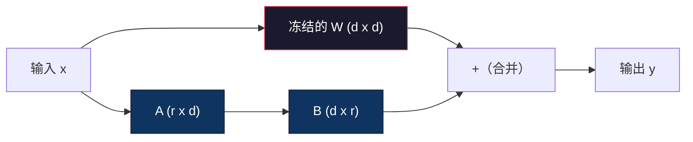
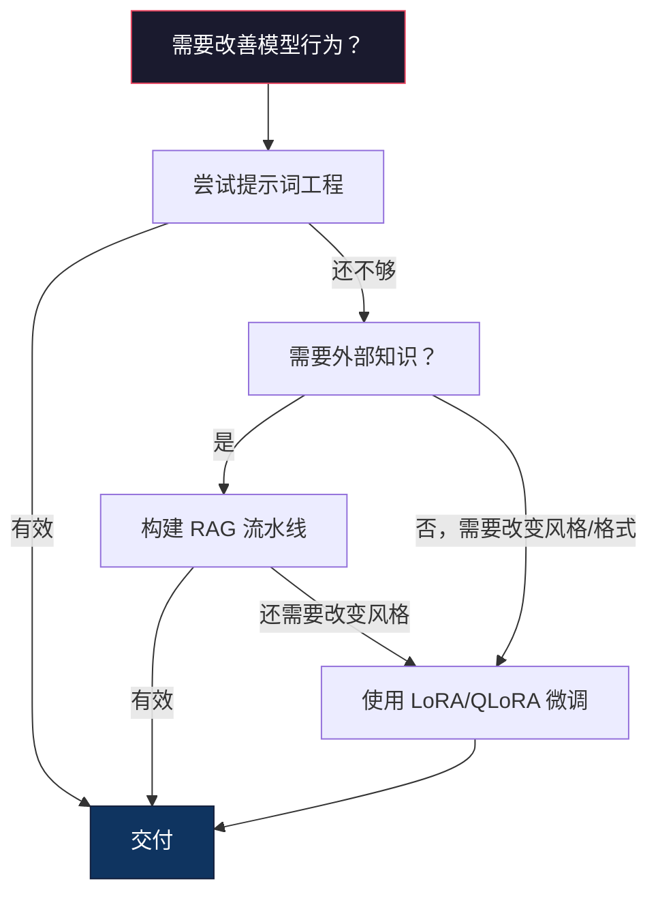

# 使用 LoRA 与 QLoRA 微调（Fine-Tuning with LoRA & QLoRA）

> 对 7B 模型进行全量微调需要 56GB 显存。你没有这么多显存，大多数公司也没有。LoRA 只训练不到 1% 的参数，就能在 6GB 显存中微调同一个模型。这并非妥协：在多数任务上，它的质量与全量微调相当。整个开源微调生态都依靠这一技巧。

**Type:** Build
**Languages:** Python
**Prerequisites:** 阶段 10，第 06 课（指令微调 / SFT）
**Time:** 约 75 分钟
**相关内容（Related）：** 阶段 10 从零实现 SFT/DPO 循环。本课将这些循环接入 2026 年的 PEFT 工具套件（PEFT、TRL、Unsloth、Axolotl、LLaMA-Factory）。

## 学习目标（Learning Objectives）

- 向预训练模型的注意力层注入低秩适配器矩阵（A 和 B），实现 LoRA。
- 计算 LoRA 相比全量微调节省的参数：维度为 d_model、秩为 r 时，训练 2*r*d 个参数，而不是 d^2 个。
- 使用 QLoRA（4 位量化基座 + LoRA 适配器）微调模型，使其能装入消费级 GPU 显存。
- 将 LoRA 权重合并回基座模型以便部署，并比较有无适配器时的推理速度。

## 问题（The Problem）

你有一个基座模型 Llama 3 8B，希望它以公司的口吻回复客户支持工单。监督微调（SFT）能解决问题，但它存在成本问题。

全量微调更新模型的每个参数。Llama 3 8B 有 80 亿个参数，fp16 下每个参数占 2 字节，仅加载权重就需要 16GB。训练还需要梯度（16GB）、Adam 优化器状态（动量 + 方差占 32GB）以及激活值。总计：单个 8B 模型大约需要 56GB 显存。

一张 A100 80GB 才勉强装得下。在云服务商那里，两张 A100 每小时收费 $3-4。在 50,000 个样本上训练 3 个轮次（epoch）需要 6-10 小时，每次实验花费 $30-40。为了调好超参数运行 10 次实验，尚未部署任何东西就已花掉 $400。

扩展到 Llama 3 70B 后，数字更惊人：仅权重就占 140GB。你需要一个集群，每次实验花费超过 $100。

还有更深层的问题。全量微调修改模型的所有权重；如果使用客户支持数据微调，模型的通用能力可能下降。这称为灾难性遗忘（catastrophic forgetting）：模型在你的任务上变好，却在其他任务上变差。

你需要一种训练参数更少、内存占用更低，且不会破坏模型已有知识的方法。

## 概念（The Concept）

### LoRA：低秩适配（Low-Rank Adaptation）

Microsoft 的 Edward Hu 及其同事于 2021 年 6 月发表 LoRA。论文的洞见是：微调中的权重更新具有较低的内在秩。不必更新 4096x4096 权重矩阵中的全部 1670 万个参数；更新中的有效信息可以由秩为 16 或 32 的矩阵捕获。

数学表达如下。标准线性层计算：

```
y = Wx
```

其中 W 是 d_out x d_in 矩阵。对于 4096x4096 的注意力投影，共有 16,777,216 个参数。

LoRA 冻结 W，并加入一个低秩分解：

```
y = Wx + BAx
```

其中 B 的形状为 (d_out x r)，A 为 (r x d_in)。秩 r 远小于 d，通常取 8、16 或 32。

对于 r=16 的 4096x4096 层：
- 原始参数：4096 x 4096 = 16,777,216
- LoRA 参数：(4096 x 16) + (16 x 4096) = 65,536 + 65,536 = 131,072
- 缩减后的比例：131,072 / 16,777,216 = 0.78%

只训练 0.78% 的参数，就能获得 95-100% 的质量。



A 使用高斯随机分布初始化，B 初始化为零。因此 LoRA 最初的贡献为零，模型从原有行为开始训练，逐渐学习适配。

### 缩放因子：Alpha（The Scaling Factor: Alpha）

LoRA 引入缩放因子 alpha，控制低秩更新对输出的影响程度：

```
y = Wx + (alpha / r) * BAx
```

当 alpha = r 时，缩放倍数为 1x。当 alpha = 2r（常见默认值）时，缩放倍数为 2x。这个超参数独立于基础学习率，控制 LoRA 路径的学习率。

实践建议：
- alpha = 2 * rank 是社区常见约定（原论文多数实验使用 alpha = rank）。
- alpha = rank 提供 1x 缩放，保守但稳定。
- alpha 越大，每步更新越大，可能加快收敛，也可能造成不稳定。

### 在哪些层应用 LoRA（Where to Apply LoRA）

Transformer 有许多线性层，不必全部添加 LoRA。原论文测试了不同组合：

| 目标层（Target Layers） | 可训练参数（7B） | 质量 |
|--------------|----------------------|---------|
| 仅 q_proj | 4.7M | 好 |
| q_proj + v_proj | 9.4M | 更好 |
| q_proj + k_proj + v_proj + o_proj | 18.9M | 注意力层中最好 |
| 所有线性层（注意力 + MLP） | 37.7M | 收益有限，参数翻倍 |

多数任务的最佳平衡点是 q_proj + v_proj。它针对自注意力中的查询和值投影，控制模型关注什么以及提取什么信息。加入 MLP 层有助于代码生成等复杂任务，但参数量翻倍，在较简单任务上的收益递减。

### 秩的选择（Rank Selection）

秩 r 控制适配的表达能力：

| 秩（Rank） | 每层可训练参数 | 最适合 |
|------|---------------------------|----------|
| 4 | 32,768 | 简单分类、情感分析 |
| 8 | 65,536 | 单领域问答、摘要 |
| 16 | 131,072 | 多领域任务、指令遵循 |
| 32 | 262,144 | 复杂推理、代码生成 |
| 64 | 524,288 | 多数任务收益递减 |
| 128 | 1,048,576 | 很少有充分理由使用 |

Hu 等人表明，对简单任务，r=4 已能捕获大部分适配。实践中最常选 r=8 和 r=16。超过 r=64 很少改善质量，并开始丧失 LoRA 的内存优势。

### QLoRA：4 位量化 + LoRA（4-Bit Quantization + LoRA）

华盛顿大学的 Tim Dettmers 及其同事于 2023 年 5 月发表 QLoRA。其思路是把冻结的基座模型量化到 4 位精度，再挂载 fp16 的 LoRA 适配器。

这大幅改变了内存需求：

| 方法 | 权重内存（7B） | 训练内存（7B） | 所需 GPU |
|--------|-------------------|---------------------|-------------|
| 全量微调（fp16） | 14GB | ~56GB | 1x A100 80GB |
| LoRA（fp16 基座） | 14GB | ~18GB | 1x A100 40GB |
| QLoRA（4 位基座） | 3.5GB | ~6GB | 1x RTX 3090 24GB |

QLoRA 有三项技术贡献：

**NF4（正态浮点 4 位，Normal Float 4-bit）**：专为神经网络权重设计的新数据类型。神经网络权重大致服从正态分布。NF4 将 16 个量化级别放在标准正态分布的分位点上，从信息论角度看，对正态分布数据最优。相比均匀 4 位量化（INT4）或标准 Float4，它损失的信息更少。

**双重量化（Double quantization）**：量化常数本身也占内存。每组 64 个权重需要一个 fp32 缩放因子（4 字节），7B 模型因此额外占用 0.4GB。双重量化将这些常数量化为 fp8，把开销降至 0.1GB。单项虽小，累积起来也可观。

**分页优化器（Paged optimizers）**：训练长序列时，优化器状态（Adam 的动量和方差）可能超出 GPU 显存。分页优化器利用 NVIDIA 统一内存，在显存耗尽时自动把优化器状态换页到 CPU RAM，需要时再换回。它以部分吞吐量为代价，防止内存不足（OOM）崩溃。

### 质量问题（The Quality Question）

减少参数或量化基座会损害质量吗？多篇论文的结果如下：

| 方法 | MMLU（5 样本） | MT-Bench | HumanEval |
|--------|--------------|----------|-----------|
| 全量微调（Llama 2 7B） | 48.3 | 6.72 | 14.6 |
| LoRA r=16 | 47.9 | 6.68 | 14.0 |
| QLoRA r=16 (NF4) | 47.5 | 6.61 | 13.4 |
| QLoRA r=64 (NF4) | 48.1 | 6.70 | 14.2 |

r=16 的 LoRA 在多数基准上与全量微调相差不到 1%。r=16 的 QLoRA 再损失不到一个百分点。r=64 的 QLoRA 基本追平全量微调，同时减少 90% 内存占用。

### 实际成本（Real-World Costs）

在 50,000 个样本上微调 Llama 3 8B（3 个轮次）：

| 方法 | GPU | 时间 | 成本 |
|--------|-----|------|------|
| 全量微调 | 2x A100 80GB | 8 小时 | ~$32 |
| LoRA r=16 | 1x A100 40GB | 4 小时 | ~$8 |
| QLoRA r=16 | 1x RTX 4090 24GB | 6 小时 | ~$5 |
| QLoRA r=16（Unsloth） | 1x RTX 4090 24GB | 2.5 小时 | ~$2 |
| QLoRA r=16 | 1x T4 16GB | 12 小时 | ~$4 |

单张消费级 GPU 上的 QLoRA 成本比一顿午餐还低。这解释了开放权重微调社区为何在 2023 年爆发，也解释了下面每个训练框架为何在 2026 年都默认提供 QLoRA。

### 2026 年 PEFT 技术栈（The 2026 PEFT stack）

| 框架 | 定义 | 选择时机 |
|-----------|-----------|-----------|
| **Hugging Face PEFT** | 标准的 LoRA/QLoRA/DoRA/IA3 库 | 希望直接控制细节，且训练循环已使用 `transformers.Trainer` |
| **TRL** | HF 基于反馈的强化训练器（SFT、DPO、GRPO、PPO、ORPO） | SFT 后还需要 DPO/GRPO；构建于 PEFT 之上 |
| **Unsloth** | 以 Triton 内核重写前向/反向传播 | 希望速度提高 2-5 倍、显存减半且不损失准确率；适用 Llama/Mistral/Qwen 系列 |
| **Axolotl** | PEFT + TRL + DeepSpeed + Unsloth 的 YAML 配置封装 | 需要可复现、受版本控制的训练运行 |
| **LLaMA-Factory** | PEFT + TRL 之上的 GUI/CLI/API | 希望零代码微调；支持 100 多个模型系列 |
| **torchtune** | 原生 PyTorch 配方，无 `transformers` 依赖 | 希望依赖最少，且组织已统一使用 PyTorch |

经验法则：研究或一次性实验 → PEFT。可重复的生产流水线 → 启用 Unsloth 内核的 Axolotl。临时原型 → LLaMA-Factory。

### 合并适配器（Merging Adapters）

训练后会得到两部分：冻结的基座模型和一个小型 LoRA 适配器（通常 10-100MB）。可以选择：

1. **保持分离**：先加载基座模型，再加载适配器。为不同任务切换适配器，从而用一个基座模型提供多个微调变体。

2. **永久合并**：计算 W' = W + (alpha/r) * BA，把结果保存为新的完整模型。合并后大小与原模型相同，没有推理开销，也没有适配器需要管理。

服务多个任务（客服适配器、代码适配器、翻译适配器）时保持分离；部署单一专用模型时合并。

组合多个适配器的高级合并技术：

- **TIES-Merging**（Yadav 等，2023）：裁剪幅值小的参数，解决符号冲突，再合并，减少适配器之间的干扰。
- **DARE**（Yu 等，2023）：合并前随机丢弃部分适配器参数，并重新缩放其余参数。组合能力的效果出人意料地好。
- **任务算术（Task arithmetic）**：直接加减适配器权重。把“代码”适配器与“数学”适配器相加，常能得到两者都擅长的模型。

### 何时不应微调（When NOT to Fine-Tune）

微调是第三选择，而非第一选择。

**第一：提示词工程（prompt engineering）。** 写更好的系统提示词，添加少样本示例，使用思维链。这不花钱，几分钟就能完成。如果提示词已满足 80% 的需求，你很可能不需要微调。

**第二：检索增强生成（RAG）。** 如果模型需要了解你的特定数据（文档、知识库、产品目录），检索比把知识融入权重更便宜、更易维护。参见第 06 课。

**第三：微调（fine-tuning）。** 当你需要模型采用提示词无法实现的特定风格、格式或推理模式时使用；需要一致的结构化输出时使用；需要把大模型蒸馏为小模型时使用；延迟重要且无法承担少样本提示额外词元时使用。



```figure
lora-params
```

## 动手构建（Build It）

我们使用纯 PyTorch 从零实现 LoRA，不依赖额外库，也没有魔法。你将构建 LoRA 层，将其注入模型、训练模型，再把权重合并回去。

### 第 1 步：LoRA 层（The LoRA Layer）

```python
import torch
import torch.nn as nn
import math

class LoRALayer(nn.Module):
    def __init__(self, in_features, out_features, rank=8, alpha=16):
        super().__init__()
        self.rank = rank
        self.alpha = alpha
        self.scaling = alpha / rank

        self.A = nn.Parameter(torch.randn(in_features, rank) * (1 / math.sqrt(rank)))
        self.B = nn.Parameter(torch.zeros(rank, out_features))

    def forward(self, x):
        return (x @ self.A @ self.B) * self.scaling
```

A 使用缩放后的随机值初始化，B 初始化为零。乘积 BA 起始为零，因此模型从原有行为开始。

### 第 2 步：LoRA 包装的线性层（LoRA-Wrapped Linear Layer）

```python
class LinearWithLoRA(nn.Module):
    def __init__(self, linear, rank=8, alpha=16):
        super().__init__()
        self.linear = linear
        self.lora = LoRALayer(
            linear.in_features, linear.out_features, rank, alpha
        )

        for param in self.linear.parameters():
            param.requires_grad = False

    def forward(self, x):
        return self.linear(x) + self.lora(x)
```

原始线性层被冻结，只有 LoRA 参数（A 和 B）可训练。

### 第 3 步：向模型注入 LoRA（Inject LoRA into a Model）

```python
def inject_lora(model, target_modules, rank=8, alpha=16):
    for param in model.parameters():
        param.requires_grad = False

    lora_layers = {}
    for name, module in model.named_modules():
        if isinstance(module, nn.Linear):
            if any(t in name for t in target_modules):
                parent_name = ".".join(name.split(".")[:-1])
                child_name = name.split(".")[-1]
                parent = dict(model.named_modules())[parent_name]
                lora_linear = LinearWithLoRA(module, rank, alpha)
                setattr(parent, child_name, lora_linear)
                lora_layers[name] = lora_linear
    return lora_layers
```

先冻结模型中的每个参数，再遍历模型树，找到名称匹配目标的线性层，用 LoRA 包装版本替换。整个模型中只有 LoRA 的 A、B 矩阵可训练。

### 第 4 步：统计参数（Count Parameters）

```python
def count_parameters(model):
    total = sum(p.numel() for p in model.parameters())
    trainable = sum(p.numel() for p in model.parameters() if p.requires_grad)
    frozen = total - trainable
    return {
        "total": total,
        "trainable": trainable,
        "frozen": frozen,
        "trainable_pct": 100 * trainable / total if total > 0 else 0
    }
```

### 第 5 步：合并回权重（Merge Weights Back）

```python
def merge_lora_weights(model):
    for name, module in model.named_modules():
        if isinstance(module, LinearWithLoRA):
            with torch.no_grad():
                merged = (
                    module.lora.A @ module.lora.B
                ) * module.lora.scaling
                module.linear.weight.data += merged.T
            parent_name = ".".join(name.split(".")[:-1])
            child_name = name.split(".")[-1]
            if parent_name:
                parent = dict(model.named_modules())[parent_name]
            else:
                parent = model
            setattr(parent, child_name, module.linear)
```

合并后 LoRA 层消失，适配已融入权重，模型大小与原来相同，没有推理开销。

### 第 6 步：模拟 QLoRA 量化（Simulated QLoRA Quantization）

```python
def quantize_to_nf4(tensor, block_size=64):
    blocks = tensor.reshape(-1, block_size)
    scales = blocks.abs().max(dim=1, keepdim=True).values / 7.0
    scales = torch.clamp(scales, min=1e-8)
    quantized = torch.round(blocks / scales).clamp(-8, 7).to(torch.int8)
    return quantized, scales

def dequantize_from_nf4(quantized, scales, original_shape):
    dequantized = quantized.float() * scales
    return dequantized.reshape(original_shape)
```

这通过将每组 64 个权重映射到 16 个离散级别来模拟 4 位量化。生产中的 QLoRA 使用 bitsandbytes 库在 GPU 上执行真正的 NF4。

### 第 7 步：训练循环（Training Loop）

```python
def train_lora(model, data, epochs=5, lr=1e-3, batch_size=4):
    optimizer = torch.optim.AdamW(
        [p for p in model.parameters() if p.requires_grad], lr=lr
    )
    criterion = nn.MSELoss()

    losses = []
    for epoch in range(epochs):
        epoch_loss = 0.0
        n_batches = 0
        indices = torch.randperm(len(data["inputs"]))

        for i in range(0, len(indices), batch_size):
            batch_idx = indices[i:i + batch_size]
            x = data["inputs"][batch_idx]
            y = data["targets"][batch_idx]

            output = model(x)
            loss = criterion(output, y)

            optimizer.zero_grad()
            loss.backward()
            optimizer.step()

            epoch_loss += loss.item()
            n_batches += 1

        avg_loss = epoch_loss / n_batches
        losses.append(avg_loss)

    return losses
```

### 第 8 步：完整演示（Full Demo）

```python
def demo():
    torch.manual_seed(42)
    d_model = 256
    n_classes = 10

    model = nn.Sequential(
        nn.Linear(d_model, 512),
        nn.ReLU(),
        nn.Linear(512, 512),
        nn.ReLU(),
        nn.Linear(512, n_classes),
    )

    n_samples = 500
    x = torch.randn(n_samples, d_model)
    y = torch.randint(0, n_classes, (n_samples,))
    y_onehot = torch.zeros(n_samples, n_classes).scatter_(1, y.unsqueeze(1), 1.0)

    data = {"inputs": x, "targets": y_onehot}

    params_before = count_parameters(model)

    lora_layers = inject_lora(
        model, target_modules=["0", "2"], rank=8, alpha=16
    )

    params_after = count_parameters(model)

    losses = train_lora(model, data, epochs=20, lr=1e-3)

    merge_lora_weights(model)
    params_merged = count_parameters(model)

    return {
        "params_before": params_before,
        "params_after": params_after,
        "params_merged": params_merged,
        "losses": losses,
    }
```

演示创建一个小模型，在两层中注入 LoRA，训练后把权重合并回去。LoRA 训练期间，可训练参数从全部降至约 1%，合并后恢复原始架构。

## 实际使用（Use It）

借助 Hugging Face 生态，在真实模型上应用 LoRA 约需 20 行代码：

```python
from transformers import AutoModelForCausalLM, AutoTokenizer
from peft import LoraConfig, get_peft_model, TaskType

model = AutoModelForCausalLM.from_pretrained("meta-llama/Llama-3.1-8B")
tokenizer = AutoTokenizer.from_pretrained("meta-llama/Llama-3.1-8B")

lora_config = LoraConfig(
    task_type=TaskType.CAUSAL_LM,
    r=16,
    lora_alpha=32,
    lora_dropout=0.05,
    target_modules=["q_proj", "v_proj"],
)

model = get_peft_model(model, lora_config)
model.print_trainable_parameters()
```

对于 QLoRA，加入 bitsandbytes 量化：

```python
from transformers import BitsAndBytesConfig

bnb_config = BitsAndBytesConfig(
    load_in_4bit=True,
    bnb_4bit_quant_type="nf4",
    bnb_4bit_compute_dtype=torch.bfloat16,
    bnb_4bit_use_double_quant=True,
)

model = AutoModelForCausalLM.from_pretrained(
    "meta-llama/Llama-3.1-8B",
    quantization_config=bnb_config,
    device_map="auto",
)

model = get_peft_model(model, lora_config)
```

就是这样。训练循环和数据流水线不变。基座模型现在采用 4 位存储，LoRA 适配器以 fp16 训练，整体可装入 6GB 显存。

使用 Hugging Face Trainer 训练：

```python
from transformers import TrainingArguments, Trainer
from datasets import load_dataset

dataset = load_dataset("tatsu-lab/alpaca", split="train[:5000]")

training_args = TrainingArguments(
    output_dir="./lora-llama",
    num_train_epochs=3,
    per_device_train_batch_size=4,
    gradient_accumulation_steps=4,
    learning_rate=2e-4,
    fp16=True,
    logging_steps=10,
    save_strategy="epoch",
    optim="paged_adamw_8bit",
)

trainer = Trainer(
    model=model,
    args=training_args,
    train_dataset=dataset,
)

trainer.train()

model.save_pretrained("./lora-adapter")
```

保存的适配器大小为 10-100MB，基座模型不变。你可以在 Hugging Face Hub 分享适配器，无须重新分发完整模型。

## 交付产物（Ship It）

本课产出：
- `outputs/prompt-lora-advisor.md`：帮助你为具体任务决定 LoRA 秩、目标模块及超参数的提示词。
- `outputs/skill-fine-tuning-guide.md`：教智能体通过决策树判断何时以及如何微调的技能。

## 练习（Exercises）

1. **秩消融研究（Rank ablation study）。** 分别以秩 2、4、8、16、32、64 运行演示，绘制最终损失与秩的关系。找到收益递减点，即秩翻倍不再让损失减半的位置。对 256 维特征上的简单分类任务，该点应在 r=8-16 左右。

2. **目标模块比较（Target module comparison）。** 修改 inject_lora，分别只针对层 "0"、只针对层 "2"、只针对层 "4" 以及全部三层。每个变体训练 20 轮，比较收敛速度和最终损失。这对应实际选择 q_proj、v_proj 或所有线性层的决策。

3. **量化误差分析（Quantization error analysis）。** 获取训练后模型在 quantize_to_nf4 / dequantize_from_nf4 前后的权重矩阵，计算均方误差、最大绝对误差以及原始与重建权重的相关性。尝试 block_size 为 32、64、128、256。

4. **多适配器服务（Multi-adapter serving）。** 在不同数据子集（偶数索引与奇数索引）上训练两个 LoRA 适配器并保存。只加载一次基座模型，然后切换适配器，验证二者对同一输入产生不同输出。生产系统就是这样用一个基座提供多个微调模型。

5. **合并与未合并推理（Merge vs. unmerged inference）。** 对相同的 100 个输入，比较 LoRA 模型在 merge_lora_weights 前后的输出，验证它们一致（浮点容差 1e-5 内）。再测试两者推理速度：合并后应略快，因为只需一次矩阵乘法，而非两次。

## 关键术语（Key Terms）

| 术语 | 常见说法 | 实际含义 |
|------|----------------|----------------------|
| 低秩适配（LoRA） | “高效微调” | 冻结基座权重，训练两个小矩阵 A、B，其乘积近似完整权重更新 |
| 量化 LoRA（QLoRA） | “在笔记本上微调” | 以 4 位 NF4 加载基座，在其上以 fp16 训练 LoRA 适配器，使 7B 微调可在 6GB 显存内完成 |
| 秩（Rank，r） | “模型能学多少” | A、B 矩阵的内维度；控制表达能力与参数量的权衡 |
| Alpha | “LoRA 学习率” | 应用于 LoRA 输出的缩放因子；alpha/r 缩放适配对最终输出的贡献 |
| 正态浮点 4 位（NF4） | “4 位量化” | 量化级别位于正态分布分位点的 4 位数据类型，对神经网络权重最优 |
| 适配器（Adapter） | “训练得到的小部分” | 独立保存为文件（10-100MB）的 LoRA A、B 矩阵，可加载到基座模型的任意副本上 |
| 目标模块（Target modules） | “在哪些层使用 LoRA” | 注入 LoRA 适配器的特定线性层（q_proj、v_proj 等） |
| 合并（Merging） | “融入进去” | 计算 W + (alpha/r) * BA 并替换原始权重，消除推理时适配器开销 |
| 分页优化器（Paged optimizers） | “训练别 OOM” | GPU 显存耗尽时，将优化器状态（Adam 动量、方差）卸载到 CPU |
| 灾难性遗忘（Catastrophic forgetting） | “微调破坏了其他一切” | 更新全部权重导致模型失去先前学会的能力 |

## 延伸阅读（Further Reading）

- Hu 等，《LoRA：大语言模型的低秩适配（LoRA: Low-Rank Adaptation of Large Language Models）》（2021）：提出低秩分解方法的原始论文，在 GPT-3 175B 上以低至 4 的秩测试。
- Dettmers 等，《QLoRA：量化语言模型的高效微调（QLoRA: Efficient Finetuning of Quantized Language Models）》（2023）：引入 NF4、双重量化、分页优化器，使单张 48GB GPU 可以微调 65B 模型。
- PEFT 库文档（huggingface.co/docs/peft）：Hugging Face 生态中 LoRA、QLoRA 及其他参数高效方法的标准库。
- Yadav 等，《TIES-Merging：解决模型合并中的干扰（TIES-Merging: Resolving Interference When Merging Models）》（2023）：在不降低质量的情况下组合多个 LoRA 适配器的技术。
- [Rafailov 等，《直接偏好优化：你的语言模型其实是奖励模型（Direct Preference Optimization: Your Language Model is Secretly a Reward Model）》（NeurIPS 2023）](https://arxiv.org/abs/2305.18290)：DPO 推导；SFT 之后的偏好微调阶段，无须奖励模型。
- [TRL 文档](https://huggingface.co/docs/trl/)：`SFTTrainer`、`DPOTrainer`、`KTOTrainer` 及与 PEFT/bitsandbytes/Unsloth 集成接口的官方参考。
- [Unsloth 文档](https://docs.unsloth.ai/)：让微调吞吐量翻倍、内存减半的融合内核；TRL 底层的性能层。
- [Axolotl 文档](https://axolotl-ai-cloud.github.io/axolotl/)：YAML 配置的多 GPU SFT/DPO/QLoRA 训练器；以配置即代码替代手写脚本。
