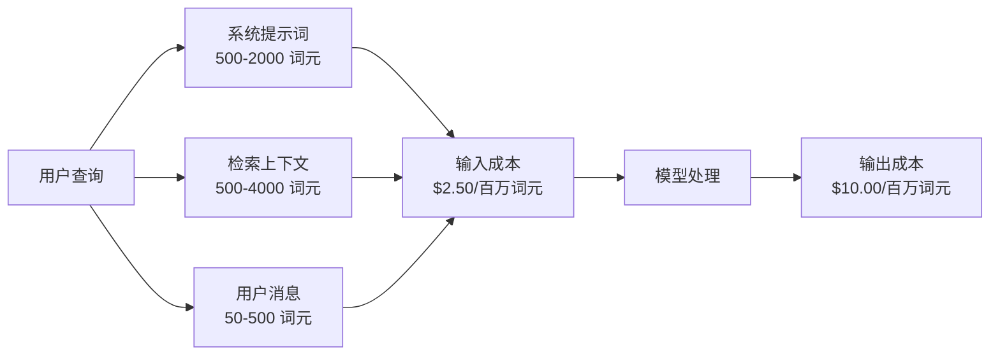
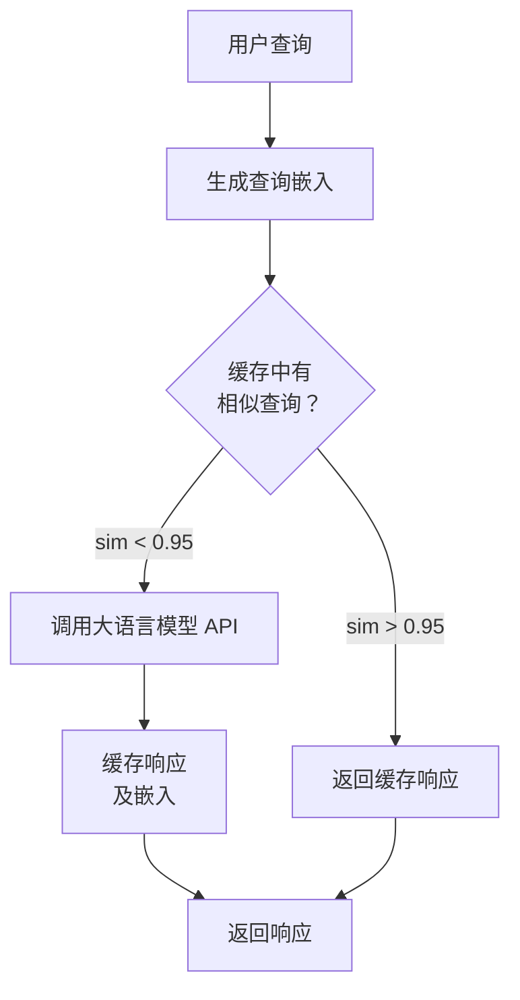
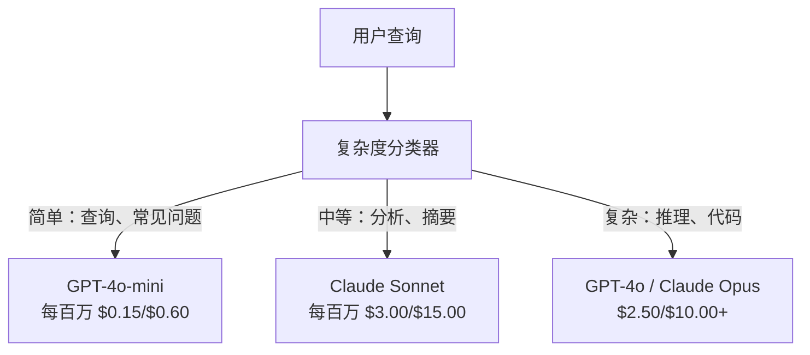

# 缓存、限流与成本优化（Caching, Rate Limiting & Cost Optimization）

> 多数 AI 初创公司不是败在模型差，而是败在单位经济效益差。一次 GPT-4o 调用只需几分之一美分，但一万名用户每天各调用十次，仅输入词元就花费 $250，而你可能还未收取一美元。能生存下来的公司，会将每次 API 调用视为财务交易，而不只是函数调用。

**Type:** Build
**Languages:** Python
**Prerequisites:** 阶段 11 第 09 课（函数调用）
**Time:** 约 45 分钟
**相关内容（Related）：** 阶段 11 · 15（提示词缓存）：本课涵盖应用层缓存（语义缓存、精确哈希缓存、模型路由）。第 15 课涵盖提供商层提示词缓存（Anthropic cache_control、OpenAI 自动缓存、Gemini CachedContent）。结合两者可降低 50-95% 成本。

## 学习目标（Learning Objectives）

- 实现语义缓存，从缓存响应重复或相似查询，避免新 API 调用。
- 计算跨提供商的每请求成本，实现感知词元用量的限流和预算告警。
- 构建成本优化层，包含提示词压缩、模型路由（昂贵与便宜模型）及响应缓存。
- 针对不同查询类型，设计结合精确匹配、语义相似度与前缀缓存的分层缓存策略。

## 问题（The Problem）

你构建了 RAG 聊天机器人，运行很好，用户也喜欢。

然后账单来了。

GPT-5 每百万输入词元 $5、输出词元 $15。Claude Opus 4.7 为输入 $15 / 输出 $75。Gemini 3 Pro 为输入 $1.25 / 输出 $5。GPT-5-mini 为 $0.25/$2。以下价格仅作示例，始终查看提供商当前定价页。

下面的计算足以拖垮初创公司：

- 10,000 名日活用户。
- 每位用户每天查询 10 次。
- 每次查询 1,000 输入词元（系统提示词 + 上下文 + 用户消息）。
- 每次回复 500 输出词元。

**每日输入成本：** 10,000 x 10 x 1,000 / 1,000,000 x $2.50 = **$250/天**
**每日输出成本：** 10,000 x 10 x 500 / 1,000,000 x $10.00 = **$500/天**
**每月合计：** **$22,500/月**

这还只是大语言模型费用。加上嵌入、向量数据库托管和基础设施，一个聊天机器人每月约需 $30,000。

残酷之处在于，40-60% 的查询近乎重复。用户只是换个说法问同样的问题。每个请求完全相同的系统提示词，每次都被计费。询问同一主题的不同用户，RAG 检索出的上下文文档也重复。

你在为冗余计算支付全价。

## 概念（The Concept）

### 大语言模型调用的成本构成（The Cost Anatomy of an LLM Call）

每次 API 调用有五个成本组成部分。



系统提示词是隐蔽的成本杀手。每次请求发送 1,500 词元的系统提示词，每百万请求仅该前缀就花费 $3.75。每天 100K 请求时，就是 $375/天、$11,250/月，而文本从不变化。

### 提供商缓存：内置折扣（Provider Caching: Built-in Discounts）

2026 年三家主要提供商都提供服务端提示词缓存，但机制不同。深入讲解见阶段 11 · 15。

| 提供商 | 机制 | 折扣 | 最小长度 | 缓存时长 |
|----------|-----------|----------|---------|----------------|
| Anthropic | 显式 cache_control 标记 | 命中时优惠 90%（写入额外付 25%） | 1,024 词元（Sonnet/Opus），2,048（Haiku） | 默认 5 分钟；可延长至 1 小时（2 倍写入价格） |
| OpenAI | 自动前缀匹配 | 命中时优惠 50% | 1,024 词元 | 尽力保留，最长 1 小时 |
| Google Gemini | 显式 CachedContent API | 降低约 75%（另收存储费） | 4,096（Flash）/ 32,768（Pro） | 用户可配置 TTL |

**Anthropic 的方式**是显式缓存。用 `cache_control: {"type": "ephemeral"}` 标记提示词片段。首次请求支付 25% 写入溢价，后续相同前缀请求优惠 90%。通常花费 $0.005 的 2,000 词元系统提示词，命中缓存时只需 $0.000625。100K 次请求每天可省 $437.50。

**OpenAI 的方式**是自动缓存。匹配先前请求的提示词前缀可优惠 50%，无须标记。权衡是折扣更少、控制更少，但实现工作量为零。

### 语义缓存：自定义层（Semantic Caching: Your Custom Layer）

提供商缓存只对相同前缀有效。语义缓存处理更难的情况：不同查询具有相同含义。

“退货政策是什么？”与“我该如何退货？”字符串不同，意图却相同。语义缓存对查询生成嵌入、计算余弦相似度，相似度超过阈值（通常 0.92-0.95）时返回缓存响应。



嵌入成本可以忽略。OpenAI text-embedding-3-small 每百万词元 $0.02。相对完整的大语言模型调用，检查缓存几乎不花钱。

### 精确缓存：哈希与匹配（Exact Caching: Hash and Match）

对确定性调用（temperature=0、相同模型、相同提示词），精确缓存更简单、更快。对完整提示词取哈希，检查缓存，找到就返回。

它非常适合：
- 系统提示词 + 固定上下文 + 相同用户查询。
- 使用相同工具定义的函数调用。
- 同一文档被处理多次的批处理。

### 限流：保护预算（Rate Limiting: Protecting Your Budget）

限流不只是公平问题，也关乎生存。

**令牌桶算法（Token bucket algorithm）：**每位用户有一个容量为 N 的令牌桶，以每秒 R 的速率补充。请求消耗桶中令牌，桶空则拒绝。这既允许突发（一次用完整桶），又约束平均速率。

**每用户配额（Per-user quotas）：**按用户等级设置每日/每月词元上限。

| 等级 | 每日词元上限 | 每分钟最大请求数 | 可用模型 |
|------|------------------|------------------|-------------|
| 免费（Free） | 50,000 | 10 | 仅 GPT-4o-mini |
| 专业（Pro） | 500,000 | 60 | GPT-4o、Claude Sonnet |
| 企业（Enterprise） | 5,000,000 | 300 | 所有模型 |

### 模型路由：任务与模型匹配（Model Routing: Right Model for the Right Job）

并非每个查询都需要 GPT-4o。

“商店几点关门？”不需要每百万输出词元 $10 的模型。GPT-4o-mini 每百万输出 $0.60 就能很好处理，Claude Haiku 每百万输出 $1.25 也能处理。简单分类器把简单查询路由到便宜模型，把复杂查询路由到昂贵模型。



调优良好的路由器，仅模型成本就能节省 40-70%。

### 成本跟踪：了解资金去向（Cost Tracking: Know Where the Money Goes）

不测量就无法优化。记录每次 API 调用的：

- 时间戳。
- 模型名称。
- 输入词元。
- 输出词元。
- 延迟（毫秒）。
- 计算成本（美元）。
- 用户 ID。
- 缓存命中/未命中。
- 请求类别。

这些数据揭示哪些功能昂贵、哪些用户消耗最多，以及缓存在哪些地方影响最大。

### 批处理：批量折扣（Batching: Bulk Discounts）

OpenAI Batch API 异步处理请求，优惠 50%。一批最多提交 50,000 个请求，结果在 24 小时内返回。

批处理适用于：
- 夜间文档处理。
- 批量分类。
- 评估运行。
- 数据增强流水线。

不适用于面向用户的实时查询，因为延迟重要。

### 预算告警与熔断器（Budget Alerts and Circuit Breakers）

熔断器在达到上限时停止支出。没有它，缺陷或滥用可能在几小时内耗尽月预算。

设置三个阈值：
1. **警告（Warning）**（预算 70%）：发送告警。
2. **节流（Throttle）**（预算 85%）：切换为仅使用便宜模型。
3. **停止（Stop）**（预算 95%）：拒绝新请求，仅返回缓存响应。

### 优化技术栈（The Optimization Stack）

按顺序应用这些技术，每层在前面各层基础上叠加收益。

| 层 | 技术 | 典型节省 | 实现工作量 |
|-------|-----------|----------------|----------------------|
| 1 | 提供商提示词缓存 | 30-50% | 低（添加缓存标记） |
| 2 | 精确缓存 | 10-20% | 低（哈希 + 字典） |
| 3 | 语义缓存 | 15-30% | 中（嵌入 + 相似度） |
| 4 | 模型路由 | 40-70% | 中（分类器） |
| 5 | 限流 | 保护预算 | 低（令牌桶） |
| 6 | 提示词压缩 | 10-30% | 中（重写提示词） |
| 7 | 批处理 | 合适请求优惠 50% | 低（批处理 API） |

RAG 应用采用第 1-5 层后，成本通常从 $22,500/月降至 $4,000-6,000/月。这决定了你是在消耗生存资金，还是建立业务。

### 实际节省：前后对比（Real Savings: Before and After）

以下是一个服务 10,000 日活用户的 RAG 聊天机器人的实际成本拆分。

| 指标 | 优化前 | 优化后 | 节省 |
|--------|--------------------|--------------------|---------|
| 每月大语言模型成本 | $22,500 | $5,200 | 77% |
| 平均每查询成本 | $0.0075 | $0.0017 | 77% |
| 缓存命中率 | 0% | 52% | -- |
| 路由到 mini 的查询 | 0% | 65% | -- |
| P95 延迟 | 2,800ms | 900ms（缓存命中：50ms） | 68% |
| 每月嵌入成本 | $0 | $180 | （新增成本） |
| 每月总成本 | $22,500 | $5,380 | 76% |

语义缓存的嵌入成本（$180/月），在缓存命中的第一个小时内就能收回。

```figure
semantic-cache
```

## 动手构建（Build It）

### 第 1 步：成本计算器（Cost Calculator）

构建掌握主要模型当前定价的词元成本计算器。

```python
import hashlib
import time
import json
import math
from dataclasses import dataclass, field


MODEL_PRICING = {
    "gpt-4o": {"input": 2.50, "output": 10.00, "cached_input": 1.25},
    "gpt-4o-mini": {"input": 0.15, "output": 0.60, "cached_input": 0.075},
    "gpt-4.1": {"input": 2.00, "output": 8.00, "cached_input": 0.50},
    "gpt-4.1-mini": {"input": 0.40, "output": 1.60, "cached_input": 0.10},
    "gpt-4.1-nano": {"input": 0.10, "output": 0.40, "cached_input": 0.025},
    "o3": {"input": 2.00, "output": 8.00, "cached_input": 0.50},
    "o3-mini": {"input": 1.10, "output": 4.40, "cached_input": 0.55},
    "o4-mini": {"input": 1.10, "output": 4.40, "cached_input": 0.275},
    "claude-opus-4": {"input": 15.00, "output": 75.00, "cached_input": 1.50},
    "claude-sonnet-4": {"input": 3.00, "output": 15.00, "cached_input": 0.30},
    "claude-haiku-3.5": {"input": 0.80, "output": 4.00, "cached_input": 0.08},
    "gemini-2.5-pro": {"input": 1.25, "output": 10.00, "cached_input": 0.3125},
    "gemini-2.5-flash": {"input": 0.15, "output": 0.60, "cached_input": 0.0375},
}


def calculate_cost(model, input_tokens, output_tokens, cached_input_tokens=0):
    if model not in MODEL_PRICING:
        return {"error": f"Unknown model: {model}"}
    pricing = MODEL_PRICING[model]
    non_cached = input_tokens - cached_input_tokens
    input_cost = (non_cached / 1_000_000) * pricing["input"]
    cached_cost = (cached_input_tokens / 1_000_000) * pricing["cached_input"]
    output_cost = (output_tokens / 1_000_000) * pricing["output"]
    total = input_cost + cached_cost + output_cost
    return {
        "model": model,
        "input_tokens": input_tokens,
        "output_tokens": output_tokens,
        "cached_input_tokens": cached_input_tokens,
        "input_cost": round(input_cost, 6),
        "cached_input_cost": round(cached_cost, 6),
        "output_cost": round(output_cost, 6),
        "total_cost": round(total, 6),
    }
```

### 第 2 步：精确缓存（Exact Cache）

对完整提示词取哈希，为相同请求返回缓存响应。

```python
class ExactCache:
    def __init__(self, max_size=1000, ttl_seconds=3600):
        self.cache = {}
        self.max_size = max_size
        self.ttl = ttl_seconds
        self.hits = 0
        self.misses = 0

    def _hash(self, model, messages, temperature):
        key_data = json.dumps({"model": model, "messages": messages, "temperature": temperature}, sort_keys=True)
        return hashlib.sha256(key_data.encode()).hexdigest()

    def get(self, model, messages, temperature=0.0):
        if temperature > 0:
            self.misses += 1
            return None
        key = self._hash(model, messages, temperature)
        if key in self.cache:
            entry = self.cache[key]
            if time.time() - entry["timestamp"] < self.ttl:
                self.hits += 1
                entry["access_count"] += 1
                return entry["response"]
            del self.cache[key]
        self.misses += 1
        return None

    def put(self, model, messages, temperature, response):
        if temperature > 0:
            return
        if len(self.cache) >= self.max_size:
            oldest_key = min(self.cache, key=lambda k: self.cache[k]["timestamp"])
            del self.cache[oldest_key]
        key = self._hash(model, messages, temperature)
        self.cache[key] = {
            "response": response,
            "timestamp": time.time(),
            "access_count": 1,
        }

    def stats(self):
        total = self.hits + self.misses
        return {
            "hits": self.hits,
            "misses": self.misses,
            "hit_rate": round(self.hits / total, 4) if total > 0 else 0,
            "cache_size": len(self.cache),
        }
```

### 第 3 步：语义缓存（Semantic Cache）

生成查询嵌入，相似度超过阈值时返回缓存响应。

```python
def simple_embed(text):
    words = text.lower().split()
    vocab = {}
    for w in words:
        vocab[w] = vocab.get(w, 0) + 1
    norm = math.sqrt(sum(v * v for v in vocab.values()))
    if norm == 0:
        return {}
    return {k: v / norm for k, v in vocab.items()}


def cosine_similarity(a, b):
    if not a or not b:
        return 0.0
    all_keys = set(a) | set(b)
    dot = sum(a.get(k, 0) * b.get(k, 0) for k in all_keys)
    return dot


class SemanticCache:
    def __init__(self, similarity_threshold=0.85, max_size=500, ttl_seconds=3600):
        self.entries = []
        self.threshold = similarity_threshold
        self.max_size = max_size
        self.ttl = ttl_seconds
        self.hits = 0
        self.misses = 0

    def get(self, query):
        query_embedding = simple_embed(query)
        now = time.time()
        best_match = None
        best_sim = 0.0
        for entry in self.entries:
            if now - entry["timestamp"] > self.ttl:
                continue
            sim = cosine_similarity(query_embedding, entry["embedding"])
            if sim > best_sim:
                best_sim = sim
                best_match = entry
        if best_match and best_sim >= self.threshold:
            self.hits += 1
            best_match["access_count"] += 1
            return {"response": best_match["response"], "similarity": round(best_sim, 4), "original_query": best_match["query"]}
        self.misses += 1
        return None

    def put(self, query, response):
        if len(self.entries) >= self.max_size:
            self.entries.sort(key=lambda e: e["timestamp"])
            self.entries.pop(0)
        self.entries.append({
            "query": query,
            "embedding": simple_embed(query),
            "response": response,
            "timestamp": time.time(),
            "access_count": 1,
        })

    def stats(self):
        total = self.hits + self.misses
        return {
            "hits": self.hits,
            "misses": self.misses,
            "hit_rate": round(self.hits / total, 4) if total > 0 else 0,
            "cache_size": len(self.entries),
        }
```

### 第 4 步：限流器（Rate Limiter）

带每用户配额的令牌桶限流器。

```python
class TokenBucketRateLimiter:
    def __init__(self):
        self.buckets = {}
        self.tiers = {
            "free": {"capacity": 50_000, "refill_rate": 500, "max_requests_per_min": 10},
            "pro": {"capacity": 500_000, "refill_rate": 5_000, "max_requests_per_min": 60},
            "enterprise": {"capacity": 5_000_000, "refill_rate": 50_000, "max_requests_per_min": 300},
        }

    def _get_bucket(self, user_id, tier="free"):
        if user_id not in self.buckets:
            tier_config = self.tiers.get(tier, self.tiers["free"])
            self.buckets[user_id] = {
                "tokens": tier_config["capacity"],
                "capacity": tier_config["capacity"],
                "refill_rate": tier_config["refill_rate"],
                "last_refill": time.time(),
                "request_timestamps": [],
                "max_rpm": tier_config["max_requests_per_min"],
                "tier": tier,
                "total_tokens_used": 0,
            }
        return self.buckets[user_id]

    def _refill(self, bucket):
        now = time.time()
        elapsed = now - bucket["last_refill"]
        refill = int(elapsed * bucket["refill_rate"])
        if refill > 0:
            bucket["tokens"] = min(bucket["capacity"], bucket["tokens"] + refill)
            bucket["last_refill"] = now

    def check(self, user_id, tokens_needed, tier="free"):
        bucket = self._get_bucket(user_id, tier)
        self._refill(bucket)
        now = time.time()
        bucket["request_timestamps"] = [t for t in bucket["request_timestamps"] if now - t < 60]
        if len(bucket["request_timestamps"]) >= bucket["max_rpm"]:
            return {"allowed": False, "reason": "rate_limit", "retry_after_seconds": 60 - (now - bucket["request_timestamps"][0])}
        if bucket["tokens"] < tokens_needed:
            deficit = tokens_needed - bucket["tokens"]
            wait = deficit / bucket["refill_rate"]
            return {"allowed": False, "reason": "token_limit", "tokens_available": bucket["tokens"], "retry_after_seconds": round(wait, 1)}
        return {"allowed": True, "tokens_available": bucket["tokens"]}

    def consume(self, user_id, tokens_used, tier="free"):
        bucket = self._get_bucket(user_id, tier)
        bucket["tokens"] -= tokens_used
        bucket["request_timestamps"].append(time.time())
        bucket["total_tokens_used"] += tokens_used

    def get_usage(self, user_id):
        if user_id not in self.buckets:
            return {"error": "User not found"}
        b = self.buckets[user_id]
        return {
            "user_id": user_id,
            "tier": b["tier"],
            "tokens_remaining": b["tokens"],
            "capacity": b["capacity"],
            "total_tokens_used": b["total_tokens_used"],
            "utilization": round(b["total_tokens_used"] / b["capacity"], 4) if b["capacity"] else 0,
        }
```

### 第 5 步：成本跟踪器（Cost Tracker）

记录每次调用，计算累计总额。

```python
class CostTracker:
    def __init__(self, monthly_budget=1000.0):
        self.logs = []
        self.monthly_budget = monthly_budget
        self.alerts = []

    def log_call(self, model, input_tokens, output_tokens, cached_input_tokens=0, latency_ms=0, user_id="anonymous", cache_status="miss"):
        cost = calculate_cost(model, input_tokens, output_tokens, cached_input_tokens)
        entry = {
            "timestamp": time.time(),
            "model": model,
            "input_tokens": input_tokens,
            "output_tokens": output_tokens,
            "cached_input_tokens": cached_input_tokens,
            "latency_ms": latency_ms,
            "cost": cost["total_cost"],
            "user_id": user_id,
            "cache_status": cache_status,
        }
        self.logs.append(entry)
        self._check_budget()
        return entry

    def _check_budget(self):
        total = self.total_cost()
        pct = total / self.monthly_budget if self.monthly_budget > 0 else 0
        if pct >= 0.95 and not any(a["level"] == "stop" for a in self.alerts):
            self.alerts.append({"level": "stop", "message": f"Budget 95% consumed: ${total:.2f}/${self.monthly_budget:.2f}", "timestamp": time.time()})
        elif pct >= 0.85 and not any(a["level"] == "throttle" for a in self.alerts):
            self.alerts.append({"level": "throttle", "message": f"Budget 85% consumed: ${total:.2f}/${self.monthly_budget:.2f}", "timestamp": time.time()})
        elif pct >= 0.70 and not any(a["level"] == "warning" for a in self.alerts):
            self.alerts.append({"level": "warning", "message": f"Budget 70% consumed: ${total:.2f}/${self.monthly_budget:.2f}", "timestamp": time.time()})

    def total_cost(self):
        return round(sum(e["cost"] for e in self.logs), 6)

    def cost_by_model(self):
        by_model = {}
        for e in self.logs:
            m = e["model"]
            if m not in by_model:
                by_model[m] = {"calls": 0, "cost": 0, "input_tokens": 0, "output_tokens": 0}
            by_model[m]["calls"] += 1
            by_model[m]["cost"] = round(by_model[m]["cost"] + e["cost"], 6)
            by_model[m]["input_tokens"] += e["input_tokens"]
            by_model[m]["output_tokens"] += e["output_tokens"]
        return by_model

    def cache_savings(self):
        cache_hits = [e for e in self.logs if e["cache_status"] == "hit"]
        if not cache_hits:
            return {"saved": 0, "cache_hits": 0}
        saved = 0
        for e in cache_hits:
            full_cost = calculate_cost(e["model"], e["input_tokens"], e["output_tokens"])
            saved += full_cost["total_cost"]
        return {"saved": round(saved, 4), "cache_hits": len(cache_hits)}

    def summary(self):
        if not self.logs:
            return {"total_calls": 0, "total_cost": 0}
        total_latency = sum(e["latency_ms"] for e in self.logs)
        cache_hits = sum(1 for e in self.logs if e["cache_status"] == "hit")
        return {
            "total_calls": len(self.logs),
            "total_cost": self.total_cost(),
            "avg_cost_per_call": round(self.total_cost() / len(self.logs), 6),
            "avg_latency_ms": round(total_latency / len(self.logs), 1),
            "cache_hit_rate": round(cache_hits / len(self.logs), 4),
            "cost_by_model": self.cost_by_model(),
            "cache_savings": self.cache_savings(),
            "budget_remaining": round(self.monthly_budget - self.total_cost(), 2),
            "budget_utilization": round(self.total_cost() / self.monthly_budget, 4) if self.monthly_budget > 0 else 0,
            "alerts": self.alerts,
        }
```

### 第 6 步：模型路由器（Model Router）

将查询路由到能够处理它的最便宜模型。

```python
SIMPLE_KEYWORDS = ["what time", "hours", "address", "phone", "price", "return policy", "hello", "hi", "thanks", "yes", "no"]
COMPLEX_KEYWORDS = ["analyze", "compare", "explain why", "write code", "debug", "architect", "design", "trade-off", "evaluate"]


def classify_complexity(query):
    q = query.lower()
    if len(q.split()) <= 5 or any(kw in q for kw in SIMPLE_KEYWORDS):
        return "simple"
    if any(kw in q for kw in COMPLEX_KEYWORDS):
        return "complex"
    return "medium"


def route_model(query, tier="pro"):
    complexity = classify_complexity(query)
    routing_table = {
        "simple": {"free": "gpt-4.1-nano", "pro": "gpt-4o-mini", "enterprise": "gpt-4o-mini"},
        "medium": {"free": "gpt-4o-mini", "pro": "claude-sonnet-4", "enterprise": "claude-sonnet-4"},
        "complex": {"free": "gpt-4o-mini", "pro": "gpt-4o", "enterprise": "claude-opus-4"},
    }
    model = routing_table[complexity].get(tier, "gpt-4o-mini")
    return {"query": query, "complexity": complexity, "model": model, "tier": tier}
```

### 第 7 步：运行演示（Run the Demo）

```python
def simulate_llm_call(model, query):
    input_tokens = len(query.split()) * 4 + 500
    output_tokens = 150 + (len(query.split()) * 2)
    latency = 200 + (output_tokens * 2)
    return {
        "model": model,
        "response": f"[Simulated {model} response to: {query[:50]}...]",
        "input_tokens": input_tokens,
        "output_tokens": output_tokens,
        "latency_ms": latency,
    }


def run_demo():
    print("=" * 60)
    print("  Caching, Rate Limiting & Cost Optimization Demo")
    print("=" * 60)

    print("\n--- Model Pricing ---")
    for model, pricing in list(MODEL_PRICING.items())[:6]:
        cost_1k = calculate_cost(model, 1000, 500)
        print(f"  {model}: ${cost_1k['total_cost']:.6f} per 1K in + 500 out")

    print("\n--- Cost Comparison: 100K Requests ---")
    for model in ["gpt-4o", "gpt-4o-mini", "claude-sonnet-4", "claude-haiku-3.5"]:
        cost = calculate_cost(model, 1000 * 100_000, 500 * 100_000)
        print(f"  {model}: ${cost['total_cost']:.2f}")

    print("\n--- Anthropic Cache Savings ---")
    no_cache = calculate_cost("claude-sonnet-4", 2000, 500, 0)
    with_cache = calculate_cost("claude-sonnet-4", 2000, 500, 1500)
    saving = no_cache["total_cost"] - with_cache["total_cost"]
    print(f"  Without cache: ${no_cache['total_cost']:.6f}")
    print(f"  With 1500 cached tokens: ${with_cache['total_cost']:.6f}")
    print(f"  Savings per call: ${saving:.6f} ({saving/no_cache['total_cost']*100:.1f}%)")

    exact_cache = ExactCache(max_size=100, ttl_seconds=300)
    semantic_cache = SemanticCache(similarity_threshold=0.75, max_size=100)
    rate_limiter = TokenBucketRateLimiter()
    tracker = CostTracker(monthly_budget=100.0)

    print("\n--- Exact Cache ---")
    messages_1 = [{"role": "user", "content": "What is the return policy?"}]
    result = exact_cache.get("gpt-4o-mini", messages_1, 0.0)
    print(f"  First lookup: {'HIT' if result else 'MISS'}")
    exact_cache.put("gpt-4o-mini", messages_1, 0.0, "You can return items within 30 days.")
    result = exact_cache.get("gpt-4o-mini", messages_1, 0.0)
    print(f"  Second lookup: {'HIT' if result else 'MISS'} -> {result}")
    result = exact_cache.get("gpt-4o-mini", messages_1, 0.7)
    print(f"  With temp=0.7: {'HIT' if result else 'MISS (non-deterministic, skip cache)'}")
    print(f"  Stats: {exact_cache.stats()}")

    print("\n--- Semantic Cache ---")
    test_queries = [
        ("What is the return policy?", "Items can be returned within 30 days with receipt."),
        ("How do I return an item?", None),
        ("What are your store hours?", "We are open 9am-9pm Monday through Saturday."),
        ("When does the store open?", None),
        ("Tell me about quantum computing", "Quantum computers use qubits..."),
        ("Explain quantum mechanics", None),
    ]
    for query, response in test_queries:
        cached = semantic_cache.get(query)
        if cached:
            print(f"  '{query[:40]}' -> CACHE HIT (sim={cached['similarity']}, original='{cached['original_query'][:40]}')")
        elif response:
            semantic_cache.put(query, response)
            print(f"  '{query[:40]}' -> MISS (stored)")
        else:
            print(f"  '{query[:40]}' -> MISS (no match)")
    print(f"  Stats: {semantic_cache.stats()}")

    print("\n--- Rate Limiting ---")
    for i in range(12):
        check = rate_limiter.check("user_1", 1000, "free")
        if check["allowed"]:
            rate_limiter.consume("user_1", 1000, "free")
        status = "OK" if check["allowed"] else f"BLOCKED ({check['reason']})"
        if i < 5 or not check["allowed"]:
            print(f"  Request {i+1}: {status}")
    print(f"  Usage: {rate_limiter.get_usage('user_1')}")

    print("\n--- Model Routing ---")
    routing_queries = [
        "What time do you close?",
        "Summarize this quarterly earnings report",
        "Analyze the trade-offs between microservices and monoliths",
        "Hello",
        "Write code for a binary search tree with deletion",
    ]
    for q in routing_queries:
        route = route_model(q, "pro")
        print(f"  '{q[:50]}' -> {route['model']} ({route['complexity']})")

    print("\n--- Full Pipeline: Before vs After Optimization ---")
    queries = [
        "What is the return policy?",
        "How do I return something?",
        "What are your hours?",
        "When do you open?",
        "Explain the difference between TCP and UDP",
        "Compare TCP vs UDP protocols",
        "Hello",
        "What is your phone number?",
        "Write a Python function to sort a list",
        "Analyze the pros and cons of serverless architecture",
    ]

    print("\n  [Before: no caching, single model (gpt-4o)]")
    tracker_before = CostTracker(monthly_budget=1000.0)
    for q in queries:
        result = simulate_llm_call("gpt-4o", q)
        tracker_before.log_call("gpt-4o", result["input_tokens"], result["output_tokens"], latency_ms=result["latency_ms"], cache_status="miss")
    before = tracker_before.summary()
    print(f"  Total cost: ${before['total_cost']:.6f}")
    print(f"  Avg cost/call: ${before['avg_cost_per_call']:.6f}")
    print(f"  Avg latency: {before['avg_latency_ms']}ms")

    print("\n  [After: caching + routing + rate limiting]")
    exact_c = ExactCache()
    semantic_c = SemanticCache(similarity_threshold=0.75)
    tracker_after = CostTracker(monthly_budget=1000.0)

    for q in queries:
        messages = [{"role": "user", "content": q}]
        cached = exact_c.get("gpt-4o", messages, 0.0)
        if cached:
            tracker_after.log_call("gpt-4o-mini", 0, 0, latency_ms=5, cache_status="hit")
            continue
        sem_cached = semantic_c.get(q)
        if sem_cached:
            tracker_after.log_call("gpt-4o-mini", 0, 0, latency_ms=15, cache_status="hit")
            continue
        route = route_model(q)
        result = simulate_llm_call(route["model"], q)
        tracker_after.log_call(route["model"], result["input_tokens"], result["output_tokens"], latency_ms=result["latency_ms"], cache_status="miss")
        exact_c.put(route["model"], messages, 0.0, result["response"])
        semantic_c.put(q, result["response"])

    after = tracker_after.summary()
    print(f"  Total cost: ${after['total_cost']:.6f}")
    print(f"  Avg cost/call: ${after['avg_cost_per_call']:.6f}")
    print(f"  Avg latency: {after['avg_latency_ms']}ms")
    print(f"  Cache hit rate: {after['cache_hit_rate']:.0%}")

    if before["total_cost"] > 0:
        savings_pct = (1 - after["total_cost"] / before["total_cost"]) * 100
        print(f"\n  SAVINGS: {savings_pct:.1f}% cost reduction")
        print(f"  Latency improvement: {(1 - after['avg_latency_ms'] / before['avg_latency_ms']) * 100:.1f}% faster")

    print("\n--- Budget Alerts Demo ---")
    alert_tracker = CostTracker(monthly_budget=0.01)
    for i in range(5):
        alert_tracker.log_call("gpt-4o", 5000, 2000, latency_ms=500)
    print(f"  Total spent: ${alert_tracker.total_cost():.6f} / ${alert_tracker.monthly_budget}")
    for alert in alert_tracker.alerts:
        print(f"  ALERT [{alert['level'].upper()}]: {alert['message']}")

    print("\n--- Cost Breakdown by Model ---")
    multi_tracker = CostTracker(monthly_budget=500.0)
    for _ in range(50):
        multi_tracker.log_call("gpt-4o-mini", 800, 200, latency_ms=150)
    for _ in range(30):
        multi_tracker.log_call("claude-sonnet-4", 1500, 500, latency_ms=400)
    for _ in range(10):
        multi_tracker.log_call("gpt-4o", 2000, 800, latency_ms=600)
    for _ in range(10):
        multi_tracker.log_call("claude-opus-4", 3000, 1000, latency_ms=1200)
    breakdown = multi_tracker.cost_by_model()
    for model, data in sorted(breakdown.items(), key=lambda x: x[1]["cost"], reverse=True):
        print(f"  {model}: {data['calls']} calls, ${data['cost']:.6f}, {data['input_tokens']:,} in / {data['output_tokens']:,} out")
    print(f"  Total: ${multi_tracker.total_cost():.6f}")

    print("\n" + "=" * 60)
    print("  Demo complete.")
    print("=" * 60)


if __name__ == "__main__":
    run_demo()
```

## 实际使用（Use It）

### Anthropic 提示词缓存（Anthropic Prompt Caching）

```python
# import anthropic
#
# client = anthropic.Anthropic()
#
# response = client.messages.create(
#     model="claude-sonnet-5",
#     max_tokens=1024,
#     system=[
#         {
#             "type": "text",
#             "text": "You are a helpful customer support agent for Acme Corp...",
#             "cache_control": {"type": "ephemeral"},
#         }
#     ],
#     messages=[{"role": "user", "content": "What is the return policy?"}],
# )
#
# print(f"Input tokens: {response.usage.input_tokens}")
# print(f"Cache creation tokens: {response.usage.cache_creation_input_tokens}")
# print(f"Cache read tokens: {response.usage.cache_read_input_tokens}")
```

首次调用写入缓存（溢价 25%）。后续相同系统提示词前缀的调用读取缓存（优惠 90%）。缓存持续 5 分钟，每次命中重置计时器。

### OpenAI 自动缓存（OpenAI Automatic Caching）

```python
# from openai import OpenAI
#
# client = OpenAI()
#
# response = client.chat.completions.create(
#     model="gpt-4o",
#     messages=[
#         {"role": "system", "content": "You are a helpful customer support agent..."},
#         {"role": "user", "content": "What is the return policy?"},
#     ],
# )
#
# print(f"Prompt tokens: {response.usage.prompt_tokens}")
# print(f"Cached tokens: {response.usage.prompt_tokens_details.cached_tokens}")
# print(f"Completion tokens: {response.usage.completion_tokens}")
```

OpenAI 自动缓存。任何匹配近期请求、长度至少 1,024 词元的提示词前缀都优惠 50%。无须改代码，只需检查响应中的 `prompt_tokens_details.cached_tokens` 验证是否生效。

### OpenAI 批处理 API（OpenAI Batch API）

```python
# import json
# from openai import OpenAI
#
# client = OpenAI()
#
# requests = []
# for i, query in enumerate(queries):
#     requests.append({
#         "custom_id": f"request-{i}",
#         "method": "POST",
#         "url": "/v1/chat/completions",
#         "body": {
#             "model": "gpt-4o-mini",
#             "messages": [{"role": "user", "content": query}],
#         },
#     })
#
# with open("batch_input.jsonl", "w") as f:
#     for r in requests:
#         f.write(json.dumps(r) + "\n")
#
# batch_file = client.files.create(file=open("batch_input.jsonl", "rb"), purpose="batch")
# batch = client.batches.create(input_file_id=batch_file.id, endpoint="/v1/chat/completions", completion_window="24h")
# print(f"Batch ID: {batch.id}, Status: {batch.status}")
```

Batch API 对所有词元统一优惠 50%，24 小时内返回结果，非常适合非实时工作负载：评估、数据标注、批量摘要。

### 使用 Redis 构建生产语义缓存（Production Semantic Cache with Redis）

```python
# import redis
# import numpy as np
# from openai import OpenAI
#
# r = redis.Redis()
# client = OpenAI()
#
# def get_embedding(text):
#     response = client.embeddings.create(model="text-embedding-3-small", input=text)
#     return response.data[0].embedding
#
# def semantic_cache_lookup(query, threshold=0.95):
#     query_emb = np.array(get_embedding(query))
#     keys = r.keys("cache:emb:*")
#     best_sim, best_key = 0, None
#     for key in keys:
#         stored_emb = np.frombuffer(r.get(key), dtype=np.float32)
#         sim = np.dot(query_emb, stored_emb) / (np.linalg.norm(query_emb) * np.linalg.norm(stored_emb))
#         if sim > best_sim:
#             best_sim, best_key = sim, key
#     if best_sim >= threshold and best_key:
#         response_key = best_key.decode().replace("cache:emb:", "cache:resp:")
#         return r.get(response_key).decode()
#     return None
```

生产环境将线性扫描替换为向量索引（Redis Vector Search、Pinecone 或 pgvector）。线性扫描适用于少于 1,000 条记录，超过后使用近似最近邻（ANN）实现 O(log n) 查询。

## 交付产物（Ship It）

本课产出 `outputs/prompt-cost-optimizer.md`，可复用提示词，用于分析大语言模型应用，推荐具体成本优化并估算节省。

还产出 `outputs/skill-cost-patterns.md`，为具体用例选择合适缓存策略、限流配置及模型路由规则的决策框架。

## 练习（Exercises）

1. **为语义缓存实现 LRU 淘汰。** 将最旧优先淘汰改为最近最少使用（LRU）。跟踪每条记录的最后访问时间，缓存满时淘汰最久未访问的记录。在 100 个查询上比较两种策略的命中率。

2. **构建成本预测工具。** 给定 API 调用日志（CostTracker 日志），根据最近 7 天平均值预测月成本，考虑工作日/周末模式。预计月成本超预算 20% 以上时触发告警。

3. **实现分层语义缓存。** 使用两个相似度阈值：0.98 为高置信命中（立即返回），0.90 为中置信命中（附说明：“根据之前一个相似问题……”）。跟踪每次命中来自哪一层，测量用户满意度差异。

4. **构建模型路由分类器。** 用基于嵌入的分类器替换关键词分类器。为 50 个已标注查询（simple/medium/complex）生成嵌入，再通过最近的已标注样本分类新查询。在 20 查询测试集上测量分类准确率。

5. **实现带降级等级的熔断器。** 预算达到 70% 时记录警告，85% 时自动将所有路由切换到最便宜模型（gpt-4o-mini），95% 时仅提供缓存响应并拒绝新查询。用 $1.00 预算模拟 1,000 次请求，验证各阈值正确触发。

## 关键术语（Key Terms）

| 术语 | 常见说法 | 实际含义 |
|------|----------------|----------------------|
| 提示词缓存（Prompt caching） | “缓存系统提示词” | 提供商层缓存，重复前缀享受折扣（Anthropic 90%，OpenAI 50%）；OpenAI 不需改代码，Anthropic 要显式标记 |
| 语义缓存（Semantic caching） | “智能缓存” | 嵌入查询、计算与历史查询相似度，超过阈值就返回缓存响应；能捕获精确匹配遗漏的改写 |
| 精确缓存（Exact caching） | “哈希缓存” | 对完整提示词（模型 + 消息 + 温度）取哈希，相同输入返回缓存响应；仅适用于 temperature=0 的确定性调用 |
| 令牌桶（Token bucket） | “限流器” | 每用户容量 N、每秒补充 R 的桶，允许最多 N 的突发，同时限制平均速率 R |
| 模型路由（Model routing） | “省钱路由” | 分类器将简单查询交给便宜模型（GPT-4o-mini、Haiku），复杂查询交给昂贵模型（GPT-4o、Opus），节省 40-70% 模型成本 |
| 成本跟踪（Cost tracking） | “计量” | 记录每次 API 调用的模型、词元、延迟、费用和用户 ID，明确资金去向及昂贵功能 |
| 熔断器（Circuit breaker） | “切断开关” | 支出接近预算上限时自动降级（便宜模型、仅缓存）或完全停止请求 |
| 批处理 API（Batch API） | “批量折扣” | OpenAI 异步处理，优惠 50%；最多提交 50,000 请求，24 小时内返回 |
| 提示词压缩（Prompt compression） | “词元节食” | 重写系统提示词和上下文，在保留含义的同时减少词元；短提示词更便宜，效果也常更好 |
| 缓存命中率（Cache hit rate） | “缓存效率” | 从缓存响应而不调用模型的请求比例；生产聊天机器人通常为 40-60%，成本同比例节省 |

## 延伸阅读（Further Reading）

- [Anthropic 提示词缓存指南](https://docs.anthropic.com/en/docs/build-with-claude/prompt-caching)：显式 cache_control 标记、定价及缓存生命周期行为的官方文档。
- [OpenAI 提示词缓存](https://platform.openai.com/docs/guides/prompt-caching)：自动缓存、通过 usage 字段验证命中及最小前缀长度。
- [OpenAI Batch API](https://platform.openai.com/docs/guides/batch)：异步处理优惠 50%、JSONL 格式、24 小时完成窗口及 50K 请求限制。
- [GPTCache](https://github.com/zilliztech/GPTCache)：支持多种嵌入后端、向量存储及淘汰策略的开源语义缓存库。
- [Martian Model Router](https://docs.withmartian.com)：生产模型路由，自动为每个查询选择能胜任的最便宜模型。
- [Not Diamond](https://www.notdiamond.ai)：基于机器学习的模型路由器，从流量模式中学习，优化跨提供商成本与质量权衡。
- [Helicone](https://www.helicone.ai)：大语言模型可观测性平台，以代理层提供成本跟踪、缓存、限流及预算告警。
- [Dean 与 Barroso，《规模化系统中的尾部（The Tail at Scale）》（CACM 2013）](https://research.google/pubs/the-tail-at-scale/)：延迟、吞吐量、TTFT/TPOT 百分位及对冲请求；“选择仍满足 P95 的最便宜模型”背后的成本模型。
- [Kwon 等，《使用 PagedAttention 高效管理大语言模型服务内存（Efficient Memory Management for Large Language Model Serving with PagedAttention）》（SOSP 2023）](https://arxiv.org/abs/2309.06180)：vLLM 论文；分页 KV 缓存 + 连续批处理为何能让吞吐量达到朴素服务器的 24 倍，是“缓存与成本”下的基础设施层。
- [Dao 等，《FlashAttention-2：通过更好的并行性和工作划分加速注意力（FlashAttention-2: Faster Attention with Better Parallelism and Work Partitioning）》（ICLR 2024）](https://arxiv.org/abs/2307.08691)：独立于提示词缓存的内核级降本；结合推测解码和 GQA 阅读，理解完整成本曲线。
