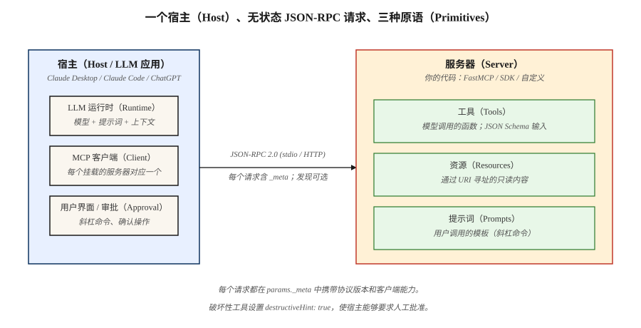

# 模型上下文协议（Model Context Protocol，MCP）

> MCP 为 AI 宿主（Host）提供统一协议，用于发现和调用工具、资源与提示词。2026-07-28 修订版使该协议无状态（Stateless）：能力与版本上下文随每个请求传递，而不再依赖绑定到连接的握手（Handshake）。

**Type:** Build
**Languages:** Python
**Prerequisites:** 阶段 11 · 09（函数调用，Function Calling）、阶段 11 · 03（结构化输出，Structured Outputs）
**Time:** 约 75 分钟

## 学习目标（Learning Objectives）

- 区分 MCP 宿主、客户端（Client）、服务器（Server）、传输方式（Transport）和服务器原语（Server Primitive）。
- 构建包含 MCP 2026-07-28 所需元数据的 JSON-RPC 请求。
- 使用 `server/discover` 检查版本、身份与能力。
- 从工具、资源和提示词返回具有明确类型及缓存信息的结果。
- 解释现代无状态 MCP 如何与握手时代的服务器互操作。
- 为服务器选择安全的状态、传输和审批边界。

## 问题（The Problem）

你的应用需要数据库查询、日历操作和文件读取功能。如果没有共享协议，每个 AI 宿主都必须为这些相同能力编写定制的发现、调用、错误、传输和授权衔接代码。

MCP 缩小了这张集成矩阵。服务器发布标准的 JSON-RPC 接口。符合协议的客户端可以发现该接口、将其展示给模型或用户、调用它并解释结果，而无需针对特定服务器编写适配器（Adapter）。

有一条重要边界很容易被忽略：MCP 标准化的是通信。它不决定模型应调用哪个工具，不会使不可信内容变安全，也不会将无状态请求变成持久的应用状态。这些决策仍由你的宿主和服务器负责。

## 概念（The Concept）



### 三种服务器原语（The three server primitives）

1. **工具（Tools）**是可调用的动作。每个工具都有名称、描述、JSON Schema 输入和处理函数（Handler）。
2. **资源（Resources）**是有名称、通过 URI 寻址且可供客户端读取的内容。
3. **提示词（Prompts）**是宿主可向用户展示的可复用模板。

宿主就是 AI 应用。宿主内的一个 MCP 客户端与一个服务器通信。传输层在两者之间承载 JSON-RPC 消息。

### 无状态请求取代握手（Stateless requests replace the handshake）

MCP 2026-07-28 移除了 `initialize` 和 `notifications/initialized`，也移除了协议级会话（Session）。每个请求都在 `params._meta` 中携带解释该请求所需的上下文：

```json
{
  "jsonrpc": "2.0",
  "id": 1,
  "method": "tools/list",
  "params": {
    "_meta": {
      "io.modelcontextprotocol/protocolVersion": "2026-07-28",
      "io.modelcontextprotocol/clientCapabilities": {},
      "io.modelcontextprotocol/clientInfo": {
        "name": "lesson-client",
        "version": "1.0.0"
      }
    }
  }
}
```

协议版本和客户端能力是必需项，建议同时提供客户端身份。缺少 `_meta`、缺少必需字段或必需字段类型错误，都属于格式错误，返回无效参数（Invalid Params，`-32602`）。格式正确但服务器不支持的版本字符串会返回 `UnsupportedProtocolVersionError`（`-32022`）。服务器无需恢复先前的协商记录，就能处理有效请求。

无状态并不意味着应用永远不能维护状态，而是说状态不能隐藏在 MCP 连接或 `Mcp-Session-Id` 后面。如果工作流需要跨调用连续性，服务器就生成一个不透明句柄（Opaque Handle），客户端在后续调用中将其作为普通工具参数传递。每个请求仍必须检查授权。

### 发现与版本选择（Discovery and version selection）

每个现代服务器都实现 `server/discover`，其结果公布受支持的版本、能力和服务器身份：

```json
{
  "jsonrpc": "2.0",
  "id": 1,
  "result": {
    "resultType": "complete",
    "supportedVersions": ["2026-07-28"],
    "capabilities": {
      "tools": {},
      "resources": {},
      "prompts": {}
    },
    "ttlMs": 3600000,
    "cacheScope": "public",
    "_meta": {
      "io.modelcontextprotocol/serverInfo": {
        "name": "demo-server",
        "version": "1.0.0"
      }
    }
  }
}
```

客户端可以直接调用其他方法并处理版本错误，但发现操作让能力展示和版本选择变得明确。不受支持的版本会返回错误码为 `-32022` 的 `UnsupportedProtocolVersionError`。其数据包含服务器修订版本数组 `supported`，以及被拒绝的修订版本 `requested`。

在标准输入输出（stdio）传输上，兼容两个时代的客户端使用 `server/discover` 探测。发现结果，或可识别的现代错误（例如 `UnsupportedProtocolVersionError`），都表明这是现代服务器。对于无法识别为现代协议响应的错误或超时，允许回退到 2025-11-25 的 `initialize` 流程。旧版行为属于兼容代码，而非现代协议的默认路径。

### 显式结果（Results are explicit）

2026-07-28 核心协议的每个结果都有 `resultType`：

- `complete` 表示操作已完成。
- `input_required` 表示服务器需要通过多轮往返请求（Multi Round-Trip Requests）模式再进行一次往返。核心服务器只能从 `tools/call`、`resources/read` 或 `prompts/get` 返回它。

对于省略 `resultType` 的旧版结果，客户端必须视为已完成。

服务器应在每个结果的 `_meta` 中包含 `io.modelcontextprotocol/serverInfo`。这一身份由服务器自行声明，用于显示、日志记录和调试，而非安全决策。

列表和读取结果还携带 `ttlMs` 与 `cacheScope`。确定性的 `tools/list` 排序配合新鲜度提示，使客户端能够安全缓存发现结果，并提高提示词缓存（Prompt Cache）的稳定性。`cacheScope: public` 允许共享缓存；`private` 将复用范围限定在调用上下文内。

### 线上消息格式与传输（The wire format and transport）

MCP 通过 stdio 或可流式 HTTP（Streamable HTTP）传输 JSON-RPC 2.0。

- 请求包含 `jsonrpc`、`id`、`method` 和 `params`。
- 响应包含匹配的 `id`，以及 `result` 或 `error`。
- 通知（Notification）没有 `id`，也不期待响应。

现代 Streamable HTTP 暴露一个接受 POST 的端点。每条 JSON-RPC 消息各自使用一次 POST。请求 POST 收到一个 JSON 对象，或一个限定于该请求、以最终响应结束的服务器发送事件（Server-Sent Events，SSE）流。已接受的通知 POST 收到没有响应体的 HTTP 202；本核心修订版未定义通过 Streamable HTTP 发送的客户端到服务器通知。

2026-07-28 中没有独立的 MCP GET 流、DELETE 会话端点、`Mcp-Session-Id` 或 `Last-Event-ID` 重放（Replay）。长时间持续的变更通知使用 `subscriptions/listen` POST，其响应作为 SSE 流保持打开。

### 无需服务器主动发起请求的客户端输入（Client input without server-initiated requests）

旧修订版允许服务器通过流发送 `sampling/createMessage`、`roots/list` 或 `elicitation/create` 等请求。当前协议改用多轮往返请求。符合条件的工具调用、资源读取或提示词获取会返回 `resultType: input_required`，并至少包含 `inputRequests` 或 `requestState` 之一。客户端收集所请求的输入，使用新的 JSON-RPC ID 和对应的 `inputResponses` 重试原方法；如果提供了 `requestState`，则原样回传其值。如果没有 `inputRequests`，重试时就省略 `inputResponses`。

根目录（Roots）、采样（Sampling）和日志（Logging）功能仍可使用，但已弃用，因此新实现不应采用它们。现有 Roots 或 Sampling 请求在 MRTR 的 `inputRequests` 内传递，绝不能作为独立的服务器到客户端 JSON-RPC 请求。优先使用显式文件或目录参数、资源 URI、服务器配置，以及与模型供应商直接集成。stdio 诊断使用标准错误（stderr），生产遥测（Telemetry）使用 OpenTelemetry。

```figure
mcp-nxm-collapse
```

## 动手构建（Build It）

### 第 1 步：注册服务器接口（register a server surface）

尽管请求契约（Request Contract）发生了变化，注册仍然很简单：

```python
server = MCPServer("demo-server")

@server.tool(
    "add",
    "Add two integers.",
    {
        "type": "object",
        "properties": {
            "a": {"type": "integer"},
            "b": {"type": "integer"}
        },
        "required": ["a", "b"]
    }
)
def add(a: int, b: int) -> dict:
    return {"sum": a + b}
```

随课程提供的 `code/main.py` 实现还注册了资源和提示词。它特意使用标准库，让你看到每个消息封装（Envelope），而不是把协议处理交给 SDK。

### 第 2 步：为每个请求附加元数据（attach metadata to every request）

```python
def request(method, params=None):
    body_params = dict(params or {})
    body_params["_meta"] = {
        "io.modelcontextprotocol/protocolVersion": "2026-07-28",
        "io.modelcontextprotocol/clientCapabilities": {},
        "io.modelcontextprotocol/clientInfo": {
            "name": "demo-client",
            "version": "1.0.0"
        }
    }
    return {
        "jsonrpc": "2.0",
        "id": 1,
        "method": method,
        "params": body_params
    }
```

不要只把这份元数据缓存在连接对象中。服务器会在每个请求上校验它。

### 第 3 步：可在列举前执行发现（optionally discover before listing）

调用 `server/discover`，选择受支持的版本，再调用 `tools/list`。如果你已知版本并能处理 `-32022`，也可以直接调用 `tools/list`。

演示按名称排序返回工具列表，并附加 `ttlMs`、`cacheScope`、`resultType` 和服务器身份。工具调用返回已完成且不可缓存的结果，因为其输出可能依赖当前状态。

### 第 4 步：将同一请求映射到 HTTP（map the same request to HTTP）

远程 `tools/call` POST 包含与 JSON-RPC 请求体对应的请求头：

```http
POST /mcp HTTP/1.1
Content-Type: application/json
Accept: application/json, text/event-stream
MCP-Protocol-Version: 2026-07-28
Mcp-Method: tools/call
Mcp-Name: add
```

`MCP-Protocol-Version` 请求头必须与 `_meta` 中的版本一致。每个 JSON-RPC 请求都必须包含 `Mcp-Method`，且与 `method` 一致。只有 `tools/call`、`resources/read` 和 `prompts/get` 需要 `Mcp-Name`，其值必须分别匹配工具名称、资源 URI 或提示词名称。缺少必需请求头或值不匹配时，返回 HTTP 400，并带有错误码为 `-32020` 的 `HeaderMismatch`。

### 第 5 步：在协议状态之外落实安全措施（enforce safety outside protocol state）

- 对每个 HTTP 请求校验授权和受众（Audience）。
- 将本地服务器绑定到 localhost，并在 Streamable HTTP 上校验 `Origin`。
- 为会修改状态的工具标记 `destructiveHint: true`，并要求宿主批准。
- 显式传递目录和文件范围，不依赖已弃用的 Roots。
- 将资源和工具输出视为不可信数据。
- 使用 stdio 时，将标准输出（stdout）专用于 JSON-RPC；诊断信息写入 stderr。

## 使用方法（Use It）

在本课目录中运行：

```bash
python3 code/main.py
cd code
python3 -m unittest discover tests -v
```

第一行应报告已发现协议版本为 `2026-07-28` 的 `demo-server`。然后检查 `MCPClient.request`：它会为每次调用重建 `_meta`。移除某个请求的元数据，观察服务器拒绝它。

## 交付成果（Ship It）

`outputs/skill-mcp-server-designer.md` 将业务领域转化为无状态 MCP 设计。其验收门槛要求具备发现结果、逐请求元数据策略、顺序确定且包含缓存信息的列表、显式状态句柄、传输请求头、授权和审批规则。

## 继续深入 MCP（Continue the MCP Deep Dive）

本课介绍协议模型。阶段 13 将四个生产边界拆分为独立的构建与验证课程：

1. [MCP 工具契约与内容（MCP Tool Contracts and Content）](../../../13-tools-and-protocols/28-mcp-tool-contracts-and-content/docs/en.md) 涵盖封闭输入模式、结构化内容、路由元数据、不透明分页、补全授权，以及协议错误与工具领域错误的区别。
2. [MCP 可靠性、取消与流量控制（MCP Reliability, Cancellation, and Flow Control）](../../../13-tools-and-protocols/29-mcp-reliability-cancellation-and-flow-control/docs/en.md) 涵盖请求取消、持久任务取消、截止时间、幂等性（Idempotency）、背压（Backpressure）、代理缓冲和重连行为。
3. [MCP 注册表供应链、准入、漂移与回滚（MCP Registry Supply Chain, Admission, Drift, and Rollback）](../../../13-tools-and-protocols/30-mcp-registry-supply-chain-and-drift/docs/en.md) 涵盖命名空间证明、制品来源、不可变版本固定、运行时漂移、Registry 状态、准入证据和回滚。
4. [MCP 一致性工程（MCP Conformance Engineering）](../../../13-tools-and-protocols/31-mcp-conformance-versioning-and-operations/docs/en.md) 涵盖黄金样本与反例通信记录、严格区分协议版本时代、SDK 差异测试、代理证据、脱敏、健康门槛和发布回滚。

当服务器将跨越团队或信任边界时，请按顺序学习这些课程。它们一起将目标从“方法能够工作”推进到“契约在整个部署过程中保持安全且可诊断”。

## 练习（Exercises）

1. 添加 `subtract` 工具，确认 `tools/list` 仍按字母顺序排列。
2. 移除协议版本键，验证返回无效参数（Invalid Params，`-32602`）。再发送格式正确但不受支持的版本 `2025-11-25`，验证返回 `-32022`，确认 `requested` 回传该修订版本，并从 `supported` 中选择版本。
3. 为创建操作添加服务器生成的 `draftId`，然后要求更新操作必须携带该参数。解释为什么这是应用状态，而不是协议会话。
4. 从需要用户确认的工具返回 `input_required`。使用新 ID、一个 `inputResponses` 条目和原样的 `requestState` 重试原调用，不要自行构造服务器到客户端的 JSON-RPC 请求。
5. 勾勒兼容两个时代的 stdio 客户端。将结果或可识别的现代错误视为现代协议响应，只在出现无法识别的错误或超时时允许回退到 `initialize`。

## 关键术语（Key Terms）

| 术语 | 常见说法 | 实际含义 |
|------|-----------------|------------------------|
| 模型上下文协议（MCP） | “LLM 的工具协议” | 用于服务器发现、工具、资源、提示词和扩展的 JSON-RPC 协议 |
| 宿主（Host） | “AI 应用” | 拥有模型和 UI，并挂载一个或多个 MCP 客户端 |
| 客户端（Client） | “连接器” | 代表宿主使用 MCP 与一个服务器通信 |
| 无状态 MCP（Stateless MCP） | “没有会话” | 每个请求携带版本和能力；协议状态不以连接为键保存 |
| `server/discover` | “能力探测” | 公布版本、能力和身份的必需服务器方法 |
| `resultType` | “结果状态” | 将结果标记为 `complete` 或 `input_required` |
| 状态句柄（State handle） | “工作流 ID” | 服务器生成、作为普通参数传递的应用标识符 |
| 可流式 HTTP（Streamable HTTP） | “远程传输” | 一个 POST 端点，返回 JSON 或限定于请求的 SSE 响应 |
| 多轮往返请求（MRTR） | “询问并重试” | 将输入请求嵌入结果，然后重试原操作 |

## 延伸阅读（Further Reading）

- [MCP 2026-07-28 主要变更（key changes）](https://modelcontextprotocol.io/specification/2026-07-28/changelog)
- [MCP 服务器发现（server discovery）](https://modelcontextprotocol.io/specification/2026-07-28/server/discover)
- [MCP 可流式 HTTP（Streamable HTTP）](https://modelcontextprotocol.io/specification/2026-07-28/basic/transports/streamable-http)
- [MCP 多轮往返请求（Multi Round-Trip Requests）](https://modelcontextprotocol.io/specification/2026-07-28/basic/patterns/mrtr)
- [MCP 已弃用功能（deprecated features）](https://modelcontextprotocol.io/specification/2026-07-28/deprecated)
