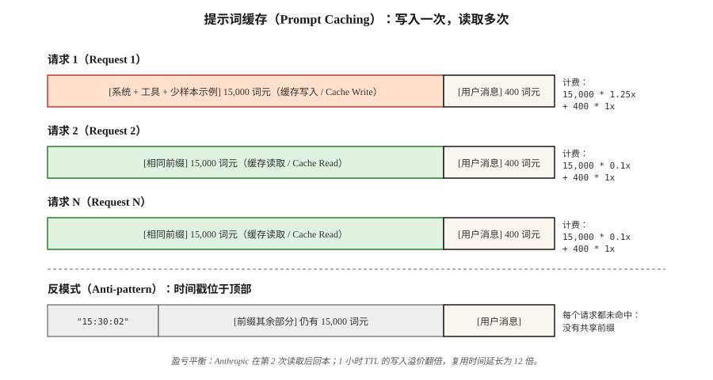

# 提示词缓存与上下文缓存（Prompt Caching and Context Caching）

> 你的系统提示词有 4,000 个词元（Token），检索增强生成（RAG）上下文有 20,000 个词元。每次请求都发送这两部分，也每次都为它们付费。提示词缓存让供应商在其服务端保持该前缀的缓存，复用时按正常费率的 10% 计费。正确使用可以将推理成本降低 50–90%，将首词元延迟降低 40–85%。

**Type:** Build
**Languages:** Python
**Prerequisites:** 阶段 11 · 01（提示词工程，Prompt Engineering）、阶段 11 · 05（上下文工程，Context Engineering）、阶段 11 · 11（缓存与成本，Caching and Cost）
**Time:** 约 60 分钟

## 问题（The Problem）

一个编程智能体（Coding Agent）在对话的每一轮都向 Claude 发送同一份 15,000 词元的系统提示词。按输入每百万词元 3 美元计费，20 轮仅输入就花费 0.90 美元，还没有计算用户实际发送的消息。每天 10,000 场对话，就会为从不变化的文本支付每天 9,000 美元。

缩短提示词会损害质量；不发送也不行，因为模型每一轮都需要它。唯一的办法，就是不再为供应商已经见过的前缀支付全价。

这个办法就是提示词缓存（Prompt Caching）。Anthropic 于 2024 年 8 月推出该功能，并于 2025 年推出生存时间（TTL）延长至 1 小时的变体；OpenAI 在 2024 年稍晚将其自动化；Google 随 Gemini 1.5 推出了显式上下文缓存。如今三家都将其作为前沿模型的原生功能。

## 概念（The Concept）



**工作机制。** 当请求前缀与近期某个请求的前缀匹配时，供应商复用上次运行的键值缓存（KV-cache），而不是重新编码词元。首次写入支付少量溢价，之后每次读取都享受大幅折扣。

**2026 年三家供应商的方案。**

| 供应商 | API 形式 | 命中折扣 | 写入溢价 | 默认 TTL | 最小可缓存量 |
|---------|-----------|--------------|---------------|-------------|---------------|
| Anthropic | 在内容块上显式添加 `cache_control` 标记 | 输入费用减免 90% | 加收 25% | 5 分钟，可延长至 1 小时 | Sonnet/Opus 为 1,024 词元，Haiku 为 2,048 词元 |
| OpenAI | 自动检测前缀 | 输入费用减免 50% | 无 | 最长 1 小时，尽力保留 | 1,024 词元 |
| Google（Gemini） | 显式 `CachedContent` API | 存储计费；读取约为正常费用的 25% | 按词元·小时收取存储费 | 用户设置，默认 1 小时 | Flash 为 4,096 词元，Pro 为 32,768 词元 |

**不变规则。** 三者都只缓存前缀。如果请求之间有任一词元不同，从第一个不同词元开始，后面的内容就全部未命中。将*稳定*部分放在顶部，将*可变*部分放在底部。

### 适合缓存的布局（The cache-friendly layout）

```
[系统提示词]             <-- 缓存这部分
[工具定义]               <-- 缓存这部分
[少样本示例（Few-shot）]  <-- 缓存这部分
[检索得到的文档]         <-- 会复用就缓存，否则不缓存
[对话历史]               <-- 缓存到上一轮
[当前用户消息]           <-- 从不缓存，每次都不同
```

如果违反这个顺序，例如将用户消息放到系统提示词之前，或在少样本示例之间穿插动态检索内容，缓存就永远不会命中。

### 盈亏平衡计算（The break-even calculation）

Anthropic 的 25% 写入溢价意味着，一个缓存块至少要读取两次才能产生净节省。1 次写入 + 1 次读取，平均单请求成本为 0.675 倍（节省 32%）；1 次写入 + 10 次读取，平均为 0.205 倍（节省 80%）。经验法则：凡是预计在 TTL 内至少复用 3 次的内容，都可以缓存。

```figure
prompt-cache-hit
```

## 动手构建（Build It）

### 第 1 步：使用显式标记实现 Anthropic 提示词缓存（Anthropic prompt caching with explicit markers）

```python
import anthropic

client = anthropic.Anthropic()

SYSTEM = [
    {
        "type": "text",
        "text": "You are a senior Python reviewer. Follow the rubric exactly.\n\n" + RUBRIC_15K_TOKENS,
        "cache_control": {"type": "ephemeral"},
    }
]

def review(code: str):
    return client.messages.create(
        model="claude-opus-4-7",
        max_tokens=1024,
        system=SYSTEM,
        messages=[{"role": "user", "content": code}],
    )
```

`cache_control` 标记告诉 Anthropic 将该块保存 5 分钟。在此窗口内复用会命中；窗口之后复用时，缓存已经过期，需要再次写入。

**响应中的用量字段：**

```python
response = review(code_a)
response.usage
# InputTokensUsage(
#     input_tokens=120,
#     cache_creation_input_tokens=15023,   # paid at 1.25x
#     cache_read_input_tokens=0,
#     output_tokens=340,
# )

response_b = review(code_b)
response_b.usage
# cache_creation_input_tokens=0
# cache_read_input_tokens=15023           # paid at 0.1x
```

在持续集成（CI）中检查这两个字段。如果多个请求的 `cache_read_input_tokens` 始终为零，说明缓存键正在漂移。

### 第 2 步：延长至一小时的 TTL（one-hour extended TTL）

对于长时间运行的批处理作业，默认 5 分钟的缓存会在作业间隔期间过期。设置 `ttl`：

```python
{"type": "text", "text": RUBRIC, "cache_control": {"type": "ephemeral", "ttl": "1h"}}
```

1 小时 TTL 的写入溢价是原来的 2 倍，即比基准高 50%，而不是 25%；但对于复用前缀超过 5 次的批次，很快就能回本。

### 第 3 步：OpenAI 自动缓存（OpenAI automatic caching）

OpenAI 无需配置。任何超过 1,024 词元且与近期请求匹配的前缀，都会自动享受 50% 折扣。

```python
from openai import OpenAI
client = OpenAI()

resp = client.chat.completions.create(
    model="gpt-5",
    messages=[
        {"role": "system", "content": SYSTEM_PROMPT},   # long and stable
        {"role": "user", "content": user_msg},
    ],
)
resp.usage.prompt_tokens_details.cached_tokens  # the discounted portion
```

同样适用上述适合缓存的布局规则。有两件事会破坏 OpenAI 的缓存，但不会破坏 Anthropic 的缓存：更改 `user` 字段（它是缓存键的一部分），以及调整工具顺序。

### 第 4 步：Gemini 显式上下文缓存（Gemini explicit context caching）

Gemini 将缓存作为可以创建和命名的一等对象（First-class Object）：

```python
from google import genai
from google.genai import types

client = genai.Client()

cache = client.caches.create(
    model="gemini-3.8-flash",
    config=types.CreateCachedContentConfig(
        display_name="rubric-v3",
        system_instruction=RUBRIC,
        contents=[FEW_SHOT_EXAMPLES],
        ttl="3600s",
    ),
)

resp = client.models.generate_content(
    model="gemini-3.8-flash",
    contents=["Review this code:\n" + code],
    config=types.GenerateContentConfig(cached_content=cache.name),
)
```

在缓存存续期间，Gemini 按词元·小时收取存储费，读取按正常输入费率的约 25% 计费。当你在多天内跨多个会话复用同一份巨大提示词时，这种形式很合适。

### 第 5 步：测量生产环境命中率（measuring hit rate in production）

参见 `code/main.py` 中模拟三家供应商的计费器，它追踪写入、读取和未命中次数，并计算每 1K 请求的混合成本。将目标命中率设为部署门槛；多数 Anthropic 生产配置在预热后应达到大于 80% 的缓存读取占比。

## 2026 年仍会被带入生产的问题（Pitfalls that still ship in 2026）

- **顶部出现动态时间戳。** 将 `"Current time: 2026-04-22 15:30:02"` 放在系统提示词顶部，会导致每个请求都未命中。把时间戳移到缓存断点（Cache Breakpoint）下方。
- **工具重排。** 按稳定顺序序列化工具；两次部署之间字典顺序的改变，会破坏所有命中。
- **自由文本近似重复。** “你乐于助人。”与“你是一名乐于助人的助手。”只要一个字节不同，就会完全未命中。
- **块太小。** Anthropic 要求至少 1,024 词元，Haiku 为 2,048。更小的块不会缓存，也不会明确报错。
- **成本仪表盘缺少区分。** 将“输入词元”拆分为已缓存和未缓存两类，否则流量下降会被误认为缓存带来的收益。

## 使用方法（Use It）

2026 年的缓存技术栈：

| 场景 | 选择 |
|-----------|------|
| 智能体有稳定的 10k+ 词元系统提示词，且对话轮次多 | Anthropic `cache_control`，使用 5 分钟 TTL |
| 批处理作业复用同一前缀超过 30 分钟 | Anthropic，设置 `ttl: "1h"` |
| 基于 GPT-5 的无服务器（Serverless）端点，没有定制基础设施 | OpenAI 自动缓存，只需使前缀稳定且足够长 |
| 多天复用巨大的代码或文档语料库 | Gemini 显式 `CachedContent` |
| 跨供应商回退（Fallback） | 各供应商保持相同的可缓存前缀布局，使任意命中都能生效 |

在用户消息层配合语义缓存（Semantic Caching，阶段 11 · 11）：提示词缓存处理*词元完全相同*的复用，语义缓存处理*含义相同*的复用。

## 交付成果（Ship It）

保存为 `outputs/skill-prompt-caching-planner.md`：

```markdown
---
name: prompt-caching-planner
description: 设计适合缓存的提示词布局，并选择合适的供应商缓存模式。
version: 1.0.0
phase: 11
lesson: 15
tags: [llm-engineering, caching, cost]
---

给定提示词（系统 + 工具 + 少样本示例 + 检索 + 历史 + 用户）和使用特征（每小时请求数、所需 TTL、供应商），输出：

1. 布局（Layout）。重新排序各部分，并标出单一缓存断点；说明哪些部分稳定，哪些容易变化。
2. 供应商模式（Provider mode）。选择 Anthropic cache_control、OpenAI 自动缓存或 Gemini CachedContent。根据 TTL 和复用模式说明理由。
3. 盈亏平衡（Break-even）。计算 TTL 内每次写入预期对应的读取次数，以及相较于无缓存的净成本。
4. 验证方案（Verification plan）。在 CI 中断言第二个相同请求的 cache_read_input_tokens > 0；仪表盘区分已缓存与未缓存词元。
5. 故障模式（Failure modes）。列出此配置下最可能导致未命中的三个原因：动态时间戳、工具重排、近似重复文本，并说明如何逐一预防。

拒绝交付将动态字段放在断点上方的缓存方案。如果复用次数不足以抵消 2 倍写入溢价，就拒绝启用 1 小时 TTL。
```

## 练习（Exercises）

1. **简单。** 使用 5,000 词元系统提示词与 Claude 进行 10 轮对话。先不使用 `cache_control` 运行，再启用它运行。分别报告输入词元账单。
2. **中等。** 编写测试工具（Test Harness）：给定提示词模板和请求日志，计算每种供应商方案的预期命中率与美元节省额，包括 Anthropic 5 分钟、Anthropic 1 小时、OpenAI 自动和 Gemini 显式缓存。
3. **困难。** 构建布局优化器：给定提示词和标记为 `stable=True/False` 的字段列表，在不丢失信息的前提下重写提示词，将单一缓存断点放到能最大化可缓存前缀的位置。在真实 Anthropic 端点上验证。

## 关键术语（Key Terms）

| 术语 | 常见说法 | 实际含义 |
|------|-----------------|-----------------------|
| 提示词缓存（Prompt caching） | “让长提示词变便宜” | 对匹配前缀复用供应商侧的 KV-cache；重复输入词元享受 50–90% 费用减免。 |
| `cache_control` | “Anthropic 的标记” | 声明“到这里为止都可缓存”的内容块属性；`{"type": "ephemeral"}`。 |
| 缓存写入（Cache write） | “支付溢价” | 首次填充缓存的请求；Anthropic 按约 1.25 倍输入费率计费，OpenAI 不收额外费用。 |
| 缓存读取（Cache read） | “折扣” | 后续匹配前缀的请求；Anthropic 按 10%、OpenAI 按 50%、Gemini 按约 25% 计费。 |
| 生存时间（TTL） | “能保留多久” | 缓存保持可用的秒数；Anthropic 默认 5 分钟，可延长至 1 小时；OpenAI 尽力保留最多 1 小时；Gemini 由用户设置。 |
| 延长 TTL（Extended TTL） | “Anthropic 的 1 小时缓存” | `{"type": "ephemeral", "ttl": "1h"}`；写入溢价翻倍，但批量复用时值得。 |
| 前缀匹配（Prefix match） | “缓存为什么没命中” | 只有从开头到断点的每个词元在字节层面完全相同，才会命中。 |
| 上下文缓存（Context caching，Gemini） | “显式的那个” | Google 的命名缓存对象，按存储计费；最适合多天复用大型语料库。 |

## 延伸阅读（Further Reading）

- [Anthropic：提示词缓存（Prompt caching）](https://docs.anthropic.com/en/docs/build-with-claude/prompt-caching)：`cache_control`、1 小时 TTL 和盈亏平衡表。
- [OpenAI：提示词缓存（Prompt caching）](https://platform.openai.com/docs/guides/prompt-caching)：自动前缀匹配。
- [Google：上下文缓存（Context caching）](https://ai.google.dev/gemini-api/docs/caching)：`CachedContent` API 与存储定价。
- [Anthropic 工程：面向长上下文工作负载的提示词缓存（Prompt caching for long-context workloads）](https://www.anthropic.com/news/prompt-caching)：包含延迟数据的最初发布文章。
- 阶段 11 · 05（上下文工程，Context Engineering）：在哪里切分提示词，才能让缓存生效。
- 阶段 11 · 11（缓存与成本，Caching and Cost）：将提示词缓存与用户消息层的语义缓存搭配使用。
- [Pope 等，《高效扩展 Transformer 推理》（Efficiently Scaling Transformer Inference，2022）](https://arxiv.org/abs/2211.05102)：提示词缓存向用户暴露的 KV-cache 内存模型；解释为什么重新读取缓存前缀比重新计算便宜约 10 倍。
- [Agrawal 等，《SARATHI：通过分块预填充搭载解码实现高效 LLM 推理》（SARATHI: Efficient LLM Inference by Piggybacking Decodes with Chunked Prefills，2023）](https://arxiv.org/abs/2308.16369)：预填充（Prefill）是提示词缓存跳过的阶段；本文解释了为什么缓存命中会大幅降低首词元时间（TTFT），却不影响每输出词元时间（TPOT）。
- [Leviathan 等，《通过推测解码加速 Transformer 推理》（Fast Inference from Transformers via Speculative Decoding，2023）](https://arxiv.org/abs/2211.17192)：提示词缓存与推测解码（Speculative Decoding）、Flash Attention、MQA/GQA 都是降低推理成本的手段；阅读本文以了解另外三者。
