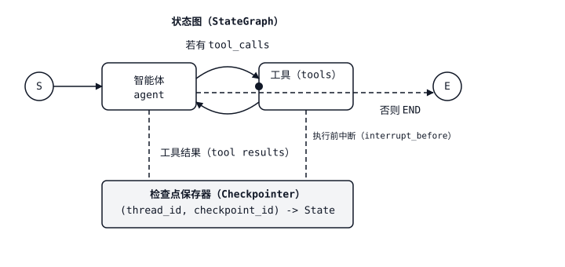

# 智能体状态机：图、节点与检查点（Agent State Machines — Graphs, Nodes, Checkpoints）

> 手写的 ReAct 循环是一个 `while True`。将同一循环写成显式图后，你就能保存检查点（Checkpoint）、中断（Interrupt）、分支，并回溯到历史状态。智能体没有改变，改变的是围绕它的运行框架（Harness）。

**Type:** Build
**Languages:** Python
**Prerequisites:** 阶段 11 · 09（函数调用，Function Calling）、阶段 11 · 14（模型上下文协议，Model Context Protocol）
**Time:** 约 75 分钟

## 问题（The Problem）

你上线了一个支持函数调用的智能体。它正常运行三轮，然后出了问题：模型尝试的工具返回 500，用户在任务中途改变主意，或者智能体未经人工签字批准就决定为订单退款。`while True:` 循环没有钩子（Hook）。你无法暂停、无法回退，也无法开出一个分支来探索“如果模型选了另一个工具会怎样”。一旦超出演示范围交付，智能体就成了一个只能知道成功或失败的黑盒。

看清这一点后，下一步就很明确：智能体本来就是状态机（State Machine），由系统提示词、消息历史、待执行工具调用和下一动作组成。将状态机显式化：为“模型思考”“工具执行”“人工批准”设置节点，用边表示它们之间的条件转移。图一旦显式化，运行框架就自然获得四种能力：检查点保存（在步骤之间保存状态）、中断（暂停以等待人工处理）、流式传输（Streaming，输出词元和中间事件），以及时间旅行（Time-travel，回到先前状态并尝试不同分支）。

这一抽象的参考实现是 LangGraph。它不是 LangChain 意义上的智能体框架，不会只给你一个 AgentExecutor 就让你自己处理其余问题。它是图运行时（Graph Runtime），将状态、持久化（Persistence）和中断都作为一等能力。智能体循环由你画出来，而不必手写出来。

## 概念（The Concept）



`StateGraph` 包含三部分。

1. **状态（State）。** 在图中流动的类型化字典（TypedDict 或 Pydantic 模型）。每个节点接收完整状态，返回部分更新；LangGraph 使用各字段的*归约器（Reducer）*合并更新。需要累积的列表使用 `operator.add`，默认行为则是覆盖。
2. **节点（Nodes）。** 形如 `state -> partial_state` 的 Python 函数。每个节点都是一个独立步骤，例如“调用模型”“执行工具”“生成摘要”。
3. **边（Edges）。** 节点之间的转移。静态边通向固定位置；条件边接收形如 `state -> next_node_name` 的路由函数（Router），让图根据模型输出选择分支。

你需要编译这张图。编译会绑定拓扑（Topology）、附加检查点保存器（Checkpointer，可选，但生产环境不可缺少），并返回可运行对象。调用时提供初始状态和 `thread_id`。执行的每一步都会持久化一个以 `(thread_id, checkpoint_id)` 为键的检查点。

### 四项核心能力（The four superpowers）

**检查点保存（Checkpointing）。** 每次节点转移都将新状态写入存储，测试使用内存，生产使用 Postgres、Redis 或 SQLite。使用相同的 `thread_id` 再次调用图即可恢复，图从暂停处继续。

**中断（Interrupts）。** 用 `interrupt_before=["human_review"]` 标记节点，执行就会在该节点运行前停止。状态被持久化，API 向用户返回“等待批准”。后续针对相同 `thread_id` 的请求携带 `Command(resume=...)`，即可恢复执行。

**流式传输（Streaming）。** `graph.stream(state, mode="updates")` 在状态增量出现时立即产出它们。`mode="messages"` 流式输出模型节点内的 LLM 词元。`mode="values"` 产出完整快照。你来选择在 UI 中展示哪些内容。

**时间旅行（Time-travel）。** `graph.get_state_history(thread_id)` 返回完整检查点日志。将任意先前的 `checkpoint_id` 传给 `graph.invoke`，就能从该点分叉。这适合调试，例如“如果模型改选工具 B 会怎样”，也适合重放生产追踪的回归测试（Regression Test）。

### 归约器是关键（Reducers are the point）

每个状态字段都有归约器。多数情况下默认行为就够用，即新值覆盖旧值。但消息列表需要 `operator.add`，使新消息追加而不是替换。并行边通过归约器合并更新。如果两个节点都更新 `messages`，而你忘记了 `Annotated[list, add_messages]`，第二次写入就会悄悄覆盖第一次，让你丢失这一轮的一半内容。归约器是库中唯一需要仔细理解的细节；配置正确，其余部分就能组合起来。

### 四节点 ReAct 图（The ReAct graph in four nodes）

一个生产 ReAct 智能体由四个节点和两条边组成：

1. `agent`：携带当前消息历史调用 LLM，返回助手消息，其中可能包含 tool_calls。
2. `tools`：执行最后一条助手消息中的所有 tool_calls，并将工具结果作为工具消息追加。
3. 从 `agent` 出发的条件边：如果最后一条消息包含 tool_calls，则路由至 `tools`，否则路由至 `END`。
4. 从 `tools` 返回 `agent` 的静态边。

就是这些。大约 40 行代码，你就能得到完整的 ReAct 循环：思考（Thought）→ 动作（Action）→ 观察（Observation）→ 思考 → ……，并具备检查点保存、中断和流式传输能力。

### StateGraph 与 Send：扇出（StateGraph vs Send: fanout）

`Send(node_name, state)` 让节点分派并行子图（Subgraph）。例如，智能体决定同时查询三个检索器（Retriever）。每个 `Send` 都启动目标节点的一次并行执行，它们的输出通过状态归约器合并。LangGraph 由此无需线程原语，就能表达编排器与工作者（Orchestrator-workers）模式。

### 子图（Subgraphs）

编译后的图可以作为另一张图的节点。外层图看到的是一个节点，内层图则拥有自己的状态和检查点。团队可据此构建监督者与工作者（Supervisor-worker）智能体：监督者图将用户意图路由至对应领域的工作者子图。

```figure
l5-state-graph-ledger
```

## 动手构建（Build It）

### 第 1 步：状态与节点（state and nodes）

```python
from typing import Annotated, TypedDict
from langchain_core.messages import AnyMessage, HumanMessage, AIMessage
from langgraph.graph import StateGraph, END
from langgraph.graph.message import add_messages
from langgraph.prebuilt import ToolNode
from langgraph.checkpoint.memory import MemorySaver

class State(TypedDict):
    messages: Annotated[list[AnyMessage], add_messages]

def agent_node(state: State) -> dict:
    response = llm.invoke(state["messages"])
    return {"messages": [response]}

def should_continue(state: State) -> str:
    last = state["messages"][-1]
    return "tools" if getattr(last, "tool_calls", None) else END

tool_node = ToolNode(tools=[search_web, read_file])

graph = StateGraph(State)
graph.add_node("agent", agent_node)
graph.add_node("tools", tool_node)
graph.set_entry_point("agent")
graph.add_conditional_edges("agent", should_continue, {"tools": "tools", END: END})
graph.add_edge("tools", "agent")

app = graph.compile(checkpointer=MemorySaver())
```

`add_messages` 是使消息列表累积而不是覆盖的归约器。忘记它是最常见的 LangGraph 错误。

### 第 2 步：使用线程运行（run with a thread）

```python
config = {"configurable": {"thread_id": "user-42"}}
for event in app.stream(
    {"messages": [HumanMessage("find the Anthropic headquarters address")]},
    config,
    stream_mode="updates",
):
    print(event)
```

每次更新都是一个 `{node_name: state_delta}` 字典。前端可以将这些更新流式传输到 UI，让用户看到“智能体正在思考……调用 search_web……获得结果……正在回答”。

### 第 3 步：添加人类在环中断（add a human-in-the-loop interrupt）

标记一个节点，使执行在该节点运行前暂停。

```python
app = graph.compile(
    checkpointer=MemorySaver(),
    interrupt_before=["tools"],  # pause before every tool call
)

state = app.invoke({"messages": [HumanMessage("delete the production database")]}, config)
# state["__interrupt__"] is set. Inspect proposed tool calls.
# If approved:
from langgraph.types import Command
app.invoke(Command(resume=True), config)
# If denied: write a rejection message and resume
app.update_state(config, {"messages": [AIMessage("Blocked by human reviewer.")]})
```

状态、检查点和线程都会跨中断持久保留。除了执行期间，没有内容仅驻留在内存中。

### 第 4 步：利用时间旅行调试（time-travel for debugging）

```python
history = list(app.get_state_history(config))
for snapshot in history:
    print(snapshot.values["messages"][-1].content[:80], snapshot.config)

# Fork from a prior checkpoint
target = history[3].config  # three steps back
for event in app.stream(None, target, stream_mode="values"):
    pass  # replay from that point forward
```

传入 `None` 作为输入，会从指定检查点重放；传入一个值，则在恢复前将其作为更新添加到该检查点的状态。这样就能复现失败的智能体运行，而无需重跑整段对话。

### 第 5 步：替换为生产用检查点保存器（swap the checkpointer for production）

```python
from langgraph.checkpoint.postgres import PostgresSaver

with PostgresSaver.from_conn_string("postgresql://...") as checkpointer:
    checkpointer.setup()
    app = graph.compile(checkpointer=checkpointer)
```

已有 SQLite、Redis 和 Postgres 实现。`MemorySaver` 用于测试。凡是需要跨重启保留数据的场景，都应使用真正的存储。

## 技能（The Skill）

> 将智能体构建为图，而不是 `while True` 循环。

使用 LangGraph 前，花 60 秒完成设计：

1. **命名节点。** 每个独立决策或有副作用的动作都是一个节点，例如“智能体思考”“工具执行”“审查者批准”“响应流式输出”。如果还列不出来，说明任务尚未整理成适合智能体的形式。
2. **声明状态。** 使用最小的 TypedDict，并为每个列表字段配置归约器。不要把所有内容塞进 `messages`；将任务特有字段提升到顶层，例如工作中的 `plan`、`budget` 计数器、`retrieved_docs` 列表。
3. **画出边。** 除非下一步依赖模型输出，否则使用静态边。每条条件边都需要一个具有命名分支的路由函数。
4. **预先选择检查点保存器。** 测试使用 `MemorySaver`，其他场景使用 Postgres、Redis 或 SQLite。没有保存器就不要交付，因为这意味着无法恢复、无法中断、无法时间旅行。
5. **在工具执行前决定中断，而不是执行后。** 将审批放在进入有副作用节点的边上，以便在造成损害前取消；将校验放在模型的出边上，以低成本拒绝错误调用。
6. **默认使用流式传输。** UI 使用 `mode="updates"`；模型节点内的词元级流式输出使用 `mode="messages"`；评估期间的完整快照使用 `mode="values"`。

拒绝交付没有检查点保存器的 LangGraph 智能体。拒绝交付在副作用发生*之后*才中断的智能体。拒绝交付未使用 `add_messages` 作为归约器的 `messages` 字段。

## 练习（Exercises）

1. **简单。** 使用计算器工具和网页搜索工具实现上述四节点 ReAct 图。验证两轮对话的 `list(app.get_state_history(config))` 至少返回四个检查点。
2. **中等。** 添加在 `agent` 之前运行的 `planner` 节点，将结构化的 `plan: list[str]` 写入状态。让 `agent` 标记已完成的计划步骤。如果检查点恢复后 `plan` 丢失，即归约器配置错误，则让测试失败。
3. **困难。** 构建监督者图，使用 `Send` 在三个子图（`researcher`、`writer`、`reviewer`）之间路由。每个子图都有自己的状态和检查点保存器。在外层图添加 `interrupt_before=["writer"]`，让人工能够批准研究简报。确认从先前检查点进行时间旅行时，只重跑分叉出的分支。

## 关键术语（Key Terms）

| 术语 | 常见说法 | 实际含义 |
|------|-----------------|-----------------------|
| 状态图（StateGraph） | “LangGraph 的图” | 编译前用于添加节点和边的构建器对象。 |
| 归约器（Reducer） | “字段如何合并” | 节点返回该字段的更新时应用的 `(old, new) -> merged` 函数；默认覆盖，`add_messages` 则追加。 |
| 线程（Thread） | “对话 ID” | 一个 `thread_id` 字符串，用于限定某次会话所有检查点的范围。 |
| 检查点（Checkpoint） | “暂停的状态” | 节点转移后完整图状态的持久化快照，以 `(thread_id, checkpoint_id)` 为键。 |
| 中断（Interrupt） | “暂停等待人工” | `interrupt_before` / `interrupt_after` 在节点边界停止执行；通过 `Command(resume=...)` 恢复。 |
| 时间旅行（Time-travel） | “从先前步骤分叉” | `graph.invoke(None, config_with_old_checkpoint_id)` 从该检查点向前重放。 |
| 分派（Send） | “并行子图分派” | 节点可以返回的构造器，用于启动目标节点的 N 次并行执行。 |
| 子图（Subgraph） | “将编译后的图作为节点” | 用作另一张图中节点的已编译 StateGraph，保留自己的状态作用域。 |

## 延伸阅读（Further Reading）

- [LangGraph 文档（documentation）](https://langchain-ai.github.io/langgraph/)：StateGraph、归约器、检查点保存器和中断的权威参考。
- [LangGraph 概念：状态、归约器、检查点保存器（state, reducers, checkpointers）](https://langchain-ai.github.io/langgraph/concepts/low_level/)：本课所用心智模型的直接来源。
- [LangGraph 持久化与检查点（Persistence and Checkpoints）](https://langchain-ai.github.io/langgraph/concepts/persistence/)：Postgres、SQLite、Redis 存储、检查点命名空间和线程 ID 的详细说明。
- [LangGraph 人类在环（Human-in-the-loop）](https://langchain-ai.github.io/langgraph/concepts/human_in_the_loop/)：`interrupt_before`、`interrupt_after`、`Command(resume=...)` 和编辑状态模式。
- [Yao 等，《ReAct：协同语言模型中的推理与行动》（ReAct: Synergizing Reasoning and Acting in Language Models，ICLR 2023）](https://arxiv.org/abs/2210.03629)：每个 LangGraph 智能体实现的模式；阅读它以了解推理轨迹的依据。
- [Anthropic：构建有效智能体（Building effective agents，2024 年 12 月）](https://www.anthropic.com/research/building-effective-agents)：何时优先选择链、路由器、编排器与工作者、评估器与优化器等图结构。
- 阶段 11 · 09（函数调用，Function Calling）：每个 LangGraph 智能体节点复用的工具调用原语。
- 阶段 11 · 14（模型上下文协议，Model Context Protocol）：通过 MCP 适配器接入 LangGraph `ToolNode` 的外部工具发现。
- 阶段 11 · 17（智能体框架权衡，Agent framework tradeoffs）：何时应选择 LangGraph，而不是 CrewAI、AutoGen 或 Agno。
