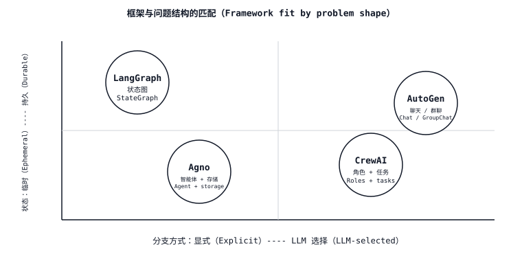

# 智能体框架权衡：图、角色与参与者编排（Agent Framework Tradeoffs — Graph, Role, and Actor Orchestration）

> 每个框架都展示同一种演示：研究智能体生成报告，也都隐藏同一种问题：状态模式与编排层相互冲突。选择抽象与问题结构相匹配的框架，否则其余部分都将成为你不得不重复编写的衔接代码。

**Type:** Learn
**Languages:** Python
**Prerequisites:** 阶段 11 · 09（函数调用，Function Calling）、阶段 11 · 16（LangGraph）
**Time:** 约 45 分钟

## 问题（The Problem）

你有一个需要多次 LLM 调用的任务。它可能是研究工作流：规划、搜索、摘要、引用；也可能是代码审查流水线：解析差异、评议、修补、验证；还可能是预订航班、撰写邮件和提交报销单的多轮助手。于是你选择了一个框架。

三天后，你发现框架的抽象存在泄漏（Leaky Abstraction）。CrewAI 提供角色，但“研究员”需要把结构化计划交给“作者”时，这套抽象就会妨碍你。AutoGen 提供智能体间聊天，却没有一等状态，因此你的检查点只是经过 pickle 序列化的对话日志。LangGraph 提供状态图，却要求你在知道智能体会做什么之前就为每次转移命名。Agno 提供单智能体抽象，但当你尝试扇出（Fanout）到三个并发工作者时，这套抽象就难以适应。

解决办法不是“挑最好的框架”，而是让框架的核心抽象与问题结构匹配。本课将画出这张对应关系图。

## 概念（The Concept）



四个框架主导着 2026 年的版图，它们的核心抽象并不相同。

| 框架 | 核心抽象 | 最适合 | 最不适合 |
|-----------|------------------|----------|-----------|
| **LangGraph** | `StateGraph`：类型化状态、节点、条件边、检查点保存器（Checkpointer）。 | 具有显式状态和人类在环（Human-in-the-loop）中断的工作流；需要时间旅行（Time-travel）调试的生产智能体。 | 拓扑未知、松散且由角色驱动的头脑风暴。 |
| **CrewAI** | `Crew`：角色（目标、背景故事）、任务、流程（顺序或层级）。 | 具有简短线性或层级计划的角色扮演、人格驱动工作流。 | 超出团队轮次历史的状态需求；复杂分支。 |
| **AutoGen** | 成对的 `ConversableAgent`：两个或更多智能体轮流发言，直到满足退出条件。 | 思考从聊天中涌现的多智能体*对话*，例如教师与学生、提案者与批评者、执行者与审查者。 | 已知有向无环图（DAG）的确定性工作流；任何需要跨重启持久状态的场景。 |
| **Agno** | `Agent`：单个 LLM + 工具 + 记忆，可组合成团队。 | 快速构建单智能体和轻量团队；多模态能力强，且内置存储驱动。 | 具有自定义归约器（Reducer）、深层显式分支的图。 |

### “抽象”的实际含义（What "abstraction" actually means）

框架的核心抽象，就是你讲解架构时画在白板上的东西。

- **LangGraph** → 你画一张图。节点是步骤，边是转移，每个位置的状态对象都有类型。其心智模型是状态机（State Machine）。
- **CrewAI** → 你画组织架构图。每个角色都有岗位说明，由经理分派任务。其心智模型是由专家组成的小团队。
- **AutoGen** → 你画一段 Slack 私信。两个智能体互相发消息，需要主持人时再加入第三个。其心智模型是聊天。
- **Agno** → 你画一个挂接着工具的方框。将多个方框并排放置就组成团队。其心智模型是“常用能力开箱即用的智能体”。

### 状态问题（The state question）

大多数框架选型在生产环境中失效，都发生在状态管理上。

- **LangGraph。** 类型化状态（`TypedDict` 或 Pydantic 模型）、逐字段归约器，以及一等检查点保存器（SQLite、Postgres、Redis）。恢复、中断和时间旅行能力自然具备。*参见阶段 11 · 16。*
- **CrewAI。** 状态通过 `context` 字段以字符串形式在任务之间流动，或通过 `output_pydantic` 结构化传递。没有开箱即用的逐团队持久存储；如果团队必须在重启后恢复，你就得自行加装。
- **AutoGen。** 状态是聊天历史和用户定义的 `context`。对话记录可以持久化；任意工作流状态则不能，除非你编写适配器（Adapter）。
- **Agno。** 通过 `storage=` 将内置存储驱动（SQLite、Postgres、Mongo、Redis、DynamoDB）附加到 `Agent`，对话会话和用户记忆会自动持久化。这是会话存储，而非完整的图检查点保存器。

### 分支问题（The branching question）

每个稍有复杂度的智能体都会分支。由谁决定分支很重要。

- **LangGraph**：你通过条件边决定。路由是具有命名分支的 Python 函数。分支是编译后图的一等结构，检查点保存器会记录实际走了哪个分支。
- **CrewAI**：层级模式由经理决定，顺序模式由你在构建时决定。路由隐含在任务列表中，经理提示词之外没有一等的“如果”结构。
- **AutoGen**：智能体通过聊天决定。分支从下一位发言者的选择中涌现。`GroupChatManager` 选择下一位发言者；你可以手写 `speaker_selection_method`，但默认由 LLM 驱动。
- **Agno**：智能体通过选择下一个要调用的工具决定。团队具有协调者、路由者、协作者模式，超出这些模式的分支由开发者负责。

### 可观测性问题（The observability question）

- **LangGraph**：通过 LangSmith 或任意 OTel 导出器使用 OpenTelemetry。每次节点转移都是一个追踪跨度（Trace Span），检查点也兼作可重放追踪。LangSmith 是官方选项，Langfuse 和 Phoenix 也提供适配器。
- **CrewAI**：自 2025 年末起将 OpenTelemetry 作为一等能力，并与 Langfuse、Phoenix、Opik、AgentOps 集成。
- **AutoGen**：通过 `autogen-core` 集成 OpenTelemetry；AgentOps 和 Opik 提供连接器。追踪粒度是每条智能体消息，而非每个节点。
- **Agno**：内置 `monitoring=True` 标记和 OpenTelemetry 导出器；与 Langfuse 紧密集成以提供会话追踪。

### 成本与延迟（Cost and latency）

四个框架都会增加单次调用开销，包括框架逻辑、校验和序列化。开销从低到高大致为：Agno ≈ LangGraph < CrewAI ≈ AutoGen。差异主要取决于框架执行了多少额外 LLM 路由。CrewAI 的层级经理会消耗词元来决定谁接着执行，AutoGen 的 `GroupChatManager` 也是如此。LangGraph 只在你编写 `llm.invoke` 的地方消耗词元。Agno 的单智能体路径开销较小。

当单次运行成本很重要时，优先使用显式路由（Explicit Routing），例如 LangGraph 的边和 AutoGen 的 `speaker_selection_method`，而不是由 LLM 选择路由。

### 互操作性（Interoperability）

- **LangGraph** ↔ **LangChain** 的工具、检索器和 LLM。提供一等 MCP 适配器，将工具作为 MCP 服务器导入。
- **CrewAI** ↔ 工具继承 `BaseTool`；LangChain、LlamaIndex 和 MCP 工具都可以适配接入。通过 `allow_delegation=True` 实现团队之间的委派（Delegation）。
- **AutoGen** → `FunctionTool` 包装任意 Python 可调用对象；有 MCP 适配器。其智能体间交互模式与 AG2 生态紧密耦合。
- **Agno** → `@tool` 装饰器或 BaseTool 子类；MCP 适配器；工具可在智能体和团队之间共享。

## 技能（The Skill）

> 你能用一句话解释，为什么某个框架适合某个智能体问题。

构建前检查清单：

1. **画出结构。** 这是图（类型化状态、命名转移）、角色扮演（专家交接工作）、聊天（智能体聊到完成），还是一个带工具的智能体？
2. **决定谁选择分支。** 开发者决定 → LangGraph；经理智能体决定 → CrewAI 层级模式；聊天中涌现 → AutoGen；工具调用决定 → Agno。
3. **检查状态需求。** 是否需要从检查点恢复、时间旅行、运行中人工中断？如果需要，默认选择 LangGraph；Agno 会话覆盖对话范围的状态。
4. **检查成本预算。** LLM 选择路由会在每轮消耗额外词元。如果智能体每天运行数千次，优先使用显式路由。
5. **计入框架开销。** 每个框架都是一个额外依赖。如果任务只是两次 LLM 调用和一个工具，写 30 行纯 Python 就行；没有框架比不使用框架更便宜。

在能够画出图、组织架构图、聊天或智能体方框之前，不要急于使用框架。不要选择一个会迫使你与其状态模型对抗，才能实现实际需求的框架。

## 决策矩阵（The Decision Matrix）

| 问题结构 | 首选框架 | 原因 |
|---------------|---------------------|-----|
| 具有类型化状态、人工审批且长时间运行的工作流 DAG | LangGraph | 一等状态、检查点保存器、中断和时间旅行。 |
| 角色分工明确的研究或写作流水线 | CrewAI 顺序模式，或 LangGraph 子图 | CrewAI 中按任务分配角色很容易表达；分支复杂后用 LangGraph 扩展。 |
| 提案者与批评者，或教师与学生对话 | AutoGen | 双智能体聊天是其原生结构。 |
| 具有工具、会话和记忆的单智能体 | Agno | 配置最精简，内置存储和记忆。 |
| 带归约器的数千路并行扇出 | LangGraph + `Send` | 四者中唯一提供一等并行分派 API 的框架。 |
| 快速原型，不想绑定框架 | 纯 Python + 供应商 SDK | 不使用框架就是最快的框架。 |

```figure
l5-framework-fit
```

## 练习（Exercises）

1. **简单。** 针对同一任务“研究 Anthropic 总部，撰写一份 200 词简报并引用来源”，分别用 LangGraph（规划、搜索、写作、引用四个节点）和 CrewAI（研究员、作者、编辑三个角色）实现。报告每次运行的词元成本和代码行数。
2. **中等。** 用 AutoGen（研究员与作者聊天，编辑通过 `GroupChat` 加入）和 Agno（具有 `search_tools`、`write_tools` 和会话存储的单智能体）实现同一任务。按以下指标对四种实现排序：（a）单次运行成本，（b）崩溃后恢复能力，（c）在写作步骤前加入人工审批的能力。
3. **困难。** 构建决策树脚本 `pick_framework.py`，接收简短问题描述，JSON 为 `{has_typed_state, has_roles, has_dialogue, has_parallel_fanout, needs_resume}`，返回推荐及一句话理由。在你自行设计的六个案例上验证。

## 关键术语（Key Terms）

| 术语 | 常见说法 | 实际含义 |
|------|-----------------|-----------------------|
| 编排（Orchestration） | “智能体如何协调” | 决定下一个运行哪个节点、角色或智能体的层。 |
| 持久状态（Durable state） | “重启后恢复” | 在进程终止后仍保留的状态，附着于检查点或会话存储。 |
| LLM 选择路由（LLM-selected routing） | “让模型决定” | 规划器 LLM 每轮选择下一步；灵活，但每次决策都消耗词元。 |
| 显式路由（Explicit routing） | “开发者决定” | Python 函数或静态边选择下一步；成本低且可审计。 |
| 团队（Crew） | “CrewAI 团队” | 将角色、任务和流程（顺序或层级）绑定成单个可运行对象。 |
| 群聊（GroupChat） | “AutoGen 的多智能体聊天” | 具有发言者选择器、由 N 个智能体参与的受管理对话。 |
| 团队（Team，Agno） | “多智能体 Agno” | 在一组智能体上采用路由、协调或协作模式。 |
| 状态图（StateGraph） | “LangGraph 的图” | 类型化状态、节点、条件边和检查点保存器的抽象。 |

## 延伸阅读（Further Reading）

- [LangGraph 文档（documentation）](https://langchain-ai.github.io/langgraph/)：StateGraph、检查点保存器、中断和时间旅行。
- [CrewAI 文档（documentation）](https://docs.crewai.com/)：团队（Crews）、流（Flows）、智能体（Agents）、任务（Tasks）和流程（Processes）。
- [AutoGen 文档（documentation）](https://microsoft.github.io/autogen/)：ConversableAgent、GroupChat、团队和工具。
- [Agno 文档（documentation）](https://docs.agno.com/)：Agent、Team、Workflow、存储和记忆。
- [Anthropic：构建有效智能体（Building effective agents，2024 年 12 月）](https://www.anthropic.com/research/building-effective-agents)：不依赖框架的模式库，包括提示词链、路由、并行化、编排器与工作者、评估器与优化器。
- [Yao 等，《ReAct：协同推理与行动》（ReAct: Synergizing Reasoning and Acting，ICLR 2023）](https://arxiv.org/abs/2210.03629)：每个框架包装的循环。
- [Wu 等，《AutoGen：通过多智能体对话实现下一代 LLM 应用》（AutoGen: Enabling Next-Gen LLM Applications via Multi-Agent Conversation，2023）](https://arxiv.org/abs/2308.08155)：AutoGen 的设计论文。
- [Park 等，《生成式智能体：人类行为的交互式模拟》（Generative Agents: Interactive Simulacra of Human Behavior，UIST 2023）](https://arxiv.org/abs/2304.03442)：CrewAI 风格人格技术栈所依托的角色扮演基础。
- 阶段 11 · 16（LangGraph）：本课用于比较的基准框架。
- 阶段 11 · 19（Reflexion）：能自然映射到 LangGraph、但较难映射到 CrewAI 的模式。
- 阶段 11 · 22（生产可观测性，Production observability）：无论选择哪个框架，如何为其添加观测埋点。
