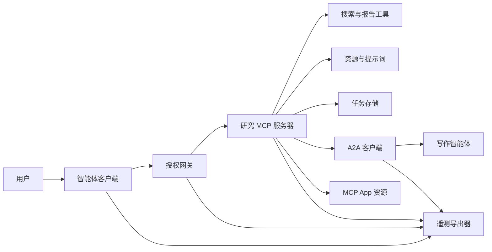
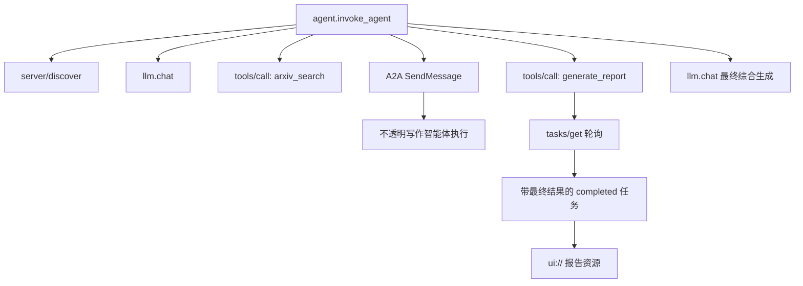
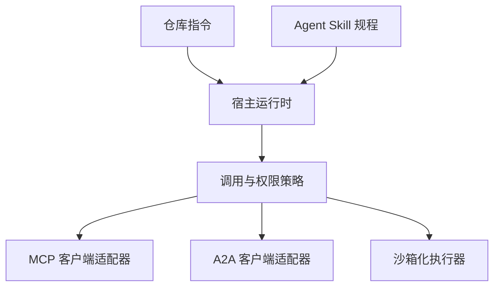

# 综合项目：无状态工具生态系统（Capstone: Stateless Tool Ecosystem）

> 生产智能体系统是一组边界，不是功能堆砌。本综合项目将可读的进程内模拟，与真实部署仍需的协议客户端、授权服务器、沙箱和遥测导出器分开。

**Type:** Build
**Languages:** Python (stdlib, in-process simulation)
**Prerequisites:** Phase 13 · 01 至 22，使用 MCP 修订 `2026-07-28`
**Time:** ~120 分钟

## 学习目标（Learning Objectives）

- 将工具调用、任务形态结果、委托工作、UI 资源、授权策略和追踪记录组合为一条流程。
- 在每个 MCP 请求携带协议版本、客户端身份和能力，而非依赖连接会话。
- 使用前发现服务器，并通过官方 Tasks 扩展驱动长任务。
- 区分协议形态模拟与 MCP、A2A、OAuth 或 OpenTelemetry 实现。
- 将每个模拟边界映射到必须替换它的生产组件。
- 让 `AGENTS.md`、Agent Skill、运行时适配器、工具和安全策略各守其职。
- 解释哪些主张可由本地输出验证，哪些需要实时集成测试。

## 问题（The Problem）

设计研究与报告系统。用户请求智能体协议相关论文。系统搜索论文目录、委托摘要、生成报告、返回 UI 资源，并记录贯穿系统的路径。

这句话隐藏了多个独立契约：

- 面向模型的工具模式；
- 无状态请求信封和服务器发现契约；
- 针对行为者、作用域和工具身份的网关决定；
- 长时间运行操作契约；
- 委托协议；
- 宿主到应用的桥接；
- 追踪传播和导出；
- 可复用操作规程。

`code/main.py` 用普通 Python 函数和字典让这些边界可见。它不打开传输、不联系 arXiv、不执行 OAuth、不调用 A2A 服务器、不渲染 MCP App，也不导出遥测。因此易于检查控制流，同时不会将模拟呈现为符合规范的服务。

## 概念（The Concept）

### 目标架构（Target architecture）



该架构是公开协议模式的概念组合，不是对任何产品私有内部实现的主张。

### 目标追踪（Target trace）



真实实现中，每跳都传播追踪上下文。跨度名和属性必须遵循所选插桩版本支持的 OpenTelemetry 语义约定。仅有共享追踪标识符，不证明父子关系、导出或后端摄取正确。

### 当前协议接口面（Current protocol surfaces）

使用当前协议定义的方法名，而非记忆中的旧草案名称：

| 边界 | 当前接口面 | 综合项目模拟内容 |
|---|---|---|
| MCP 发现 | 必需 `server/discover` | 直接函数返回版本、能力和服务器身份 |
| MCP 请求上下文 | 每个 `params._meta` 中的版本、能力和客户端身份 | 每个模拟调用传入新的请求元数据 |
| MCP 工具调用 | `tools/call` | 直接 Python 函数分发 |
| MCP 任务轮询 | `io.modelcontextprotocol/tasks` 与 `tasks/get` | 先返回工作中句柄，再返回携带最终结果的已完成任务 |
| A2A 委托 | gRPC 和 JSON-RPC 中的 `SendMessage`；HTTP+JSON 中的 `POST /message:send` | 一个嵌套跨度，无远程调用或人为延迟 |
| MCP App 调用服务器工具 | `app.callServerTool({ name, arguments })` | 无实时桥接的 HTML 字符串 |
| OAuth 授权 | 授权服务器、受保护资源元数据、受众与作用域验证 | 静态令牌查找和作用域成员检查 |
| OpenTelemetry | SDK、传播器、导出器及收集器或后端 | 内存跨度字典 |

协议名称只是第一层。生产测试必须在线上实际覆盖序列化、认证失败、取消、超时、重试和版本兼容。

### 无状态 MCP 改变集成边界（Stateless MCP changes the integration boundary）

修订 `2026-07-28` 移除了协议会话和 `initialize` / `notifications/initialized` 握手，也移除了 `Mcp-Session-Id`。每个请求携带这些命名空间化的 `_meta` 字段：

```json
{
  "io.modelcontextprotocol/protocolVersion": "2026-07-28",
  "io.modelcontextprotocol/clientCapabilities": {
    "extensions": {
      "io.modelcontextprotocol/tasks": {}
    }
  },
  "io.modelcontextprotocol/clientInfo": {
    "name": "capstone-client",
    "version": "1.0.0"
  }
}
```

服务器必须实现 `server/discover`。普通结果使用 `resultType: "complete"`，任务句柄使用 `resultType: "task"`。每个结果应在 `_meta.io.modelcontextprotocol/serverInfo` 中标识服务器。

任务扩展有 `tasks/get`、`tasks/update` 和 `tasks/cancel`。工具可先返回 `resultType: "task"`；`tasks/get` 本身返回 `resultType: "complete"`，已完成 `Task` 包含最终结果。旧的 `tasks/result` 和 `tasks/list` 不属于当前扩展。客户端必须在可能收到任务句柄的同一请求中声明 `io.modelcontextprotocol/tasks`。否则服务器返回 `-32021`，`requiredCapabilities` 结构是缺失客户端能力对象，包含 `extensions.io.modelcontextprotocol/tasks`。

### 安全设计（Security posture）

预期部署使用纵深防御：

- 客户端类型要求时，OAuth 授权配合 PKCE；
- 签发访问令牌的资源与受众绑定；
- 检查请求工具和作用域的网关 RBAC；
- 上游凭据位于模型可见上下文之外；
- 固定或已审查的工具描述清单；
- 对不可信输入、敏感数据和实际后果操作执行三取二规则审查；
- 在技能之外强制执行文件系统、进程、网络、凭据和资源限制的执行沙箱。

演示仅实现静态令牌、作用域检查和描述哈希。它有助于理解策略流程，不用于安全验证。

### 技能是规程，不是传输（Skills are procedure, not transport）

Agent Skill 可告诉运行时如何执行研究流程、期望哪些工具契约、保存什么证据以及何时停止。它不能创建 MCP 服务器、建立 A2A 兼容性、授予作用域或创建沙箱。



规程引用配套文件时，交付完整技能目录。这个较早综合项目中的扁平制品是课程蓝图，不证明宿主保留可移植包。第 24 至 27 课构建并测试完整包生命周期。

### 课程制品元数据是本地适配器（Course artifact metadata is a local adapter）

课程目录和安装器识别名为 `skill-*.md` 的扁平文件，但这是仓库约定，不是可移植 Agent Skills 包契约。其最小前置元数据解析器只读取顶层键。因此本课将可移植身份字段和课程目录字段放在同一层：

```yaml
---
name: ecosystem-blueprint
description: 根据产品需求生成完整 Phase 13 生态系统架构。
version: "1.0.0"
phase: "13"
lesson: "23"
tags: [mcp, capstone, ecosystem, architecture, a2a, otel]
---
```

`name` 和 `description` 是可移植身份字段。`version`、`phase`、`lesson` 和 `tags` 是课程专属目录扩展。课程解析器要求 `tags` 为行内列表，使 `--tag capstone` 能匹配。

可移植目录技能可以用可选 `metadata` 映射保存字符串值扩展数据，但这不使 `metadata` 与仓库目录模式可互换。如果扁平文件将 `version` 或 `tags` 嵌套到 `metadata` 下，最小解析器会跳过缩进键，目录记录空版本，标签过滤也找不到制品。生产宿主应使用安全 YAML 解析器并验证自己的文档化模式。

### 模拟与生产（Simulation versus production）

| 层 | `code/main.py` | 生产替代 | 必需证据 |
|---|---|---|---|
| 发现 | `server_discover()` 加静态 `TOOLS` | `server/discover` 后接具缓存感知的 `tools/list` | 线上记录、确定性顺序和模式验证 |
| 认证 | 令牌键控字典 | OAuth 授权和资源服务器验证 | 签发者、受众、作用域、到期和失败测试 |
| 授权 | 作用域成员关系 | 绑定行为者、工具、目标和租户的网关策略 | 允许与拒绝审计案例 |
| 搜索 | 静态论文夹具 | 搜索 API 或 MCP 服务器 | 来源出处、排序和错误测试 |
| 任务 | 本地句柄加立即 `tasks/get` | 持久 `io.modelcontextprotocol/tasks` 存储，含 `tasks/get`、`tasks/update`、`tasks/cancel` 和 TTL | 状态转移、输入、取消和恢复测试 |
| 委托 | 休眠加嵌套跨度 | A2A 客户端和远程智能体卡片 | 契约、超时、重试和不透明性测试 |
| 应用 | HTML 字符串和 URI | MCP Apps 资源和 `App` 桥接 | CSP、权限、工具调用和浏览器测试 |
| 遥测 | 内存列表 | OTel SDK 和导出器 | 收集器接收和追踪父级断言 |
| 沙箱 | 无 | 宿主强制隔离执行器 | 逃逸、出站、秘密和资源限制测试 |

此表就是交接边界。本地运行通过仅验证模拟。

### Phase 13 映射（Phase 13 map）

| 课程 | 贡献 |
|---|---|
| 01-05 | 工具接口、调用、模式、结构化结果和确定性验证 |
| 06-14 | 无状态 MCP 请求信封、发现、传输、资源、提示词、扩展和 Apps |
| 15-18 | 投毒防御、OAuth、网关、注册表和生产认证 |
| 19 | A2A 消息和任务委托 |
| 20 | OpenTelemetry GenAI 追踪设计 |
| 21 | 模型提供方路由 |
| 22 | 可移植技能契约和运行时边界 |

```figure
t3-capstone-chain
```

## 动手实现（Build It）

运行进程内测试框架：

```bash
cd phases/13-tools-and-protocols/23-capstone-tool-ecosystem
python3 code/main.py
```

检查五件事：

1. `server/discover` 声明修订 `2026-07-28` 和 Tasks 扩展。
2. Alice 可读取并生成报告，Bob 的写作用域调用被拒绝。
3. 一次编排器运行中的每个本地跨度共享一个追踪标识符，并记录父跨度标识符。
4. 报告以任务句柄开始。`tasks/get` 返回已完成任务，最终结果含文本和 `ui://` 引用。
5. 委托的写作智能体保持不透明，因为编排器仅记录边界跨度。
6. 没有输出声称发生了网络连接、OAuth 交换、收集器导出、浏览器渲染或沙箱执行。

脚本运行两次，因此产生两条根追踪。审计条目是进程本地的，下次运行重置。

## 实际应用（Use It）

每次将一层替换为真实实现：

1. 用真实 `server/discover` 和 `tools/list` 调用替换 `server_discover()` 和静态工具列表。每个请求发送版本、身份和能力。
2. 用授权服务器和受保护资源验证替换静态令牌。
3. 实现 `io.modelcontextprotocol/tasks` 扩展，测试 `tasks/get`、`tasks/update`、`tasks/cancel`、超时、TTL 和重启恢复。不要添加 `tasks/result` 或 `tasks/list`。
4. 用解析智能体卡片并发送消息的 A2A 客户端替换委托桩。
5. 使用官方 SDK 构建 App，通过 `app.callServerTool` 调用服务器工具。
6. 将跨度导出到测试收集器，在接收端断言父子关系。
7. 在第 26 课沙箱契约中运行工具和脚本执行。
8. 将规程打包成完整目录包，并通过第 27 课发布门槛。

每次替换都需要跨越新边界的集成测试。线上协议变成真实后，不要删除底层策略测试。

## 交付（Ship It）

本课生成 `outputs/skill-ecosystem-blueprint.md`，一个旧式单文件课程制品。它要求一页架构，涵盖原语、安全设计、委托、遥测、打包和最难运维风险。其顶层目录字段由仓库真实目录和安装器解析器验证。

由于不是目录包，它不能携带参考资料、脚本、资产或评估夹具。在课程之外发布可复用技能时，使用第 22 课及第 24 至 27 课的包格式。

## 练习（Exercises）

1. 运行 `code/main.py`。区分输出证明的事实与仍需集成证据的生产主张。
2. 添加第二个静态后端，为同名两个工具定义冲突规则。然后用真实 `tools/list` 调用替换两个列表。
3. 用 A2A 测试服务器替换写作桩。记录智能体卡片、消息请求、超时路径和返回制品。
4. 添加能跨进程重启存活的任务存储。证明客户端可用 `tasks/get` 恢复、遵守 `pollIntervalMs`，并在不用 `tasks/result` 的情况下读取已完成任务最终结果。
5. 构建最小 MCP App，在限制性 CSP 和显式权限下用浏览器验证 `app.callServerTool`。
6. 通过 OTel SDK 将模拟跨度导出到本地收集器。断言接收、追踪标识符、父子关系和错误状态。
7. 为仓库级维护规则编写 `AGENTS.md`，为可复用研究规程编写独立技能包。解释为何两者都不授予工具权限。

## 关键术语（Key Terms）

| 术语 | 常见说法 | 实际含义 |
|---|---|---|
| 综合项目（Capstone） | “全部接在一起” | 模拟与真实边界保持明确的分阶段集成 |
| 协议形态模拟（Protocol-shaped simulation） | “基本就是 MCP” | 类似协议但未实现线上契约的本地数据与调用 |
| Tasks 扩展（Tasks extension） | “长工具调用” | 可选 `io.modelcontextprotocol/tasks` 生命周期，具有持久身份、轮询、客户端输入、最终结果和取消语义 |
| 不透明边界（Opacity boundary） | “另一个智能体处理” | 调用方看到声明接口和制品，而非私有推理或内部状态 |
| 运行时适配器（Runtime adapter） | “技能集成” | 将可移植规程映射到发现、调用、工具、策略和上下文的宿主代码 |
| 集成证据（Integration evidence） | “通过了” | 证明真实边界被跨越的记录、制品或接收端观察 |

## 延伸阅读（Further Reading）

- [MCP 规范 2026-07-28](https://modelcontextprotocol.io/specification/2026-07-28)：无状态请求、发现、工具、授权和传输行为。
- [MCP 2026-07-28 关键变化](https://modelcontextprotocol.io/specification/2026-07-28/changelog)：会话移除、逐请求元数据、MRTR、扩展和弃用。
- [MCP Tasks 扩展](https://tasks.extensions.modelcontextprotocol.io/specification/draft/tasks)：`tasks/get`、`tasks/update`、`tasks/cancel` 和终态任务携带的最终结果。
- [MCP Apps SDK](https://github.com/modelcontextprotocol/ext-apps/blob/main/docs/overview.md)：`App` 和 `app.callServerTool`。
- [A2A 协议](https://a2a-protocol.org/latest/)：智能体卡片、消息交付、任务、制品和传输绑定。
- [OpenTelemetry GenAI 语义约定](https://opentelemetry.io/docs/specs/semconv/gen-ai/)：追踪和属性约定。
- [Agent Skills 规范](https://agentskills.io/specification)：规程层使用的可移植包契约。
