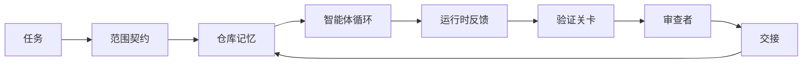

# 智能体工作台工程：有能力的模型为什么仍然失败（Agent Workbench Engineering: Why Capable Models Still Fail）

> 仅有一个能力强的模型还不够。可靠智能体需要工作台（Workbench）：指令、状态、范围、反馈、验证、审查和交接。去掉这些，即使前沿模型也会产出无法安全交付的工作。

**Type:** Learn + Build
**Languages:** Python（标准库）
**Prerequisites:** 第 14 阶段 · 01（智能体循环），第 14 阶段 · 26（失效模式）
**Time:** 约 45 分钟

## 学习目标（Learning Objectives）

- 区分模型能力与执行可靠性。
- 列出决定智能体能否交付的七项工作台支撑能力（Workbench Surfaces）。
- 在小型仓库任务上，对比仅提示词运行与工作台引导运行。
- 产出失效模式报告，将每项缺失的支撑能力映射到它造成的症状。

## 问题（The Problem）

你将前沿模型放进真实仓库，要求增加输入校验。它打开四个文件，写出看似合理的代码，宣告成功并停止。你运行测试，两个失败。它还动了一个与校验无关的文件。没有记录说明智能体做了什么假设、先尝试了什么、还有什么没做完。

模型不是不懂 Python，而是不懂这项工作。它不知道什么算完成、允许在哪里写入、哪些测试具有权威性，以及下个会话应如何接续。

这不是模型缺陷，而是工作台缺陷。智能体周围的环境缺少将单次生成变成可靠、可恢复工程工作的部分。

## 概念（The Concept）

工作台是模型执行任务时所处的操作环境，具有七项支撑能力（Workbench Surfaces）：

| 支撑能力 | 承载内容 | 缺失时的失败 |
|---------|-----------------|----------------------|
| 指令（Instructions） | 启动规则、禁止动作、完成定义 | 智能体猜测交付意味着什么 |
| 状态（State） | 当前任务、改动文件、阻塞、下一步动作 | 每个会话从零开始 |
| 范围（Scope） | 允许文件、禁止文件、验收标准 | 修改蔓延到无关代码 |
| 反馈（Feedback） | 将真实命令输出送回循环 | 智能体收到 400 仍宣告成功 |
| 验证（Verification） | 测试、代码检查、冒烟运行、范围检查 | “看起来不错”就进入 main |
| 审查（Review） | 不同角色的第二轮检查 | 构建者自己评判工作是否合格 |
| 交接（Handoff） | 改了什么、为什么、还剩什么 | 下个会话重新发现一切 |

工作台独立于模型。你可以更换模型并保留这些支撑能力，却不能随意更换支撑能力还保有可靠性。



整个循环通过状态文件衔接，而不依赖聊天历史。聊天记录可能丢失，仓库才是权威记录系统（System of record）。

### 工作台与提示词工程（Workbench versus prompt engineering）

提示词告诉模型本轮要什么，工作台告诉模型如何跨轮次、跨会话做工作。多数被称为提示词工程问题的智能体失败，实际是工作台失败。

### 工作台与框架（Workbench versus framework）

框架提供运行时，如 LangGraph、AutoGen、Agents SDK。工作台在运行时里给智能体提供工作场所。两者都需要。本小专题讨论后者。

### 从基本构件推理，而非厂商分类（Reasoning from primitives, not from vendor taxonomies）

当前关于“执行框架工程（Harness engineering）”的文章很多。Addy Osmani、OpenAI、Anthropic、LangChain、Martin Fowler、MongoDB、HumanLayer、Augment Code、Thoughtworks、walkinglabs 精选列表，以及持续出现的 Medium 和 Hacker News 文章，都在讨论它。它们对执行框架的边界、范围和词汇各有看法。我们不必选边。七项支撑能力是用户体验层；每个工作台底下，都是支撑可靠后端的同一组分布式系统基本构件。

暂时去掉智能体标签。智能体运行是跨时间、进程和机器的计算。要让它可靠，就需要任何生产系统都需要的基本构件。

| 基本构件 | 它是什么 | 为智能体承载什么 |
|-----------|------------|------------------------------|
| 函数（Function） | 带类型的处理程序，尽可能保持纯函数，拥有自身输入与输出 | 工具调用、规则检查、验证步骤、模型调用 |
| 工作者（Worker） | 拥有一个或多个函数及生命周期的长期进程 | 构建者、审查者、验证者、MCP 服务器 |
| 触发器（Trigger） | 调用函数的事件源 | 智能体循环节拍、HTTP 请求、队列消息、定时任务、文件变化、钩子 |
| 运行时（Runtime） | 决定什么在哪里运行，以及超时和资源限制的边界 | Claude Code 进程、LangGraph 运行时、工作者容器 |
| HTTP / RPC | 调用方与工作者之间的通信线路 | 工具调用协议、MCP 请求、模型 API |
| 队列（Queue） | 触发器与工作者之间的持久缓冲，提供背压、重试、幂等性 | 任务板、反馈日志、审查收件箱 |
| 会话持久化（Session persistence） | 在崩溃、重启、模型切换后保留的状态 | `agent_state.json`、检查点、键值存储、仓库本身 |
| 授权策略（Authorization policy） | 谁能在何种范围内调用什么函数 | 允许/禁止文件、审批边界、MCP 能力列表 |

现在将七项工作台支撑能力（Workbench Surfaces）映射到这些基本构件。

- **指令**：策略与函数元数据。规则是检查函数。路由器（`AGENTS.md`）是附着于运行时启动的策略。
- **状态**：会话持久化。运行时每步读取的键控存储。文件、键值存储或数据库都可以；重要的是持久化语义，而非存储后端。
- **范围**：每任务授权策略。允许/禁止的通配模式是访问控制列表（ACL），所需审批构成权限格（Permission lattice）。
- **反馈**：写入队列的调用日志。每次 Shell 调用都是持久、可重放的记录。
- **验证**：一个函数。相对于输入具有确定性。任务关闭时触发。失败时拒绝放行。
- **审查**：独立工作者，对构建者产物仅有读取授权，对审查报告仅有写入授权。
- **交接**：会话结束触发器发出的持久记录，下个会话启动触发器读取它。

智能体循环本身就是工作者：消费用户消息、工具结果、计时器节拍等事件，调用模型及模型选中的工具等函数，写入状态和反馈记录，发出验证、审查、交接触发信号。它的结构与普通作业处理器相同。

### 将流行模式译回基本构件（Patterns in circulation, translated to primitives）

每种流行执行框架模式，都能归结到这八种基本构件。对应表如下。

| 厂商或社区模式 | 实际是什么 |
|------------------------------|--------------------|
| Ralph Loop（Claude Code、Codex、agentic_harness 书籍）：智能体尝试提前停止时，将原始意图重新注入新上下文窗口 | 将任务以干净上下文重新入队的触发器；会话持久化将目标向前传递 |
| 计划 / 执行 / 验证（PEV） | 三个工作者各担任一个角色，通过状态与阶段间队列通信 |
| 执行框架与计算分离（OpenAI Agents SDK，2026 年 4 月）：分离控制平面与执行平面 | 重述控制平面 / 数据平面；该概念比智能体标签早几十年 |
| Open Agent Passport（OAP，2026 年 3 月）：执行前按声明式策略签名并审计每次工具调用 | 动作前工作者执行授权策略，并附带签名审计队列 |
| 指引与传感器（Guides and Sensors，Birgitta Böckeler / Thoughtworks）：前馈规则与反馈可观测性 | 授权策略、验证函数、可观测性追踪 |
| 五阶段渐进压缩（Claude Code 逆向工程，2026 年 4 月） | 像定时任务一样作用于会话持久化的状态管理工作者，使其保持在预算内 |
| 钩子 / 中间件（LangChain、Claude Code）：拦截模型和工具调用 | 包裹运行时调用路径的触发器与函数 |
| 渐进披露的 Markdown 技能（Anthropic、Flue） | 函数注册表，函数元数据按需及时加载到上下文 |
| 沙箱智能体（Codex、Sandcastle、Vercel Sandbox） | 计算平面：文件系统、网络、生命周期隔离的运行时 |
| MCP 服务器 | 通过稳定 RPC 暴露函数的工作者，以能力列表作为授权 |

表中每项都是智能体社区发现已有名字的分布式系统基本构件，再赋予新名称。这些标签适合营销，不适合作为工程词汇。

### 证据究竟说明什么（What the receipts actually say）

“执行框架重于模型”的主张如今有数字支持。值得了解，因为这也是反对“等更聪明的模型就行”的唯一诚实论据。

- Terminal Bench 2.0：同一个模型，仅改变执行框架，就使编码智能体从前 30 名之外升至第 5 名（LangChain，《智能体执行框架剖析》，Anatomy of an Agent Harness）。
- Vercel：删除智能体 80% 的工具，成功率从 80% 升至 100%（MongoDB）。
- Harvey：仅优化执行框架，法律智能体准确率就翻倍以上（MongoDB）。
- 88% 的企业 AI 智能体项目未能进入生产。失败集中于运行时，而非推理（preprints.org，《语言智能体执行框架工程》，Harness Engineering for Language Agents，2026 年 3 月）。
- 2025 年针对三个热门开源框架的基准研究报告约 50% 任务完成率；长上下文条件下 WebAgent 从 40–50% 跌到 10% 以下，主要由无限循环和目标丢失造成（2026 年初大量文章报道）。

结论不是“执行框架永远胜出”。模型确实会随时间吸收执行框架技巧。结论是，今天承担关键作用的工程在模型周围，而非模型内部；承载这些作用的基本构件，就是所有生产系统始终需要的那些。

### 厂商文章止步于何处（Where vendor writeups stop short）

这部分不必客气。

- LangChain《智能体执行框架剖析》（Anatomy of an Agent Harness）列出十一个组件，包括提示词、工具、钩子、沙箱、编排、记忆、技能、子智能体，以及运行时“笨循环”。但没有指出队列、作为部署单元的工作者、触发语义、作为独立关注点的会话持久化或授权策略。它将执行框架视为配置对象，而非要部署的系统。
- Addy Osmani《智能体执行框架工程》（Agent Harness Engineering）给出 `Agent = Model + Harness` 和棘轮模式，却没有说明执行框架由什么构成。读起来像立场，而非规格。
- Anthropic 和 OpenAI 对这些支撑能力讨论最深入，但仍停留在自身运行时内。2026 年 4 月 Agents SDK 的“执行框架与计算分离”公告，是首篇明确支持控制平面 / 数据平面分离的厂商文章。这是基础思想，不是新思想。
- agentic_harness 书籍将执行框架视为配置对象（Jaymin West《智能体工程》，Agentic Engineering，第 6 章），其中最有力的一句是“执行框架是智能体系统的主要安全边界”。这只是换一种说法重述授权策略。
- Hacker News 讨论不断回到同一点。2026 年 4 月“智能体执行框架应该在沙箱之外”（The agent harness belongs outside the sandbox）主张，执行框架应“更像置于一切之外、根据上下文和用户授权访问的虚拟机监控器”。这仍然是将授权策略作为独立平面。

无需反对任何文章，也能看到缺口：它们在写一个既有系统的用户体验描述，我们则在构建系统。系统构建正确时，七项支撑能力自然从基本构件中形成；构建错误时，再精美的 `AGENTS.md` 也补不上缺失队列。

所以，在其他地方听到“执行框架工程”时，应将它译回基本构件。提示词和规则是策略与函数，脚手架是运行时，护栏是授权加验证，钩子是触发器，记忆是会话持久化，Ralph Loop 是重新入队，子智能体是工作者，沙箱是计算平面。词汇会变，工程不会。工作台是面向智能体的用户体验；能够经受下一轮厂商概念重塑的执行框架，则是正确连接的函数、工作者、触发器、运行时、队列、持久化和策略。

```figure
wb-seven-surfaces
```

## 动手实现（Build It）

`code/main.py` 对同一个微型仓库任务运行两次：先仅用提示词，再接入七项支撑能力。同一模型、同一任务。脚本统计失败运行中缺失的支撑能力，并打印失效模式报告。

仓库任务刻意保持小规模：为单文件 FastAPI 式处理器添加输入校验，并写一个通过的测试。

运行：

```
python3 code/main.py
```

输出：两次运行的并排日志、汇总仅提示词运行的 `failure_modes.json`，以及用一行文字说明工作台运行的判定结果。

智能体是微型规则桩，重点在于支撑能力而非模型。在本小专题其余课程中，你会将每项支撑能力重建为真实可复用产物。

## 实际应用（Use It）

现实中已有工作台支撑能力的三个地方，即使没人这样称呼：

- **Claude Code、Codex、Cursor。** `AGENTS.md` 和 `CLAUDE.md` 是指令支撑能力；斜杠命令是范围；钩子是验证。
- **LangGraph、OpenAI Agents SDK。** 检查点和会话存储是状态支撑能力，交接就是交接支撑能力。
- **真实仓库的 CI。** 测试、代码检查和类型检查是验证；PR 模板是交接；CODEOWNERS 是审查。

工作台工程就是明确定义这些支撑能力，并使其可以复用，而非让每个团队重新发现它们。

## 交付成果（Ship It）

`outputs/skill-workbench-audit.md` 是可移植技能，审计现有仓库的七项工作台支撑能力（Workbench Surfaces），报告缺失、部分具备或健康状态。放在任意智能体配置旁，它就能告诉你先修什么。

## 练习（Exercises）

1. 选择已运行智能体的仓库，为七项支撑能力从 0（缺失）到 2（健康）评分。最薄弱的支撑能力是什么？
2. 扩展 `main.py`，让仅提示词运行也产生虚假的“成功”宣称。验证门禁应能捕获它。
3. 为自己的产品增加第八项支撑能力，说明为什么它不能归入现有七个。
4. 换一个会幻觉式额外写文件的桩智能体，重新运行脚本。哪项支撑能力先捕获它？
5. 将第 14 阶段 · 26 的五种行业常见失效模式映射到七项支撑能力。每项支撑能力设计用来化解哪种模式？

## 关键术语（Key Terms）

| 术语 | 常见说法 | 实际含义 |
|------|----------------|------------------------|
| 工作台（Workbench） | “配置环境” | 模型周围经过工程设计、使工作可靠的支撑能力 |
| 支撑能力（Surface） | “文档”或“脚本” | 智能体每轮读写的、具名且机器可读的输入 |
| 权威记录系统（System of record） | “笔记” | 聊天历史消失后，智能体视为事实来源的文件 |
| 完成定义（Definition of done） | “验收” | 有文件依据、客观且智能体无法伪造的清单 |
| 工作台审计（Workbench audit） | “仓库就绪检查” | 工作开始前检查七项支撑能力，标记缺失部分 |

## 延伸阅读（Further Reading）

将以下资料视为数据点，而非权威。每份都是部分分类体系。采用之前，将每个概念译回基本构件：函数、工作者、触发器、运行时、HTTP/RPC、队列、持久化、策略。

厂商视角：

- [Addy Osmani《智能体执行框架工程》（Agent Harness Engineering）](https://addyosmani.com/blog/agent-harness-engineering/)：`Agent = Model + Harness` 与棘轮模式，基础设施论述较薄
- [LangChain《智能体执行框架剖析》（The Anatomy of an Agent Harness）](https://blog.langchain.com/the-anatomy-of-an-agent-harness/)：十一个组件，包括提示词、工具、钩子、编排、沙箱、记忆、技能、子智能体、运行时；遗漏队列、部署和授权
- [OpenAI《执行框架工程：在智能体优先世界中利用 Codex》（Harness engineering: leveraging Codex in an agent-first world）](https://openai.com/index/harness-engineering/)：Codex 团队对运行时周围支撑能力的看法
- [OpenAI《展开 Codex 智能体循环》（Unrolling the Codex agent loop）](https://openai.com/index/unrolling-the-codex-agent-loop/)：将智能体循环归结为围绕函数调用的 `while`
- [Anthropic《长时间运行智能体的有效执行框架》（Effective harnesses for long-running agents）](https://www.anthropic.com/engineering/effective-harnesses-for-long-running-agents)：特定运行时中的长周期支撑能力
- [Anthropic《长时间应用开发的执行框架设计》（Harness design for long-running application development）](https://www.anthropic.com/engineering/harness-design-long-running-apps)：应用设计笔记
- [LangChain Deep Agents 执行框架能力](https://docs.langchain.com/oss/python/deepagents/harness)：运行时配置接口

含可用细节的实践文章：

- [Martin Fowler / Birgitta Böckeler《编码智能体用户的执行框架工程》（Harness engineering for coding agent users）](https://martinfowler.com/articles/harness-engineering.html)：指引（前馈）与传感器（反馈），最清晰的控制论表述
- [HumanLayer《技能问题：编码智能体执行框架工程》（Skill Issue: Harness Engineering for Coding Agents）](https://www.humanlayer.dev/blog/skill-issue-harness-engineering-for-coding-agents)：“不是模型问题，而是配置问题”
- [MongoDB《智能体执行框架：为什么 LLM 是智能体系统中最小的部分》（The Agent Harness: Why the LLM Is the Smallest Part of Your Agent System）](https://www.mongodb.com/company/blog/technical/agent-harness-why-llm-is-smallest-part-of-your-agent-system)：证据包括 Vercel 从 80% 到 100%、Harvey 准确率翻倍、Terminal Bench 从前 30 名外到前 5
- [Augment Code《AI 编码智能体的执行框架工程》（Harness Engineering for AI Coding Agents）](https://www.augmentcode.com/guides/harness-engineering-ai-coding-agents)：约束优先的讲解
- [Sequoia 播客，Harrison Chase 谈长周期智能体上下文工程（Context Engineering Long-Horizon Agents）](https://sequoiacap.com/podcast/context-engineering-our-way-to-long-horizon-agents-langchains-harrison-chase/)：运行时问题重于模型问题

书籍、论文和参考实现：

- [Jaymin West《智能体工程》第 6 章：执行框架（Agentic Engineering — Chapter 6: Harnesses）](https://www.jayminwest.com/agentic-engineering-book/6-harnesses)：书籍级讨论，将执行框架视为主要安全边界
- [preprints.org《语言智能体执行框架工程》（Harness Engineering for Language Agents，2026 年 3 月）](https://www.preprints.org/manuscript/202603.1756)：控制、自主性、运行时的学术表述
- [walkinglabs/awesome-harness-engineering](https://github.com/walkinglabs/awesome-harness-engineering)：涵盖上下文、评估、可观测性、编排的精选阅读列表
- [ai-boost/awesome-harness-engineering](https://github.com/ai-boost/awesome-harness-engineering)：另一精选列表，涵盖工具、评估、记忆、MCP、权限
- [HKUDS/OpenHarness](https://github.com/HKUDS/OpenHarness)：内置个人智能体的开放执行框架

值得阅读分歧而非共识的 Hacker News 讨论：

- [HN：长时间运行智能体的有效执行框架（Effective harnesses for long-running agents）](https://news.ycombinator.com/item?id=46081704)
- [HN：一下午改善 15 个 LLM 的编码表现，只改变执行框架（Improving 15 LLMs at Coding in One Afternoon. Only the Harness Changed）](https://news.ycombinator.com/item?id=46988596)
- [HN：智能体执行框架应在沙箱之外（The agent harness belongs outside the sandbox）](https://news.ycombinator.com/item?id=47990675)：主张将授权作为独立平面

本课程内部交叉引用：

- 第 14 阶段 · 23：OpenTelemetry GenAI 约定，传感器文献指向的可观测性层
- 第 14 阶段 · 26：七项支撑能力设计用来化解的失效模式目录
- 第 14 阶段 · 27：位于授权策略基本构件上的提示词注入防御
- 第 14 阶段 · 29：生产运行时（队列、事件、定时任务），即本课基本构件在部署中的落点
