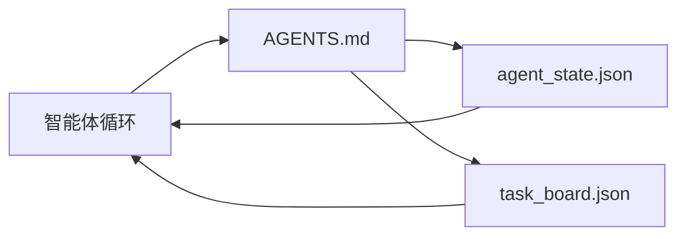

# 最小智能体工作台（The Minimal Agent Workbench）

> 最小有用工作台由三个文件组成：根指令路由器、状态文件、任务板。其他所有东西都叠加在其上。如果仓库连这三者都无法承载，没有模型能拯救它。

**Type:** Build
**Languages:** Python（标准库）
**Prerequisites:** 第 14 阶段 · 31（有能力的模型为什么仍然失败）
**Time:** 约 45 分钟

## 学习目标（Learning Objectives）

- 定义构成最小可行工作台的三个文件。
- 解释简短根路由器为什么优于冗长单体 `AGENTS.md`。
- 构建智能体每轮可读、结束时可写的状态文件。
- 构建不依赖聊天历史、可跨会话保留工作的任务板。

## 问题（The Problem）

多数团队用一份 3000 行的 `AGENTS.md` 搭建工作台，并宣告完成。模型加载后忽略无法概括的部分，过去缺失的工作台支撑能力（Workbench Surfaces）仍未补齐，失败也照旧发生。

你需要反过来做。小型根文件只在相关时将智能体路由到深层文件。智能体行动前读取、行动后写入持久状态。任务板说明正在做什么、哪里受阻、接下来是什么。

三个文件，各司其职。每个都足够机器可读，以便之后演进成真实系统。

## 概念（The Concept）



### AGENTS.md 是路由器，不是手册（AGENTS.md is a router, not a manual）

好的 `AGENTS.md` 很短，将智能体指向：

- 状态文件：你在哪里。
- 任务板：还剩什么。
- 深层规则：位于 `docs/agent-rules.md`。
- 验证命令：如何知道工作有效。

更长的内容放在深层文档中，仅在需要时加载。长手册会被忽略，短路由器会被遵循。

### agent_state.json 是权威记录系统（agent_state.json is the system of record）

状态包含活跃任务 ID、改动文件、所作假设、阻塞和下一步动作。智能体每轮读取它，下个会话也读取它，而非重放聊天。

状态放在文件里，因为聊天历史不可靠。会话会结束，对话会被裁剪，而状态文件仍会保留。

### task_board.json 是队列（task_board.json is the queue）

任务板承载所有任务，状态为 `todo | in_progress | done | blocked`。状态为空时，智能体从此队列拉取工作；你想知道智能体是否按计划推进时，也查看此队列。

任务板中的任务有 ID、目标、负责人（`builder`、`reviewer` 或 `human`）和验收标准。任务板刻意保持小规模：超过一屏时，是规划出了问题，不是任务板出了问题。

### 三个文件是下限，不是上限（Three files is the floor, not the ceiling）

后续课程增加范围契约、反馈运行器、验证门禁、审查者清单和交接包。它们都以这里的三个文件为前提。

```figure
wb-three-files
```

## 动手实现（Build It）

`code/main.py` 将最小工作台写入空仓库，演示智能体单轮执行：

1. 读取 `agent_state.json`。
2. 状态为空时，从 `task_board.json` 领取下个任务。
3. 修改范围内的一个文件。
4. 写回更新状态。

运行：

```
python3 code/main.py
```

脚本在自身旁边创建 `workdir/`，写入三个文件，运行一轮并打印差异。再次运行，观察第二轮如何从第一轮停止处继续。

## 实际应用（Use It）

生产智能体产品中，同样三个文件以不同名称出现：

- **Claude Code：** `AGENTS.md` 或 `CLAUDE.md` 作为路由器，`.claude/state.json` 式存储保存状态，钩子承担任务板作用。
- **Codex / Cursor：** 工作区规则作为路由器，会话记忆作为状态，聊天侧栏的排队任务作为任务板。
- **自定义 Python 智能体：** 就是你刚写的文件。

名称会变，结构不变。

## 真实生产模式（Production patterns in the wild）

在最小工作台之上叠加三种模式，才能适应真实单体仓库。它们相互独立，只选择仓库实际需要的。

**嵌套 `AGENTS.md`，最近者优先。** OpenAI 主仓库分布着 88 个 `AGENTS.md` 文件，每个子组件一份。Codex、Cursor、Claude Code、Copilot 都从工作文件向仓库根目录遍历，拼接沿途找到的每份 `AGENTS.md`。子目录文件扩展根文件。Codex 增加 `AGENTS.override.md`，用于替换而非扩展；该覆盖机制仅限 Codex，跨工具工作应避免。Augment Code 的测量最值得关注：最好的 `AGENTS.md` 带来相当于从 Haiku 升级到 Opus 的质量提升；最差的则比完全没有文件更糟。

**看似覆盖全面也必须拒绝的反模式。** 冲突指令会让智能体静默地从交互模式转入贪心模式（ICLR 2026 AMBIG-SWE：解决率从 48.8% 降到 28%）；应编号定义优先级，而非平铺堆叠。没有执行命令的不可验证风格规则，如“遵循 Google Python 风格指南”，会让智能体编造合规结论；每条风格规则都应配准确的检查命令。先讲风格而非命令，会埋没验证路径；命令优先，风格最后。面向人而非智能体写作会浪费上下文预算；简洁本身就是功能。

**跨工具符号链接。** 单个根文件加符号链接（`ln -s AGENTS.md CLAUDE.md`、`ln -s AGENTS.md .github/copilot-instructions.md`、`ln -s AGENTS.md .cursorrules`），让每个编码智能体使用同一事实来源。Nx 的 `nx ai-setup` 从一份配置自动为 Claude Code、Cursor、Copilot、Gemini、Codex、OpenCode 完成此设置。

## 交付成果（Ship It）

`outputs/skill-minimal-workbench.md` 为任意新仓库生成三文件工作台：适配项目的 `AGENTS.md` 路由器、带正确键的 `agent_state.json`，以及由当前待办事项初始化的 `task_board.json`。

## 练习（Exercises）

1. 为 `agent_state.json` 添加 `last_run` 时间戳。如果文件超过 24 小时，除非运维人员确认，否则拒绝运行。
2. 为任务板添加 `priority` 字段，修改领取器，始终选择最高优先级的 `todo`。
3. 将 `task_board.json` 迁移到 JSON Lines，每个任务一行，使版本控制差异清晰。
4. 编写 `lint_workbench.py`，当 `AGENTS.md` 超过 80 行或引用不存在的文件时失败。
5. 判断丢失三个文件中的哪一个伤害最大，并论证。

## 关键术语（Key Terms）

| 术语 | 常见说法 | 实际含义 |
|------|----------------|------------------------|
| 路由器（Router） | `AGENTS.md` | 将智能体指向深层文档和文件的简短根文件 |
| 状态文件（State file） | “笔记” | 机器可读的当前位置记录，每轮写入 |
| 任务板（Task board） | “待办清单” | 带状态、负责人、验收标准的 JSON 工作队列 |
| 权威记录系统（System of record） | “事实来源” | 聊天消失后，工作台视为权威的文件 |

## 延伸阅读（Further Reading）

- [agents.md：开放规范（The open spec）](https://agents.md/)：被 Cursor、Codex、Claude Code、Copilot、Gemini、OpenCode 采用
- [Augment Code《好的 AGENTS.md 相当于模型升级，坏的比没有文档还糟》（A good AGENTS.md is a model upgrade. A bad one is worse than no docs at all）](https://www.augmentcode.com/blog/how-to-write-good-agents-dot-md-files)：质量提升测量
- [Blake Crosley《AGENTS.md 模式：什么真正改变智能体行为》（AGENTS.md Patterns: What Actually Changes Agent Behavior）](https://blakecrosley.com/blog/agents-md-patterns)：实证中什么有效、什么无效
- [Datadog Frontend《用 AGENTS.md 引导单体仓库中的 AI 智能体》（Steering AI Agents in Monorepos with AGENTS.md）](https://dev.to/datadog-frontend-dev/steering-ai-agents-in-monorepos-with-agentsmd-13g0)：嵌套优先级实践
- [Nx 博客《教 AI 智能体如何在单体仓库中工作》（Teach Your AI Agent How to Work in a Monorepo）](https://nx.dev/blog/nx-ai-agent-skills)：从单一来源为六种工具生成配置
- [The Prompt Shelf《AGENTS.md 最佳实践：结构、范围和真实示例》（AGENTS.md Best Practices: Structure, Scope, and Real Examples）](https://thepromptshelf.dev/blog/agents-md-best-practices/)：经得住审查的章节排序
- [Anthropic，Claude Code 子智能体（Subagents）](https://code.claude.com/docs/en/sub-agents)
- 第 14 阶段 · 31：这个最小方案化解的失效模式
- 第 14 阶段 · 34：本课预先介绍的持久状态结构定义（Schema）
