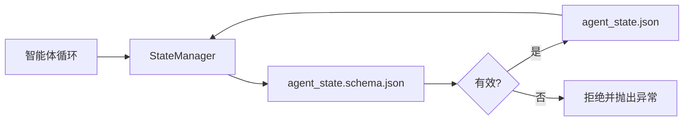

# 仓库记忆与持久状态（Repo Memory and Durable State）

> 聊天历史易失，仓库持久。工作台将智能体状态存入版本化文件，使下个会话、下个智能体和下位审查者都从同一事实来源读取。

**Type:** Build
**Languages:** Python（标准库，可选 `jsonschema`）
**Prerequisites:** 第 14 阶段 · 32（最小工作台）
**Time:** 约 60 分钟

## 学习目标（Learning Objectives）

- 定义什么属于仓库记忆，什么属于聊天历史。
- 为 `agent_state.json` 和 `task_board.json` 编写 JSON 结构定义（JSON Schema）。
- 构建状态管理器，原子地加载、校验、修改和持久化状态。
- 利用结构定义（Schema）拒绝错误写入，避免损坏工作台。

## 问题（The Problem）

智能体结束会话，聊天关闭。下个会话打开，询问从哪里开始。模型说“让我检查文件”，读取过时笔记，重复已完成工作。更糟时，它重写已完成文件，因为没人告诉它文件已完成。

工作台的解决办法是仓库记忆：状态放在仓库 JSON 文件中，按结构定义（Schema）写入，原子持久化，在代码审查中便于比较差异。聊天是临时信息流，仓库才是权威记录系统。

## 概念（The Concept）



### 什么属于仓库记忆（What belongs in repo memory）

| 应包含 | 不应包含 |
|---------|-----------------|
| 活跃任务 ID | 原始聊天记录 |
| 本会话改动文件 | 词元级推理追踪 |
| 智能体所作假设 | “用户似乎不耐烦” |
| 未解决阻塞 | 采样生成内容 |
| 下一步动作 | 厂商特定模型 ID |

判据是持久价值：三个月后 CI 重跑时是否仍有用？有用则进仓库，否则进遥测。

### 结构定义优先的状态（Schema-first state）

JSON 结构定义（JSON Schema）就是契约。没有它，每个智能体都会自行添加新字段，审查者每次都得重新理解数据结构，CI 脚本也必须为旧版本编写特殊处理逻辑。有它，错误写入就会被拒绝。

结构定义涵盖：

- 必需键。
- 允许的 `status` 值。
- 禁止值，例如数组不能为 `null`。
- 模式约束，例如任务 ID 匹配 `T-\d{3,}`。
- 用于迁移的版本字段。

### 原子写入（Atomic writes）

状态写入必须能承受部分失败：先写临时文件，fsync，再重命名覆盖目标。状态文件是事实来源，半写文件比没有文件更糟。

### 迁移（Migrations）

结构定义变更时，应在升级版本的同时交付迁移脚本。状态文件携带 `schema_version` 字段；管理器拒绝加载无法迁移的版本。

```figure
wb-state-persist
```

## 动手实现（Build It）

`code/main.py` 实现：

- `agent_state.schema.json` 和 `task_board.schema.json`。
- 纯标准库验证器，支持 JSON 结构定义（JSON Schema）的子集：required、type、enum、pattern、items。
- `StateManager.load`、`StateManager.update`、`StateManager.commit`，使用临时文件加重命名实现原子写入。
- 修改、持久化、重载状态并证明往返一致性的演示。

运行：

```
python3 code/main.py
```

脚本写入 `workdir/agent_state.json` 和 `workdir/task_board.json`，在两轮中修改它们，每步打印通过校验的状态。

## 真实生产模式（Production patterns in the wild）

以下四种实践让本课的最小方案能够用于多智能体协作的单体仓库。

**临时文件加重命名的原子写入不是可选项。** 2026 年 3 月 Hive 项目缺陷报告清楚记录此失效模式：通过 `write_text()` 写入 `state.json`，异常被捕获并静默吞掉。部分写入导致会话从损坏状态恢复，却没有信号。修复始终是：在目标同一目录中 `tempfile.mkstemp`，写入，`fsync`，`os.replace`，后者在 POSIX 和 Windows 上原子重命名。本课 `atomic_write` 正是这样做的。

**每次非幂等工具调用都要有幂等键。** 智能体在调用工具后、为结果建立检查点前崩溃，恢复就会重试调用。读取安全，邮件、数据库插入、文件上传危险。模式是：执行前把每个工具调用 ID 记录到 `pending_calls.jsonl`。重试时检查 ID，存在则跳过调用并使用缓存结果。Anthropic 和 LangChain 在 2026 年指南中都强调此点；LangGraph 检查点存储器出于同样原因持久化待处理写入。

**大型产物与状态分离。** 不要将 CSV、长对话记录或生成文件存进 `agent_state.json`。将产物单独保存为文件，或上传对象存储，状态只保留路径。检查点保持小而快，产物独立增长。

**事件溯源用于审计，快照用于恢复。** 每次修改追加事件日志（`state.events.jsonl`），定期快照到 `state.json`。恢复时读取快照，再重放快照时间戳之后的事件。磁盘成本更高，但可原样重放智能体决策，对调试长周期运行不可缺少。结构与 Postgres 内部 WAL 相同。

**迁移结构定义（Schema），否则拒绝加载。** 整数 `schema_version` 是契约。管理器遇到未知版本文件就拒绝读取。升级结构定义版本时，同时交付迁移脚本，`tools/migrate_state.py` 每次启动幂等运行。

## 实际应用（Use It）

生产中：

- **LangGraph 检查点存储器（Checkpointers）。** 同样思想，不同存储。将图状态持久化到 SQLite、Postgres 或自定义后端。当检查点存储器失效、你需要手工读状态时，本课介绍的结构定义就派上用场。
- **Letta 记忆块（Memory blocks）。** 遵循结构定义（Schema）的持久记忆块（第 14 阶段 · 08）。同样规范，范围是长期运行的角色。
- **OpenAI Agents SDK 会话存储（Session store）。** 可插拔且支持结构定义（Schema）的后端。本课状态文件是本地文件后端。

## 交付成果（Ship It）

`outputs/skill-state-schema.md` 为项目生成一对 JSON 结构定义（JSON Schema），分别用于状态与任务板，同时生成接入原子写入的 Python `StateManager` 和迁移脚本骨架，避免下次结构定义升级破坏工作台。

## 练习（Exercises）

1. 添加 `last_human_touch` 时间戳。人工编辑后五秒内拒绝智能体写入。
2. 扩展验证器支持 `oneOf`，使任务可以是具有不同必需字段的构建任务或审查任务。
3. 添加 `schema_version`，编写 v1 到 v2 迁移，将 `blockers` 重命名为 `risks`。
4. 将存储后端从本地文件迁移到 SQLite，保持 `StateManager` API 不变。
5. 让两个智能体对同一状态文件产生 50 毫秒写入竞态。会出什么问题，原子重命名如何保护你？

## 关键术语（Key Terms）

| 术语 | 常见说法 | 实际含义 |
|------|----------------|------------------------|
| 仓库记忆（Repo memory） | “笔记文件” | 按结构定义（Schema）存储在仓库跟踪文件中的状态 |
| 结构定义优先（Schema-first） | “校验输入” | 先定义契约，再写入，拒绝漂移 |
| 原子写入（Atomic write） | “重命名就行” | 写临时文件、fsync、重命名，防止部分失败造成损坏 |
| 迁移（Migration） | “结构定义升级” | 将 vN 状态转换为 v(N+1) 状态的脚本 |
| 权威记录系统（System of record） | “事实来源” | 工作台视为权威的产物 |

## 延伸阅读（Further Reading）

- [JSON 结构定义（JSON Schema）规范](https://json-schema.org/specification.html)
- [LangGraph 检查点存储器（Checkpointers）](https://langchain-ai.github.io/langgraph/concepts/persistence/)
- [Letta 记忆块（Memory blocks）](https://docs.letta.com/v1-sdk/memory/memory-blocks)
- [Fast.io《AI 智能体状态检查点实践指南》（AI Agent State Checkpointing: A Practical Guide）](https://fast.io/resources/ai-agent-state-checkpointing/)：优先定义结构、具备幂等性的检查点
- [Fast.io《AI 智能体工作流状态持久化：2026 最佳实践》（AI Agent Workflow State Persistence: Best Practices 2026）](https://fast.io/resources/ai-agent-workflow-state-persistence/)：并发控制、TTL、事件溯源
- [Hive 问题 #6263：非原子 state.json 写入被静默忽略](https://github.com/aden-hive/hive/issues/6263)：真实项目中的失效模式
- [eunomia《检查点/恢复系统：演进、技术、应用》（Checkpoint/Restore Systems: Evolution, Techniques, Applications）](https://eunomia.dev/blog/2025/05/11/checkpointrestore-systems-evolution-techniques-and-applications-in-ai-agents/)：将操作系统历史中的检查点/恢复基本构件用于智能体
- [Indium《2026 年长时间运行 AI 智能体的七种状态持久化策略》（7 State Persistence Strategies for Long-Running AI Agents in 2026）](https://www.indium.tech/blog/7-state-persistence-strategies-ai-agents-2026/)
- [Microsoft Agent Framework，压缩（Compaction）](https://learn.microsoft.com/en-us/agent-framework/agents/conversations/compaction)：厂商检查点管理器
- 第 14 阶段 · 08：记忆块与休眠计算
- 第 14 阶段 · 32：本课为之编写结构定义的三文件最小方案
- 第 14 阶段 · 40：依据同一结构定义读取的交接包
