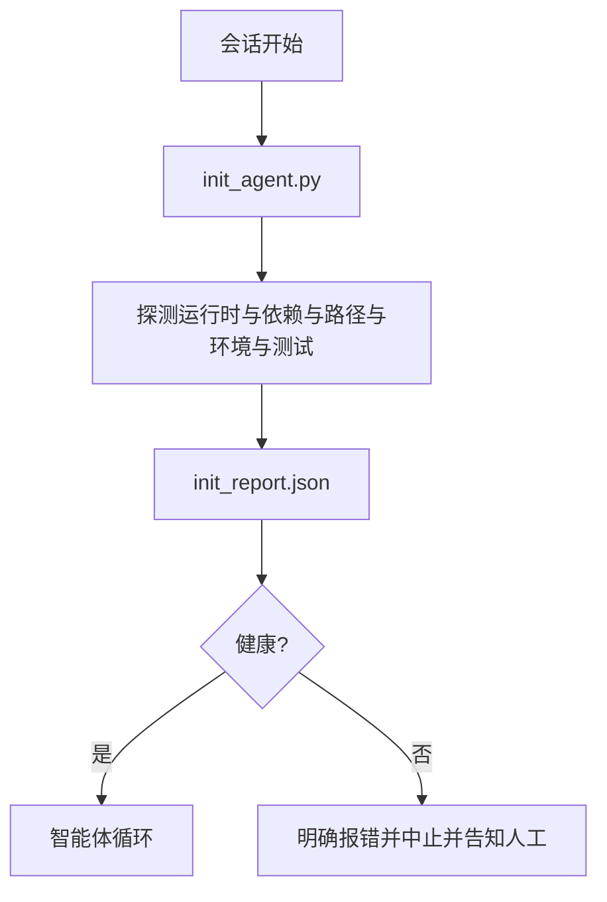

# 智能体初始化脚本（Initialization Scripts for Agents）

> 每个冷启动会话都要支付准备成本：智能体读取相同文件、重试相同探测、重新发现相同路径。初始化脚本只支付一次，将答案写入状态。

**Type:** Build
**Languages:** Python（标准库）
**Prerequisites:** 第 14 阶段 · 32（最小工作台），第 14 阶段 · 34（仓库记忆）
**Time:** 约 45 分钟

## 学习目标（Learning Objectives）

- 识别智能体每个会话都不应重复做的工作。
- 构建确定性的初始化脚本，探测运行时、依赖和仓库健康。
- 持久化探测结果，让智能体读取，而非重跑检查。
- 初始化失败时，快速、明确地失败，并提供单一排查位置。

## 问题（The Problem）

打开会话，智能体猜 Python 版本、猜测试命令、列五次仓库根目录寻找入口、尝试导入未安装包、问用户配置文件在哪。等到真正修改，已花一万个词元做本应由单个脚本完成的准备工作。

解决办法是一个初始化脚本：在智能体做任何其他事之前运行，写出启动时读取的 `init_report.json`。

## 概念（The Concept）



### 初始化脚本探测什么（What the init script probes）

| 探测项 | 为什么重要 |
|-------|----------------|
| 运行时版本 | 错误 Python 或 Node 版本会产生静默版本缺陷 |
| 依赖可用性 | 稍后才发现缺包，成本是现在捕获的十倍 |
| 测试命令 | 智能体必须知道如何验证；命令缺失说明工作台损坏 |
| 仓库路径 | 硬编码路径会漂移，应一次解析并固定 |
| 环境变量 | 缺少 `OPENAI_API_KEY` 是明确失效点，不是运行时谜团 |
| 状态与任务板新鲜度 | 崩溃会话留下的陈旧状态易造成误操作 |
| 最后已知正常提交 | 会话结束时交接差异的锚点 |

### 明确、快速、集中地失败（Fail loud, fail fast, fail in one place）

探测失败就停止并向人报告，不接受“智能体会想办法”。初始化的目的就是工作台损坏时拒绝启动。

### 幂等性（Idempotent）

连续运行两次，第二次除了更新时间戳，应不产生变化。幂等性让脚本能接入 CI、钩子或任务前斜杠命令。

### 初始化与启动规则（Init versus startup rules）

规则（第 14 阶段 · 33）规定行动前必须满足的条件，初始化脚本则确保这些规则能够得到检查。没有初始化，规则就退化成一句“要小心”；没有规则，初始化流程再完善也无法避免失败。

```figure
wb-init-probes
```

## 动手实现（Build It）

`code/main.py` 实现 `init_agent.py`：

- 五项探测：Python 版本、通过 `importlib.util.find_spec` 检查列出的依赖、测试命令能否解析、必需环境变量、状态文件新鲜度。
- 每项返回 `(name, status, detail)`。
- 写入包含全部探测结果的 `init_report.json`；任何阻断级别的探测失败时，退出码均为非零值。

运行：

```
python3 code/main.py
```

脚本打印探测表，写入 `init_report.json`；正常路径以零退出，否则列出失败探测并非零退出。

## 真实生产模式（Production patterns in the wild）

以下三种实践让初始化脚本发挥实际作用，避免沦为例行仪式。

**锚定最后已知正常提交。** 将当前提交与最后成功合并时写入的 `LKG` 文件对照。如果差异超过预算，默认 50 个文件，拒绝启动并要求人工认可新基线。这是 Cloudflare AI Code Review 为审查智能体限定范围的方法：每个审查会话锚定同一最后已知正常点，不让跨会话漂移累积。

**带生存时间（TTL）的锁文件。** 首次探测全部成功后写入 `prereqs.lock`。后续运行在 N 小时内信任锁，默认 24 小时，跳过昂贵探测。初始化先读锁，新鲜且依赖清单哈希匹配就直接返回。与 Docker 层缓存同模式：幂等探测 + 内容哈希 = 跳过。

**热路径无网络、无 LLM、无意外。** 初始化探测是确定性的基础工作。调用 LLM 分类失败，或访问外部服务检查许可证的探测，不是探测，而是工作流。试运行中探测超过三秒，应视为工作台设计信号，将其移出初始化或缓存结果。

## 实际应用（Use It）

生产中：

- **Claude Code 钩子。** `pre-task` 钩子调用初始化脚本，失败就拒绝启动智能体。
- **GitHub Actions。** `setup-agent` 作业运行初始化脚本，智能体作业依赖它。
- **Docker 入口点。** 智能体容器先运行初始化，再 exec 智能体运行时；失败时展示日志。

初始化脚本不调用特定框架，因此可移植。Bash、Make 或任务文件都能包装它。

## 交付成果（Ship It）

`outputs/skill-init-script.md` 调研项目，将准备工作归类为探测，输出项目特定 `init_agent.py` 与 CI 工作流，在任何智能体步骤前运行。

## 练习（Exercises）

1. 添加探测，对比当前提交与最后已知正常提交，超过 50 个文件变化就拒绝启动。
2. 让脚本写 `prereqs.lock`，锁超过七天就拒绝启动。
3. 添加 `--fix` 标志，自动安装缺失开发依赖，但未经批准绝不修改运行时依赖。
4. 将探测从硬编码函数迁到 YAML 注册表，论证取舍。
5. 为每项探测添加时间预算，超过三秒就是工作台设计警讯。

## 关键术语（Key Terms）

| 术语 | 常见说法 | 实际含义 |
|------|----------------|------------------------|
| 探测（Probe） | “检查” | 返回 `(name, status, detail)` 的确定性函数 |
| 初始化报告（Init report） | “准备输出” | 写在状态旁、包含探测结果的 JSON |
| 幂等（Idempotent） | “可安全重跑” | 连续两次报告除时间戳外完全相同 |
| 明确失败（Fail loud） | “不要吞错” | 停止并向人报告，不静默回退 |
| 准备成本（Setup tax） | “引导成本” | 智能体每个会话重新发现显而易见内容消耗的词元 |

## 延伸阅读（Further Reading）

- [Anthropic《长时间运行智能体的有效执行框架》（Effective harnesses for long-running agents）](https://www.anthropic.com/engineering/effective-harnesses-for-long-running-agents)
- [GitHub Actions：用于准备工作的复合动作（Composite actions for setup）](https://docs.github.com/en/actions/sharing-automations/creating-actions/creating-a-composite-action)
- [microservices.io，GenAI 开发平台：护栏（Guardrails）](https://microservices.io/post/architecture/2026/03/09/genai-development-platform-part-1-development-guardrails.html)：提交前与 CI 检查作为初始化
- [Augment Code《如何构建 AGENTS.md》（How to Build Your AGENTS.md，2026）](https://www.augmentcode.com/guides/how-to-build-agents-md)：初始化预期
- [Codex Blog《Codex CLI 上下文压缩》（Codex CLI Context Compaction）](https://codex.danielvaughan.com/2026/03/31/codex-cli-context-compaction-architecture/)：将会话启动作为感知压缩的初始化
- 第 14 阶段 · 33：本脚本启用的规则集
- 第 14 阶段 · 34：本脚本初始化的状态文件
- 第 14 阶段 · 38：初始化脚本供给的验证门禁
- 第 14 阶段 · 40：消费初始化报告中最后已知正常点的交接
