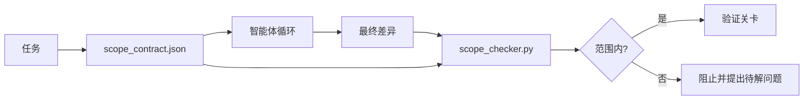

# 范围契约与任务边界（Scope Contracts and Task Boundaries）

> 模型不知道工作在哪里结束。范围契约是每个任务对应的文件，说明工作从哪里开始、在哪里结束，以及越界时如何回滚。它把“保持在范围内”从愿望变为可检查的约束。

**Type:** Build
**Languages:** Python（标准库）
**Prerequisites:** 阶段 14 · 32（最小工作台），阶段 14 · 33（规则即约束）
**Time:** 约 50 分钟

## 学习目标（Learning Objectives）

- 编写供智能体在任务开始时读取、供验证器在任务结束时读取的范围契约。
- 指定允许文件、禁止文件、验收标准、回滚计划与审批边界。
- 实现范围检查器，将差异与契约比较并标记违规。
- 让范围蔓延可见、可自动检测、可供审查。

## 问题（The Problem）

智能体的工作范围会蔓延。任务是“修复登录错误”，差异却涉及登录路由、邮件辅助程序、数据库驱动、README 和发布脚本。每次改动在当时都有看似合理的原因，但合在一起，已经不是最初审查的那项变更。

范围蔓延是智能体工作中监测最不足的失败模式，因为智能体会善意地解释每一步。解决办法不是更严格的提示词，而是磁盘上的契约：记录承诺，再用检查将结果与承诺比较。

## 概念（The Concept）



### 范围契约包含什么（What goes in a scope contract）

| 字段 | 用途 |
|-------|---------|
| `task_id` | 关联看板上的任务 |
| `goal` | 审查者能够验证的一句话目标 |
| `allowed_files` | 智能体可以写入的通配模式（Globs） |
| `forbidden_files` | 智能体即使无意也不得触碰的通配模式 |
| `acceptance_criteria` | 证明完成的测试命令或断言 |
| `rollback_plan` | 需要中止时，操作者能够执行的一段回滚说明 |
| `approvals_required` | 范围外且需要人工明确批准的操作 |

缺少 `forbidden_files` 的契约是不完整的。禁止事项占契约的一半。

### 使用通配模式，而非原始路径（Globs, not raw paths）

实际仓库会移动文件。让契约绑定通配模式（`app/**/*.py`、`tests/test_signup*.py`），这样会话之间的重构就不会使契约失效。

### 回滚也是范围的一部分（Rollback is part of scope）

写清如何回滚，会迫使契约作者思考可能出什么问题。无法回滚的契约不应获得批准。

### 范围检查就是差异检查（Scope check is a diff check）

智能体产出差异。检查器读取差异、允许的通配模式、禁止的通配模式，以及已经运行的验收命令列表。每项违规都是带标签的发现，验证关卡可以据此拒绝放行。

### 范围的两个层级：功能清单与任务契约（Two altitudes of scope: the feature list and the task contract）

范围契约约束一个任务，不约束整个项目。智能体可以完全遵守登录修复契约，却在下一轮决定项目还需要设置页、深色模式开关和路由器重写。契约从未被要求回答哪些工作属于项目范围，只回答哪些文件属于任务范围。

第二个层级需要自己的原语：智能体在会话开始时读取的 `feature_list.json`。它是以机器可读、有序文件表示的项目待办清单。智能体只能选择一个 `status` 为 `todo` 的功能，将其 `id` 写入当前范围契约，并且不得在同一会话中开始第二个功能。“一次只做一个功能”不再是智能体可以找理由绕过的提示词，而成为从磁盘读取的值和关卡强制执行的检查。

```json
{
  "project": "knowledge-base",
  "active": "import-pdf",
  "features": [
    { "id": "import-pdf",   "status": "in_progress", "goal": "import a PDF into the library",        "done_when": "pytest tests/test_import.py && a sample PDF appears in the library view" },
    { "id": "full-text-search", "status": "todo",     "goal": "search document text and rank hits",   "done_when": "query returns ranked results with snippets" },
    { "id": "cite-answers", "status": "todo",         "goal": "answers carry source citations",        "done_when": "every answer renders at least one clickable citation" }
  ]
}
```

| 字段 | 用途 |
|-------|---------|
| `active` | 当前会话唯一可以处理的功能；为空时需选一个并设置 |
| `features[].id` | 范围契约的 `task_id` 指向的稳定短标识 |
| `features[].status` | `todo`、`in_progress`、`done`、`blocked`；同一时间只能有一个 `in_progress` |
| `features[].goal` | 审查者能够验证的一句话目标 |
| `features[].done_when` | 将 `in_progress` 转为 `done` 的验收条件 |

两条规则使清单承担实际约束，而非装饰。首先，“最多一个 `in_progress`”这一不变量本身就是启动检查（阶段 14 · 33）：若清单中有两个，会话拒绝启动，直到人工解决。其次，功能清单是文件而非聊天消息，因为聊天会滚出上下文，文件却能跨会话、跨智能体保留。交接（阶段 14 · 40）将已完成功能的状态写回 `done`，让下一次会话打开准确的看板，而不必重新推导还剩什么。

契约与清单按最小权限原则组合，与下文的合并方式相同：任务契约的 `allowed_files` 必须位于当前功能涉及的范围内，绝不能超出。

```figure
wb-scope-bounce
```

## 动手实现（Build It）

`code/main.py` 实现：

- `scope_contract.json` 的结构定义（Schema），使用 JSON Schema 的子集和通配模式数组。
- 差异解析器，将变更文件列表和已运行命令列表转换为 `RunSummary`。
- `scope_check`，依据契约返回 `(violations, in_scope, off_scope)`。
- 两次演示运行：一次守住范围，一次发生蔓延。检查器以确切文件和原因标记越界。

运行：

```
python3 code/main.py
```

输出：契约、两次运行、每次运行的判定，以及保存的 `scope_report.json`。

## 实际生产中的模式（Production patterns in the wild）

一位采用“规格强化（specsmaxxing）”的实践者，在调用智能体前用 YAML 编写范围契约，报告称三周内无效深挖率从 52% 降至 21%，没有更换智能体。发挥作用的是契约，而非模型。三种模式能让收益持续。

**违规预算（Violation Budgets），而非非黑即白的失败。** `agent-guardrails` 是 Claude Code、Cursor、Windsurf、Codex 通过 MCP 使用的开源合并关卡，为每个任务提供 `violationBudget`：预算内的轻微越界显示为警告，只有超出预算才拒绝合并。配合 `violationSeverity: "error" | "warning"` 使用。合理的预算决定了团队能否持续使用关卡交付变更，还是最终因无法忍受它而将其禁用。

**按路径类别设置不对称严重度（Severity Asymmetry）。** 对 `docs/**` 的范围外写入通常为 `warn`；对 `scripts/**`、`migrations/**`、`config/prod/**` 的范围外写入始终为 `block`。这种不对称必须写在契约中，而不是运行时中，因为它因项目而异，也随任务变化。

**文件预算之外，还要有时间与网络预算。** `time_budget_minutes` 字段约束实际经过时间；超时后，运行时未经重新批准就拒绝继续。针对主机名的 `network_egress` 允许列表，防止智能体悄悄调用任务范围外的外部 API。这些也是范围维度；文件通配模式是必要条件，但不充分。

**多契约合并语义（Multi-contract Merge Semantics）：最小权限。** 两份范围契约同时适用时（例如项目级契约与任务专属契约），合并规则是：对 `allowed_files` 取**交集**（两份契约都必须允许该路径），对 `forbidden_files` 取**并集**（任意一份都可禁止），`time_budget_minutes` 取最严格值（最小值），`approvals_required` 累积。`network_egress` 为 `None` 表示不强制限制，`[]` 表示全部拒绝，`[...]` 表示允许列表；合并时 `None` 采用另一方的约束，两份列表取交集，全部拒绝仍保持全部拒绝。将这些语义写入契约的结构定义（Schema），让合并能够按固定规则执行并接受审查。

## 实际应用（Use It）

生产模式：

- **Claude Code 斜杠命令（Slash Commands）。** `/scope` 命令写入契约，并将其固定为会话上下文。子智能体行动前读取契约。
- **GitHub PR。** 将契约作为 JSON 文件放入 PR 正文，或作为纳入版本控制的产物推送。CI 针对合并差异运行范围检查器。
- **LangGraph 中断（Interrupts）。** 范围违规触发中断；处理器询问人工，是扩大契约范围，还是让智能体退回边界内。

契约跟随任务流转。任务关闭时，契约归档至 `outputs/scope/closed/`。

## 交付成果（Ship It）

`outputs/skill-scope-contract.md` 根据任务描述生成范围契约，以及能识别通配模式、在 CI 中对每份智能体差异运行的检查器。

## 练习（Exercises）

1. 添加 `network_egress` 字段，列出允许访问的外部主机。拒绝访问其他主机的运行。
2. 扩展检查器：对 `docs/**` 采用软失败，对 `scripts/**` 采用硬失败。解释这种不对称的依据。
3. 让契约通过静态规则集（不用 LLM）从 `goal` 字段推导 `allowed_files`。遇到第一个边界情况会出什么问题？
4. 添加 `time_budget_minutes`，实际经过时间超出时拒绝继续。
5. 对同一份差异运行两份契约。两者同时适用时，正确的合并语义是什么？

## 关键术语（Key Terms）

| 术语 | 常见说法 | 实际含义 |
|------|----------------|------------------------|
| 范围契约（Scope Contract） | “任务简报” | 每任务 JSON，列出允许／禁止文件、验收条件与回滚方案 |
| 范围蔓延（Scope Creep） | “它还动了……” | 同一任务修改了契约范围外的文件 |
| 回滚计划（Rollback Plan） | “可以撤销” | 操作者中止工作时使用的一段操作手册 |
| 审批边界（Approval Boundary） | “需要签字同意” | 契约中明确列为需要人工批准的操作 |
| 差异检查（Diff Check） | “路径审计” | 将变更文件与契约的通配模式比较 |

## 延伸阅读（Further Reading）

- [LangGraph 人工介入中断（Human-in-the-loop Interrupts）](https://langchain-ai.github.io/langgraph/concepts/human_in_the_loop/)
- [OpenAI Agents SDK 工具审批策略（Tool Approval Policies）](https://platform.openai.com/docs/guides/agents-sdk)
- [logi-cmd/agent-guardrails：合并关卡与范围验证（Merge Gates and Scope Validation）](https://github.com/logi-cmd/agent-guardrails) —— 违规预算、严重度分级
- [Dev|Journal：通过智能体契约测试防止配置漂移（Preventing AI Agent Configuration Drift with Agent Contract Testing）](https://earezki.com/ai-news/2026-05-05-i-built-a-tiny-ci-tool-to-keep-ai-agent-configs-from-drifting-in-my-repo/) —— 无外部依赖的 `--strict` 模式
- [智能体编程不是陷阱：生产日志（Agentic Coding Is Not a Trap）](https://dev.to/jtorchia/agentic-coding-is-not-a-trap-i-answered-the-viral-hn-post-with-my-own-production-logs-33d9) —— 规格强化的实证：52% → 21%
- [OpenCode 权限通配模式（Permission Globs）](https://opencode.ai/docs/agents/) —— 按权限细分范围
- [Knostic：AI 编程智能体安全：威胁模型与保护策略（AI Coding Agent Security: Threat Models and Protection Strategies）](https://www.knostic.ai/blog/ai-coding-agent-security) —— 将范围纳入最小权限原则
- [Augment Code：AI 规格模板（AI Spec Template）](https://www.augmentcode.com/guides/ai-spec-template) —— 三级边界系统：必须／询问／禁止（must/ask/never）
- 阶段 14 · 27 —— 与范围锁配合的提示注入防御
- 阶段 14 · 33 —— 本契约按任务具体化的规则集
- 阶段 14 · 38 —— 检查器上报结果的验证关卡
