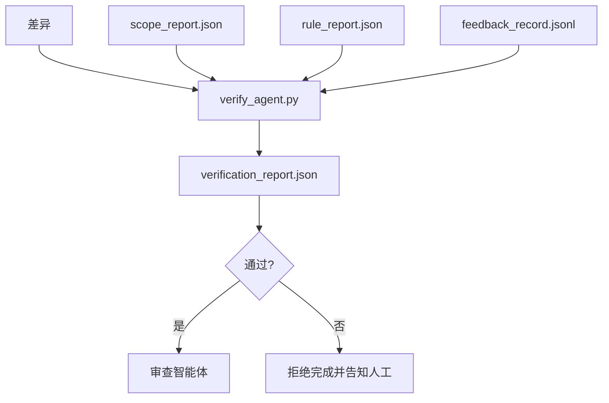

# 验证关卡（Verification Gates）

> 智能体无权自行把工作标记为完成。验证关卡读取范围契约、反馈日志、规则报告与差异，只回答一个问题：这个任务真的完成了吗？如果关卡说没有，无论聊天里怎么说，任务都没有完成。

**Type:** Build
**Languages:** Python（标准库）
**Prerequisites:** 阶段 14 · 33（规则），阶段 14 · 36（范围），阶段 14 · 37（反馈）
**Time:** 约 55 分钟

## 学习目标（Learning Objectives）

- 将验证关卡定义为针对工作台产物的确定性函数。
- 将规则报告、范围报告、反馈记录与差异合并为一个判定。
- 输出审查智能体与 CI 都能读取的 `verification_report.json`。
- 出现任何阻断级失败时拒绝推进任务，不设例外。

## 问题（The Problem）

智能体过于轻易地宣布成功。主要有三种失败形态：

- “看起来不错。”模型读了自己的差异，就决定它是正确的。
- “测试通过了。”说得肯定，却没有测试确实运行的记录。
- “满足验收要求。”把验收标准解释得足够宽松，变成“任何像是完成的东西”。

工作台的解决办法是一个统一验证关卡：读取智能体已产出的材料，作出判断。关卡是确定性的，纳入版本控制，接入 CI。智能体无法收买它。

## 概念（The Concept）



### 关卡检查什么（What the gate checks）

| 检查 | 来源产物 | 严重度 |
|-------|-----------------|----------|
| 所有验收命令均已运行 | `feedback_record.jsonl` | block |
| 所有验收命令退出码均为零 | `feedback_record.jsonl` | block |
| 范围检查没有禁止写入 | `scope_report.json` | block |
| 范围检查没有范围外写入 | `scope_report.json` | block 或 warn |
| 所有阻断级规则均通过 | `rule_report.json` | block |
| 反馈中没有 `null` 退出码 | `feedback_record.jsonl` | block |
| 变更文件匹配 `scope.allowed_files` | 两者 | warn |

`warn` 发现为判定添加注释；`block` 发现阻止出现 `passed: true`。

### 确定性，而非概率性（Deterministic, not probabilistic）

同一组产物每次都必须得到相同判定。不能使用 LLM 裁判。LLM 裁判属于审查侧（阶段 14 · 39），其目标是定性评价，而不是状态判定。

### 一份报告，一个路径（One report, one path）

每次任务收尾时，关卡输出一份 `verification_report.json`，写入 `outputs/verification/<task_id>.json`。CI 消费同一路径。不同路径上的多个关卡会分裂事实来源。

### 拒绝，不设例外（Refuse without exception）

智能体不能覆盖阻断级发现。只有人工可以例外放行，且必须记录 `override_reason` 和 `overridden_by` 用户 ID。例外放行是一项签署的变更，不是智能体的决定。

```figure
wb-gate-sequence
```

## 动手实现（Build It）

`code/main.py` 实现：

- 各输入产物的加载器，全部使用本地桩数据，让本课自包含。
- `verify(task_id, artifacts) -> VerdictReport` 纯函数。
- 显示逐项检查结果及最终通过／失败的打印器。
- 包含三个任务场景的演示：全部通过、范围蔓延、缺少验收。

运行：

```
python3 code/main.py
```

输出：三份判定报告，各自保存在脚本旁。

## 实际生产中的模式（Production patterns in the wild）

四种模式把关卡从“又一个静态检查任务”提升为“最终决策点”。

**纵深防御（Defense-in-depth），而非单一关卡。** 提交前钩子 → CI 状态检查 → 工具调用前授权钩子 → 合并前关卡。每层都是确定性的，一层漏掉的失败由下一层捕获。microservices.io 的 2026 年 3 月手册明确指出：提交前钩子不可绕过，因为与模型侧技能不同，它不依赖智能体遵守指令。验证关卡位于 CI／合并前这一层。

**确定性检查负责防御，模型裁判只处理细微判断。** Anthropic 的 2026 年混合规范（Hybrid Norm）配对方式：可验证奖励（单元测试、结构定义（Schema）检查、退出码）回答“代码解决问题了吗？”；LLM 评分标准回答“代码是否易读、安全、符合风格？”关卡运行第一类，审查者（阶段 14 · 39）运行第二类。混在一起会破坏信号。

**签署的例外放行日志（Signed Override Log），而非 Slack 讨论串。** 每次放行都向 `outputs/verification/overrides.jsonl` 写入一行，包含时间戳、发现代码、原因、签署用户、当前 HEAD 提交。运行时拒绝缺少签名的放行；审计轨迹由 git 跟踪。这些记录使例外放行政策能够接受审计，而不只是形式上的规定。

**把覆盖率下限（Coverage Floor）作为一等检查。** `coverage_report.json` 为 `coverage_floor` 检查提供输入，默认下限为 80%。实测覆盖率低于下限，或比上一次合并的下限下降超过 1 个百分点时，关卡失败。没有这项检查，智能体会悄悄删除失败测试，而验证报告仍然全绿。

**`--strict` 模式把警告升级为阻止。** 对发布分支、阻塞交付的 PR 或事故后排查，`--strict` 将每条警告变为硬失败。该开关按分支选择启用，不作为全局默认，因为对一切严格处理会损害日常流程。

## 实际应用（Use It）

生产模式：

- **CI 步骤。** `verify_agent` 任务对智能体的最终产物运行关卡。没有 `passed: true`，合并保护就拒绝放行。
- **交接前钩子（Pre-handoff Hook）。** 智能体运行时在生成交接文档前调用关卡。没有通过判定，就没有交接。
- **人工排查（Manual Triage）。** 智能体宣称成功而人工有所怀疑时，操作者读取报告。

关卡是工作台流程的最终决策点。其余工作台支撑能力（Workbench Surfaces）都位于它的上游。

## 交付成果（Ship It）

`outputs/skill-verification-gate.md` 将关卡接入具体项目：哪些验收命令提供输入、哪些规则为阻断级、哪些范围外写入可容忍，以及如何存储例外放行审计日志。

## 练习（Exercises）

1. 添加 `coverage_floor` 检查：测试命令必须产生至少 80% 的覆盖率报告。决定由哪个产物承载下限。
2. 支持 `--strict` 模式，将每个 `warn` 升为 `block`。记录哪些情况下应默认使用严格模式。
3. 让关卡除 JSON 外还输出 Markdown 摘要。说明哪些字段应进入摘要及其依据。
4. 添加 `time_since_last_human_touch` 检查：人工按键后 60 秒内编辑的任何文件，豁免范围外标记。
5. 对产品中的真实智能体差异运行关卡。多少发现是真问题，多少是噪声？关卡还需扩展哪里？

## 关键术语（Key Terms）

| 术语 | 常见说法 | 实际含义 |
|------|----------------|------------------------|
| 验证关卡（Verification Gate） | “阻止事情继续的检查” | 针对工作台产物的确定性函数，输出通过／失败判定 |
| 阻断级严重度（Block Severity） | “硬失败” | 阻止 `passed: true`，且需签署例外放行的发现 |
| 例外放行日志（Override Log） | “为什么让它通过” | 含原因与用户 ID 的签署条目，由审查进行审计 |
| 验收命令（Acceptance Command） | “证据” | 零退出状态定义 `done` 的 shell 命令 |
| 单一报告路径（One Report Path） | “事实来源” | `outputs/verification/<task_id>.json`，CI 与人工共同消费 |

## 延伸阅读（Further Reading）

- [Anthropic：长时间应用开发的执行框架设计（Harness Design for Long-running Application Development）](https://www.anthropic.com/engineering/harness-design-long-running-apps)
- [OpenAI Agents SDK 护栏（Guardrails）](https://openai.github.io/openai-agents-python/guardrails/)
- [microservices.io：GenAI 开发平台护栏（GenAI Dev Platform: Guardrails）](https://microservices.io/post/architecture/2026/03/09/genai-development-platform-part-1-development-guardrails.html) —— 提交前与 CI 之间的纵深防御
- [ICMD：2026 年智能体 AI 运维手册（The 2026 Playbook for Agentic AI Ops）](https://icmd.app/article/the-2026-playbook-for-agentic-ai-ops-guardrails-costs-and-reliability-at-scale-1776661990431) —— 审批关卡阶梯：草稿 → 审批 → 阈值内自动执行
- [类型检查合规：确定性护栏（Type-Checked Compliance: Deterministic Guardrails，arXiv 2604.01483）](https://arxiv.org/pdf/2604.01483) —— Lean 4 作为确定性关卡的上界
- [logi-cmd/agent-guardrails：合并关卡规格（Merge Gate Spec）](https://github.com/logi-cmd/agent-guardrails) —— 范围与变异测试关卡
- [Guardrails AI x MLflow](https://guardrailsai.com/blog/guardrails-mlflow) —— 确定性验证器作为 CI 评分器
- 阶段 14 · 27 —— 提示注入防御（关卡的对抗防御搭档）
- 阶段 14 · 36 —— 该关卡执行的范围契约
- 阶段 14 · 37 —— 该关卡评分的反馈日志
- 阶段 14 · 39 —— 关卡交接给的审查智能体
