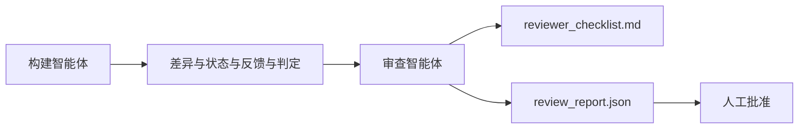

# 审查智能体：分离构建者与评分者（Reviewer Agent: Separate Builder from Marker）

> 写代码的智能体不能给自己的代码评分。审查者是第二个循环，使用不同的系统提示词、不同的目标，并以只读方式访问构建者产出的所有内容。大部分可靠性来自构建者与审查者之间的分离。

**Type:** Build
**Languages:** Python（标准库）
**Prerequisites:** 阶段 14 · 38（验证关卡）
**Time:** 约 55 分钟

## 学习目标（Learning Objectives）

- 说明为什么同一个智能体无法可靠地审查自己的工作。
- 构建消费构建者产物并输出结构化审查报告的审查智能体循环。
- 编写针对具体维度、而非凭感觉评分的审查标准。
- 将审查者接入工作台，让人工审查从真实产物开始。

## 问题（The Problem）

你让智能体修复一个缺陷。它编辑四个文件、运行测试，然后报告完成。验证关卡（阶段 14 · 38）确认验收已运行且范围未超出，给出 `passed: true`。你合并了。两天后，你发现它只修复了缺陷的一部分，而且并非真正需要修复的那部分。

验收是必要条件，但不充分。审查者提出验收无法提出的问题：解决的是正确的问题吗？有没有扩大范围却不标记？有没有把本应质疑的假设仅仅记录下来？留下的工作台状态能让下一次会话接手吗？

## 概念（The Concept）



### 审查评分标准（Reviewer Rubric）

五个维度，每个维度计 0 至 2 分。

| 维度 | 问题 |
|-----------|----------|
| 问题匹配度（Problem Fit） | 变更是否解决了明确提出的任务，而非相近任务？ |
| 范围纪律（Scope Discipline） | 编辑是否限定在契约内，或者契约是否经过有意扩展？ |
| 假设（Assumptions） | 所有隐藏假设是否都记录在可审查的位置？ |
| 验证质量（Verification Quality） | 验收命令是否真的证明目标达成，还是只证明了较弱版本？ |
| 交接就绪度（Handoff Readiness） | 下一次会话能否从当前状态顺利接手？ |

总分 10 分。低于 7 分为软失败，低于 5 分为硬失败。

### 审查者是独立角色，而非独立模型（The reviewer is a separate role, not a separate model）

审查者可以使用与构建者相同的模型。关键在角色分离：不同的系统提示词、不同输入，以及没有修改差异的权限。立场变化带来信号变化。

### 审查者不能编辑差异（The reviewer cannot edit the diff）

审查者读取差异、状态、反馈与判定，写出报告，不修补差异。如果报告说“修复这里”，由下一轮构建者修复，审查者继续审查。混合角色会破坏这种分离。

### 审查标准与验证关卡（Reviewer rubric versus verification gate）

关卡（阶段 14 · 38）检查确定性事实：验收是否运行、规则是否通过、范围是否守住。审查者作定性判断：工作是否正确、是否有文档、交接是否可用。两者都需要。

```figure
wb-builder-marker
```

## 动手实现（Build It）

`code/main.py` 实现：

- `ReviewerInputs` 数据类，打包审查者读取的产物。
- 每个维度一个函数的评分器。本课各函数均为确定性桩评分；真实实现会调用 LLM。
- `review_report.json` 写入器，包含五项分数、总分和判定（`pass`、`soft_fail`、`hard_fail`）。
- 两个演示案例：干净的变更，以及“测试正确、问题错了”的变更。

运行：

```
python3 code/main.py
```

输出：写入磁盘的两份审查报告，以及控制台中的维度评分表。

## 实际生产中的模式（Production patterns in the wild）

实证：Cloudflare 的 2026 年 4 月 AI Code Review 系统，在 30 天内针对 5,169 个仓库的 48,095 个合并请求运行了 131,246 次审查。审查耗时中位数为 3 分 39 秒。最多七个专业审查者（安全、性能、代码质量、文档、发布管理、合规、Engineering Codex）在审查协调者（Review Coordinator）管理下并行运行，由协调者去重发现并判断严重度。顶级模型仅供协调者使用，专业审查者使用更便宜的档位。

四种模式让这种方式能够规模化。

**专业审查池（Specialist Pool），而非一个庞大审查者。** 一个使用五维标准的审查者适合个人仓库。一旦代码库具有安全关键、性能关键和文档区域，就拆成提示词更小的专业角色。协调者负责去重；专业角色不运行完整标准。模型档位分离也随之形成：便宜的专业角色，昂贵的协调者。

**把偏差缓解（Bias Mitigation）作为设计要求，而非优化项。** LLM 裁判呈现四种稳定偏差（Adnan Masood，2026 年 4 月）：位置偏差（GPT-4 对 (A,B) 与 (B,A) 顺序的判断约有 40% 不一致）、冗长偏差（较长输出得分约高估 15%）、自我偏好（裁判偏爱同模型家族的输出）、权威偏差（对引用知名作者的内容高估评分）。缓解方法：两种顺序都评估，只计一致的胜出；使用明确奖励简洁的 1–4 分量表；跨模型家族轮换裁判；评分前去掉作者姓名。

**使用校准集（Calibration Set），而非凭感觉。** 准备 10–20 个已知正确判定的历史任务。每次修改提示词都让审查者跑一遍。若与历史记录的一致率低于 80%，须先修订标准，再交付审查者。每个团队迟早都会重新发现这一点，不如从一开始就做。

**与关卡配合的混合规范（Hybrid Norm）。** 验证关卡（阶段 14 · 38）处理确定性检查（验收是否运行、测试是否通过、范围是否守住）。审查者处理语义检查（工作是否正确、假设是否记录、交接是否可用）。Anthropic 的 2026 年指引明确要求这种分工：不要让审查者重做关卡已经证明的事情。

## 实际应用（Use It）

生产模式：

- **Claude Code 子智能体（Subagents）。** 构建者关闭任务后运行审查子智能体，并将维度分数作为评论发布到 PR。
- **OpenAI Agents SDK 交接（Handoffs）。** 任务完成时，构建者交接给审查者。审查者可以带着发现列表交回，也可以上交人工。
- **双模型配对（Two-model Pairing）。** 构建者运行更快、更便宜的模型。审查者使用更强模型和更小上下文，专注判断。

当人工无法逐一审查时，审查者就是工作台增加的第二双眼睛。

## 交付成果（Ship It）

`outputs/skill-reviewer-agent.md` 生成项目专属审查标准、接入构建者产物的审查智能体桩，以及与验证关卡的集成，让人工审查从书面报告而非空白页开始。

## 练习（Exercises）

1. 添加与你的产品领域相关的第六个维度。说明为何现有五个维度不能涵盖它。
2. 用两种系统提示词（简短、冗长）运行审查者。哪种报告更可能被人工阅读？
3. 为每个维度添加 `confidence` 字段。最低分维度的置信度低于 0.6 时，拒绝交付报告。
4. 构建校准集：10 个已知正确判定的历史任务收尾记录。让审查者评估，找出与历史记录不一致之处。
5. 添加“请求更多证据”的交互：审查者可以在评分前要求构建者运行某项测试。应如何退避，避免陷入循环？

## 关键术语（Key Terms）

| 术语 | 常见说法 | 实际含义 |
|------|----------------|------------------------|
| 审查评分标准（Reviewer Rubric） | “检查清单” | 五维 0–2 分评分，每个维度有书面问题 |
| 软失败（Soft Fail） | “需要修改” | 总分低于 7；构建者收到待处理发现 |
| 硬失败（Hard Fail） | “拒绝” | 总分低于 5 或任一维度为 0；中止并告知人工 |
| 角色分离（Role Separation） | “换提示词” | 同一模型可担任两个角色；关键在输入与立场 |
| 置信度下限（Confidence Floor） | “不交付低信号报告” | 标准判断不确定时拒绝输出判定 |

## 延伸阅读（Further Reading）

- [OpenAI Agents SDK 交接（Handoffs）](https://openai.github.io/openai-agents-python/handoffs/)
- [Anthropic Claude Code 子智能体（Subagents）](https://code.claude.com/docs/en/sub-agents)
- [Cloudflare：规模化编排 AI 代码审查（Orchestrating AI Code Review at Scale）](https://blog.cloudflare.com/ai-code-review/) —— 七个专业角色加协调者架构，30 天运行 13.1 万次
- [智能体作为裁判：用智能体评估智能体（Agent-as-a-Judge: Evaluating Agents with Agents，OpenReview / ICLR）](https://openreview.net/forum?id=DeVm3YUnpj) —— DevAI 基准，366 项分层解决方案要求
- [Adnan Masood：基于评分标准的评估与 LLM 裁判：方法、偏差与实证验证（Rubric-Based Evaluations and LLM-as-a-Judge: Methodologies, Biases, Empirical Validation）](https://medium.com/@adnanmasood/rubric-based-evals-llm-as-a-judge-methodologies-and-empirical-validation-in-domain-context-71936b989e80) —— 四种偏差及缓解方法
- [MLflow：LLM 裁判评估（LLM-as-a-Judge Evaluation）](https://mlflow.org/llm-as-a-judge) —— 分离构建者／评估者的生产工具
- [LangChain：用人工修正校准 LLM 裁判（How to Calibrate LLM-as-a-Judge with Human Corrections）](https://www.langchain.com/articles/llm-as-a-judge) —— 校准集工作流
- [Evidently AI：LLM 裁判完整指南（LLM-as-a-judge: A Complete Guide）](https://www.evidentlyai.com/llm-guide/llm-as-a-judge)
- [Arize：LLM 裁判入门与预置评估器（LLM as a Judge — Primer and Pre-Built Evaluators）](https://arize.com/llm-as-a-judge/)
- 阶段 14 · 05 —— 自我改进（Self-Refine）与 CRITIC（单智能体自审基线）
- 阶段 14 · 30 —— 评估驱动的智能体开发（校准集生成器）
- 阶段 14 · 38 —— 审查者读取的验证关卡
- 阶段 14 · 40 —— 审查报告进入的交接包
