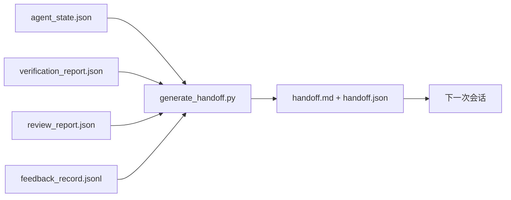

# 多会话交接（Multi-Session Handoff）

> 会话即将结束，工作却不会。交接包把“智能体工作了一小时”变成“下一次会话第一分钟就能产出”。应有意构建它，而非事后补上。

**Type:** Build
**Languages:** Python（标准库）
**Prerequisites:** 阶段 14 · 34（仓库记忆），阶段 14 · 38（验证），阶段 14 · 39（审查者）
**Time:** 约 50 分钟

## 学习目标（Learning Objectives）

- 识别每份交接包必需的七个字段。
- 从工作台产物生成交接材料，不手写说明。
- 将大型反馈日志裁剪为适合交接的摘要。
- 让下一次会话的第一个动作具有确定性。

## 问题（The Problem）

会话结束。智能体说“很好，我们取得了进展”。下一次会话打开，下一个智能体问“上次做到哪里了？”前一个智能体的回答已经消失。后继智能体重新探索、重跑相同命令、向人工重复提问，花三十分钟恢复上次会话最后三十秒的信息。

糟糕交接的成本，会在任务存续期间的每次会话中重复支付。解决办法是在会话结束时自动生成交接包：改了什么、为什么改、尝试了什么、什么失败了、还剩什么、下次先做什么。

## 概念（The Concept）



### 每份交接包含七个字段（Seven fields every handoff carries）

| 字段 | 回答的问题 |
|-------|---------------------|
| `summary` | 用一段话说明完成了什么 |
| `changed_files` | 一眼看清差异 |
| `commands_run` | 实际执行了什么 |
| `failed_attempts` | 尝试过什么，为什么没成功 |
| `open_risks` | 下次会话可能遇到什么问题，严重度如何 |
| `next_action` | 下一次会话的第一个具体步骤 |
| `verdict_pointer` | 验证与审查报告的路径 |

`next_action` 才是关键字段。其他内容都有却缺少 `next_action` 的文档，是状态报告，不是交接。

### 交接通过生成，而非手写（Handoffs are generated, not written）

手写交接在忙乱时容易被跳过。生成器读取工作台产物并输出交接包。智能体的职责是把工作台留在生成器能够概括的状态，而不是编写摘要。

### 两种形式：人类可读与机器可读（Two forms: human-readable and machine-readable）

人工读取 `handoff.md`，下一个智能体加载 `handoff.json`。两者来自相同的来源产物。若不一致，以 JSON 为准。

### 反馈日志裁剪（Feedback log trimming）

完整的 `feedback_record.jsonl` 可能有数百条记录。交接包只保留最后 K 条，以及所有非零退出条目。下一次会话有需要时再加载完整日志，交接包则保持小巧。

### 留下干净状态（Leave a clean state）

交接描述工作，干净状态使工作可以恢复，两者并不相同。如果下一次会话面对的是只应用了一半的差异、智能体忘记清理的临时文件、多余分支，以及尚未运行就报错的测试，再完美的 `handoff.md` 也没有价值。下一个智能体的前十分钟会用于替上一个收拾残局，而非构建；这一成本在任务存续期间的每次会话中累积。

因此，会话不是在功能可用时结束，而是在工作台处于生成器能够概括、下一次会话能够信任的状态时结束。清理是独立阶段，在交接前运行；它是一项检查，而非习惯，因为习惯在忙乱时就会被省略。

| 检查 | 干净意味着 | 不干净会阻止交接的原因 |
|-------|-------------|----------------------|
| 工作树 | 每项变更都已提交，或明确储藏并附备注 | 半应用的差异在下一个智能体看来像有意保留的工作 |
| 临时产物 | 没有遗留 `*.tmp`、草稿目录、调试打印或注释掉的代码块 | 多余文件污染差异和下一个智能体的理解 |
| 测试 | 全绿，或已在 `open_risks` 中点明失败的红色测试 | 未说明的失败会成为下一次会话踩中的陷阱 |
| 功能看板 | `feature_list.json` 状态反映现实（阶段 14 · 36） | 过时看板会引导下一次会话去做已完成工作 |
| 分支 | 位于预期分支，没有分离 HEAD，没有孤立分支 | 错误分支会让下一次会话的首个提交落错位置 |

清理阶段输出列有阻止项的 `clean_state.json`；空列表是交接生成器写包前断言的前置条件。基于脏工作树的交接只是转交混乱。两类产物配合：清理证明工作台可以安全离开，交接证明下一次会话知道从哪里开始。

```figure
wb-handoff-packet
```

## 动手实现（Build It）

`code/main.py` 实现：

- 加载器，将状态、判定、审查和反馈汇总到一个 `WorkbenchSnapshot`。
- `generate_handoff(snapshot) -> (markdown, payload)` 函数。
- 筛选器，选取最后 K 条反馈以及所有非零退出条目。
- 演示运行，在脚本旁写入 `handoff.md` 和 `handoff.json`。

运行：

```
python3 code/main.py
```

输出：打印的交接正文，以及磁盘上的两个文件。

## 实际生产中的模式（Production patterns in the wild）

Codex CLI、Claude Code 和 OpenCode 各自采用不同的压缩方式；结构化交接包建立在三者之上。

**压缩策略各异，交接包的结构定义（Schema）不变。** Codex CLI 的 POST /v1/responses/compact 返回服务端不透明 AES 数据块（OpenAI 模型的快速路径）；回退方案是将本地“交接摘要”作为 `_summary` 用户角色消息追加。Claude Code 在上下文达到 95% 时执行五阶段渐进压缩。OpenCode 根据时间戳隐藏消息，并生成包含五个标题的 LLM 摘要。三种机制有同一需求：将压缩后应保留的内容序列化为可移植产物。交接包就是该产物。

**新会话交接不是压缩（Compaction）。** 压缩延长会话；交接妥善关闭当前会话并开启下一个。Hermes Issue #20372（2026 年 4 月）的表述是正确的：原地压缩开始降低质量时，智能体应写出精简交接、结束会话，再在全新上下文中恢复。交接包让转换成本降低。错误做法是持续压缩直到质量崩塌；解决办法是预留预算，尽早妥善交接。

**每个分支和主题只保留一份当前交接。** 多智能体协调因过时交接而崩溃的情况，比因糟糕模型输出更多。始终包含 `branch`、`last_known_good_commit` 和取值为 `active | superseded | archived` 的 `status`。过时交接归档；只有当前交接驱动下一次会话。这区分了“交接即笔记”和“交接即状态”。

**在上下文预算达到 50–75% 前收尾，而非耗尽时。** 手写模式手册（CLAUDE.md + HANDOVER.md）报告，在上下文预算 50–75% 时结束会话，比 95% 时效果更好。生成器应在压缩产物污染来源状态之前运行。上下文完整时生成成本低，模型已开始丢失位置时成本高。

## 实际应用（Use It）

生产模式：

- **会话结束钩子（Session-end Hook）。** 用户关闭聊天时，运行时触发生成器。交接包进入 `outputs/handoff/<session_id>/`。
- **PR 模板。** 生成器的 Markdown 也可作为 PR 正文。审查者无需再打开五个文件即可阅读。
- **跨智能体交接（Cross-agent Handoff）。** 用一个产品（Claude Code）构建，再用另一个（Codex）继续。交接包是通用语言。

交接包体积小、结构规整、生成成本低。节省的成本随每次会话累积。

## 交付成果（Ship It）

`outputs/skill-handoff-generator.md` 产出适配项目产物路径的生成器、运行它的会话结束钩子，以及下一个智能体在启动时读取的 `handoff.json` 结构定义（Schema）。

## 练习（Exercises）

1. 添加 `assumptions_to_validate` 字段，列出构建者记录过、但审查者评分未高于 1 的每项假设。
2. 对失败与通过的运行采用不同反馈摘要裁剪方式。解释这种不对称。
3. 加入“给人工的问题”列表。问题进入交接包而非聊天消息的门槛是什么？
4. 让生成器幂等：运行两次生成相同交接包。哪些内容必须稳定才能成立？
5. 添加“下一次会话前置条件”部分，逐一列出行动前必须加载的产物。

## 关键术语（Key Terms）

| 术语 | 常见说法 | 实际含义 |
|------|----------------|------------------------|
| 交接包（Handoff Packet） | “会话摘要” | 包含七个字段、同时具备 Markdown 与 JSON 形式的生成产物 |
| 下一步动作（Next Action） | “先做什么” | 启动下一次会话的一个具体步骤 |
| 反馈裁剪（Feedback Trim） | “日志摘要” | 最后 K 条记录，以及所有非零退出记录 |
| 状态报告（Status Report） | “我们做了什么” | 缺少 `next_action` 的文档；有用，但不是交接 |
| 判定指针（Verdict Pointer） | “凭据” | 指向验证与审查报告的路径，用于追溯 |

## 延伸阅读（Further Reading）

- [Anthropic：长时间运行智能体的有效执行框架（Effective Harnesses for Long-running Agents）](https://www.anthropic.com/engineering/effective-harnesses-for-long-running-agents)
- [OpenAI Agents SDK 交接（Handoffs）](https://openai.github.io/openai-agents-python/handoffs/)
- [Codex Blog：Codex CLI 上下文压缩：架构、配置与长会话管理（Codex CLI Context Compaction: Architecture, Configuration, Managing Long Sessions）](https://codex.danielvaughan.com/2026/03/31/codex-cli-context-compaction-architecture/) —— POST /v1/responses/compact 与本地回退
- [Justin3go：卸下沉重记忆，Codex、Claude Code、OpenCode 中的上下文压缩（Shedding Heavy Memories: Context Compaction in Codex, Claude Code, OpenCode）](https://justin3go.com/en/posts/2026/04/09-context-compaction-in-codex-claude-code-and-opencode) —— 三家产品压缩方式比较
- [JD Hodges：Claude 交接提示词，如何跨会话保留上下文（Claude Handoff Prompt: How to Keep Context Across Sessions，2026）](https://www.jdhodges.com/blog/ai-session-handoffs-keep-context-across-conversations/) —— CLAUDE.md + HANDOVER.md，50–75% 上下文预算
- [Mervin Praison：管理多智能体编程会话交接，在新上下文中保持连续性（Managing Handoffs in Multi-Agent Coding Sessions: Fresh Context Without Losing Continuity）](https://mer.vin/2026/04/managing-handoffs-in-multi-agent-coding-sessions-fresh-context-without-losing-continuity/) —— 分布式系统视角
- [Hermes Issue #20372：压缩变得危险时自动交接到新会话（Automatic Fresh-session Handoff）](https://github.com/NousResearch/hermes-agent/issues/20372)
- [Hermes Issue #499：上下文压缩质量改进（Context Compaction Quality Overhaul）](https://github.com/NousResearch/hermes-agent/issues/499) —— Codex CLI 中面向交接的提示词
- [Microsoft Agent Framework：压缩（Compaction）](https://learn.microsoft.com/en-us/agent-framework/agents/conversations/compaction)
- [OpenCode：上下文管理与压缩（Context Management and Compaction）](https://deepwiki.com/sst/opencode/2.4-context-management-and-compaction)
- [LangChain：智能体上下文工程（Context Engineering for Agents）](https://www.langchain.com/blog/context-engineering-for-agents)
- 阶段 14 · 34 —— 生成器读取的状态文件
- 阶段 14 · 38 —— 交接包指向的验证判定
- 阶段 14 · 39 —— 纳入交接包的审查报告
