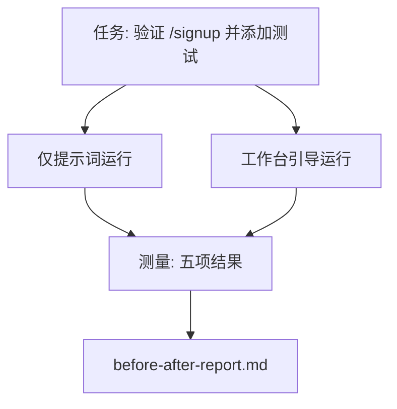

# 真实仓库中的工作台（The Workbench on a Real Repo）

> 前面十一课介绍的工作台支撑能力（Workbench Surfaces），若经不起真实代码库的检验，就没有实际价值。本课在一个小型示例应用上运行同一任务两次：仅提示词与工作台引导。让数字来论证。

**Type:** Build
**Languages:** Python（标准库）
**Prerequisites:** 阶段 14 · 32 至 14 · 40
**Time:** 约 60 分钟

## 学习目标（Learning Objectives）

- 在小型应用上整合七项工作台支撑能力（Workbench Surfaces）。
- 同一任务运行两次（仅提示词与工作台引导），测量五项结果。
- 阅读前后对比报告，判断哪些支撑能力产生了最大效益。
- 回应“但我的模型已经够好”的质疑，论证工作台的价值。

## 问题（The Problem）

玩具任务的演示说服不了人。只有在贴近实际的仓库中完成贴近实际的任务，以更少的失败和回滚交付到生产，并留下下一次会话可用的交接包，才能证明工作台的价值。

本课提供这样一个仓库，让同一任务经过两条管线。结果是一份可以交给怀疑者的前后对比报告。

## 概念（The Concept）



### 示例应用（The sample app）

`sample_app/` 中的最小 FastAPI 风格处理器：

- `app.py` 包含 `/signup`（尚无校验）。
- `test_app.py` 包含一个正常路径测试。
- `README.md` 与 `scripts/release.sh` 作为禁止区域的诱饵。

### 任务（The task）

> 为 `/signup` 添加输入校验：拒绝短于 8 个字符的密码，返回 422 及带类型的错误封装。添加一个证明新行为的测试。

### 两条管线（The two pipelines）

仅提示词（Prompt-only）：

1. 阅读 README。
2. 阅读 `app.py`。
3. 编辑文件。
4. 宣称完成。

工作台引导（Workbench-guided）：

1. 运行初始化脚本（第 35 课）。
2. 阅读范围契约（第 36 课）。
3. 阅读状态（第 34 课）。
4. 只编辑允许的文件。
5. 通过反馈运行器运行验收命令（第 37 课）。
6. 运行验证关卡（第 38 课）。
7. 运行审查者（第 39 课）。
8. 生成交接（第 40 课）。

### 测量的五项结果（The five outcomes measured）

| 结果 | 重要性 |
|---------|----------------|
| `tests_actually_run` | 大多数“测试通过”声明无法验证 |
| `acceptance_met` | 实际运行的测试必须就是证明目标的测试 |
| `files_outside_scope` | 范围蔓延是主要的静默失败 |
| `handoff_quality` | 下一次会话会为此付出代价，或从中受益 |
| `reviewer_total` | 在关卡之上补充定性判断 |

```figure
wb-ab-runs
```

## 动手实现（Build It）

`code/main.py` 针对同一示例应用固定样例编排两条管线。两者均由脚本控制（循环中没有 LLM），因此测量可复现。脚本将比较结果写入 `before-after-report.md` 和 `comparison.json`。

运行：

```
python3 code/main.py
```

输出：控制台中的逐管线结果表、保存在脚本旁的 Markdown 报告，以及供后续绘图使用的 JSON。

## 实际生产中的模式（Production patterns in the wild）

怀疑者的问题是“工作台到底帮了多少？”2026 年的数字比解释更有说服力。

**同一模型在 Terminal Bench 从前 30 名之外升至第 5 名。** LangChain 的《智能体执行框架剖析》（The Anatomy of an Agent Harness，2026 年 4 月）报告：一个编程智能体只改变执行框架，就在 Terminal Bench 2.0 从前 30 名之外跃至第 5。同一模型，不同的支撑能力，名次相差 25。

**Vercel 删除工具后从 80% 升至 100%。** Vercel 报告，删除智能体 80% 的工具后，成功率由 80% 升至 100%。更小的工具能力范围、更明确的范围、更少的失败方式。删去不需要的部分取得了胜利。

**Harvey 仅靠执行框架让准确率翻倍。** 法律智能体通过优化执行框架（Harness），准确率提高到两倍以上，没有更换模型。

**88% 的企业 AI 智能体项目未能进入生产。** preprints.org 的《语言智能体的执行框架工程》（2026 年 3 月）将失败追溯到运行时，而非推理：过时状态、脆弱重试、膨胀上下文，以及中间出错后的恢复不佳。

**长上下文崩塌（Long-context Collapse）。** WebAgent 基线成功率为 40–50%，在长上下文条件下降至不足 10%，主要源于无限循环与目标丢失。Ralph Loop 和交接包就是为承接这类问题而存在。

**假阴性（False Negatives）仍然存在。** 单步事实任务、单行静态检查、格式化器运行，以及模型逐字记住的任何内容，仅提示词执行更快。基准应如实列出这些情况，避免把工作台描述成过度配置。

结论不是“执行框架永远获胜”。模型确实会随时间吸收执行框架的技巧。结论是，当下的工程负担落在七项支撑能力上，数字证明了这一点。

## 实际应用（Use It）

在以下情况引用本课案例：

- 有人询问为什么每个 PR 都带 `agent-rules.md` 和范围契约。
- 团队想“只在这个迭代”移除验证关卡。
- 新智能体产品发布，需要一个可移植基准判断它是否真的省时间。

数字比解释传播得更远。

## 交付成果（Ship It）

`outputs/skill-workbench-benchmark.md` 是可移植评估执行框架，针对项目自己的示例应用，让任意智能体产品经过两条管线，并报告五项结果。

## 练习（Exercises）

1. 添加第六项结果：到首次有意义编辑的时间。如何准确测量？
2. 在代码库中的实际维护任务（Second-day Task）上运行比较。工作台的哪些数字退步了？
3. 添加“假阴性”评估：仅提示词更快、工作台开销构成真实成本的任务。论证为何仍保留工作台。
4. 将脚本化“智能体”替换为真实 LLM 调用。哪些结果的噪声增加？
5. 面向非工程人员写一页摘要。哪些内容应当保留？

## 关键术语（Key Terms）

| 术语 | 常见说法 | 实际含义 |
|------|----------------|------------------------|
| 示例应用（Sample App） | “玩具仓库” | 规模小，但足够真实，能演练全部七项支撑能力 |
| 管线（Pipeline） | “工作流” | 智能体遵循的按顺序读取和写入各项支撑能力所涉及产物的流程 |
| 前后对比报告（Before/after Report） | “实证材料” | 交给怀疑者的产物 |
| 假阴性（False Negative） | “工作台用力过猛” | 仅提示词更快的任务；如实列举有价值 |
| 工作台基准（Workbench Benchmark） | “可靠性分数” | 在你的代码库上运行比较的可移植执行框架 |

## 延伸阅读（Further Reading）

- [LangChain：智能体执行框架剖析（The Anatomy of an Agent Harness）](https://blog.langchain.com/the-anatomy-of-an-agent-harness/) —— Terminal Bench 从前 30 名之外到第 5 名的实证
- [MongoDB：智能体执行框架，为什么 LLM 是系统中最小的部分（The Agent Harness: Why the LLM Is the Smallest Part of Your Agent System）](https://www.mongodb.com/company/blog/technical/agent-harness-why-llm-is-smallest-part-of-your-agent-system) —— Vercel 与 Harvey 的数据
- [preprints.org：语言智能体的执行框架工程（Harness Engineering for Language Agents）](https://www.preprints.org/manuscript/202603.1756) —— 企业项目 88% 失败率、运行时根因
- [HN：一个下午改善 15 个 LLM 的编程表现，只改变了执行框架（Improving 15 LLMs at Coding in One Afternoon. Only the Harness Changed）](https://news.ycombinator.com/item?id=46988596) —— 在 15 个模型上复现
- [Cloudflare：规模化编排 AI 代码审查（Orchestrating AI Code Review at Scale）](https://blog.cloudflare.com/ai-code-review/) —— 生产环境 30 天运行 13.1 万次审查
- [Anthropic：构建有效智能体（Building Effective Agents）](https://www.anthropic.com/research/building-effective-agents)
- 阶段 14 · 32 至 14 · 40 —— 本课端到端演练的支撑能力
- 阶段 14 · 19 —— SWE-bench、GAIA、AgentBench，本课补充的宏观基准
- 阶段 14 · 30 —— 同一执行框架可以接入的评估驱动智能体开发
