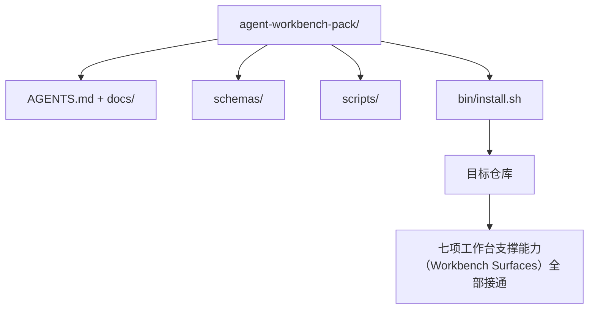

# 综合项目：交付可复用智能体工作台包（Capstone: Ship a Reusable Agent Workbench Pack）

> 这条小型学习路线以一个可放入任何仓库的包收尾。前面十一课介绍的工作台支撑能力（Workbench Surfaces）被整合进一个目录，执行 `cp -r` 即可复制，让智能体第二天早上就能可靠地工作。综合项目就是这套课程拿得出手的产物。

**Type:** Build
**Languages:** Python（标准库）
**Prerequisites:** 阶段 14 · 31 至 14 · 41
**Time:** 约 75 分钟

## 学习目标（Learning Objectives）

- 将七项工作台支撑能力（Workbench Surfaces）打包进一个即插即用目录。
- 固定结构定义（Schema）、脚本与模板，让新仓库获得已知良好基线。
- 添加一个以幂等方式安装工作台包的安装脚本。
- 决定哪些内容纳入包、哪些不纳入，并逐项说明取舍依据。

## 问题（The Problem）

散落在 Google Doc、聊天历史和三份只记得一半的脚本里的工作台，每季度都得重建。解决办法是版本化工作台包：一个包含支撑能力、结构定义（Schema）、脚本和单命令安装器的仓库或目录。

完成本课时，磁盘上将有 `outputs/agent-workbench-pack/`，以及把它放入任意目标仓库的 `bin/install.sh`。

## 概念（The Concept）



### 包布局（The pack layout）

```
outputs/agent-workbench-pack/
├── AGENTS.md
├── docs/
│   ├── agent-rules.md
│   ├── reliability-policy.md
│   ├── handoff-protocol.md
│   └── reviewer-rubric.md
├── schemas/
│   ├── agent_state.schema.json
│   ├── task_board.schema.json
│   └── scope_contract.schema.json
├── scripts/
│   ├── init_agent.py
│   ├── run_with_feedback.py
│   ├── verify_agent.py
│   └── generate_handoff.py
├── bin/
│   └── install.sh
└── README.md
```

### 纳入与排除（What stays in, what stays out）

纳入：

- 支撑能力的结构定义（Schema）。它们就是契约。
- 上述四个脚本。它们就是运行时。
- 四份文档。它们就是规则与评分标准。

排除：

- 项目专属任务。任务属于目标仓库看板，不属于工作台包。
- 厂商 SDK 调用。工作台包不依赖框架。
- 入门说明。包放在团队现有入门材料旁，而非融入其中。

### 安装器（The installer）

一个简短的 `bin/install.sh`（或 `bin/install.py`）：

1. 没有 `--force` 时拒绝覆盖已有工作台包。
2. 将包复制到目标仓库。
3. 若存在 `.github/workflows/`，接通 CI。
4. 打印后续步骤：填写看板、设置验收命令、运行初始化脚本。

### 版本管理（Versioning）

包携带 `VERSION` 文件。需要迁移的结构定义升级与脚本变更提升主版本；仅文档变更提升补丁版本。目标仓库的 `agent_state.json` 记录初始化时使用的包版本。

```figure
wb-pack-install
```

## 动手实现（Build It）

`code/main.py` 在课程旁组装 `outputs/agent-workbench-pack/`，以本路线前面课程的结构定义、脚本和已编写文档作为初始内容。

运行：

```
python3 code/main.py
```

脚本复制各项支撑能力所需文件并固定其版本，写入 README，打印包目录树，并以退出码 0 退出。重跑具有幂等性。

## 实际生产中的模式（Production patterns in the wild）

工作台包只有经得起分叉、更新和不友好的上游才有价值。四种模式让它做到这一点。

**`VERSION` 是契约，不是营销。** 主版本升级要求状态迁移，次版本升级要求重跑检查器，补丁版本仅改文档。安装器每次安装都向目标仓库写入 `.workbench-version`；目标锁定版本与包的 `VERSION` 不一致时，`lint_pack.py` 拒绝交付。这正是 `npm`、`Cargo` 和 `pyproject.toml` 经受十年变化的方式；智能体没有改变这些规则。

**跨工具分发采用单一来源（Single Source）。** Nx 用一个 `nx ai-setup` 从单一配置生成 `AGENTS.md`、`CLAUDE.md`、`.cursor/rules/`、`.github/copilot-instructions.md` 和 MCP 服务器。包也应如此；安装器生成符号链接（`ln -s AGENTS.md CLAUDE.md`），让单一事实来源分发给所有编程智能体。为支持某个工具而分叉工作台包是一种失败模式。

**`uninstall.sh` 遇到不可忽略状态时拒绝执行。** 卸载不得删除用户的 `agent_state.json`、`task_board.json` 或 `outputs/`。卸载器移除结构定义、脚本、文档和 `AGENTS.md`（可用 `--keep-agents-md` 保留）；若状态文件有任何未提交变更，则拒绝继续。状态属于用户，不属于工作台包。

**技能作为可发布产物（Skill-as-publishable），采用 SkillKit 风格分发。** 工作台包以 SkillKit 技能发布：`skillkit install agent-workbench-pack` 从单一来源安装到 32 种 AI 智能体。包仓库是事实来源，SkillKit 是分发渠道。厂商锁定被打破，七项支撑能力保持相同。

## 实际应用（Use It）

包的三种交付形式：

- **放入仓库的目录。** `cp -r outputs/agent-workbench-pack /path/to/repo`。
- **公开模板仓库。** 分叉后定制，通过 `VERSION` 控制漂移。
- **SkillKit 技能。** 接入智能体产品，用一条命令安装。

包是配方，每次安装是按配方做出的一份成品。

## 交付成果（Ship It）

`outputs/skill-workbench-pack.md` 生成项目定制包：依据团队历史明确规则，让范围通配模式匹配仓库，并为评分标准增加一个领域专属维度。

## 练习（Exercises）

1. 决定哪份可选的第五份文档值得纳入规范包，并说明取舍依据。
2. 用 Python 重写安装器并添加 `--dry-run`。比较它与 bash 的使用体验。
3. 添加 `bin/uninstall.sh`，安全移除工作台包；若状态文件有不可忽略的历史，则拒绝执行。什么算不可忽略？
4. 添加 `lint_pack.py`，包与 `VERSION` 不一致时失败。将其接入包自身仓库的 CI。
5. 编写从手工工作台迁移到该包的操作手册。什么操作顺序可以最小化停机时间？

## 关键术语（Key Terms）

| 术语 | 常见说法 | 实际含义 |
|------|----------------|------------------------|
| 工作台包（Workbench Pack） | “启动套件” | 携带全部七项支撑能力的版本化目录 |
| 安装器（Installer） | “设置脚本” | 以幂等方式安装包的 `bin/install.sh` |
| 包版本（Pack Version） | “VERSION” | 结构定义（Schema）／脚本变更提升主版本，仅文档变更提升补丁版本 |
| 即插即用包（Drop-in Pack） | “cp -r 就能用” | 第一天无需逐仓库定制即可工作 |
| 可分叉模板（Forkable Template） | “GitHub 模板” | 可通过 GitHub“使用此模板（Use this template）”克隆的公开仓库 |

## 延伸阅读（Further Reading）

- 阶段 14 · 31 至 14 · 41 —— 包中包含的每项支撑能力
- [SkillKit](https://github.com/rohitg00/skillkit) —— 在 32 种 AI 智能体中安装此技能
- [Nx Blog：教 AI 智能体如何在单仓库中工作（Teach Your AI Agent How to Work in a Monorepo）](https://nx.dev/blog/nx-ai-agent-skills) —— 面向六种工具的单一来源生成器
- [agents.md：开放规格（The Open Spec）](https://agents.md/) —— 包的路由入口必须实现的要求
- [HKUDS/OpenHarness](https://github.com/HKUDS/OpenHarness) —— 等效工作台包的参考实现
- [andrewgarst/agentic_harness](https://github.com/andrewgarst/agentic_harness) —— 基于 Redis、包含评估套件的参考实现
- [Augment Code：好的 AGENTS.md 就是模型升级（A Good AGENTS.md Is a Model Upgrade）](https://www.augmentcode.com/blog/how-to-write-good-agents-dot-md-files) —— 包文档的质量标准
- [Anthropic：长时间运行智能体的有效执行框架（Effective Harnesses for Long-running Agents）](https://www.anthropic.com/engineering/effective-harnesses-for-long-running-agents)
- [Anthropic：长时间应用开发的执行框架设计（Harness Design for Long-running Application Development）](https://www.anthropic.com/engineering/harness-design-long-running-apps)
- 阶段 14 · 30 —— 消费包中验证关卡的评估驱动智能体开发
- 阶段 14 · 41 —— 该包所改进的前后对比基准
