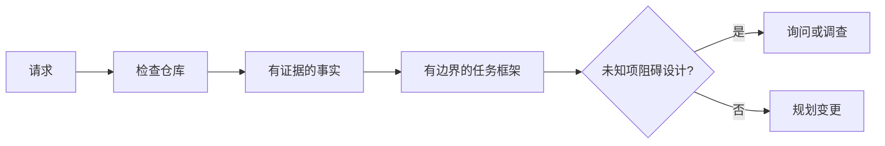

# 在智能体写代码前界定任务（Frame the Task Before the Agent Writes Code）

> 编程智能体能快速实现清晰任务，也能快速实现含糊任务。速度相同，成本不同。

**Type:** Learn + Build
**Languages:** Python（标准库）
**Prerequisites:** 阶段 14 第 31、36 课
**Time:** 约 60 分钟

## 学习目标（Learning Objectives）

- 在编辑前将请求转为有边界的任务框架（Task Frame）。
- 区分仓库事实、假设与待解问题。
- 定义允许路径、禁止路径与验收证据。
- 判断何时已有足够侦察信息，可以开始工作。

## 代价高昂的失败（The Expensive Failure）

“添加重复邮箱保护”听起来具体，其实不然。唯一性属于 API、领域服务还是数据库？比较是否区分大小写？哪种错误格式已经公开？允许数据库迁移吗？哪个测试证明行为？

有能力的智能体会用看似合理的选择填补空白。这才是危险情形：实现可以整洁、经过测试，却仍与系统不兼容。

因此，编程智能体工作的第一个单位不是编辑，而是有仓库证据支撑的任务框架。

## 任务框架（The Task Frame）

有用的框架包含六个字段：

| 字段 | 问题 |
|---|---|
| 目标（Goal） | 哪种可观察行为必须改变？ |
| 仓库事实（Repository Facts） | 你在代码、测试、配置或历史中验证了什么？ |
| 允许路径（Allowed Paths） | 变更可以落在哪里？ |
| 禁止路径（Forbidden Paths） | 哪些内容必须保持不动？ |
| 验收证据（Acceptance Evidence） | 哪些命令或观察能够证明目标？ |
| 未知项（Unknowns） | 哪些决定仍需证据或人工判断？ |

事实需要凭据。“API 对重复情况使用 409”只有能指向现有测试或处理器才是事实。文件路径加行号即可；涉及行为时，命令结果更好。



## 侦察就是寻找约束（Reconnaissance Is a Search for Constraints）

不必通读整个仓库，而应找到会约束这次变更的相关部分：

1. 当前行为及其调用方。
2. 最接近的现有测试。
3. 公开契约或序列化格式。
4. 管理该路径的项目指令。
5. 构建与验证命令。
6. 揭示本地模式的相似已完成变更。

当每项拟作出的决策都有证据支撑、已被明确授权，或已列为待解决的未知项时，就可以停止调查。此后继续阅读，往往是在回避行动。

## 未知项不是失败（Unknowns Are Not Failures）

未知项是已经识别并纳入管理的信息缺口；假设则是在未加核实的情况下，直接替这个缺口填上答案。

为每个未知项分类：

- **可发现（Discoverable）：** 仓库或运行中的系统能够回答。
- **可决定（Decidable）：** 任务契约授权智能体选择。
- **需人工（Human）：** 选择会改变产品行为、成本、风险或公开兼容性。
- **延期（Deferred）：** 选择在当前切片之外，应纳入非目标。

智能体应继续解决可发现和已授权的未知项。对于需人工的未知项，应在选择被埋进代码前暂停。

## 实现前定义验收（Acceptance Before Implementation）

先写证据方案，再写补丁。证据可以是：

- 聚焦的单元或集成测试命令；
- 指定视口与预期状态的浏览器操作流程；
- 网络请求与确切响应契约；
- 带阈值的性能测量；
- 确认未改动无关文件的范围检查。

“测试通过”不是证据计划。应指明权威测试及其支持的主张。

## 动手实现（Build It）

实验创建 `TaskFrame`，验证其边界与证据，并写入 `outputs/task-frame.md`。

在本课目录运行：

```bash
python3 code/main.py
python3 -m unittest discover code/tests -v
```

用四种方式破坏示例：删除目标、删除一项事实凭据、让允许与禁止路径重叠、删除验收命令。验证器应分别以不同原因拒绝每个框架。

## 在真实仓库中使用（Use It in a Real Repository）

要求智能体编辑前：

1. 把目标写成行为，而非文件改动。
2. 记录两三项带确切证据的事实。
3. 指定最小允许路径集合。
4. 明确写出禁止事项。
5. 写出能关闭任务的命令或观察。
6. 列出尚无充分依据作出的决定。

框架应能放进一屏。若放不下，任务可能包含多个可独立验证的变更。

## 练习（Exercises）

1. 为自己仓库中的真实错误界定任务，但不提出解决方案。
2. 找出框架中实际上是假设的一项主张，用证据替换。
3. 添加一个需人工回答、且答案会改变公开契约的未知项。
4. 将一个宽泛允许路径拆为最小安全集合。
5. 在验收证据中加入范围凭据。

## 延伸阅读（Further Reading）

- [Nuseibeh 与 Easterbrook：需求工程路线图（Requirements Engineering: A Roadmap）](https://www.cs.toronto.edu/~sme/papers/2000/ICSE2000.pdf)，讨论如何让实现锚定现实目标与不断演变的约束。
- [Yang 等：SWE-agent，智能体与计算机接口实现自动化软件工程（SWE-agent: Agent-Computer Interfaces Enable Automated Software Engineering）](https://arxiv.org/abs/2405.15793)，提供编程智能体周围的接口会改变其效能的证据。

## 保留产物（What You Keep）

保留 `outputs/task-frame.md`。它是下一课的输入，届时框架将变成有证据支撑的执行计划。
