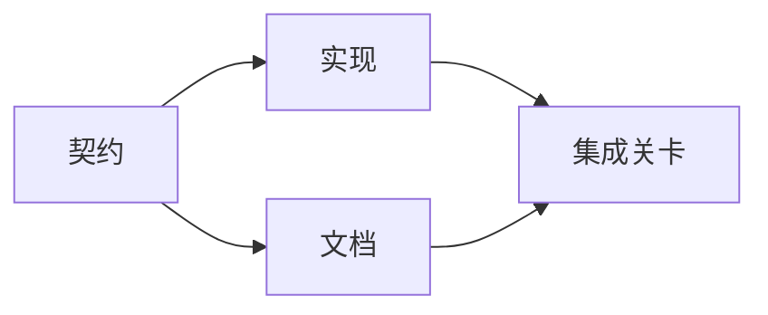

# 构建有证据支撑的执行计划（Build an Evidence-Backed Execution Plan）

> 计划不是更漂亮的待办清单，而是一张依赖图：每项变更都有理由，每个末端节点都有完成证据。

**Type:** Learn + Build
**Languages:** Python（标准库）
**Prerequisites:** 阶段 14 第 43 课
**Time:** 约 65 分钟

## 学习目标（Learning Objectives）

- 将任务框架转换为具备依据与完成证据的工作项。
- 用依赖关系而非叙述顺序建模执行次序。
- 编辑前检测缺失事实、未知依赖和环路。
- 区分可同时运行与必须等待的步骤。

## 智能体计划为何失败（Why Agent Plans Fail）

薄弱计划只是用将来时重复请求：

1. 更新 API。
2. 添加测试。
3. 更新文档。

这份列表没有说明调查发现了什么、为什么应修改这些文件、哪个契约必须先变更，也没有说明哪些工作可以并发。智能体即使遵循每一步，仍可能造成返工。

可靠的计划需要为每个工作项明确五件事：

| 承诺 | 用途 |
|---|---|
| 标识符（Identifier） | 依赖与交接中的稳定引用 |
| 变更（Change） | 最小行为或契约变更 |
| 依据（Evidence） | 支持变更的仓库事实 |
| 依赖（Dependencies） | 必须先成立的工作 |
| 证明（Proof） | 关闭工作项的确切检查 |

## 先规划契约，再规划实现（Plan the Contract Before Its Implementations）

多个部分依赖同一行为时，应先定义该行为。这样，测试、实现、文档与集成便能共享一个契约，避免各自形成相互冲突的版本。



图展示了安全并发：契约固定后，实现与文档可同时推进，集成等待两者。

## 证据改变计划（Evidence Changes the Plan）

仓库证据不是装饰，应能改变工作：

- 现有辅助函数使计划中的新抽象不再需要。
- 兼容性测试迫使计划增加迁移步骤。
- 部署约束使数据模式（Schema）变更必须移到另一个任务中。
- 公开响应类型改变实现与文档的顺序。

如果证据无法改变计划，它很可能不是该决策的依据。

## 为中断设计（Design for Interruption）

编程智能体会话会意外结束。可恢复计划的工作项足够小，让另一次会话能判断：

- 哪项已完成；
- 哪项证明已运行；
- 哪些产物改变了；
- 哪些依赖现已解除阻塞；
- 下一项安全工作是什么。

不要只在聊天中的勾选框里编码状态。把计划存放在工作旁。

## 计划验证（Plan Validation）

出现以下情况，在执行前拒绝计划：

- 标识符重复；
- 工作项没有依据；
- 工作项没有完成证明；
- 依赖指向未知工作项；
- 图中存在环路；
- 在相关不确定性解决之前，就执行了首个不可逆动作。

前五项是机械检查。最后一项需要判断，应明确指出。

## 动手实现（Build It）

`code/main.py` 对工作项建模，验证凭据，用拓扑排序计算执行波次（Execution Waves），并写入 `outputs/evidence-plan.json`。

运行：

```bash
python3 code/main.py
python3 -m unittest discover code/tests -v
```

示例产生三个波次。首先定义契约，接着实现与文档同时运行，最后运行集成关卡。

## 与编程智能体一起使用（Use It with a Coding Agent）

让智能体在修改文件前产出计划。审查三件事：

1. 每项路径与行为主张都有仓库凭据。
2. 每个工作项都有一个明确完成证明。
3. 图将昂贵或不可逆工作延后，直到其依赖的不确定性解决。

批准的是计划，而非“会小心”的含糊承诺。

## 练习（Exercises）

1. 添加一个需要人工明确批准的迁移工作项。
2. 创建环路，并解释其背后隐藏的产品分歧。
3. 拆分一个包含两条证明命令的工作项。
4. 添加一个能在第二波次运行、且不触及现有两个分支的工作项。
5. 将计划渲染为 Markdown，同时保留 JSON 为事实来源。

## 延伸阅读（Further Reading）

- [Nuseibeh 与 Easterbrook：需求工程路线图（Requirements Engineering: A Roadmap）](https://www.cs.toronto.edu/~sme/papers/2000/ICSE2000.pdf)，讨论目标、规格、共识与演进之间的迭代关系。
- [Barry Boehm：软件开发与改进的螺旋模型（A Spiral Model of Software Development and Enhancement）](https://dl.acm.org/doi/10.1145/12944.12948)，讨论围绕风险消解而非固定线性顺序安排开发。

## 保留产物（What You Keep）

保留 `outputs/evidence-plan.json`。它将在下一课成为委派契约。
