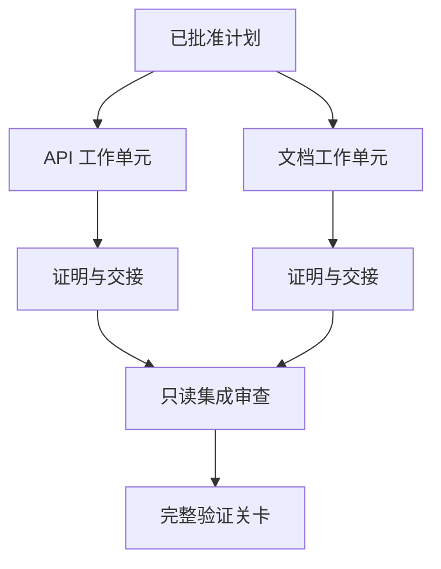

# 通过隔离与合并契约委派智能体工作（Delegate Agent Work with Isolation and Merge Contracts）

> 只有工作彼此独立，并行智能体才能节省实际时间。否则，它们只是把一个清晰任务变成失败速度更快的协调问题。

**Type:** Learn + Build
**Languages:** Python（标准库）
**Prerequisites:** 阶段 14 第 39、44 课
**Time:** 约 70 分钟

## 学习目标（Learning Objectives）

- 根据真实独立性判断委派是否合理。
- 为每个工作者分配独占文件所有权与明确证明。
- 根据依赖计算执行波次。
- 设计合并契约，安全组合智能体工作。

## 并行性检验（The Parallelism Test）

不要因为可用智能体更多就委派。至少满足以下一项才委派：

- 两项调查可以独立回答不同未知项；
- 两项实现拥有不相交的文件与契约；
- 审查者可检查已完成产物而不修改它；
- 缓慢的外部检查可与本地工作同时运行。

若智能体需要相同文件、同一未决决定或同一可变环境，就保持串行。

## 工作单元就是契约（A Work Unit Is a Contract）

每个委派单元需要：

| 字段 | 含义 |
|---|---|
| 目标（Goal） | 一个可观察结果 |
| 负责人（Owner） | 一个承担责任的工作者 |
| 路径（Paths） | 独占写入所有权 |
| 依赖（Dependencies） | 开始前必须完成的单元 |
| 证明（Proof） | 返回给集成者的确切证据 |
| 交接（Handoff） | 变更文件、所作决定、剩余风险 |

“处理后端”不是工作单元。“在 `app/accounts.py` 中实现重复检查，并用聚焦账户测试证明它”才是。

## 隔离的三个层次（Isolation Has Three Layers）

1. **文件系统隔离（Filesystem Isolation）：** 独立工作树或沙箱防止意外共享编辑。
2. **所有权隔离（Ownership Isolation）：** 契约防止两个工作者有意编辑同一路径。
3. **状态隔离（State Isolation）：** 独立日志与输出防止一个工作者覆盖另一个的证据。

文件系统隔离不能解决所有权。两个干净工作树仍可能产出冲突设计。合并契约必须在工作开始前解决共享接口问题。



## 集成者不重做工作（The Integrator Does Not Rebuild the Work）

集成者应：

1. 确认每份交接符合分配范围；
2. 阅读证明输出，而不只是工作者摘要；
3. 按依赖顺序组合变更；
4. 运行完整的跨单元关卡；
5. 拒绝隐藏的范围扩大；
6. 将冲突记录为新决定，而非静默编辑。

如果集成需要重写工作者的大部分结果，原始拆分就是错的。

## 人工与智能体角色（Human and Agent Roles）

委派不会消除人工判断。改变公开行为、风险、权限或不可逆成本的选择仍属于人工。智能体可以承担有边界的调查、实现、验证与审查。

这就是校准自主性（Calibrated Autonomy）：证据和回滚保障充分时给予自由，后果重大时设置检查点。

## 动手实现（Build It）

实验检查路径重叠、验证依赖、计算安全执行波次，并写入 `outputs/delegation-plan.json`。

运行：

```bash
python3 code/main.py
python3 -m unittest discover code/tests -v
```

将文档单元改为拥有 `app/`。计划应被阻止，因为该父路径与 API 单元重叠。

## 练习（Exercises）

1. 将真实变更拆为两个独立工作单元和一个集成者。
2. 找出一个只是看似独立的并行拆分，说明其共享决定。
3. 添加一个只读研究工作者，输出事实表。
4. 添加合并关卡，将最终变更文件集合与全部单元契约比对。
5. 为依赖失效的工作者定义取消规则。

## 延伸阅读（Further Reading）

- [Reid Smith：契约网协议（The Contract Net Protocol）](https://doi.org/10.1109/TC.1980.1675516)，对分布式任务分配与结果报告的早期形式化论述。
- [Eric Horvitz：混合主动用户界面原则（Principles of Mixed-Initiative User Interfaces）](https://dl.acm.org/doi/10.1145/302979.303030)，讨论自动化何时应行动，何时应把控制权交还人工。

## 保留产物（What You Keep）

保留 `outputs/delegation-plan.json`。它记录拆分为何安全、每条路径由谁负责，以及集成必须收到什么证据。
