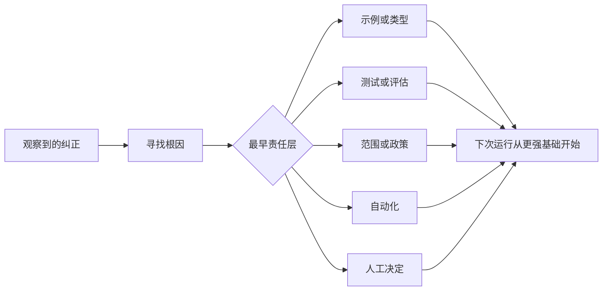

# 将每次智能体纠正转为系统改进（Turn Every Agent Correction into a System Improvement）

> 只留在聊天中的纠正，只修复一次运行。提升为测试、边界、示例或工具的纠正，会改善之后每次运行。

**Type:** Learn + Build
**Languages:** Python（标准库）
**Prerequisites:** 阶段 14 第 37 至 41 课
**Time:** 约 65 分钟

## 学习目标（Learning Objectives）

- 将智能体纠正转为持久控制措施。
- 把每项控制放到能够防止复发的最早层次。
- 用稳定指纹对重复经验去重。
- 停用已不再防范实际风险的控制措施。

## 纠正就是证据（Corrections Are Evidence）

告诉智能体“不要编辑那个文件”时，你发现范围边界不可执行。说“输出格式错了”时，你发现缺少示例或测试。环境准备再次失败时，你发现环境知识应进入自动化。

把纠正视为对工作系统的观察，而非提示词编写失败。

## 提升到最早有效层（Promote to the Earliest Effective Layer）

按以下顺序处理：

| 反复失败 | 持久化归宿 |
|---|---|
| 错误结果或回归 | 测试或评估 |
| 范围外或不安全操作 | 范围或权限政策 |
| 反复发生的环境准备或命令错误 | 自动化或工具 |
| 反复发生的输出格式错误 | 规范示例加验证器 |
| 含糊的本地惯例 | 带场景检查的指令 |
| 产品分歧 | 人工决策记录 |

越早的控制成本越低。阻止无效状态的类型，比事后发现它的审查评论更强。聚焦测试，比一段要求智能体记住的说明更强。



## 棘轮记录（The Ratchet Record）

记录：

- 症状；
- 根因；
- 后果；
- 复发次数；
- 所选控制；
- 控制的验证方式；
- 负责人；
- 复查或退役日期。

不必把每个临时偏好都固化下来。只有问题的复发频率或后果值得系统长期承担额外复杂性时，才将这次纠正固化为控制措施。

## 区分原因与症状（Separate Cause from Symptom）

“智能体编辑了 README”是症状。可能原因包括：

- 任务允许修改仓库根目录；
- 文档被隐含视为安全；
- 计划把实现和文档捆绑；
- 两个工作者所有权重叠。

每个原因对应不同控制。只是重复症状的规则，会在下一个略有不同的案例中失败。

## 控制也会退化（Controls Also Decay）

旧控制措施可能相互冲突、占用过多上下文，或继续沿用系统早已不再具备的前提。每条固化后的规则都需要定期检查是否应停用。出现以下情况时，应移除或重写：

- 底层架构改变；
- 更强的可执行控制已替代它；
- 在有意义的观察窗口内未再复发；
- 控制造成的阻力超过其防范的风险。

目标不是最长的指令文件，而是保留来之不易判断力的最小系统。

## 动手实现（Build It）

实验对纠正分类，将其提升为控制，使用指纹识别重复项，并写入 `outputs/feedback-ratchet.json`。

运行：

```bash
python3 code/main.py
python3 -m unittest discover code/tests -v
```

添加两条措辞不同但原因相同的纠正。改进规范化，直到它们合并为一项控制，同时不合并无关失败。

## 练习（Exercises）

1. 从最近编程会话取五次纠正，分类其真正责任层。
2. 用可执行测试替换一条文字规则。
3. 添加后果权重，让严重问题首次出现时就能立即提升为控制。
4. 为实验输出添加负责人和退役日期。
5. 审查一条现有智能体指令，只有证明存在更强控制后才删除它。

## 延伸阅读（Further Reading）

- [Basili、Caldiera 与 Rombach：目标—问题—度量方法（The Goal Question Metric Approach）](https://www.cs.toronto.edu/~sme/CSC444F/handouts/GQM-paper.pdf)，讨论将目标转为问题与可操作测量。
- [Shinn 等：Reflexion](https://arxiv.org/abs/2303.11366)，讨论不改变模型权重，利用反馈轨迹改善后续决策。
- [Madaan 等：自我改进（Self-Refine）](https://arxiv.org/abs/2303.17651)，讨论任务循环内的迭代反馈与修订。

## 保留产物（What You Keep）

保留 `outputs/feedback-ratchet.json`。它是智能体辅助工程（Agent-Assisted Engineering）路线最终留下的持久化产物，也是后续工作台变更的输入。
