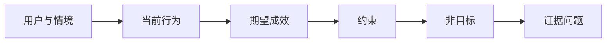

# 先定义成效，再选择产出（Define the Outcome Before You Choose the Output）

> 快速实现会放大选错问题的代价。先界定成效，让速度指向正确方向。

**Type:** Learn + Build
**Languages:** Python（标准库）
**Prerequisites:** 无
**Time:** 约 60 分钟

## 学习目标（Learning Objectives）

- 编写不指定解决方案的成效框架（Outcome Frame）。
- 识别用户、情境、当前行为与期望变化。
- 明确约束与非目标。
- 在解决方案渗入并固化为范围前识别它。

## 产出不是成效（Output Is Not Outcome）

“构建事故助手”指定了产出，却没有说明谁需要它、什么会改善，以及什么必须保持安全。

成效框架这样说：

> 生产告警到达时，值班工程师在两分钟内识别故障服务与安全的下一步动作，同时保持诊断只读且可审计。

软件、操作手册、数据修复或更小的界面变更，都可能满足这句话。它让团队关注结果，而非某人最先想到的产物。

## 六部分框架（The Six-Part Frame）

| 部分 | 问题 |
|---|---|
| 用户（User） | 谁直接经历问题？ |
| 情境（Situation） | 问题何时、何地发生？ |
| 当前行为（Current Behavior） | 今天实际发生什么，包括变通办法？ |
| 期望成效（Desired Outcome） | 哪种可观察状态应改善？ |
| 约束（Constraints） | 哪些安全、政策、成本或兼容性限制是固定的？ |
| 非目标（Non-goals） | 排除哪些有诱惑力的相邻工作？ |



## 发现解决方案渗入（Find Solution Leakage）

如果成效陈述包含尚无证据支持的产品形态、界面、模型选择、框架或架构，就发生了解决方案渗入（Solution Leakage）。

- “用户每周收到 AI 摘要”提前固定了摘要形式和频率。
- “用户在批准前理解账户变化”陈述的是结果。
- “部署向量数据库”提前固定了基础设施。
- “审查时可获得相关政策证据”陈述的是能力。

如果兼容性要求确实限定了技术选择，可以把该技术写入约束，同时记录为什么必须使用它。

## 约束保护成效（Constraints Protect the Outcome）

约束不是实现细节，而是现实目标的一部分：

- 诊断期间不写入生产；
- 在事故时间预算内响应；
- 现有审计事件仍是权威记录；
- 不新增运行时依赖；
- 保持无障碍行为完整。

违反约束才达成结果的实现，并没有达成成效。

## 非目标建立边界（Non-Goals Create a Boundary）

非目标防止有用的小切片演变成平台。好的非目标具体到足以拒绝工作：

- 不自动修复；
- 不新增告警路由系统；
- 不取代事故指挥者；
- 当前切片不做历史分析。

## 动手实现（Build It）

实验验证 `OutcomeFrame`，并写入 `outputs/outcome-frame.json`。

```bash
python3 code/main.py
python3 -m unittest discover code/tests -v
```

将期望成效替换为“使用事故助手”（use the incident assistant）。验证器应标记：拟议产出渗入了成效。

## 练习（Exercises）

1. 将待办清单中的功能请求改写为成效框架。
2. 添加一个会改变可行解决方案集合的约束。
3. 添加两个非目标，让首个切片保持小巧。
4. 找出最早能否定期望成效的观察。
5. 写出三个不同产出，使其都能满足同一成效。

## 延伸阅读（Further Reading）

- [Nuseibeh 与 Easterbrook：需求工程路线图（Requirements Engineering: A Roadmap）](https://www.cs.toronto.edu/~sme/papers/2000/ICSE2000.pdf)，讨论将现实目标作为软件工作的锚点。
- [Dardenne、van Lamsweerde 与 Fickas：目标导向需求获取（Goal-Directed Requirements Acquisition）](https://doi.org/10.1016/0167-6423(93)90021-G)，讨论将高层目标细化为约束与可操作需求。

## 保留产物（What You Keep）

保留 `outputs/outcome-frame.json`。下一课将用人们实际执行的工作流检验它。
