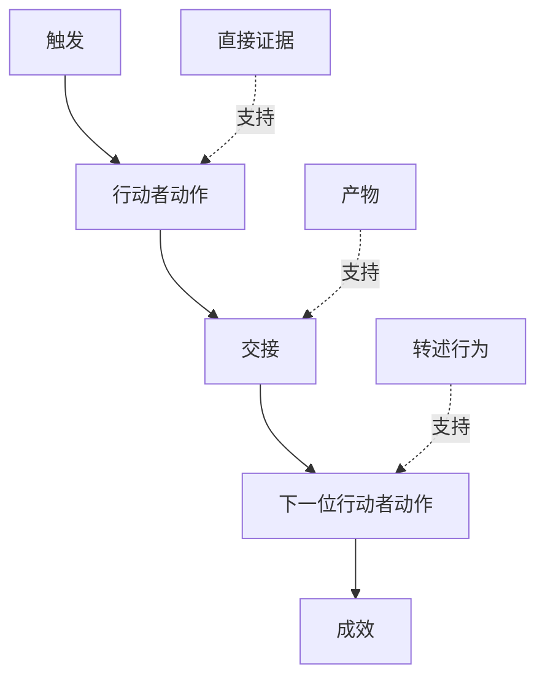

# 发现人们实际执行的工作流（Discover the Workflow People Actually Perform）

> 需求并不是在会议中等着被收集。它们散落在动作、变通办法、记录与分歧中。

**Type:** Learn + Build
**Languages:** Python（标准库）
**Prerequisites:** 阶段 14 第 47 课
**Time:** 约 70 分钟

## 学习目标（Learning Objectives）

- 将当前工作流建模为带证据的有序动作。
- 区分直接观察与转述或推断的行为。
- 定位阻力、交接、权限与隐藏状态。
- 保持不确定主张可见，不把它们直接变为需求。

## 从当前系统开始（Start with the Current System）

不要先问人们想要什么功能。先还原现在发生什么。

每个步骤记录：

| 字段 | 示例 |
|---|---|
| 行动者（Actor） | 值班工程师 |
| 触发（Trigger） | 生产告警到达 |
| 动作（Action） | 打开告警，然后搜索仪表盘 |
| 输入（Input） | 告警载荷与部署记录 |
| 输出（Output） | 候选服务与负责人 |
| 阻力（Friction） | 在三个工具间切换上下文 |
| 权限（Authority） | 事故指挥者批准写入 |
| 证据（Evidence） | 屏幕录制、事故日志、操作手册 |

工作流不止屏幕所见。它包括等待、复制粘贴、旁路渠道、审批、错误恢复，以及人们已不再留意的步骤。

## 证据有强弱（Evidence Has Strength）

使用简单的证据阶梯：

1. **直接行为（Direct Behavior）：** 观察、追踪、录制或系统事件。
2. **产物（Artifact）：** 工单、操作手册、日志、表单或完成的输出。
3. **转述行为（Reported Behavior）：** 某人描述自己怎么做。
4. **推断（Inference）：** 团队推测大概发生了什么。

四种都可能有用。只有前两种直接证明当前行为。标注其余类型，防止置信度悄悄膨胀。



## 寻找四类信息（Search for Four Things）

- **阻力（Friction）：** 重复劳动、延迟、重复录入或恢复。
- **隐藏状态（Hidden State）：** 保存在记忆、聊天或个人笔记中的事实。
- **权限（Authority）：** 被允许进行重大变更的人或系统。
- **异常（Exceptions）：** 正常工作流不再正常的情形。

AI 功能常在交接与异常处失败，因为设计时只考虑了正常路径。

## 不要用平均抹去分歧（Do Not Average Away Disagreement）

两名用户可能因合理原因执行不同工作流。在理解差异代表什么之前，保留各个变体：

- 不同角色；
- 不同风险级别；
- 旧流程与现行流程；
- 专业能力差异；
- 真正的政策分歧。

平均后的工作流可能不符合任何人。

## 动手实现（Build It）

实验在每个工作流步骤存储证据，验证顺序与置信度，计算直接证据比例，并写入 `outputs/workflow-evidence.json`。

```bash
python3 code/main.py
python3 -m unittest discover code/tests -v
```

添加部署记录缺失的异常路径。保持主顺序不变，记录分支从何处开始。

## 练习（Exercises）

1. 不访谈任何人，仅根据日志还原一个工作流。
2. 访谈用户，并标记仍缺乏直接证据的每项主张。
3. 添加一个权限边界与一个失败恢复步骤。
4. 对两个工作流变体分别建模，不合并它们。
5. 找出一项拟议功能：它移除了可见步骤，却未改变隐藏工作。

## 延伸阅读（Further Reading）

- [Nuseibeh 与 Easterbrook：需求工程路线图（Requirements Engineering: A Roadmap）](https://www.cs.toronto.edu/~sme/papers/2000/ICSE2000.pdf)，尤其关注将需求获取视为解释、建模与验证，而非简单收集。
- [Gotel 与 Finkelstein：需求可追溯性问题分析（An Analysis of the Requirements Traceability Problem）](https://doi.org/10.1109/ICRE.1994.292398)，讨论维持需求与其来源关系的困难。

## 保留产物（What You Keep）

保留 `outputs/workflow-evidence.json`。下一课将观察到的阻力与不确定性转为假设地图。
