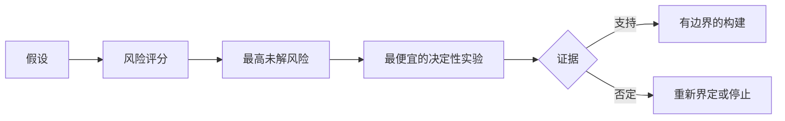

# 绘制假设地图，先解决风险最高的一项（Map Assumptions and Resolve the Riskiest One First）

> 路线图把不确定性藏在功能里。假设地图揭示：哪些条件必须成立，这些功能才值得存在。

**Type:** Learn + Build
**Languages:** Python（标准库）
**Prerequisites:** 阶段 14 第 48 课
**Time:** 约 65 分钟

## 学习目标（Learning Objectives）

- 将拟议工作转为明确假设。
- 分别评估影响、不确定性与不可逆性。
- 根据风险而非热情选择下一项实验。
- 用证据与决定替换已测试假设。

## 每次构建都包含押注（Every Build Contains Bets）

事故工具可能依赖以下条件全部成立：

- 告警上下文有足够信息识别服务；
- 工程师信任并非自己推导的建议；
- 期望响应时间在运维上有意义；
- 无需不安全权限即可访问所需数据；
- 工作流发生频率足以证明维护投入合理。

这些不是实现任务，而是构建有价值、可用、可行且安全的条件。

## 假设类别（Assumption Classes）

| 类别 | 问题 |
|---|---|
| 价值（Value） | 成效是否足够重要？ |
| 可用性（Usability） | 用户能否理解并据此行动？ |
| 技术可行性（Feasibility） | 系统能否在现有数据与约束下产出它？ |
| 运营可持续性（Viability） | 组织能否承担成本、责任与运营？ |
| 安全性（Safety） | 失败时能否避免不可接受的后果？ |

把假设写成可证伪陈述。“功能有用”无法测试。“十名值班工程师中有八名，凭只读结果能更快识别正确服务”则可以。

## 风险不是单个数字（Risk Is Not One Number）

实验使用三个 1 至 5 分维度：

- **影响（Impact）：** 假设为假时的损害。
- **不确定性（Uncertainty）：** 当前证据的薄弱程度。
- **不可逆性（Irreversibility）：** 已经投入实施之后，才发现新情况所需付出的代价。

示例分数将影响与不确定性相乘，再加上不可逆性。公式并非通用；目的是迫使团队说明，为何某个未知项应先于另一个解决。



## 设计实验，而非确认仪式（Design an Experiment, Not a Confirmation Ritual）

有用的测试具备：

- 可能为假的主张；
- 人群或真实样本；
- 可观察结果；
- 看到结果前决定的阈值；
- 对通过、失败与模糊证据分别设定的下一步决定。

避免只演示团队能把想法做出来的测试。

## 可逆性改变顺序（Reversibility Changes Order）

后果重大且不可逆的选择需要更早获得证据。只读回放可先于生产集成，临时适配器可先于数据迁移，人工批准的建议可先于自动行动。

如何安排构建工作，应取决于尚待解决的不确定性。

## 动手实现（Build It）

实验对假设排序，区分已测试与未解决主张，选择最高未解风险，并写入 `outputs/assumption-map.json`。

```bash
python3 code/main.py
python3 -m unittest discover code/tests -v
```

改变最高风险假设的证据，观察下一项实验如何变化。

## 练习（Exercises）

1. 为想构建的功能写五项假设。
2. 添加功能清单遗漏的一项安全假设。
3. 定义一个会导致停止构建的阈值。
4. 用更便宜的决定性测试替换一个大型实验。
5. 比较风险排名与路线图优先级，解释不一致之处。

## 延伸阅读（Further Reading）

- [Barry Boehm：软件开发与改进的螺旋模型（A Spiral Model of Software Development and Enhancement）](https://dl.acm.org/doi/10.1145/12944.12948)，讨论在投入更深之前解决不确定性的风险驱动开发循环。
- [Dardenne、van Lamsweerde 与 Fickas：目标导向需求获取（Goal-Directed Requirements Acquisition）](https://doi.org/10.1016/0167-6423(93)90021-G)，讨论细化目标，同时揭示障碍与约束。

## 保留产物（What You Keep）

保留 `outputs/assumption-map.json`。下一课用它选择能产生决定性证据的最小切片。
