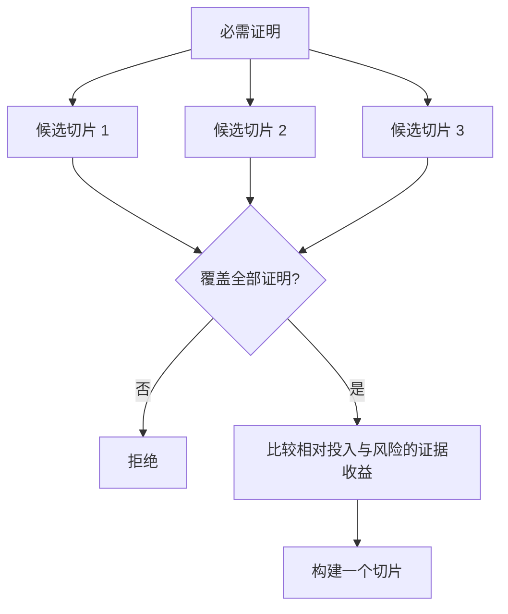

# 选择能够改变决定的最小切片（Choose the Smallest Slice That Can Change the Decision）

> 缩小范围只有在能够证明重要事项时才有价值。一个很小的实现若不能改变下一步决策，就只是一个不完整的实现。

**Type:** Learn + Build
**Languages:** Python（标准库）
**Prerequisites:** 阶段 14 第 49 课
**Time:** 约 65 分钟

## 学习目标（Learning Objectives）

- 根据切片证明的假设定义它。
- 平衡成效价值、不确定性降低、投入与后果。
- 优先获取可逆证据，避免过早投入生产。
- 拒绝遗漏工作流风险部分的切片。

## 垂直意味着端到端证据（Vertical Means Evidence End to End）

有用的切片应贯通观察成效所必需的最小真实工作流。它可以限制用户范围、数据量、持续时间和能力，但不能为了缩小范围，把恰好需要检验的不确定性排除在外。

例如：

- 对十次真实事故进行只读回放，测试服务识别与操作者信任。
- 使用合成数据的精致仪表盘可能测试理解，却不能测试数据可行性。
- 生产自动修复器一次测试全部内容，后果却不可接受。

## 先定义必需证明（Define Required Proof First）

将风险最高的未解假设转成必需证明集合。候选切片只有覆盖该集合才有资格。

然后比较合格切片：

| 维度 | 方向 |
|---|---|
| 成效价值（Outcome Value） | 越多越好 |
| 降低的不确定性（Uncertainty Reduced） | 越多越好 |
| 投入（Effort） | 越少越好 |
| 后果（Consequence） | 越小越好 |
| 可逆性（Reversibility） | 越高越好 |

实验评分刻意保持简单。资格关卡比算术更重要。



## 常见的伪最小方案（Common False Minimums）

- **仅 UI 的最小方案：** 移除了数据与运营不确定性。
- **仅基础设施的最小方案：** 证明技术可能性，却没有用户价值。
- **仅正常路径的最小方案：** 遗漏产生大部分风险的异常。
- **演示型最小方案：** 产出有说服力的产物，却没有可重复测量。
- **平台型最小方案：** 尚无一个工作流证明合理性，就构建可复用机制。

## 添加停止规则（Add a Stop Rule）

实现前写明切片失败时怎么办：

- 放弃该成效；
- 改变目标用户或情境；
- 测试不同机制；
- 收集更好证据；
- 进一步收窄权限。

若每个结果都导向“继续构建”，切片就不是实验。

## 动手实现（Build It）

实验按必需证明筛选候选，对合格切片评分，并写入 `outputs/slice-decision.json`。

```bash
python3 code/main.py
python3 -m unittest discover code/tests -v
```

添加一个更便宜、但只证明一项必需假设的候选。即使数值评分很高，它也应保持不合格。

## 练习（Exercises）

1. 为同一成效设计三个后果级别不同的切片。
2. 评分前说明必需证明集合。
3. 移除一项能力，同时保留决定性证据。
4. 为失败的试点添加停止规则。
5. 找出一个应等切片完成后再构建的可复用平台组件。

## 延伸阅读（Further Reading）

- [Barry Boehm：软件开发与改进的螺旋模型（A Spiral Model of Software Development and Enhancement）](https://dl.acm.org/doi/10.1145/12944.12948)，讨论让每个开发周期匹配它必须解决的风险。
- [Lenarduzzi 与 Taibi：MVP 释义，最小可行产品定义的系统映射研究（MVP Explained: A Systematic Mapping Study on the Definitions of Minimal Viable Product）](https://arxiv.org/abs/1609.07592)，讨论软件产品实践中“最小”与“可行”的歧义。

## 保留产物（What You Keep）

保留 `outputs/slice-decision.json`。它记录为何这个切片是能够改变决定的最小方案。
