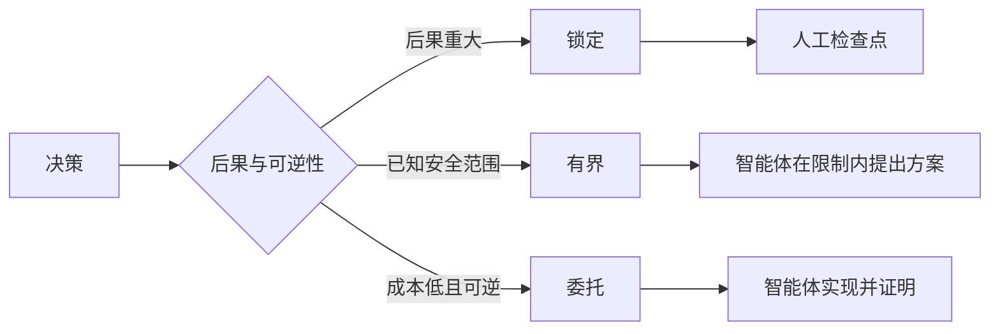

# 编写保留判断空间的规格（Write Specifications That Preserve Judgment）

> 有用的规格固定不变量与证据，同时开放可逆的实现选择。它是决策边界，不是剧本。

**Type:** Learn + Build
**Languages:** Python（标准库）
**Prerequisites:** 阶段 14 第 50 课
**Time:** 约 75 分钟

## 学习目标（Learning Objectives）

- 区分成效、不变量、示例、非目标与证明。
- 将决策标记为锁定、有界或委托。
- 在选择成本低且可逆时保留智能体判断空间。
- 后果或公开行为改变时要求人工检查点。

## 两个糟糕极端（Two Bad Extremes）

规格不足的任务迫使智能体猜测系统的实际要求；规定过细的任务则让它照着一份可能已经出错的设计实现。

有用的中间道路是可执行契约：

| 方面 | 用途 |
|---|---|
| 成效（Outcome） | 可观察结果 |
| 不变量（Invariants） | 必须始终成立的条件 |
| 示例（Examples） | 揭示意图的具体案例 |
| 非目标（Non-goals） | 有意排除的相邻行为 |
| 决策政策（Decision Policy） | 哪些选择锁定、有界或委托 |
| 证明（Proof） | 完成前需要的证据 |

## 三种决策模式（Three Decision Modes）

- **锁定（Locked）：** 智能体不得选择。用于公开兼容性、权限、安全、不可逆成本或产品承诺。
- **有界（Bounded）：** 智能体可在明确限制内选择。用于搜索预算、重试次数、允许依赖或已知接口家族。
- **委托（Delegated）：** 智能体拥有选择权，并必须解释。用于本地结构、名称、可逆重构和实现细节。



## 通过示例规定行为（Specify Behavior Through Examples）

示例比形容词更能浓缩意图。“有帮助”“稳健”“生产就绪”都不可执行。一小组正常、边界、失败与禁止案例，让构建者和验证者都有具体对象。

示例不能替代不变量。一个通过案例不能证明普遍安全规则。

## 证明必须匹配主张（Proof Must Match the Claim）

- 单元测试证明局部函数契约。
- 网络测试证明序列化与传输行为。
- 浏览器操作流程证明界面路径。
- 回放集证明代表性案例上的行为。
- 审计日志证明权限边界得到遵守。

不要接受低层证据来证明高层主张。

## 有意保留未知项（Preserve Unknowns Deliberately）

规格可以说“实现可选择任何能在时间预算内返回的只读来源”。这不是含糊，而是有边界与证明要求的有意委托决策。

证据改变时，规格也应演进。保留锁定和有界选择背后的原因，让后续团队无需翻查历史就能修订。

## 动手实现（Build It）

实验验证契约的每个方面，检查决策模式，并写入 `outputs/executable-specification.json`。

```bash
python3 code/main.py
python3 -m unittest discover code/tests -v
```

将生产写入决策从锁定改为委托。解释为什么这个值符合结构定义（Schema），却仍不符合产品对风险的要求。

## 练习（Exercises）

1. 将待办工单转换为规格的六个方面。
2. 用一个不变量与两个示例替换三条实现指令。
3. 标记每项决策，并说明每个锁定或有界选择的依据。
4. 为每个不变量添加证明凭据。
5. 移除一项没有证据或风险依据的约束。

## 延伸阅读（Further Reading）

- [Nuseibeh 与 Easterbrook：需求工程路线图（Requirements Engineering: A Roadmap）](https://www.cs.toronto.edu/~sme/papers/2000/ICSE2000.pdf)，讨论目标、精确规格、验证、共识与演进之间的关系。
- [Zave 与 Jackson：需求工程的四个暗角（Four Dark Corners of Requirements Engineering）](https://doi.org/10.1145/237432.237434)，讨论区分环境假设、需求与规格。
- [Gotel 与 Finkelstein：需求可追溯性问题分析（An Analysis of the Requirements Traceability Problem）](https://doi.org/10.1109/ICRE.1994.292398)，讨论保留需求为何存在及其来源。

## 保留产物（What You Keep）

保留 `outputs/executable-specification.json`。它成为编程智能体与人工审查者共享的契约。
