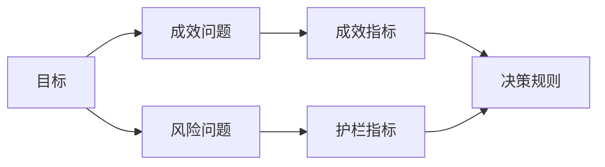

# 在结果出现前设计成功指标（Design Success Metrics Before the Result Exists）

> 测量应回答决策问题，而非装饰仪表盘。从目标出发，推导问题，再选择能回答问题的最小指标集合。

**Type:** Learn + Build
**Languages:** Python（标准库）
**Prerequisites:** 阶段 14 第 47、51 课
**Time:** 约 70 分钟

## 学习目标（Learning Objectives）

- 从成效目标推导问题与指标。
- 观察结果前定义阈值、窗口、来源与方向。
- 将成效指标与护栏、反向指标配合。
- 让评估证据匹配构建必须支持的决定。

## 目标、问题、度量（Goal, Question, Metric）

从一个目标开始：

> 缩短识别受影响服务的时间，同时不增加不安全操作。

推导问题：

- 多快能识别正确服务？
- 识别出的服务有多大比例正确？
- 诊断是否保持只读？
- 工作流是否增加告警忽略或操作者工作负担？

然后选择将这些问题转为可操作测量的指标。



## 指标需要契约（A Metric Needs a Contract）

每个指标需要：

| 字段 | 示例 |
|---|---|
| 名称（Name） | `median_identification_seconds` |
| 方向（Direction） | 至多 |
| 阈值（Threshold） | 120 |
| 窗口（Window） | 十次事故回放 |
| 来源（Source） | 回放事件日志 |
| 人群（Population） | 试点中的值班工程师 |
| 类型（Kind） | 成效或护栏 |

没有来源与窗口，数字无法复现；没有阈值，数字无法驱动决定。

## 成效、护栏与反向指标（Outcome, Guardrail, and Counter-Metric）

- **成效指标（Outcome Metric）：** 期望状态是否改善？
- **护栏（Guardrail）：** 固定约束是否仍成立？
- **反向指标（Counter-metric）：** 局部改善是否将成本或伤害转移到别处？

对于事故工作流，只有速度不够。正确性、生产写入、操作者工作量与漏掉的告警，共同防范快速却不安全的结果。

## 离线与在线证据（Offline and Online Evidence）

离线回放有助于可重复性和边界覆盖。有边界的试点有助于观察真实行为、信任和工作流影响。两者不能互相替代。

使用能够回答当前决策问题、获取成本最低的证据。不要仅因实现已经完成，就让真实用户承担试用风险。

## 先决定，再测量（Decide Before You Measure）

在看到结果前，写明结果通过、失败或不明确时各自如何处理。否则，团队可能为了保住已有实现而调整阈值。

例如：

- 通过：服务识别正确率至少 0.9，时间中位数至多 120 秒；
- 失败：发生任何生产写入，或正确率低于 0.75；
- 模糊：改善小且方差大，需要更大的回放集。

## 动手实现（Build It）

实验验证测量计划，评估包含边界值的阈值，记录缺失值，并写入 `outputs/measurement-report.json`。

```bash
python3 code/main.py
python3 -m unittest discover code/tests -v
```

移除护栏指标，观察为什么即使成效指标仍在，计划也会失效。

## 练习（Exercises）

1. 从一个成效目标推导三个问题。
2. 添加一个能发现成本转移到另一角色的反向指标。
3. 为每个指标定义来源、人群和窗口。
4. 生成数值前写好通过、失败与模糊决定。
5. 找出一个容易采集却不能改变决定的指标，移除它。

## 延伸阅读（Further Reading）

- [Basili：软件建模与测量，目标／问题／度量范式（Software Modeling and Measurement: The Goal/Question/Metric Paradigm）](https://drum.lib.umd.edu/items/8119803a-362b-42ec-b6ce-2311713e7236)，讨论从明确目标推导可操作测量。
- [Basili、Caldiera 与 Rombach：目标—问题—度量方法（The Goal Question Metric Approach）](https://www.cs.toronto.edu/~sme/CSC444F/handouts/GQM-paper.pdf)，讨论将该方法用作反馈与改进系统。

## 保留产物（What You Keep）

保留 `outputs/measurement-report.json`。它定义原型、试点或生产阶段的证据关卡。
