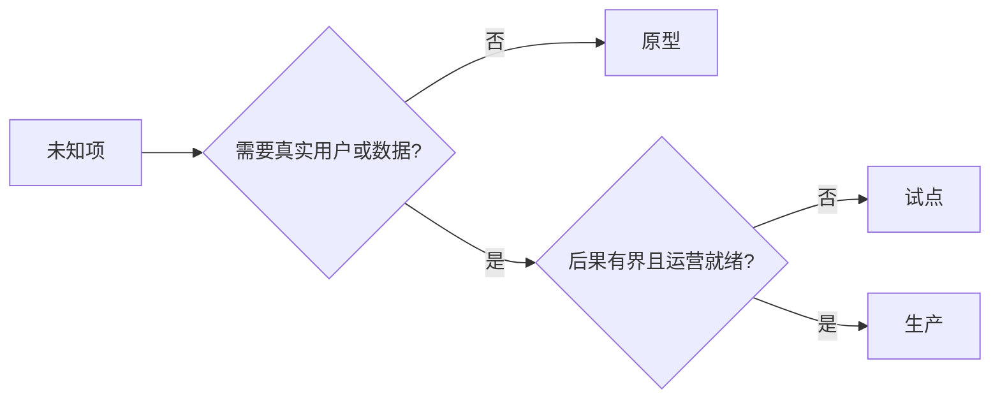

# 有意选择原型、试点或生产（Choose Prototype, Pilot, or Production Deliberately）

> 这些阶段用于在不同条件下获取认识，区别不在于产品打磨得多精致。应选择能够解答当前未知问题、又尽量少带来额外后果的阶段。

**Type:** Learn + Build
**Languages:** Python（标准库）
**Prerequisites:** 阶段 14 第 50 至 52 课
**Time:** 约 70 分钟

## 学习目标（Learning Objectives）

- 根据未知项、受众、数据、后果与就绪度选择构建阶段。
- 定义各阶段的控制与退出标准。
- 防止原型悄悄变成生产系统。
- 在证据与运营足以支持之前，推迟赋予真实权限。

## 三个不同问题（Three Different Questions）

| 阶段 | 主要问题 |
|---|---|
| 原型（Prototype） | 该机制是否有可能产生所需证据？ |
| 试点（Pilot） | 在有边界的真实受众和真实条件下，能否安全工作？ |
| 生产（Production） | 能否以承诺的可靠性与风险水平持续承担责任？ |

原型即使技术完整，仍可随时丢弃。试点可以使用生产数据，同时限制受众与权限。组织接受持续责任时，生产才开始。

## 原型（Prototype）

未知项无需真实用户或真实数据就能回答时，使用原型。保持：

- 可丢弃；
- 隔离；
- 行为范围窄；
- 学习问题明确；
- 不作虚假的运营保证。

机制尚未证明值得进入下一阶段前，不要优化架构。

## 试点（Pilot）

未知项需要真实行为、贴近现实的数据或真实工作流，但后果或就绪度还不适合广泛发布时，使用试点。

试点需要：

- 明确受众；
- 人工负责人；
- 有界持续时间与权限；
- 审计与回滚；
- 成效和护栏阈值；
- 扩大、修订或停止的退出标准。

## 生产（Production）

生产不止部署，还需要：

- 服务等级目标（Service Level Objective）；
- 值班与事故责任归属；
- 安全与隐私审查；
- 成本与容量控制；
- 回滚与恢复；
- 持续监控；
- 退役路径。



## 阶段漂移（Stage Drift）

原型代码获得用户、数据或权限，却没有同步获得责任归属时，就会变得危险。在配置、访问控制、遥测和文档中标明原型与试点边界。警告横幅并不足够。

阶段应能从系统本身观察到。

## 动手实现（Build It）

实验根据决策上下文选择阶段，返回所需控制，并写入 `outputs/stage-decisions.json`。

```bash
python3 code/main.py
python3 -m unittest discover code/tests -v
```

将试点示例改为后果较低且运营就绪。解释还需要什么证据才能支持进入生产。

## 练习（Exercises）

1. 按学习阶段而非部署状态给三个当前项目分类。
2. 写出包含停止决定的试点退出标准。
3. 添加技术控制，阻止原型接触生产数据。
4. 找出使构建成为生产的首项运营责任。
5. 为有边界试点设计回滚凭据。

## 延伸阅读（Further Reading）

- [Barry Boehm：软件开发与改进的螺旋模型（A Spiral Model of Software Development and Enhancement）](https://dl.acm.org/doi/10.1145/12944.12948)，讨论让每次迭代的投入程度匹配已解决风险。
- [Fagerholm 等：持续实验的构建模块（Building Blocks for Continuous Experimentation）](https://doi.org/10.1145/2601248.2601276)，讨论持续开展实验所需的组织与技术条件。

## 保留产物（What You Keep）

保留 `outputs/stage-decisions.json`。它记录每个阶段为何合理，以及进入下一阶段前必须具备哪些控制。
