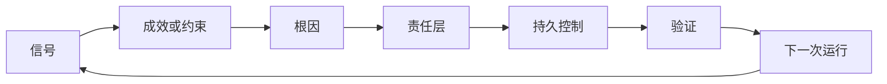

# 构建有责任归属与退役机制的反馈棘轮（Build a Feedback Ratchet with Ownership and Retirement）

> 交付关闭一次构建循环，也开启学习循环。证据必须改变系统，否则就会成为无人负责的遥测。

**Type:** Learn + Build
**Languages:** Python（标准库）
**Prerequisites:** 阶段 14 第 46、53 课
**Time:** 约 75 分钟

## 学习目标（Learning Objectives）

- 将事故、评估、用户行为和纠正转成有人负责的行动。
- 将每个信号路由到上下文、评估、政策、运行时或待办清单。
- 根据严重度与频率确定复发问题优先级。
- 给每项控制设定退役条件。

## 反馈就是基础设施（Feedback Is Infrastructure）

团队即使收集了追踪记录、评估结果、支持工单和事故日志，也可能没有从中吸取任何经验。缺少的是把反馈落实为改进的机制：明确如何将观察转为持久变更，指定负责人，并要求提供验证证据。

循环如下：

1. 观察具体信号；
2. 将其关联到成效、约束或假设；
3. 找出能够最早处理该根因的系统层；
4. 创建有边界的变更；
5. 验证复发可能性降低；
6. 复查该控制是否应保留。

## 路由到责任层（Route to the Owning Layer）

| 信号 | 归宿 |
|---|---|
| 假阳性、回归、错误结果 | 评估或测试 |
| 缺少上下文、重复工作、过时事实 | 上下文来源或检索路由 |
| 不安全动作或权限缺口 | 政策或权限边界 |
| 超时、重试风暴、依赖不可用 | 运行时控制 |
| 新产品需求或未解权衡 | 已界定的待办项 |

在最早有效层修复原因。测试或权限能让失败不可能发生时，不要再加一段提示词。



## 责任归属是控制的一部分（Ownership Is Part of the Control）

每项棘轮行动需要：

- 一个负责人；
- 基于后果与复发情况的优先级；
- 要改变的产物；
- 证明变更的验证；
- 复查或到期窗口；
- 退役条件。

改进如果无人负责，就仍然只是经过整理的观察记录。

## 退役过时控制（Retire Stale Controls）

反馈系统会累积政策，政策可能变得矛盾且昂贵。出现以下情况时复查控制：

- 架构或工作流改变；
- 更低层不变量替代更高层指令；
- 所防范失败在选定窗口内未出现；
- 控制阻止合法工作的次数多于防止伤害的次数。

退役也需要证据。不要仅因控制看起来旧就删除它。

## 连接构建与编程智能体反馈（Connect Build and Coding-Agent Feedback）

同一棘轮服务两条路线：

- 产品证据改变成效框架、假设、切片或测量计划。
- 编程智能体纠正改变测试、上下文、范围、自动化或交接。
- 事故可以同时改变产品边界与智能体工作台。

因此，界定构建方向并不是编码前就结束的阶段，而是持续贯穿每项已接受变更。

## 动手实现（Build It）

实验对信号分类，创建有人负责的棘轮行动，排序优先级，并写入 `outputs/feedback-backlog.json`。

```bash
python3 code/main.py
python3 -m unittest discover code/tests -v
```

添加运行时超时信号，确认它路由到运行时，而非一般待办清单。

## 练习（Exercises）

1. 将一次事故与一条用户投诉转为棘轮行动。
2. 指明能防止每次复发的最早层。
3. 为实验输出添加验证命令或观察。
4. 为政策规则定义退役条件。
5. 将一次已接受纠正追溯到下一个任务框架。

## 延伸阅读（Further Reading）

- [Basili、Caldiera 与 Rombach：目标—问题—度量方法（The Goal Question Metric Approach）](https://www.cs.toronto.edu/~sme/CSC444F/handouts/GQM-paper.pdf)，讨论通过目标导向测量实现组织学习。
- [Fagerholm 等：持续实验的构建模块（Building Blocks for Continuous Experimentation）](https://doi.org/10.1145/2601248.2601276)，讨论将证据连接到持续产品开发的技术与组织循环。
- [Nuseibeh 与 Easterbrook：需求工程路线图（Requirements Engineering: A Roadmap）](https://www.cs.toronto.edu/~sme/papers/2000/ICSE2000.pdf)，讨论需求随系统生命周期演进。

## 保留产物（What You Keep）

保留 `outputs/feedback-backlog.json`。它是产品判断与交付（Product Judgment and Delivery）路线的收尾产物，也是下一个成效框架的输入。
