# 通信协议（Communication Protocols）

> 无法说同一种语言的智能体（Agent）不是团队，而是对着虚空喊话的陌生人。

**Type:** Build
**Languages:** TypeScript
**Prerequisites:** Phase 14 智能体工程（Agent Engineering）, Lesson 16.01 为什么使用多智能体（Why Multi-Agent）
**Time:** ~120 分钟

## 学习目标（Learning Objectives）

- 实现 MCP 工具发现与调用，让智能体能使用外部服务器暴露的工具
- 构建 A2A 智能体卡片与任务端点，让一个智能体能通过 HTTP 向另一个委派工作
- 比较 MCP（工具访问）、A2A（智能体间通信）、ACP（企业审计）和 ANP（去中心化信任），说明各自解决的问题
- 在同一系统中连接多个协议，让智能体通过 MCP 发现工具、通过 A2A 委派任务

## 问题（The Problem）

你把系统拆成了多个智能体：研究员、编码者、评审员。它们各自都能做好本职工作，但现在你需要让它们真正相互交流。

首先想到的尝试很直接：传递字符串。研究员返回一大段文本，编码者尽力解析。起初能工作，直到编码者误解研究摘要，两个智能体相互等待造成死锁，或不同团队构建的智能体需要协作。“只要传字符串”便突然失效。

这就是通信协议问题。没有共享的信息交换契约，多智能体系统就会脆弱、无法审计，也无法扩展到你亲自编写的少数智能体之外。

AI 生态给出了四种协议，分别解决问题的不同部分：

- **MCP** 用于工具访问
- **A2A** 用于智能体间协作
- **ACP** 用于企业可审计性
- **ANP** 用于去中心化身份与信任

本课将深入这些协议。你将阅读各规范的真实传输格式，构建可运行的实现，并把四者连接成统一系统。

## 概念（The Concept）

### 协议全景（The Protocol Landscape）

将这四种协议看成不同层，每层回答一个不同问题：

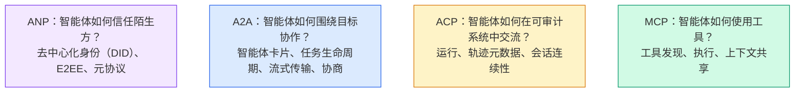

它们不是竞争关系，而是在不同层面解决不同问题。

### MCP 回顾（Recap）

阶段 13 已深入介绍 MCP。简要回顾：MCP 标准化了 LLM 连接外部工具和数据源的方式。它是一种**客户端-服务器（Client-server）**协议，由智能体（客户端）发现并调用服务器暴露的工具。

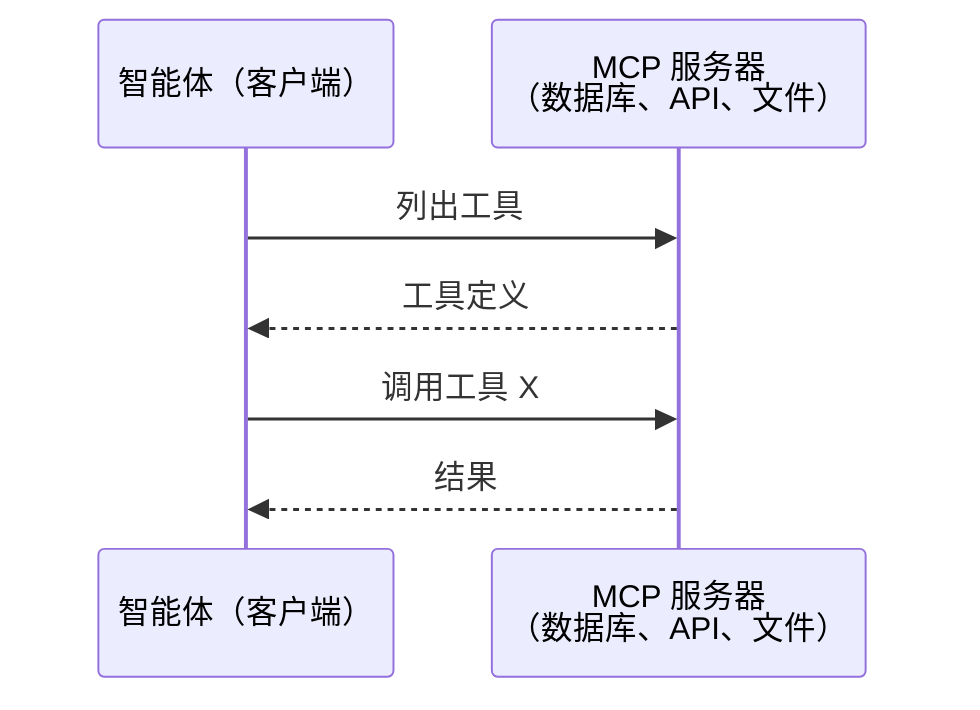

MCP 是**智能体到工具（Agent-to-tool）**的通信，不负责让智能体相互交流。

### 智能体间协议（Agent2Agent Protocol，A2A）

**创建者：** Google（现归 Linux Foundation 管理，名称为 `lf.a2a.v1`）
**规范版本：** 1.0.0
**问题：** 自主智能体如何相互协作、协商并委派任务？

A2A 是面向**对等智能体协作（Peer-to-peer agent collaboration）**的协议。MCP 将智能体连接到工具，A2A 则将智能体连接到其他智能体。每个智能体在约定 URL 发布**智能体卡片（Agent Card）**，其他智能体借此发现它、与其协商并向其委派任务。

#### A2A 如何工作（How A2A Works）

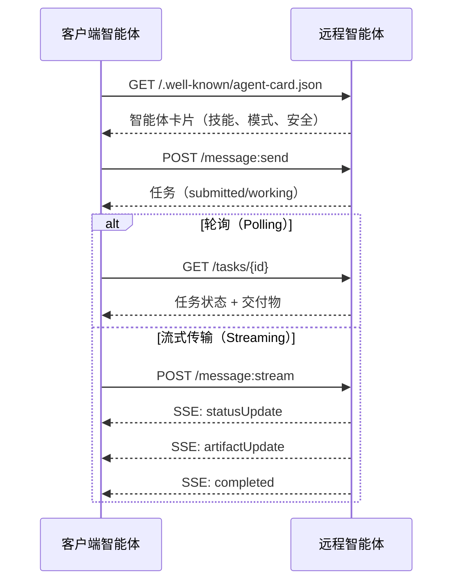

#### 真实的智能体卡片（The Real Agent Card）

下面展示现实中的 A2A 智能体卡片，通过 `GET /.well-known/agent-card.json` 提供：

```json
{
  "name": "Research Agent",
  "description": "Searches documentation and summarizes findings",
  "version": "1.0.0",
  "supportedInterfaces": [
    {
      "url": "https://research-agent.example.com/a2a/v1",
      "protocolBinding": "JSONRPC",
      "protocolVersion": "1.0"
    },
    {
      "url": "https://research-agent.example.com/a2a/rest",
      "protocolBinding": "HTTP+JSON",
      "protocolVersion": "1.0"
    }
  ],
  "provider": {
    "organization": "Your Company",
    "url": "https://example.com"
  },
  "capabilities": {
    "streaming": true,
    "pushNotifications": false
  },
  "defaultInputModes": ["text/plain", "application/json"],
  "defaultOutputModes": ["text/plain", "application/json"],
  "skills": [
    {
      "id": "web-research",
      "name": "Web Research",
      "description": "Searches the web and synthesizes findings",
      "tags": ["research", "search", "summarization"],
      "examples": ["Research the latest changes in React 19"]
    },
    {
      "id": "doc-analysis",
      "name": "Documentation Analysis",
      "description": "Reads and analyzes technical documentation",
      "tags": ["docs", "analysis"],
      "inputModes": ["text/plain", "application/pdf"],
      "outputModes": ["application/json"]
    }
  ],
  "securitySchemes": {
    "bearer": {
      "httpAuthSecurityScheme": {
        "scheme": "Bearer",
        "bearerFormat": "JWT"
      }
    }
  },
  "security": [{ "bearer": [] }]
}
```

需要注意的要点：
- **技能（Skills）**说明智能体能够做什么。每项都有 ID、标签及支持的输入输出 MIME 类型。客户端智能体据此判断远程智能体能否处理请求。
- **supportedInterfaces** 列出多种协议绑定。一个智能体可以同时支持 JSON-RPC、REST 和 gRPC。
- **安全（Security）**机制内置于卡片。客户端无需发出实际请求，就能预先知道所需认证方式。

#### 任务生命周期（Task Lifecycle）

任务是 A2A 的核心工作单位，按定义好的状态流转：

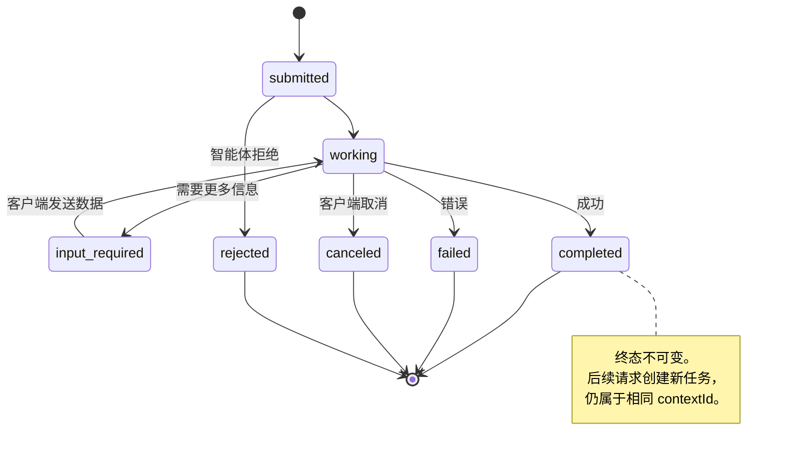

全部 8 种状态如下（规范还定义了作为哨兵值的 `UNSPECIFIED`，此处省略）：

| 状态 | 是否终态？ | 含义 |
|---|---|---|
| `TASK_STATE_SUBMITTED` | 否 | 已确认，尚未处理 |
| `TASK_STATE_WORKING` | 否 | 正在处理 |
| `TASK_STATE_INPUT_REQUIRED` | 否 | 智能体需要客户端提供更多信息 |
| `TASK_STATE_AUTH_REQUIRED` | 否 | 需要身份认证 |
| `TASK_STATE_COMPLETED` | 是 | 成功结束 |
| `TASK_STATE_FAILED` | 是 | 因错误结束 |
| `TASK_STATE_CANCELED` | 是 | 完成前取消 |
| `TASK_STATE_REJECTED` | 是 | 智能体拒绝任务 |

任务一旦进入终态（Terminal state）就不可变，不再接收消息。后续请求会在同一个 `contextId` 下创建新任务。

#### 传输格式（Wire Format）

A2A 使用 JSON-RPC 2.0。以下是真实消息交换的形式：

**客户端发送任务：**
```json
{
  "jsonrpc": "2.0",
  "id": 1,
  "method": "SendMessage",
  "params": {
    "message": {
      "messageId": "msg-001",
      "role": "ROLE_USER",
      "parts": [{ "text": "Research React 19 compiler features" }]
    },
    "configuration": {
      "acceptedOutputModes": ["text/plain", "application/json"],
      "historyLength": 10
    }
  }
}
```

**智能体以任务响应：**
```json
{
  "jsonrpc": "2.0",
  "id": 1,
  "result": {
    "task": {
      "id": "task-abc-123",
      "contextId": "ctx-xyz-789",
      "status": {
        "state": "TASK_STATE_COMPLETED",
        "timestamp": "2026-03-27T10:30:00Z"
      },
      "artifacts": [
        {
          "artifactId": "art-001",
          "name": "research-results",
          "parts": [{
            "data": {
              "findings": [
                "React 19 compiler auto-memoizes components",
                "No more manual useMemo/useCallback needed",
                "Compiler runs at build time, not runtime"
              ]
            },
            "mediaType": "application/json"
          }]
        }
      ]
    }
  }
}
```

**通过 SSE 流式传输：**
```text
POST /message:stream HTTP/1.1
Content-Type: application/json
A2A-Version: 1.0

data: {"task":{"id":"task-123","status":{"state":"TASK_STATE_WORKING"}}}

data: {"statusUpdate":{"taskId":"task-123","status":{"state":"TASK_STATE_WORKING","message":{"role":"ROLE_AGENT","parts":[{"text":"Searching documentation..."}]}}}}

data: {"artifactUpdate":{"taskId":"task-123","artifact":{"artifactId":"art-1","parts":[{"text":"partial findings..."}]},"append":true,"lastChunk":false}}

data: {"statusUpdate":{"taskId":"task-123","status":{"state":"TASK_STATE_COMPLETED"}}}
```

### 智能体通信协议（Agent Communication Protocol，ACP）

**创建者：** IBM / BeeAI
**规范版本：** 0.2.0（OpenAPI 3.1.1）
**状态：** 正在 Linux Foundation 下并入 A2A
**问题：** 智能体如何在具备完整可审计性、会话连续性和轨迹追踪的条件下通信？

ACP 是**企业协议（Enterprise protocol）**。与许多摘要的说法不同，ACP **不**使用 JSON-LD。它是通过 OpenAPI 定义的直接 REST/JSON API。其独特之处在于**轨迹元数据（TrajectoryMetadata）**：每个智能体响应都能携带生成该响应时的详细推理步骤与工具调用日志。

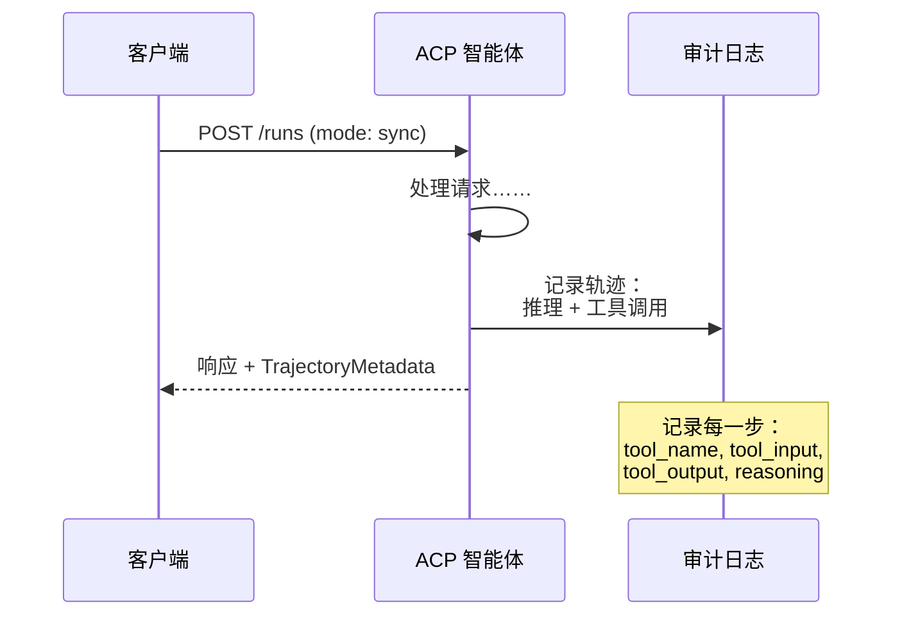

#### ACP 中的智能体发现（Agent Discovery in ACP）

ACP 定义了四种发现方法：

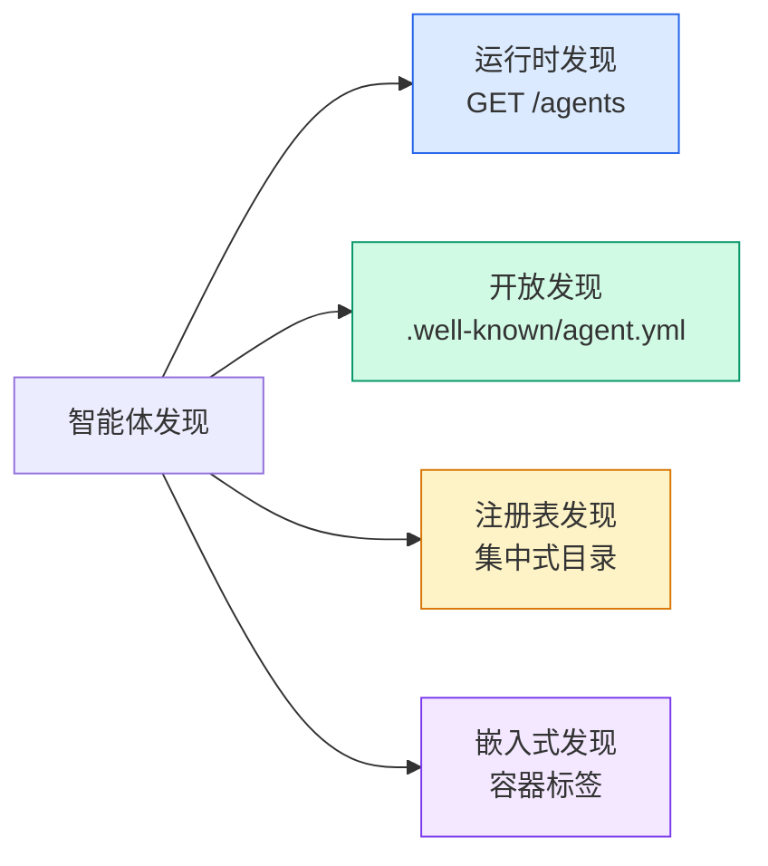

**智能体清单（AgentManifest）**比 A2A 的智能体卡片更简单：

```json
{
  "name": "summarizer",
  "description": "Summarizes documents with source citations",
  "input_content_types": ["text/plain", "application/pdf"],
  "output_content_types": ["text/plain", "application/json"],
  "metadata": {
    "tags": ["summarization", "RAG"],
    "framework": "BeeAI",
    "capabilities": [
      {
        "name": "Document Summarization",
        "description": "Condenses long documents into key points"
      }
    ],
    "recommended_models": ["llama3.3:70b-instruct-fp16"],
    "license": "Apache-2.0",
    "programming_language": "Python"
  }
}
```

#### 运行生命周期（Run Lifecycle）

ACP 使用“运行（Run）”而非“任务（Task）”。一次运行就是一次智能体执行，具有三种模式：

| 模式 | 行为 |
|---|---|
| `sync` | 阻塞。响应包含完整结果。 |
| `async` | 立即返回 202。轮询 `GET /runs/{id}` 获取状态。 |
| `stream` | SSE 流。智能体工作时触发事件。 |

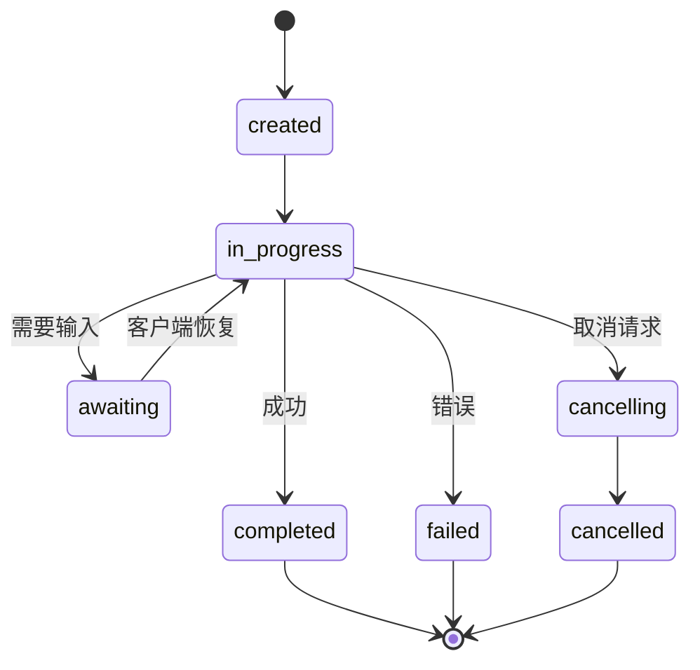

#### 轨迹元数据（TrajectoryMetadata）：审计轨迹（The Audit Trail）

这是 ACP 的关键区别。每个消息部分都可包含元数据，准确展示智能体做过什么：

```json
{
  "role": "agent/researcher",
  "parts": [
    {
      "content_type": "text/plain",
      "content": "The weather in San Francisco is 72F and sunny.",
      "metadata": {
        "kind": "trajectory",
        "message": "I need to check the weather for this location",
        "tool_name": "weather_api",
        "tool_input": { "location": "San Francisco, CA" },
        "tool_output": { "temperature": 72, "condition": "sunny" }
      }
    }
  ]
}
```

这对受监管行业很有价值。每个答案都附带可证明的推理链：调用了哪些工具、使用了哪些输入、收到哪些输出，不再是黑箱。

ACP 还支持用于来源归属的**引用元数据（CitationMetadata）**：

```json
{
  "kind": "citation",
  "start_index": 0,
  "end_index": 47,
  "url": "https://weather.gov/sf",
  "title": "NWS San Francisco Forecast"
}
```

### 智能体网络协议（Agent Network Protocol，ANP）

**创建者：** 开源社区（由 GaoWei Chang 发起）
**仓库：** [github.com/agent-network-protocol/AgentNetworkProtocol](https://github.com/agent-network-protocol/AgentNetworkProtocol)
**问题：** 不同组织的智能体如何在没有中心权威的情况下相互信任？

ANP 是**去中心化身份协议（Decentralized identity protocol）**，通过 W3C 去中心化标识符（Decentralized Identifier，DID）和端到端加密（End-to-end encryption，E2EE）建立信任。A2A 通过已知端点发现智能体，而 ANP 允许智能体用密码学证明身份。

ANP 分三层：

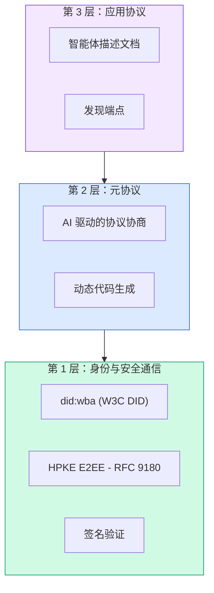

#### DID 文档的真实结构（DID Documents, Real Structure）

ANP 使用名为 `did:wba`（Web-Based Agent）的自定义 DID 方法。DID `did:wba:example.com:user:alice` 解析为 `https://example.com/user/alice/did.json`：

```json
{
  "@context": [
    "https://www.w3.org/ns/did/v1",
    "https://w3id.org/security/suites/jws-2020/v1",
    "https://w3id.org/security/suites/secp256k1-2019/v1"
  ],
  "id": "did:wba:example.com:user:alice",
  "verificationMethod": [
    {
      "id": "did:wba:example.com:user:alice#key-1",
      "type": "EcdsaSecp256k1VerificationKey2019",
      "controller": "did:wba:example.com:user:alice",
      "publicKeyJwk": {
        "crv": "secp256k1",
        "x": "NtngWpJUr-rlNNbs0u-Aa8e16OwSJu6UiFf0Rdo1oJ4",
        "y": "qN1jKupJlFsPFc1UkWinqljv4YE0mq_Ickwnjgasvmo",
        "kty": "EC"
      }
    },
    {
      "id": "did:wba:example.com:user:alice#key-x25519-1",
      "type": "X25519KeyAgreementKey2019",
      "controller": "did:wba:example.com:user:alice",
      "publicKeyMultibase": "z9hFgmPVfmBZwRvFEyniQDBkz9LmV7gDEqytWyGZLmDXE"
    }
  ],
  "authentication": [
    "did:wba:example.com:user:alice#key-1"
  ],
  "keyAgreement": [
    "did:wba:example.com:user:alice#key-x25519-1"
  ],
  "humanAuthorization": [
    "did:wba:example.com:user:alice#key-1"
  ],
  "service": [
    {
      "id": "did:wba:example.com:user:alice#agent-description",
      "type": "AgentDescription",
      "serviceEndpoint": "https://example.com/agents/alice/ad.json"
    }
  ]
}
```

需要注意的要点：
- 强制**密钥分离（Key separation）**。签名密钥（secp256k1）与加密密钥（X25519）分开。
- **`humanAuthorization`** 是 ANP 特有的。这些密钥使用前需要明确的人类批准（生物识别、密码、HSM）。资金转账等高风险操作走这条路径。
- **`keyAgreement`** 密钥用于 HPKE 端到端加密（RFC 9180）。
- **service** 部分链接到智能体描述文档（Agent Description）。

#### ANP 中的信任如何工作（How Trust Works in ANP）

ANP **不**使用信任网（Web-of-trust）或背书图（Endorsement graph）。信任是双边的，每次交互分别验证：

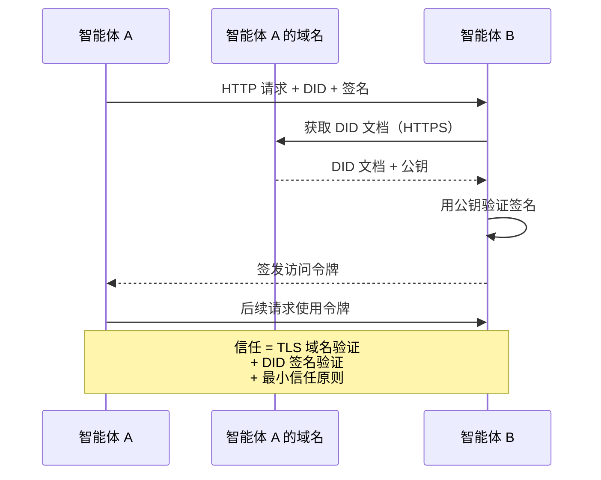

信任有三个来源：
1. **域名级 TLS** 验证 DID 文档的托管主机
2. **DID 密码学签名**验证智能体身份
3. **最小信任原则（Principle of least trust）**仅授予最低限度权限

没有基于流言（Gossip）的信任传播或 PageRank 评分。你通过每个智能体的 DID 直接验证它。

#### 元协议协商（Meta-Protocol Negotiation）

这是 ANP 最新颖的特性。来自不同生态的两个智能体相遇时，无需预先约定数据格式，可以用自然语言协商：

```json
{
  "action": "protocolNegotiation",
  "sequenceId": 0,
  "candidateProtocols": "I can communicate using:\n1. JSON-RPC with hotel booking schema\n2. REST with OpenAPI 3.1 spec\n3. Natural language over HTTP",
  "modificationSummary": "Initial proposal",
  "status": "negotiating"
}
```

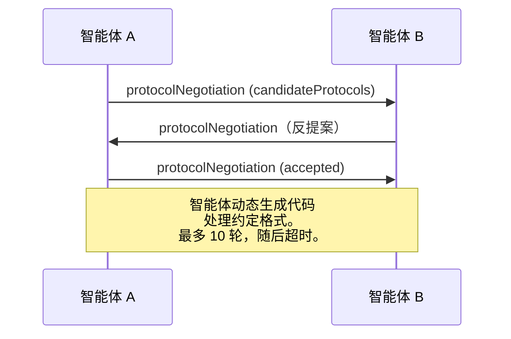

智能体来回交涉（最多 10 轮），直至就格式达成一致，再动态生成处理该格式的代码。状态值为 `negotiating`、`rejected`、`accepted`、`timeout`。

这意味着两个此前从未见过彼此的智能体，无需任何人预定义共享模式，就能自行确定通信方式。

### 对比，已修正（Comparison, Corrected）

| | MCP | A2A | ACP | ANP |
|---|---|---|---|---|
| **创建者** | Anthropic | Google / Linux Foundation | IBM / BeeAI | 社区 |
| **规范格式** | JSON-RPC | JSON-RPC / REST / gRPC | OpenAPI 3.1（REST） | JSON-RPC |
| **主要用途** | 智能体到工具 | 智能体到智能体 | 智能体到智能体 | 智能体到智能体 |
| **发现机制** | 工具列表 | `/.well-known/agent-card.json` | `GET /agents`、`/.well-known/agent.yml` | `/.well-known/agent-descriptions`、DID 服务端点 |
| **身份** | 隐式（本地） | 安全方案（OAuth、mTLS） | 服务器级 | W3C DID（`did:wba`）与 E2EE |
| **审计轨迹** | 不适用 | 基础（任务历史） | TrajectoryMetadata（工具调用、推理） | 未正式规定 |
| **状态机** | 不适用 | 9 种任务状态 | 7 种运行状态 | 不适用 |
| **流式传输** | 不适用 | SSE | SSE | 与传输无关 |
| **独有特性** | 工具模式 | 智能体卡片 + 技能 | 轨迹审计记录 | 元协议协商 |
| **最适合** | 工具与数据 | 动态协作 | 受监管行业 | 跨组织信任 |
| **状态** | 稳定 | 稳定（v1.0） | 正在并入 A2A | 积极开发中 |

### 如何协同工作（How They Work Together）

这些协议并不互斥，真实的企业系统会同时使用多种：

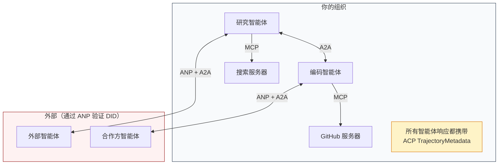

- **MCP** 将各智能体连接到其工具
- **A2A** 处理内部和外部智能体之间的协作
- **ACP** 为响应封装轨迹元数据，提供可审计性
- **ANP** 为不受你控制的智能体提供身份验证

```figure
swarm-message-bus
```

## 动手实现（Build It）

### 第 1 步：核心消息类型（Core Message Types）

每个多智能体系统都从消息格式开始。我们定义与真实协议所用内容对应的类型：

```typescript
import crypto from "node:crypto";

type MessageRole = "user" | "agent";

type MessagePart =
  | { kind: "text"; text: string }
  | { kind: "data"; data: unknown; mediaType: string }
  | { kind: "file"; name: string; url: string; mediaType: string };

type TrajectoryEntry = {
  reasoning: string;
  toolName?: string;
  toolInput?: unknown;
  toolOutput?: unknown;
  timestamp: number;
};

type AgentMessage = {
  id: string;
  role: MessageRole;
  parts: MessagePart[];
  trajectory?: TrajectoryEntry[];
  replyTo?: string;
  timestamp: number;
};

function createMessage(
  role: MessageRole,
  parts: MessagePart[],
  replyTo?: string
): AgentMessage {
  return {
    id: crypto.randomUUID(),
    role,
    parts,
    replyTo,
    timestamp: Date.now(),
  };
}

function textMessage(role: MessageRole, text: string): AgentMessage {
  return createMessage(role, [{ kind: "text", text }]);
}
```

注意：`MessagePart` 与真实 A2A 和 ACP 规范一样支持多模态（文本、结构化数据、文件）。`TrajectoryEntry` 捕获推理链，对应 ACP 的 TrajectoryMetadata。

### 第 2 步：A2A 智能体卡片与注册表（A2A Agent Card and Registry）

构建与真实 A2A 规范一致的智能体发现机制：

```typescript
type Skill = {
  id: string;
  name: string;
  description: string;
  tags: string[];
  inputModes: string[];
  outputModes: string[];
};

type AgentCard = {
  name: string;
  description: string;
  version: string;
  url: string;
  capabilities: {
    streaming: boolean;
    pushNotifications: boolean;
  };
  defaultInputModes: string[];
  defaultOutputModes: string[];
  skills: Skill[];
};

class AgentRegistry {
  private cards: Map<string, AgentCard> = new Map();

  register(card: AgentCard) {
    this.cards.set(card.name, card);
  }

  discoverBySkillTag(tag: string): AgentCard[] {
    return [...this.cards.values()].filter((card) =>
      card.skills.some((skill) => skill.tags.includes(tag))
    );
  }

  discoverByInputMode(mimeType: string): AgentCard[] {
    return [...this.cards.values()].filter(
      (card) =>
        card.defaultInputModes.includes(mimeType) ||
        card.skills.some((skill) => skill.inputModes.includes(mimeType))
    );
  }

  resolve(name: string): AgentCard | undefined {
    return this.cards.get(name);
  }

  listAll(): AgentCard[] {
    return [...this.cards.values()];
  }
}
```

这比简单的名称到能力映射丰富得多。与真实 A2A 规范支持的方式一样，你可以按技能标签、输入 MIME 类型或名称发现智能体。

### 第 3 步：A2A 任务生命周期（A2A Task Lifecycle）

构建完整的任务状态机：

```typescript
type TaskState =
  | "submitted"
  | "working"
  | "input-required"
  | "auth-required"
  | "completed"
  | "failed"
  | "canceled"
  | "rejected";

const TERMINAL_STATES: TaskState[] = [
  "completed",
  "failed",
  "canceled",
  "rejected",
];

type TaskStatus = {
  state: TaskState;
  message?: AgentMessage;
  timestamp: number;
};

type Artifact = {
  id: string;
  name: string;
  parts: MessagePart[];
};

type Task = {
  id: string;
  contextId: string;
  status: TaskStatus;
  artifacts: Artifact[];
  history: AgentMessage[];
};

type TaskEvent =
  | { kind: "statusUpdate"; taskId: string; status: TaskStatus }
  | {
      kind: "artifactUpdate";
      taskId: string;
      artifact: Artifact;
      append: boolean;
      lastChunk: boolean;
    };

type TaskHandler = (
  task: Task,
  message: AgentMessage
) => AsyncGenerator<TaskEvent>;

class TaskManager {
  private tasks: Map<string, Task> = new Map();
  private handlers: Map<string, TaskHandler> = new Map();
  private listeners: Map<string, ((event: TaskEvent) => void)[]> = new Map();

  registerHandler(agentName: string, handler: TaskHandler) {
    this.handlers.set(agentName, handler);
  }

  subscribe(taskId: string, listener: (event: TaskEvent) => void) {
    const existing = this.listeners.get(taskId) ?? [];
    existing.push(listener);
    this.listeners.set(taskId, existing);
  }

  async sendMessage(
    agentName: string,
    message: AgentMessage,
    contextId?: string
  ): Promise<Task> {
    const handler = this.handlers.get(agentName);
    if (!handler) {
      const task = this.createTask(contextId);
      task.status = {
        state: "rejected",
        timestamp: Date.now(),
        message: textMessage("agent", `No handler for ${agentName}`),
      };
      return task;
    }

    const task = this.createTask(contextId);
    task.history.push(message);
    task.status = { state: "submitted", timestamp: Date.now() };

    this.processTask(task, handler, message).catch((err) => {
      task.status = {
        state: "failed",
        timestamp: Date.now(),
        message: textMessage("agent", String(err)),
      };
    });
    return task;
  }

  getTask(taskId: string): Task | undefined {
    return this.tasks.get(taskId);
  }

  cancelTask(taskId: string): boolean {
    const task = this.tasks.get(taskId);
    if (!task || TERMINAL_STATES.includes(task.status.state)) return false;
    task.status = { state: "canceled", timestamp: Date.now() };
    this.emit(taskId, {
      kind: "statusUpdate",
      taskId,
      status: task.status,
    });
    return true;
  }

  private createTask(contextId?: string): Task {
    const task: Task = {
      id: crypto.randomUUID(),
      contextId: contextId ?? crypto.randomUUID(),
      status: { state: "submitted", timestamp: Date.now() },
      artifacts: [],
      history: [],
    };
    this.tasks.set(task.id, task);
    return task;
  }

  private async processTask(
    task: Task,
    handler: TaskHandler,
    message: AgentMessage
  ) {
    task.status = { state: "working", timestamp: Date.now() };
    this.emit(task.id, {
      kind: "statusUpdate",
      taskId: task.id,
      status: task.status,
    });

    try {
      for await (const event of handler(task, message)) {
        if (TERMINAL_STATES.includes(task.status.state)) break;

        if (event.kind === "statusUpdate") {
          task.status = event.status;
        }
        if (event.kind === "artifactUpdate") {
          const existing = task.artifacts.find(
            (a) => a.id === event.artifact.id
          );
          if (existing && event.append) {
            existing.parts.push(...event.artifact.parts);
          } else {
            task.artifacts.push(event.artifact);
          }
        }
        this.emit(task.id, event);
      }
    } catch (err) {
      task.status = {
        state: "failed",
        timestamp: Date.now(),
        message: textMessage("agent", String(err)),
      };
      this.emit(task.id, {
        kind: "statusUpdate",
        taskId: task.id,
        status: task.status,
      });
    }
  }

  private emit(taskId: string, event: TaskEvent) {
    for (const listener of this.listeners.get(taskId) ?? []) {
      listener(event);
    }
  }
}
```

这里实现真实的 A2A 任务生命周期：submitted、working、input-required 和各终态。处理器是产生事件（状态更新和交付物分块）的异步生成器，与 SSE 流式模型对应。

### 第 4 步：ACP 风格的审计轨迹（ACP-Style Audit Trail）

为通信封装轨迹追踪：

```typescript
type AuditEntry = {
  runId: string;
  agentName: string;
  input: AgentMessage[];
  output: AgentMessage[];
  trajectory: TrajectoryEntry[];
  status: "created" | "in-progress" | "completed" | "failed" | "awaiting";
  startedAt: number;
  completedAt?: number;
  sessionId?: string;
};

class AuditableRunner {
  private log: AuditEntry[] = [];
  private handlers: Map<
    string,
    (input: AgentMessage[]) => Promise<{
      output: AgentMessage[];
      trajectory: TrajectoryEntry[];
    }>
  > = new Map();

  registerAgent(
    name: string,
    handler: (input: AgentMessage[]) => Promise<{
      output: AgentMessage[];
      trajectory: TrajectoryEntry[];
    }>
  ) {
    this.handlers.set(name, handler);
  }

  async run(
    agentName: string,
    input: AgentMessage[],
    sessionId?: string
  ): Promise<AuditEntry> {
    const entry: AuditEntry = {
      runId: crypto.randomUUID(),
      agentName,
      input: structuredClone(input),
      output: [],
      trajectory: [],
      status: "created",
      startedAt: Date.now(),
      sessionId,
    };
    this.log.push(entry);

    const handler = this.handlers.get(agentName);
    if (!handler) {
      entry.status = "failed";
      return entry;
    }

    entry.status = "in-progress";
    try {
      const result = await handler(input);
      entry.output = structuredClone(result.output);
      entry.trajectory = structuredClone(result.trajectory);
      entry.status = "completed";
      entry.completedAt = Date.now();
    } catch (err) {
      entry.status = "failed";
      entry.trajectory.push({
        reasoning: `Error: ${String(err)}`,
        timestamp: Date.now(),
      });
      entry.completedAt = Date.now();
    }
    return entry;
  }

  getFullAuditLog(): AuditEntry[] {
    return structuredClone(this.log);
  }

  getAuditLogForAgent(agentName: string): AuditEntry[] {
    return structuredClone(
      this.log.filter((e) => e.agentName === agentName)
    );
  }

  getAuditLogForSession(sessionId: string): AuditEntry[] {
    return structuredClone(
      this.log.filter((e) => e.sessionId === sessionId)
    );
  }

  getTrajectoryForRun(runId: string): TrajectoryEntry[] {
    const entry = this.log.find((e) => e.runId === runId);
    return entry ? structuredClone(entry.trajectory) : [];
  }
}
```

每次智能体执行都会生成完整审计条目：输入是什么、输出是什么，以及两者之间完整的工具调用和推理步骤轨迹。可按智能体、会话或单次运行查询。

### 第 5 步：ANP 风格的身份验证（ANP-Style Identity Verification）

构建基于 DID 的身份与验证机制：

```typescript
type VerificationMethod = {
  id: string;
  type: string;
  controller: string;
  publicKeyDer: string;
};

type DIDDocument = {
  id: string;
  verificationMethod: VerificationMethod[];
  authentication: string[];
  keyAgreement: string[];
  humanAuthorization: string[];
  service: { id: string; type: string; serviceEndpoint: string }[];
};

type AgentIdentity = {
  did: string;
  document: DIDDocument;
  privateKey: crypto.KeyObject;
  publicKey: crypto.KeyObject;
};

class IdentityRegistry {
  private documents: Map<string, DIDDocument> = new Map();

  publish(doc: DIDDocument) {
    this.documents.set(doc.id, doc);
  }

  resolve(did: string): DIDDocument | undefined {
    return this.documents.get(did);
  }

  verify(did: string, signature: string, payload: string): boolean {
    const doc = this.documents.get(did);
    if (!doc) return false;

    const authKeyIds = doc.authentication;
    const authKeys = doc.verificationMethod.filter((vm) =>
      authKeyIds.includes(vm.id)
    );

    for (const key of authKeys) {
      const publicKey = crypto.createPublicKey({
        key: Buffer.from(key.publicKeyDer, "base64"),
        format: "der",
        type: "spki",
      });
      const isValid = crypto.verify(
        null,
        Buffer.from(payload),
        publicKey,
        Buffer.from(signature, "hex")
      );
      if (isValid) return true;
    }
    return false;
  }

  requiresHumanAuth(did: string, operationKeyId: string): boolean {
    const doc = this.documents.get(did);
    if (!doc) return false;
    return doc.humanAuthorization.includes(operationKeyId);
  }
}

function createIdentity(domain: string, agentName: string): AgentIdentity {
  const did = `did:wba:${domain}:agent:${agentName}`;
  const { publicKey, privateKey } = crypto.generateKeyPairSync("ed25519");

  const publicKeyDer = publicKey
    .export({ format: "der", type: "spki" })
    .toString("base64");

  const keyId = `${did}#key-1`;
  const encKeyId = `${did}#key-x25519-1`;

  const document: DIDDocument = {
    id: did,
    verificationMethod: [
      {
        id: keyId,
        type: "Ed25519VerificationKey2020",
        controller: did,
        publicKeyDer,
      },
      {
        id: encKeyId,
        type: "X25519KeyAgreementKey2019",
        controller: did,
        publicKeyDer,
      },
    ],
    authentication: [keyId],
    keyAgreement: [encKeyId],
    humanAuthorization: [],
    service: [
      {
        id: `${did}#agent-description`,
        type: "AgentDescription",
        serviceEndpoint: `https://${domain}/agents/${agentName}/ad.json`,
      },
    ],
  };

  return { did, document, privateKey, publicKey };
}

function signPayload(identity: AgentIdentity, payload: string): string {
  return crypto
    .sign(null, Buffer.from(payload), identity.privateKey)
    .toString("hex");
}
```

这里对应真实的 ANP 身份模型：智能体具有 DID 文档，认证、密钥协商和人类授权使用分开的密钥。`IdentityRegistry` 模拟 DID 解析（生产中应通过 HTTP 从智能体域名获取）。

### 第 6 步：协议网关（Protocol Gateway）

将四种协议连接成统一系统：

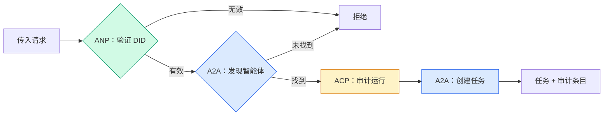

```typescript
class ProtocolGateway {
  private registry: AgentRegistry;
  private taskManager: TaskManager;
  private auditRunner: AuditableRunner;
  private identityRegistry: IdentityRegistry;

  constructor(
    registry: AgentRegistry,
    taskManager: TaskManager,
    auditRunner: AuditableRunner,
    identityRegistry: IdentityRegistry
  ) {
    this.registry = registry;
    this.taskManager = taskManager;
    this.auditRunner = auditRunner;
    this.identityRegistry = identityRegistry;
  }

  async delegateTask(
    fromDid: string,
    signature: string,
    targetAgent: string,
    message: AgentMessage,
    sessionId?: string
  ): Promise<{ task: Task; audit: AuditEntry } | { error: string }> {
    if (!this.identityRegistry.verify(fromDid, signature, message.id)) {
      return { error: "Identity verification failed" };
    }

    const card = this.registry.resolve(targetAgent);
    if (!card) {
      return { error: `Agent ${targetAgent} not found in registry` };
    }

    const audit = await this.auditRunner.run(
      targetAgent,
      [message],
      sessionId
    );
    const task = await this.taskManager.sendMessage(targetAgent, message);

    return { task, audit };
  }

  discoverAndDelegate(
    fromDid: string,
    signature: string,
    skillTag: string,
    message: AgentMessage
  ): Promise<{ task: Task; audit: AuditEntry } | { error: string }> {
    const candidates = this.registry.discoverBySkillTag(skillTag);
    if (candidates.length === 0) {
      return Promise.resolve({
        error: `No agents found with skill tag: ${skillTag}`,
      });
    }
    return this.delegateTask(
      fromDid,
      signature,
      candidates[0].name,
      message
    );
  }
}
```

网关在一次调用中完成四件事：
1. **ANP**：通过 DID 签名验证调用者身份
2. **A2A**：发现目标智能体并检查能力
3. **ACP**：为执行过程封装带轨迹的审计记录
4. **A2A**：创建具备完整生命周期追踪的任务

### 第 7 步：连接全部组件（Wire It All Together）

```typescript
async function protocolDemo() {
  const registry = new AgentRegistry();
  registry.register({
    name: "researcher",
    description: "Searches and summarizes findings",
    version: "1.0.0",
    url: "https://researcher.local/a2a/v1",
    capabilities: { streaming: true, pushNotifications: false },
    defaultInputModes: ["text/plain"],
    defaultOutputModes: ["text/plain", "application/json"],
    skills: [
      {
        id: "web-research",
        name: "Web Research",
        description: "Searches the web",
        tags: ["research", "search", "summarization"],
        inputModes: ["text/plain"],
        outputModes: ["application/json"],
      },
    ],
  });
  registry.register({
    name: "coder",
    description: "Writes code from specs",
    version: "1.0.0",
    url: "https://coder.local/a2a/v1",
    capabilities: { streaming: false, pushNotifications: false },
    defaultInputModes: ["text/plain", "application/json"],
    defaultOutputModes: ["text/plain"],
    skills: [
      {
        id: "code-gen",
        name: "Code Generation",
        description: "Generates code",
        tags: ["coding", "generation"],
        inputModes: ["text/plain", "application/json"],
        outputModes: ["text/plain"],
      },
    ],
  });

  const taskManager = new TaskManager();
  const auditRunner = new AuditableRunner();

  const researchTrajectory: TrajectoryEntry[] = [];

  taskManager.registerHandler(
    "researcher",
    async function* (task, message) {
      yield {
        kind: "statusUpdate" as const,
        taskId: task.id,
        status: { state: "working" as const, timestamp: Date.now() },
      };

      researchTrajectory.push({
        reasoning: "Searching for React 19 documentation",
        toolName: "web_search",
        toolInput: { query: "React 19 compiler features" },
        toolOutput: {
          results: ["react.dev/blog/react-19", "github.com/react/react"],
        },
        timestamp: Date.now(),
      });

      researchTrajectory.push({
        reasoning: "Extracting key findings from search results",
        toolName: "doc_analysis",
        toolInput: { url: "react.dev/blog/react-19" },
        toolOutput: {
          summary:
            "React 19 compiler auto-memoizes, no manual useMemo needed",
        },
        timestamp: Date.now(),
      });

      yield {
        kind: "artifactUpdate" as const,
        taskId: task.id,
        artifact: {
          id: crypto.randomUUID(),
          name: "research-results",
          parts: [
            {
              kind: "data" as const,
              data: {
                findings: [
                  "React 19 compiler auto-memoizes components",
                  "No more manual useMemo/useCallback needed",
                  "Compiler runs at build time, not runtime",
                ],
                sources: ["react.dev/blog/react-19"],
              },
              mediaType: "application/json",
            },
          ],
        },
        append: false,
        lastChunk: true,
      };

      yield {
        kind: "statusUpdate" as const,
        taskId: task.id,
        status: { state: "completed" as const, timestamp: Date.now() },
      };
    }
  );

  auditRunner.registerAgent("researcher", async () => ({
    output: [
      textMessage("agent", "React 19 compiler auto-memoizes components"),
    ],
    trajectory: researchTrajectory,
  }));

  const identityRegistry = new IdentityRegistry();

  const coderIdentity = createIdentity("coder.local", "coder");
  const researcherIdentity = createIdentity("researcher.local", "researcher");

  identityRegistry.publish(coderIdentity.document);
  identityRegistry.publish(researcherIdentity.document);

  const gateway = new ProtocolGateway(
    registry,
    taskManager,
    auditRunner,
    identityRegistry
  );

  console.log("=== Protocol Demo ===\n");

  console.log("1. Agent Discovery (A2A)");
  const researchAgents = registry.discoverBySkillTag("research");
  console.log(
    `   Found ${researchAgents.length} agent(s):`,
    researchAgents.map((a) => a.name)
  );

  console.log("\n2. Identity Verification (ANP)");
  const message = textMessage("user", "Research React 19 compiler features");
  const signature = signPayload(coderIdentity, message.id);
  const verified = identityRegistry.verify(
    coderIdentity.did,
    signature,
    message.id
  );
  console.log(`   Coder DID: ${coderIdentity.did}`);
  console.log(`   Signature verified: ${verified}`);

  console.log("\n3. Task Delegation (A2A + ACP + ANP)");
  const result = await gateway.delegateTask(
    coderIdentity.did,
    signature,
    "researcher",
    message,
    "session-001"
  );

  if ("error" in result) {
    console.log(`   Error: ${result.error}`);
    return;
  }

  console.log(`   Task ID: ${result.task.id}`);
  console.log(`   Task state: ${result.task.status.state}`);
  console.log(`   Artifacts: ${result.task.artifacts.length}`);

  console.log("\n4. Audit Trail (ACP)");
  console.log(`   Run ID: ${result.audit.runId}`);
  console.log(`   Status: ${result.audit.status}`);
  console.log(`   Trajectory steps: ${result.audit.trajectory.length}`);
  for (const step of result.audit.trajectory) {
    console.log(`     - ${step.reasoning}`);
    if (step.toolName) {
      console.log(`       Tool: ${step.toolName}`);
    }
  }

  console.log("\n5. Full Audit Log");
  const fullLog = auditRunner.getFullAuditLog();
  console.log(`   Total runs: ${fullLog.length}`);
  for (const entry of fullLog) {
    const duration = entry.completedAt
      ? `${entry.completedAt - entry.startedAt}ms`
      : "in-progress";
    console.log(`   ${entry.agentName}: ${entry.status} (${duration})`);
  }
}

protocolDemo().catch((err) => {
  console.error("Protocol demo failed:", err);
  process.exitCode = 1;
});
```

## 常见故障（What Goes Wrong）

协议解决顺利执行的路径。生产中还会出现以下问题：

**模式漂移（Schema drift）。** 智能体 A 发布卡片，声明输出 `application/json`，但版本之间 JSON 模式发生变化。B 按旧格式解析，得到无效结果。修复：为技能和输出模式管理版本。A2A 卡片支持 `version` 正是出于这个原因。

**违反状态机约束。** 智能体处理器产生 `completed` 事件后，又试图产出更多交付物。任务已不可变，代码会静默丢弃更新或抛错。修复：产出之前检查终态。上述 `TaskManager` 通过终态后的 `break` 强制执行该规则。

**信任解析失败。** A 试图验证 B 的 DID，但 B 的域名服务宕机，无法获取 DID 文档。你选择故障放行（Fail open，接受未验证智能体），还是故障拒绝（Fail closed，全部拒绝）？ANP 根据最小信任原则建议故障拒绝。

**轨迹膨胀。** ACP 轨迹日志功能强大，但开销高。每次运行调用 200 次工具的复杂智能体会产生庞大审计条目。修复：让轨迹日志详细级别可配置。合规场景记录工具名与输入输出，非受监管工作负载跳过推理步骤。

**发现惊群（Discovery thundering herd）。** 50 个智能体启动时同时查询 `GET /agents`。修复：为卡片缓存设置生存时间（Time to live，TTL），错开发现间隔，或用推送式注册代替轮询。

## 实际应用（Use It）

### 真实实现（Real Implementations）

**A2A** 最成熟。Google 的[官方规范](https://github.com/google/A2A) 在 Linux Foundation 下开源，并有 Python 与 TypeScript SDK。若智能体需要动态发现与协作，从这里开始。

**ACP** 正在并入 A2A。IBM 的 [BeeAI 项目](https://github.com/i-am-bee/acp) 将 ACP 创建为 REST 优先的替代方案，但其轨迹元数据概念正在被 A2A 生态吸收。即使以 A2A 为传输层，也可使用 ACP 模式（轨迹日志、运行生命周期）。

**ANP** 实验性最强。[社区仓库](https://github.com/agent-network-protocol/AgentNetworkProtocol) 提供 Python SDK（AgentConnect）。元协议协商概念确有新意，值得跨组织智能体部署关注。

**MCP** 已在阶段 13 介绍。若需要智能体使用工具，MCP 就是标准。

### 选择合适协议（Picking the Right Protocol）

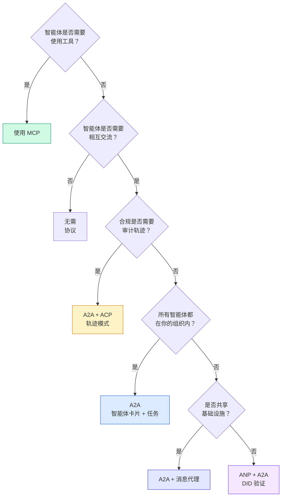

## 交付成果（Ship It）

本课产出：
- `code/main.ts`：四种协议模式的完整实现
- `outputs/prompt-protocol-selector.md`：帮助为系统选择协议的提示词

## 练习（Exercises）

1. **多跳任务委派（Multi-hop task delegation）。** 扩展 `TaskManager`，允许智能体处理器向其他智能体委派子任务。研究员接收任务，把“搜索”和“摘要”子任务分给两个专职智能体，等待两者完成，再将结果合并到自己的交付物中。

2. **流式审计轨迹。** 修改 `AuditableRunner` 以支持流式模式。不再等待完整结果，而是在添加轨迹条目时实时产出 `AuditEntry` 更新。使用生成审计快照的异步生成器。

3. **DID 轮换（DID rotation）。** 为 `IdentityRegistry` 增加密钥轮换。智能体应能发布更新密钥的新 DID 文档，同时维护 `previousDid` 引用。验证者应在宽限期内同时接受当前密钥与前一密钥的签名。

4. **协议协商。** 实现 ANP 的元协议概念。两个智能体交换包含候选格式的 `protocolNegotiation` 消息（如“我支持 JSON-RPC”与“我偏好 REST”）。最多 3 轮后，双方达成格式共识或超时。约定格式决定使用哪个 `TaskManager` 或 `AuditableRunner`。

5. **限流发现。** 添加 `RateLimitedRegistry` 包装器，按可配置 TTL 缓存智能体卡片查询，并限制每个智能体每秒的发现查询数。模拟 100 个智能体启动时互相发现造成的惊群，测量差异。

## 关键术语（Key Terms）

| 术语 | 常见说法 | 实际含义 |
|------|----------------|----------------------|
| 模型上下文协议（Model Context Protocol，MCP） | “AI 工具协议” | 供智能体发现并使用工具的客户端-服务器协议。面向智能体到工具，而非智能体到智能体。 |
| A2A | “Google 的智能体协议” | Linux Foundation 下的智能体对等协作协议。通过智能体卡片发现，具有 9 状态任务生命周期，经 SSE 流式传输，支持 JSON-RPC、REST、gRPC 绑定。 |
| ACP | “企业智能体消息传递” | IBM/BeeAI 面向智能体运行的 REST API，带有 TrajectoryMetadata：每个响应携带完整推理链和工具调用。正在并入 A2A。 |
| ANP | “去中心化智能体身份” | 社区协议，使用 `did:wba`（DID）提供密码学身份，使用 HPKE 提供 E2EE，并为素未谋面的智能体提供 AI 驱动的元协议协商。 |
| 智能体卡片（Agent Card） | “智能体名片” | 位于 `/.well-known/agent-card.json` 的 JSON 文档，描述技能、支持的 MIME 类型、安全方案和协议绑定。 |
| 去中心化标识符（Decentralized Identifier，DID） | “去中心化 ID” | W3C 标准，提供可通过密码学验证、托管在智能体自有域名上的身份。ANP 使用 `did:wba` 方法。 |
| 轨迹元数据（TrajectoryMetadata） | “审计回执” | ACP 为每个智能体响应附加推理步骤、工具调用及其输入输出的机制。 |
| 元协议（Meta-protocol） | “智能体协商如何交流” | ANP 的做法：智能体用自然语言动态约定数据格式，再生成处理这些格式的代码。 |
| 任务（Task） | “工作单位” | A2A 的有状态对象，从提交到完成追踪工作。进入终态后不可变。 |

## 延伸阅读（Further Reading）

- [Google A2A 规范（Google A2A specification）](https://github.com/google/A2A)：官方规范和 SDK（v1.0.0，Linux Foundation）
- [IBM/BeeAI ACP 规范（IBM/BeeAI ACP specification）](https://github.com/i-am-bee/acp)：面向智能体运行与轨迹元数据的 OpenAPI 3.1 规范
- [智能体网络协议（Agent Network Protocol）](https://github.com/agent-network-protocol/AgentNetworkProtocol)：基于 DID 的身份、E2EE、元协议协商
- [模型上下文协议文档（Model Context Protocol docs）](https://modelcontextprotocol.io/)：Anthropic 的 MCP 规范（阶段 13 已介绍）
- [W3C 去中心化标识符（W3C Decentralized Identifiers）](https://www.w3.org/TR/did-core/)：ANP 所依赖的身份标准
- [RFC 9180（HPKE）](https://www.rfc-editor.org/rfc/rfc9180)：ANP 用于 E2EE 的加密方案
- [FIPA 智能体通信语言（FIPA Agent Communication Language）](http://www.fipa.org/specs/fipa00061/SC00061G.html)：现代智能体协议的学术前身
