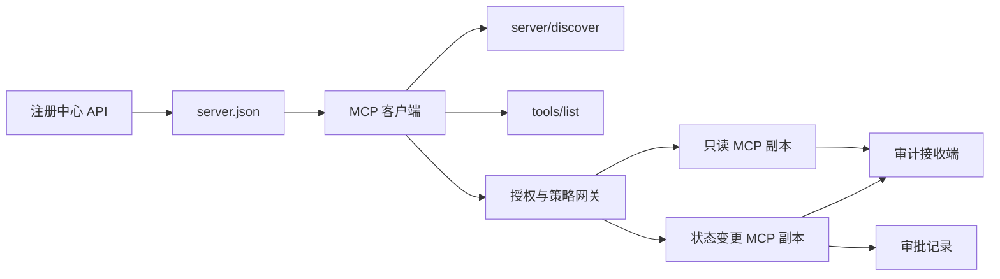

# 综合实践 13：带注册中心与治理的无状态 MCP 服务器（Stateless MCP Server with Registry and Governance）

> 生产级模型上下文协议（Model Context Protocol，MCP）不是一个服务器进程，而是一串契约：可发布元数据、实时发现、无状态请求封装、授权、策略、审计，以及部署证据。

**Type:** Capstone
**Languages:** Python 和 TypeScript 参考模型；生产实现可用任意语言
**Prerequisites:** 阶段 11、阶段 13、阶段 14、阶段 17 和阶段 18
**必修 MCP 深入课程（Required MCP deep dives）:** [第 28 课：工具契约](../../../13-tools-and-protocols/28-mcp-tool-contracts-and-content/docs/en.md)、[第 29 课：可靠性](../../../13-tools-and-protocols/29-mcp-reliability-cancellation-and-flow-control/docs/en.md)、[第 30 课：注册中心供应链](../../../13-tools-and-protocols/30-mcp-registry-supply-chain-and-drift/docs/en.md)、[第 31 课：一致性运维](../../../13-tools-and-protocols/31-mcp-conformance-versioning-and-operations/docs/en.md)
**目标协议（Protocol target）:** MCP `2026-07-28`
**Time:** 约 25 小时

## 学习目标（Learning Objectives）

- 实现无状态 MCP 请求与结果封装（Envelope）。
- 将注册中心（Registry）元数据与实时协议发现分离。
- 构建确定性、考虑缓存的工具发现。
- 对每次工具调用强制执行签发者、受众、权限范围与审批策略。
- 部署不依赖会话亲和性（Session Affinity）的可流式 HTTP（Streamable HTTP）。
- 在实际传输、授权、策略、注册中心与审计边界证明行为。

## 必修 MCP 前置路径（Required MCP Prerequisite Path）

在将本综合实践视为生产就绪前，按顺序完成链接中的四门阶段 13 课程：

1. [第 28 课](../../../13-tools-and-protocols/28-mcp-tool-contracts-and-content/docs/en.md)定义服务器必须暴露的工具、模式、内容、分页、补全、路由和错误契约。
2. [第 29 课](../../../13-tools-and-protocols/29-mcp-reliability-cancellation-and-flow-control/docs/en.md)定义取消竞态、截止时间、幂等性（Idempotency）、背压（Backpressure）、重试与重连行为。
3. [第 30 课](../../../13-tools-and-protocols/30-mcp-registry-supply-chain-and-drift/docs/en.md)定义命名空间、来源（Provenance）、准入固定信息（Admission Pin）、注册中心状态、漂移、台账与回滚证据。
4. [第 31 课](../../../13-tools-and-protocols/31-mcp-conformance-versioning-and-operations/docs/en.md)定义黄金与负例交互记录（Transcript）、严格版本时代划分、SDK 差分检查、代理证据、脱敏、健康状态与发布关卡。

本综合实践集成这些交付物，而不是用一个正常路径 SDK 测试替代它们。

## 问题（The Problem）

内部平台需要只读数据工具和少量改变状态的工具。开发者必须能够发现服务器、理解连接方式、检查其当前能力，并仅调用获准使用的操作。

难点不是注册函数，而是保持六种不同事实一致：

1. `server.json` 说明服务器可安装到哪里，或通过哪里访问。
2. `server/discover` 说明当前运行进程支持什么。
3. 每个请求声明所用协议修订版与客户端能力。
4. 授权（Authorization）将调用者绑定到正确签发者（Issuer）、资源与权限范围（Scope）。
5. 策略（Policy）决定这项具体操作能否执行。
6. 审计证据记录跨越边界的内容，且不泄露密钥或敏感载荷。

任意一项漂移，都可能导致平台列出无法访问的服务器、路由不兼容客户端、接受为另一资源签发的令牌，或未经预期评审暴露破坏性操作。

## 两层发现（The Two Discovery Layers）

注册中心与实时 MCP 服务器回答不同问题。

| 层 | 契约 | 回答的问题 |
|---|---|---|
| 发布（Publication） | `server.json` 与注册中心 API | 这是什么服务器，其软件包或远程端点在哪里，如何配置？ |
| 运行时（Runtime） | `server/discover` | 此进程支持哪些协议版本、能力、扩展和服务器身份？ |

官方注册中心使用带版本的 `server.json` 模式。远程条目可以指定 Streamable HTTP URL：

```json
{
  "$schema": "https://static.modelcontextprotocol.io/schemas/2025-12-11/server.schema.json",
  "name": "com.example/internal-readonly",
  "title": "Internal Read-Only Tools",
  "description": "Read-only incident and data lookup tools.",
  "version": "1.0.0",
  "remotes": [
    {
      "type": "streamable-http",
      "url": "https://mcp.internal.example.com/readonly"
    }
  ]
}
```

注册中心模式版本与 MCP 协议修订版相互独立。不要为了彼此匹配而改写日期。按各自契约验证文档。

模式有效不证明命名空间所有权。经验证拥有 `example.com` 的发布者使用反向域名（Reverse-DNS）命名空间 `com.example/*` 或其子命名空间。注册中心认证流程证明该所有权。域名标签保持通常顺序会指向另一个命名空间。

标准库模型中的 `validate_registry_document` 有意只实现部分远程配置验证。它检查官方必需的 `name`、`description`、`version` 字段，可选 `title`，已发布的名称与长度约束，具体版本格式，以及每个 `streamable-http` 或 `sse` 远程条目的 HTTP(S) URL 格式。它还要求非空 `remotes` 列表，因为本综合实践始终实时探测远程服务。`validate_publisher_namespace` 单独检查名称是否匹配已验证发布者域名，`validate_runtime_alignment` 将发布名称和版本与实时 `serverInfo` 比较。官方模式也支持仅软件包记录及更多远程字段。发布前，必须用固定版本的官方 JSON Schema 或 `mcp-publisher` 验证整个文档；不要把这个无依赖子集称为完整模式验证。

服务器必须实现 `server/discover`；客户端可先于其他方法调用它。本综合实践客户端解析端点后调用该方法，收到当前协议修订版和实时能力：

```json
{
  "resultType": "complete",
  "supportedVersions": ["2026-07-28"],
  "capabilities": {
    "tools": {
      "listChanged": false
    }
  },
  "_meta": {
    "io.modelcontextprotocol/serverInfo": {
      "name": "com.example/internal-readonly",
      "version": "1.0.0"
    }
  },
  "ttlMs": 3600000,
  "cacheScope": "public"
}
```

私有目录可以索引额外的所有权、评审或生命周期数据，但不得将这些数据自创为 MCP 传输字段或 `server.json` 根字段。组织策略应存于发布记录旁。需要公开自定义元数据时，使用注册中心的 `_meta.io.modelcontextprotocol.registry/publisher-provided` 扩展，并遵守 4 KB 上限。

## 无状态 MCP 核心（Stateless MCP Core）

MCP 修订版 `2026-07-28` 移除了协议会话和 `initialize` / `notifications/initialized` 握手（Handshake），也移除了 `Mcp-Session-Id`。

每个请求在 `params._meta` 中携带协议上下文：

```json
{
  "io.modelcontextprotocol/protocolVersion": "2026-07-28",
  "io.modelcontextprotocol/clientCapabilities": {},
  "io.modelcontextprotocol/clientInfo": {
    "name": "internal-platform-client",
    "version": "1.0.0"
  }
}
```

版本与能力是请求事实，而非连接事实。负载均衡器（Load Balancer）可将连续请求发送到不同健康副本，因为任一副本都能依据消息本身验证请求。

普通结果包含 `resultType: "complete"`。服务器应在每个结果的 `_meta.io.modelcontextprotocol/serverInfo` 中放入身份。协议版本缺失或不是字符串，属于无效参数 `-32602`。仅当提供了不受支持的字符串时才使用错误 `-32022`，其数据必须恰为 `{"supported": ["2026-07-28"], "requested": "..."}`。

### 可缓存发现（Cacheable Discovery）

对于相同有效工具集，`tools/list` 必须具有确定性。结果包含：

- `ttlMs`，给客户端的新鲜度提示；
- `cacheScope`，取值为 `public` 或 `private`；
- 稳定的工具顺序，使相同列表可复用提示词缓存；
- `resultType: "complete"` 和服务器身份元数据。

逐用户授权通常应产生 `cacheScope: "private"`。不要将用户专属工具可见性放进共享公共缓存。

## 可流式 HTTP（Streamable HTTP）

网络服务器暴露一个接收 POST 的 MCP 端点。每条 JSON-RPC 请求或通知各用一次 POST。

对于请求，服务器返回一个 JSON 对象或仅限该请求的服务器发送事件（Server-Sent Events，SSE）流。长连接 `subscriptions/listen` 请求携带主动订阅的变更通知。当前传输没有独立 GET 流、会话 DELETE、会话头或 `Last-Event-ID` 重放。

每个请求包含：

- `MCP-Protocol-Version`，与请求体元数据匹配；
- `Mcp-Method`，与 JSON-RPC 方法匹配；
- `Mcp-Name`，用于 `tools/call`、`resources/read` 和 `prompts/get`；
- `Accept: application/json, text/event-stream`.

对于不匹配的镜像请求头，使用规定的 `-32020` 错误拒绝。验证 `Origin`，将本地开发服务器绑定到环回地址（Loopback），认证远程客户端，并将请求范围 SSE 响应的关闭视为取消。



```figure
cf-mcp-gate
```

## 授权与策略（Authorization and Policy）

传输元数据不是授权。每次调用都要验证授权。

对于远程服务器：

1. 发现受保护资源元数据（Protected-Resource Metadata）。
2. 为该资源选择授权服务器。
3. 客户端注册优先采用客户端标识符元数据文档（Client ID Metadata Documents）。将动态客户端注册（Dynamic Client Registration）视为兼容支持。
4. 授权时发送资源指示符（Resource Indicator）。
5. 根据流程中记录的授权服务器验证返回的 `iss` 值。
6. 按签发者索引客户端凭据。绝不跨签发者复用注册数据。
7. MCP 服务器验证令牌签发者、受众（Audience）或资源、有效期和权限范围。
8. 对具体工具与参数执行第二次策略决策。

`readOnlyHint` 和 `destructiveHint` 等工具注解（Annotation）帮助客户端呈现风险，但不是可信授权控制。

### 审批是记录，不是神奇权限范围（Approval Is a Record, Not a Magic Scope）

状态变更调用需要审批记录，绑定行为主体（Actor）、工具、规范化参数或摘要、目标环境、有效期，以及一次性或重复使用策略。单条聊天消息不构成审批证明。

Python 模型对键已排序的规范 JSON 求哈希，再将摘要与令牌主体、工具名、服务器 URL 和有效期绑定。哪怕只改一个参数后重放记录，也会在处理器运行前失败。审批是独立证据，不是添加到访问令牌的权限范围。

若确实能够缩小影响范围（Blast Radius），则将高风险工具放在可独立评审的接口范围内。只有凭据、策略、部署身份与审计控制也分开时，隔离才有价值。

## 动手实现（Build It）

### 1. 建模发布元数据（Model Publication Metadata）

创建 `server.json` 并验证模式。在发布者已认证命名空间内使用稳定名称，附版本、描述、适用时的官方 `repository` 或 `packages` 元数据，以及远程或 stdio 传输。密钥只声明为环境变量输入，绝不写入字面值。

### 2. 实现实时发现（Implement Live Discovery）

先于任何功能 RPC 实现 `server/discover`。声明支持的协议版本、能力、扩展和服务器身份。增加使用 `-32022` 的版本拒绝案例。

### 3. 实现无状态封装（Implement the Stateless Envelope）

每个请求要求协议版本和客户端能力。每个结果返回 `resultType` 与服务器身份。移除初始化状态、连接范围能力缓存和会话标识符。

### 4. 构建工具接口（Build the Tool Surface）

从两个只读工具和一个状态变更工具开始。各工具提供有界 JSON Schema、精确描述、确定性结果结构与如实注解。客户端依赖结构化结果时，增加输出模式。

### 5. 增加缓存感知列表（Add Cache-Aware Listing）

以稳定顺序返回工具，带 `ttlMs` 与 `cacheScope`。分别演练缓存过期和列表变更通知行为。

### 6. 增加授权与策略（Add Authorization and Policy）

验证签发者、受众、有效期与权限范围。每次工具调用都执行策略决策。将审批绑定到精确的高风险操作。在处理器执行前拒绝缺失或过期审批。

### 7. 分离注册中心与运行时验证（Separate Registry and Runtime Validation）

先验证静态 `server.json` 记录，再用 `server/discover` 探测远程端点。发布的远程地址、身份、版本或必需能力与运行进程不一致时，报告漂移。

### 8. 增加审计证据（Add Audit Evidence）

记录主体、签发者、资源、工具、策略决定、请求标识符、轨迹上下文、延迟和结果。持久保存前对敏感参数与结果脱敏或求摘要。审计接收端（Audit Sink）置于模型可见上下文之外。

### 9. 演练水平扩展（Exercise Horizontal Scaling）

将两个无状态副本放在负载均衡器后。发送至少 100 个并发请求，证明正确性不依赖亲和性。若工具需要跨调用状态，签发显式不透明句柄（Opaque Handle），将状态存入共享持久系统。

### 10. 跨越真实传输边界（Cross the Real Wire）

针对实际服务器二进制运行一致性检查（Conformance Check）。捕获请求头与 JSON 请求体，而非仅 SDK 对象。演练错误版本、请求头不匹配、缺少权限范围、错误受众、参数格式错误、处理器失败、取消与缓存过期。

## 必需证据包（Required Evidence Pack）

提交必须包含全部五类证据，否则不完整：

| 证据 | 最低证明 | 来源课程 |
|---|---|---|
| 实际传输（Wire） | 黄金与负例的脱敏原始请求头和 JSON-RPC 请求体，涵盖元数据类型失败、请求头不匹配、不支持版本、缺失或未知 `resultType`、通知无响应，以及响应 ID 匹配 | [第 31 课](../../../13-tools-and-protocols/31-mcp-conformance-versioning-and-operations/docs/en.md) |
| 代理（Proxy） | 同一稳定案例直接运行和通过已部署中间层运行，附入口、源站、出口状态及请求体摘要；证明协议错误不被统一转换为普通 500 响应，流式传输不被缓冲 | [第 29 课](../../../13-tools-and-protocols/29-mcp-reliability-cancellation-and-flow-control/docs/en.md)和[第 31 课](../../../13-tools-and-protocols/31-mcp-conformance-versioning-and-operations/docs/en.md) |
| 准入（Admission） | 已验证发布者命名空间、不可变注册中心记录摘要、交付物或远程来源、实时 `server/discover` 身份与能力观测、描述符固定信息、当前注册中心状态和准入台账事件 | [第 30 课](../../../13-tools-and-protocols/30-mcp-registry-supply-chain-and-drift/docs/en.md) |
| 重试（Retry） | 取消与完成竞态、显式超时、安全读取重试、变更操作幂等键、重连后重新获取，以及请求取消不会静默变成持久任务取消的证明 | [第 29 课](../../../13-tools-and-protocols/29-mcp-reliability-cancellation-and-flow-control/docs/en.md) |
| 回滚（Rollback） | 精确的上一版本、准入与交付物摘要、描述符固定信息、有效注册中心状态、当前健康窗口、路由恢复结果和脱敏决策证据 | [第 30 课](../../../13-tools-and-protocols/30-mcp-registry-supply-chain-and-drift/docs/en.md)和[第 31 课](../../../13-tools-and-protocols/31-mcp-conformance-versioning-and-operations/docs/en.md) |

发布时保存脱敏证据包摘要。任何一类缺失就暂停发布。不要从进程内分发器推断代理行为，从注册中心存在记录推断准入，从新的 JSON-RPC id 推断重试安全，或从“上一个部署”推断回滚就绪。

## 本地参考模型（Local Reference Models）

Python 模型不打开网络套接字（Socket），演示注册中心元数据、反向域名发布者命名空间验证、发布与运行时身份检查、实时发现、确定性工具列表、逐请求元数据、可信签发者／受众／有效期／权限范围检查、操作绑定审批、已说明边界的部分注册中心验证器、策略与审计：

```bash
cd phases/19-capstone-projects/13-mcp-server-with-registry
python3 code/main.py
python3 -m unittest discover -s code/tests -v
```

TypeScript 项目不用 MCP SDK，通过 stdio 暴露无状态 JSON-RPC 结构。其 `tools/call` 路径强制执行 `tools/list` 声明的相同有界输入模式；已知工具的无效参数返回带 `isError: true` 的完整结果，不调用执行器：

```bash
cd phases/19-capstone-projects/13-mcp-server-with-registry/code/ts
npm install
npm run typecheck
npm test
npm run demo
```

这些模型证明本地契约逻辑，但不证明 HTTP 请求头、OAuth 交换、注册中心发布、OPA 集成、负载均衡或收集器接收。

## 实际传输示例（Wire Example）

```http
POST /mcp HTTP/1.1
Host: mcp.internal.example.com
Content-Type: application/json
Accept: application/json, text/event-stream
MCP-Protocol-Version: 2026-07-28
Mcp-Method: tools/call
Mcp-Name: postgres.readonly
Authorization: Bearer REDACTED

{
  "jsonrpc": "2.0",
  "id": 42,
  "method": "tools/call",
  "params": {
    "name": "postgres.readonly",
    "arguments": {"sql": "SELECT 1"},
    "_meta": {
      "io.modelcontextprotocol/protocolVersion": "2026-07-28",
      "io.modelcontextprotocol/clientCapabilities": {},
      "io.modelcontextprotocol/clientInfo": {
        "name": "internal-platform-client",
        "version": "1.0.0"
      }
    }
  }
}
```

## 交付成果（Ship It）

交付一个仓库，包含：

- 模式有效的 `server.json`；
- 只读与状态变更服务器接口；
- `server/discover`、确定性 `tools/list` 和策略控制的 `tools/call`；
- 具有两个可互换副本的 Streamable HTTP 部署；
- 授权与审批集成；
- 注册中心发布器或私有注册中心 API 适配器；
- 策略定义和操作绑定审批记录；
- 脱敏审计输出与轨迹传播（Trace Propagation）；
- 实际传输与代理失败证据；
- 准入、重试、健康与回滚证据，附脱敏包摘要。

| 权重 | 标准 | 证据 |
|---:|---|---|
| 25 | 协议正确性 | 无状态请求元数据、发现、结果、请求头与负例 |
| 20 | 授权 | 签发者、受众、有效期、权限范围和操作绑定审批案例 |
| 15 | 注册中心完整性 | 有效 `server.json`、发布记录、实时发现探测与漂移报告 |
| 15 | 策略与安全 | 允许、拒绝、格式错误、过期审批和敏感数据案例 |
| 15 | 规模与可靠性 | 两个副本、不依赖亲和性、取消、超时和恢复 |
| 10 | 可审计性 | 接收端脱敏审计与轨迹证据 |

## 练习（Exercises）

1. 修改发布的远程 URL，保持实时服务器不变。让注册中心验证报告精确漂移。
2. 用相同输入发送两次 `tools/list`，证明工具顺序字节级稳定。随后使 `ttlMs` 过期并刷新。
3. 发送有效请求体，但使用不同 `MCP-Protocol-Version` 请求头。返回 `-32020`，不调用策略或工具。
4. 为只读服务器签发令牌，将其提交给状态变更服务器。证明受众验证在处理器运行前失败。
5. 将审批绑定到一份规范化参数摘要。更改一个字段，证明审批无法重放。
6. 将连续调用交替路由至不同副本。工作流需要持久化时，用显式共享句柄替换隐藏进程内存。
7. 中断请求范围 SSE 连接，用新 JSON-RPC 请求 ID 重试。验证没有使用 `Last-Event-ID` 恢复路径。

## 关键术语（Key Terms）

| 术语 | 常见说法 | 实际含义 |
|---|---|---|
| 无状态 MCP（Stateless MCP） | “任何地方都没有状态” | 没有协议会话；跨调用状态显式存在，由服务器管理 |
| `server.json` | “工具清单” | 用于命名、打包、配置和传输的注册中心元数据 |
| `server/discover` | “握手” | 发现实时版本与能力的普通必需 RPC，不是会话初始化器 |
| 缓存范围（Cache Scope） | “能缓存吗？” | 可缓存结果是否适合共享或私有复用 |
| 策略决策（Policy Decision） | “令牌允许它” | 对主体、工具、目标、参数与上下文的独立决定 |
| 审批记录（Approval Record） | “人工点了是” | 在有效期策略下绑定一个主体与有实质影响操作的证据 |
| 显式句柄（Explicit Handle） | “会话 ID” | 为服务器管理的具名状态提供的普通应用数据，不是协议连接状态 |

## 延伸阅读（Further Reading）

- [MCP 2026-07-28 关键变更](https://modelcontextprotocol.io/specification/2026-07-28/changelog)
- [可流式 HTTP（Streamable HTTP）](https://modelcontextprotocol.io/specification/2026-07-28/basic/transports/streamable-http)
- [服务器发现（Server Discovery）](https://modelcontextprotocol.io/specification/2026-07-28/server/discover)
- [MCP 授权](https://modelcontextprotocol.io/specification/2026-07-28/basic/authorization)
- [官方注册中心 server.json 要求](https://github.com/modelcontextprotocol/registry/blob/main/docs/reference/server-json/official-registry-requirements.md)
- [官方注册中心 OpenAPI 契约](https://registry.modelcontextprotocol.io/openapi.yaml)
