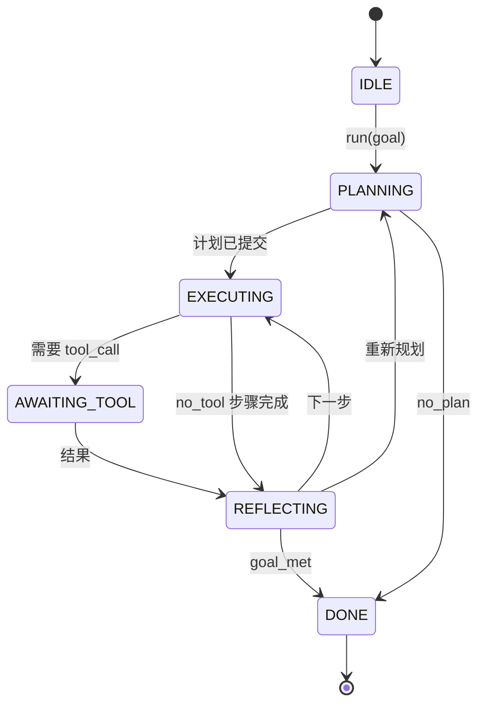

# 智能体运行框架循环契约（Agent Harness Loop Contract）

> 运行框架（Harness）就是智能体，模型是协处理器（Coprocessor）。本课固定循环契约，让你能接入任何模型。

**Type:** Build
**Languages:** Python
**Prerequisites:** 阶段 13 第 01–07 课，阶段 14 第 01 课
**Time:** 约 90 分钟

## 学习目标（Learning Objectives）
- 将智能体框架循环规定为具有显式转换的确定性状态机（Deterministic State Machine）。
- 实现十个生命周期钩子（Lifecycle Hook）主题，供操作人员接入策略、遥测和防护机制。
- 定义两个拉取点（Pull Point），循环在此将控制权交还调用者，并凭新输入恢复。
- 强制执行逐会话预算（轮次、工具调用、实际运行时间），超限时不泄露部分状态。
- 输出包含十一种事件类型的类型化流，让下游界面和追踪器无需直接检查循环即可订阅。

```figure
cf-loop-contract
```

## 框架视角（The Frame）

无人值守运行四十轮的编码智能体不是聊天循环，而是状态机：操作人员可以拦截其节点、审计其边。契约一旦写清，更换模型、工具或策略就不再需要重构，只需一次注册调用。

本课构建这一契约，命名六个状态、十个钩子主题、两个拉取点、十一种事件类型及预算边界（Budget Envelope）。框架的其他部分，如工具注册表、JSON-RPC 传输、分发器、规划器，都接入这一结构。

## 状态（The States）

循环有六个状态：五个活动状态，一个终止状态。



`IDLE` 是唯一合法入口，`DONE` 是唯一合法出口，`AWAITING_TOOL` 是唯一交出拉取点的状态。其他转换都在内部完成。

状态机具有确定性。给定相同事件日志，框架会重新进入相同状态。这让你可以重放会话调试，而不必再次调用模型。

## 钩子主题（The Hook Topics）

钩子是操作人员介入循环的接口。框架触发十个主题，每个主题接受任意数量订阅者，并按注册顺序调用。订阅者可以修改载荷、抛出异常中止本轮，或返回哨兵值（Sentinel）跳过下一步。

```text
before_plan         after_plan
before_tool_call    after_tool_call
before_step         after_step
on_error
on_pause
on_budget_exceeded
on_complete
```

这种结构对应 Claude Code、Cursor 和 OpenCode 截至 2025 年中共同采用的形态。名称按功能命名，不带品牌。阻止 `rm -rf` 的钩子放在 `before_tool_call`，发送 OpenTelemetry 跟踪区段的钩子放在 `after_step`，恢复已暂停会话的钩子放在 `on_pause`。

## 拉取点（The Pull Points）

循环有两处交出控制权：第一处是 `AWAITING_TOOL`，没有工具结果就无法前进；第二处是 `on_pause`，预算耗尽或钩子明确要求人工评审时触发。

拉取点不是异常，而是返回。调用者检查框架状态，获取框架请求的内容，再调用 `resume(payload)`，框架从停止处继续。这与 Python 生成器（Generator）的形态相同。跨拉取点的传输由你选择：终端用户界面（TUI）中是按键，MCP 上是 `tools/call`，队列上是作业轮询。

## 事件流（The Event Stream）

循环在契约规定的位置向类型化流追加事件。流仅追加（Append-Only），订阅者可以从任意偏移量重放。已实现的十一种事件类型是：

- `session.start`：调用 `run(goal)` 时输出一次
- `plan.draft`：规划器返回计划草稿时输出
- `plan.commit`：草稿提交为活动计划后输出
- `step.start`：每个执行步骤开始时输出
- `step.end`：每个执行步骤结束时输出
- `tool.call`：需要工具的步骤向调用者交出控制权时输出
- `tool.result`：携工具结果恢复时输出
- `tool.error`：携错误恢复，或钩子中止调用时输出
- `budget.warn`：达到预算限制时输出
- `session.pause`：循环因预算或钩子暂停而让出时输出
- `session.complete`：循环到达 `DONE` 时输出一次

事件不重复钩子载荷。钩子是命令式（Imperative）的，负责修改或中止；事件是观察式（Observational）的，负责记录或发送。应将两者视为正交职责。

## 预算边界（The Budget Envelope）

会话携带三项限制：轮次数、工具调用数、实际运行秒数。每轮将轮次数加一，每次工具调用将调用数加一。每次状态转换都检查实际运行时间。任何限制达到时，循环触发 `on_budget_exceeded`，输出 `budget.warn`，然后在下一个拉取点转为 `IDLE`，附预算超限原因。

预算不是紧急停止开关（Kill Switch），而是让出（Yield）。调用者决定延长预算并恢复，还是关闭会话。

## 本课不做什么（What This Lesson Does Not Do）

本课不调用模型、不注册真实工具、不实现传输，这些是后四课的内容。本课先固定契约，让后四课无需重写便能接入。

`main.py` 中的确定性规划器是替身，返回硬编码三步计划，其中两步需要工具结果。重点是循环，不是计划。

## 如何阅读代码（How to Read the Code）

`HarnessLoop` 是主类，保存状态、触发钩子、输出事件。`Budget` 追踪限制，`Event` 是流上的类型化封装，`HookRegistry` 是分发表。`_transition` 是唯一改变状态的函数，所以状态机不变量（Invariant）集中于一处。

从头到尾阅读 `main.py`，再读 `code/tests/test_loop.py`。测试固定每次转换与每个钩子的触发顺序。

## 进一步探索（Going Further）

生产框架最难的不是状态机，而是让契约可强制执行。它必须承受规划器热重载（Hot Reload）、工具返回格式错误 JSON，以及四十轮会话进行到三分之二时钩子在 `before_tool_call` 抛出异常。本课测试演练这些失败模式。运行、破坏这些测试，并增加案例。

下一课增加工具注册表，之后是 JSON-RPC 传输，再之后是分发器。到第二十四课，本文件循环将对真实工具运行真实计划，并强制执行真实预算。
