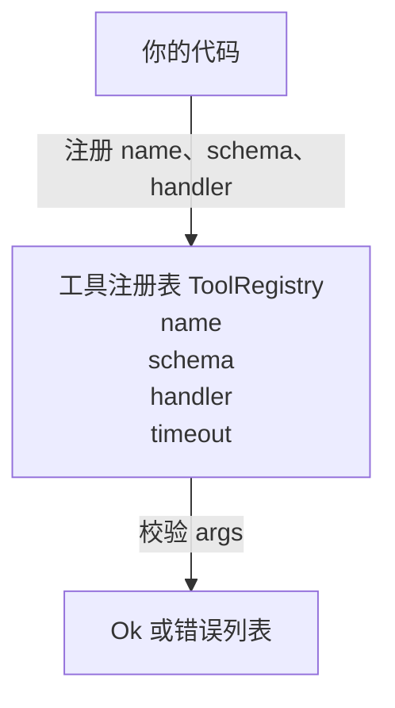

# 带模式校验的工具注册表（Tool Registry with Schema Validation）

> 智能体无法校验的工具，就不应调用。先构建注册表和模式校验器，再构建工具。

**Type:** Build
**Languages:** Python
**Prerequisites:** 第 13 阶段第 01–07 课、第 14 阶段第 01 课
**Time:** 约 90 分钟

## 学习目标（Learning Objectives）
- 维护工具名称 → 模式 → 处理函数的类型化注册表（Typed Registry），让分派器查询一次后即可信赖。
- 实现 JSON Schema 2020-12 的一个子集，覆盖九成工具调用实际使用的关键字。
- 返回精确的 JSON 指针（JSON Pointer）错误路径，让模型通过一次往返自行修正。
- 未显式覆盖时拒绝重复注册，因为静默覆盖会造成生产工具目录漂移。
- 保持校验器为纯函数（Pure Function）：无输入输出、时间依赖或全局状态，便于在重放日志上重新运行。

```figure
cf-registry-validate
```

## 为什么先构建注册表（Why the registry comes before the tool）

2026 年的编码智能体（Coding Agent）注册的工具数量，已经超过模型单个上下文窗口（Context Window）的容纳能力。一个有一定规模的运行框架（Harness）会注册两百个工具，每轮暴露十到四十个。注册表是以下问题的事实来源：“有哪些工具”“参数是什么结构”“应该调用哪个处理函数”。这三个答案一旦确定，框架的其他部分就不必猜测。

我们要避免的是：交付没有模式（Schema）的处理函数，或交付模式却不做校验。两者都很常见，也都会让下一层，即第 23 课的分派器（Dispatcher），只能猜测，最终仅靠处理函数抛出的堆栈跟踪得知失败。

## 工具记录的结构（What a tool record looks like）

```text
ToolRecord
  name        : str          （唯一；小写字母、数字、下划线组成的片段以点分隔，例如 snake_case.segment.case）
  description : str          （单行，展示给模型）
  schema      : dict         （JSON Schema 2020-12 子集）
  handler     : Callable     （异步或同步，返回 Any）
  idempotent  : bool         （分派器据此决定是否重试）
  timeout_ms  : int          （覆盖分派器针对单个工具的默认超时）
```

模式是校验器唯一接触的字段，处理函数对它是不透明的。我们刻意将两者分离：模式是数据，处理函数是代码。混在一起容易诱使你把校验逻辑放入处理函数，而这正是我们要阻止的错误。

## JSON Schema 2020-12 子集（The JSON Schema 2020-12 subset）

完整的 2020-12 规范篇幅很长。我们只需要八个关键字。

```text
type           string / number / integer / boolean / object / array / null
properties     属性名 -> 模式的映射
required       属性名称列表
enum           允许的原始类型值列表
minLength      整数，适用于字符串
maxLength      整数，适用于字符串
pattern        兼容 ECMA-262 的正则表达式，适用于字符串
items          应用于每个数组元素的模式
```

这些足以覆盖工具应用程序接口（Application Programming Interface，API）的实际需求。我们不加入的关键字（oneOf、anyOf、allOf、$ref、条件关键字）在生产模式中完全有效，但会使校验器变成需要处理环的树遍历器。我们要构建的是注册表，不是 JSON Schema 引擎。

## JSON 指针错误路径（Json pointer error paths）

校验失败时，校验器返回错误列表。每个错误都带有指向输入的 JSON 指针路径：以斜杠开头，由属性名称和数组索引构成。

```text
{"a": {"b": [1, 2, "x"]}}
                    ^
                    /a/b/2
```

模型理解错误路径比理解句子更容易。如果模式要求 `args.user.email`，而模型传入整数，错误就应包含 `/user/email` 和 `expected_type: string`。模型能在下一次调用中修复，无需额外一轮自然语言交流。

## 注册与覆盖（Registration and override）

`register(name, schema, handler, **opts)` 默认拒绝重复注册；调用者必须传入 `override=True` 才能替换。这是基本的运维规范。代码库中两处代码静默注册同名工具，正是那种上线后可能要查一周的错误。

注册表提供三个读取方法：`get(name)` 返回记录，否则抛出异常；`validate(name, args)` 返回 `Ok` 或错误列表；`names()` 按注册顺序返回工具名称。

## 校验器的职责与边界（What the validator is and is not）

它以递归方式单次遍历模式树，是纯函数，不调用处理函数，不做类型强制转换（字符串 `"42"` 无法通过数值模式），也不会静默截断。

它不是安全边界（Security Boundary）。即使校验通过，恶意处理函数仍可能违规。第 23 课的分派器会加入超时和沙箱（Sandbox）层，注册表仅检查数据结构。

## 结构（Shape）



## 代码阅读指南（How to read the code）

`code/main.py` 定义 `ToolRegistry`、`ToolRecord`、`ValidationError` 和八个校验函数。校验器按 `schema["type"]` 分派（带 `enum` 的模式也可以作为无类型枚举检查）。各类型校验器返回空列表或 `ValidationError` 列表。顶层遍历器汇总错误，并在递归深入时为路径添加片段前缀。

`code/tests/test_registry.py` 覆盖注册、覆盖、校验成功、携带路径的校验失败，以及子集中的每个关键字。

## 进一步探索（Going further）

完成本课后，你可能需要两项扩展：针对本地定义块解析 `$ref`，以及通过 `additionalProperties: false` 严格约束结构。两者都不大，工具目录超过五十个工具后也常会加入。为了让文件能一次读完，本课暂不实现。

下一课（第 22 课）构建 JSON-RPC 标准输入输出（Standard Input/Output，stdio）传输层，将注册表暴露给模型客户端。再下一课（第 23 课）通过具备超时和重试能力的分派器将两者封装起来。
