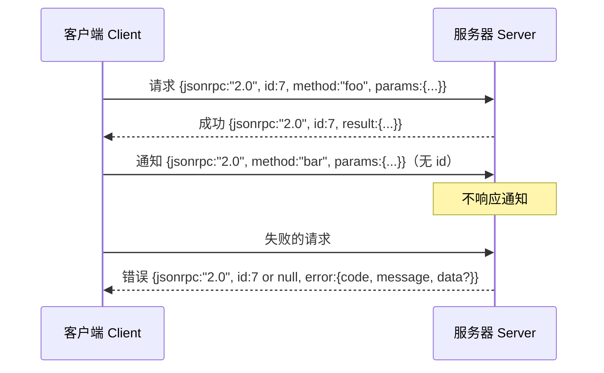

# 通过换行分隔的标准输入输出传输 JSON-RPC 2.0（JSON-RPC 2.0 Over Newline-Delimited Stdio）

> 模型客户端与工具服务器之间通过标准输入输出（Standard Input/Output，stdio）传输 JSON-RPC。亲手实现一次，就能理解每一层分帧机制的代价。

**Type:** Build
**Languages:** Python
**Prerequisites:** 第 13 阶段第 01–07 课、第 14 阶段第 01 课
**Time:** 约 90 分钟

## 学习目标（Learning Objectives）
- 在标准输入与标准输出上，使用换行分隔 JSON 为 JSON-RPC 2.0 分帧。
- 映射五个标准错误码（-32700、-32600、-32601、-32602、-32603），并按正确语义对外报告。
- 区分请求（Request）、响应（Response）、通知（Notification）和批处理（Batch），不发明新的信封字段。
- 每行独立处理解析错误，不影响流中其余内容。
- 使用 io.BytesIO 构建自行结束的演示，无需启动子进程。

```figure
cf-jsonrpc-frames
```

## 为什么 JSON-RPC 仍是通用协议（Why JSON-RPC stays the lingua franca）

2026 年的编码智能体（Coding Agent）一次会话可能连接十二个工具服务器，每个都是独立进程或远程端点。传输格式自 2013 年以来一直未变。JSON-RPC 2.0 的规范只有两页。它能延续至今，是因为替代方案（gRPC、每次调用使用 HTTP、自定义二进制协议）都要求作出 JSON-RPC 不必作出的取舍：它们会选择流式传输、批处理或与传输方式耦合。JSON-RPC 在 stdio、套接字（Socket）、WebSocket 和 HTTP 上保持对称；只要双方遵守规范，客户端就能驱动此前从未接触过的服务器。

本课构建 stdio 版本，使用换行分隔 JSON。每个请求一行，每个响应一行，传输边界是 `\n`。

## 传输结构（The wire shape）

共有四种信封（Envelope）结构：客户端发送两种，服务器发送两种。



通知没有 `id`，服务器不得响应。若服务器对通知返回响应，客户端就无法把它关联到调用位置。这一条规则让分帧逻辑保持简单。

批处理是由请求或通知组成的 JSON 数组。服务器以响应数组回复，顺序任意，每个非通知项对应一个响应。若批次中的所有项都是通知，服务器不发送任何内容。

## 五个错误码（The five error codes）

```text
-32700  解析错误（Parse error）      无法解析 JSON
-32600  无效请求（Invalid Request） 信封结构错误
-32601  未找到方法（Method not found）
-32602  无效参数（Invalid params）
-32603  内部错误（Internal error）
```

-32000 到 -32099 的错误码保留给服务器定义的错误，其余由应用定义。本课只使用上述五个。若处理函数抛出异常，传输层将其封装为 -32603，并在 `data.exception` 中放入异常类名。

解析错误有一条特殊规则：响应中的 `id` 为 `null`，因为请求解析未能进行到提取标识符的步骤。

## 换行分帧与 BytesIO 演示（Newline framing and the BytesIO demo）

传输层一次读取一行，即直到并包含 `\n` 的字节序列。如果某行无法解析，就写出 `id: null` 的 -32700 响应并继续。流不会因此失效，下一行会重新独立解析。

本课将一对 `io.BytesIO` 包装为标准输入与标准输出。服务器读取请求直到文件结束（End of File，EOF），逐个写出响应后返回，客户端再读回响应。不启动进程，也无需超时。由于 Python 的 `io` 接口提供相同的 `.readline()` 与 `.write()` 契约，其传输行为与真实子进程管道一致。

## 方法分派（Method dispatch）

传输层不知道有哪些方法，而是交给运行框架（Harness）提供的可调用对象 `handler(method, params)`。处理函数返回结果或抛出异常。三类异常情形对应特定错误码。

```text
MethodNotFound -> -32601
InvalidParams  -> -32602
其他异常       -> -32603，并在 data 中包含异常名称
```

传输层从不接触工具注册表（Tool Registry），注册表位于处理函数之后。这正是所需的分层：传输层负责 JSON-RPC，注册表负责工具结构，分派器（Dispatcher，第 23 课）将两者连接起来。

## 出错时的流行为（Stream behavior on errors）

```text
客户端写入                 服务器读取               服务器写入
---------------            -----------              -------------
{...有效请求...}            解析成功                 {...响应，id 匹配...}
{...损坏的 json...          解析失败                 {id:null, error: -32700}
{...有效请求...}            解析成功                 {...响应，id 匹配...}
{...缺少 method...}         信封无效                 {id:X, error: -32600}
```

损坏的 JSON 行、缺失的 `method` 字段和处理函数异常都不会终止循环。传输层持续读取，直到 EOF。

## 通知与非对称流程（Notifications and asymmetric flows）

通知采用发送后不等待回复（Fire-and-Forget）的方式。框架用它传递进度事件、取消信号和日志行。长时间运行的工具通过通知流式发送状态更新，无需每条更新都往返确认。

本课实现一个出站通知辅助函数 `write_notification`。服务器在请求处理中用它发送进度。演示展示了这一模式：收到请求后，处理函数发送两条进度通知，再写出最终响应。

## 代码阅读指南（How to read the code）

`code/main.py` 定义 `StdioTransport`、解析辅助函数（`parse_request`）、三个写入辅助函数（`write_response`、`write_error`、`write_notification`）以及分派循环 `serve`。错误码常量位于模块作用域。

`code/tests/test_transport.py` 覆盖五个错误码、通知（不写响应）、批处理（数组输入和输出，跳过通知）、损坏的 JSON（报告解析错误后继续），以及处理函数在调用中途写入通知的非对称流程。

## 进一步探索（Going further）

这一传输层已足够支持后续课程。生产传输层还会增加三项能力：转发后仍保留的关联标识（Correlation ID；`id` 已有此作用，但网格中还需要外层追踪标识）；取消通道（例如携带处理中调用标识的 `$/cancelRequest` 通知）；内容类型协商握手，使同一套接字可以支持 JSON-RPC 和可流式 HTTP（Streamable HTTP）。这些都不会改变传输格式，只会增加元数据。
