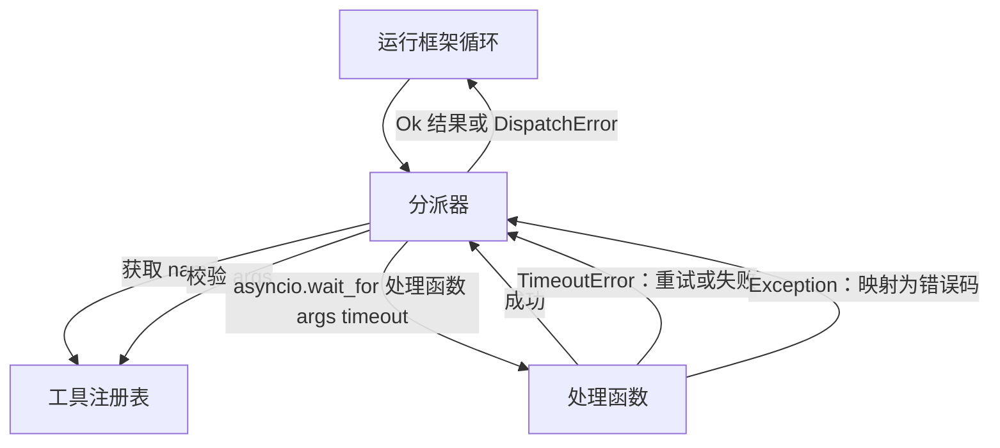
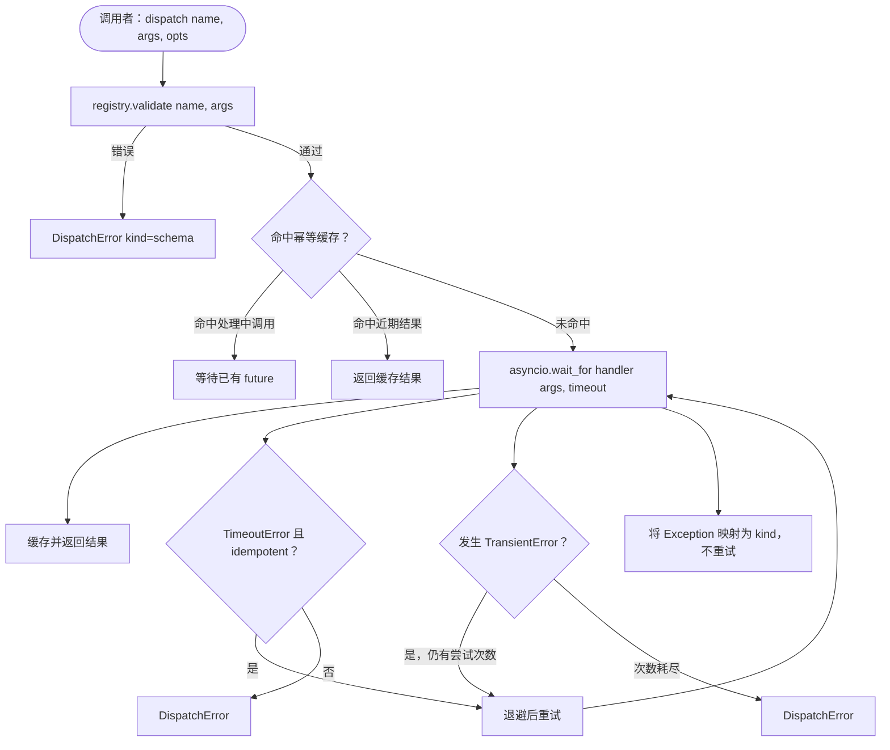

# 函数调用分派器（Function Call Dispatcher）

> 分派器（Dispatcher）负责兑现模式作出的每一项承诺：超时、重试、去重、错误映射，统一在这一层处理。

**Type:** Build
**Languages:** Python
**Prerequisites:** 第 13 阶段第 01–07 课、第 14 阶段第 01 课
**Time:** 约 90 分钟

## 学习目标（Learning Objectives）
- 为工具处理函数添加逐调用超时，返回类型化错误，而不是挂起循环。
- 实现带抖动（Jitter）和最大尝试次数的指数退避（Exponential Backoff）重试。
- 使用幂等键（Idempotency Key）去重，防止重试与缓慢的原调用竞争而执行两次。
- 将处理函数异常和传输故障映射到运行框架循环已理解的统一错误信封（Error Envelope）。
- 用并发上限约束并行分派，防止四十个工具调用的扇出（Fan-Out）耗尽事件循环资源。

```figure
cf-dispatch-retry
```

## 分派器所在的位置（Where the dispatcher sits）

它位于运行框架循环（Harness Loop，第 20 课）与工具注册表（Tool Registry，第 21 课）之间。传输层（第 22 课）向循环提供输入，循环将工具调用交给分派器。分派器查询注册表、运行处理函数，然后返回结果或 JSON-RPC 结构的错误信封。



只有分派器知道计时器、重试与幂等性（Idempotency）；循环、注册表和处理函数都不知道。这种隔离就是设计目的。

## 超时（Timeouts）

每个工具都有默认超时，由注册表记录中的 `timeout_ms` 携带。如果框架为某次调用传入覆盖值，分派器就采用该值。我们使用 `asyncio.wait_for`。超时时，处理函数任务被取消，分派器返回 `DispatchError(kind="timeout")`。

对于非幂等工具，超时默认不是可重试错误。超时的 `db.write` 可能已经提交，也可能没有；重试可能重复写入。分派器遵循注册表记录中的 `idempotent` 标志：幂等工具重试，非幂等工具不重试。

## 指数退避重试（Retries with exponential backoff）

重试策略最多尝试三次，退避按指数增长并带有抖动。

```text
第 1 次尝试 -> 延迟 0
第 2 次尝试 -> 延迟 0.1s * (1 + random[0..0.5])
第 3 次尝试 -> 延迟 0.4s * (1 + random[0..0.5])
```

只有 `timeout` 和 `transient` 错误会重试。`schema`、`not_found` 或 `internal` 错误不重试。模式错误是确定性的，重试不会改变结果，只会消耗预算。

重试循环遵循框架传入的预算。如果调用者的剩余工具调用次数为零，分派器在第一次尝试时快速失败，返回 `kind="budget_exceeded"`。

## 幂等键去重（Idempotency key dedupe）

原调用尚未完成时触发重试，是实际存在的生产问题。第一次调用在 4.9 秒时挂起，恰好未到超时；重试在 5 秒触发，此时两个请求竞争同一后端。如果工具是 `payments.charge`，就会收费两次。

分派器接受可选的 `idempotency_key`。若调用到达时同键调用仍在处理中，分派器等待已有的未来对象（Future）并返回其结果。完成后缓存继续保留键六十秒，以吸收迟到的重试。

键由调用者负责。框架根据规划器生成：`f"{step_id}:{tool_name}:{hash(args)}"`。分派器不自行生成键，因为仅凭参数生成键，会让两个语义不同的调用看起来相同。

## 错误信封（Error envelope）

分派失败统一返回以下结构。

```text
DispatchError
  kind        : "timeout" | "transient" | "schema" | "not_found" | "internal" | "budget_exceeded"
  message     : str
  attempts    : int
  jsonrpc_code: int   （-32601、-32602、-32603 之一）
```

框架循环将 `kind` 映射到下一状态。`schema` 与 `not_found` 进入 `on_error` 并触发重新规划；`timeout` 与 `transient` 进入 `on_error`，是否重新规划取决于尝试次数；`budget_exceeded` 触发 `on_budget_exceeded`。

## 扇出的并发上限（Concurrency limit on fan-out）

`gather(*calls)` 同时运行所有协程。四十个工具调用就意味着四十个打开的套接字，或四十条子进程管道。多数后端不希望一个客户端同时建立四十条连接。

分派器通过信号量（Semaphore）约束 `gather`，默认并发上限为八。每次调用分派前获取信号量，完成后释放。调用者看到的输出结构与 `gather` 一致，但实际调度有上限。

## 单次调用流程（Flow for one call）



## 代码阅读指南（How to read the code）

`code/main.py` 定义 `Dispatcher`、`DispatchError` 和 `TransientError`。构造分派器时传入注册表，异步 `dispatch(name, args, ...)` 是唯一入口。`_run_with_retries` 内直接使用 `asyncio.wait_for` 为每次尝试设置超时。`gather_bounded(calls)` 按并发上限运行多个分派调用。

`code/tests/test_dispatcher.py` 覆盖超时触发、瞬时错误重试、模式错误不重试、幂等去重（同键的两个并发调用合并为一次处理函数执行），以及并发限制（信号量的实际作用）。

测试使用 `asyncio.sleep(0)` 和基于 `Counter` 的确定性处理函数，因此可在毫秒内结束，不依赖真实时钟计时。

## 进一步探索（Going further）

生产分派器通常增加两项能力。第一，在每次状态转换时记录结构化日志（Structured Logging）：循环的事件流已有这类信息，但分派器还应发送 `dispatch.attempt` 和 `dispatch.retry` 事件。第二，熔断器（Circuit Breaker）：时间窗口内失败 N 次后，工具进入冷却期，分派直接返回 `kind="circuit_open"`，不再尝试处理函数。两者都可在不改变契约的前提下叠加到当前分派器上。

第 24 课将分派器接入规划与执行（Plan-and-Execute）智能体，让你看到四个组件协同运转。
