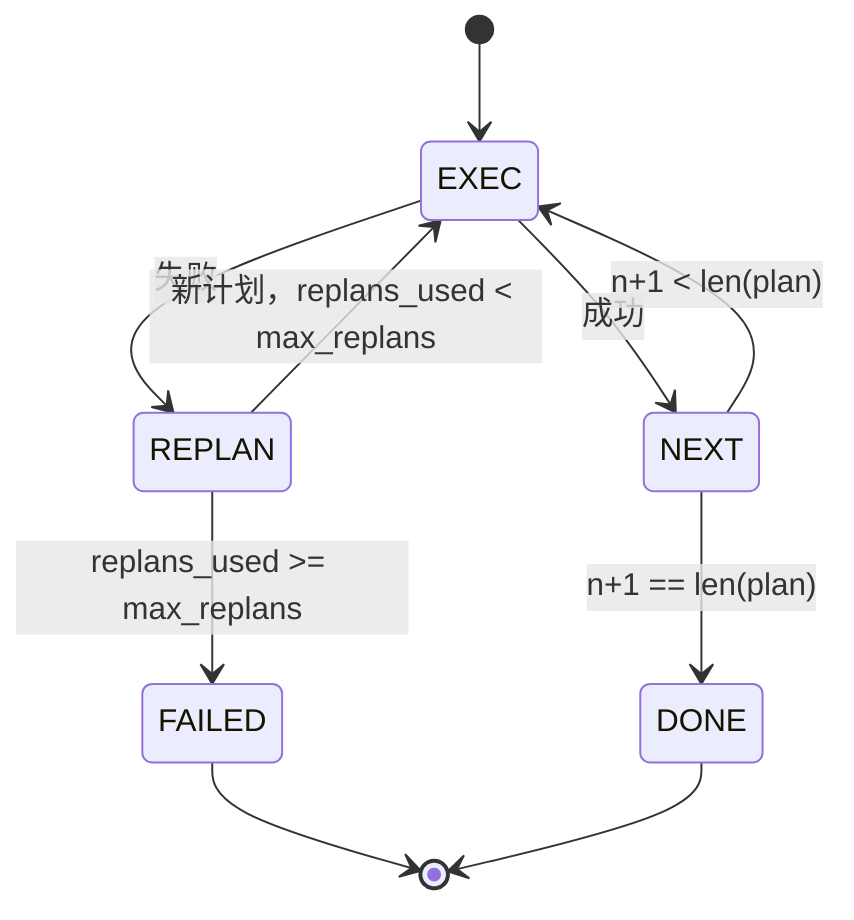

# 规划与执行控制流（Plan-Execute Control Flow）

> 无法应对失败的计划只是脚本。能够重新规划的脚本才是智能体。先构建重新规划器。

**Type:** Build
**Languages:** Python
**Prerequisites:** 第 13 阶段第 01–07 课、第 14 阶段第 01 课
**Time:** 约 90 分钟

## 学习目标（Learning Objectives）
- 将计划表示为类型化步骤的有序列表，让执行器能判断进度和结果。
- 按顺序执行步骤，并在失败时受控地将处理权交回规划器。
- 从当前游标（Cursor）重新规划，将上次错误放入上下文，使下一版计划有据可依。
- 每次修订都发出计划差异（Plan Diff），让下游追踪器或用户界面展示计划为何改变。
- 强制执行两项硬预算：步骤上限和重新规划次数上限。

```figure
cg-plan-replan
```

## 规划与执行，而非思维链（Plan and execute, not chain-of-thought）

思维链（Chain-of-Thought）智能体输出词元（Token），让循环猜测工具调用在哪里结束。规划与执行（Plan-and-Execute）智能体先输出结构化计划，再确定性地执行每一步。计划是运行框架（Harness）可以检查的数据；执行则是框架将这些数据交给分派器处理。

系统由两部分组成：生成计划的规划器（Planner），以及运行计划的执行器（Executor）。关键在于执行器遇到失败时如何处理，共有三种选择：

```text
1. 中止（Abort）   （返回失败，报告错误）
2. 跳过（Skip）    （将步骤标记为失败，继续执行其余步骤）
3. 重新规划（Replan）（将错误交给规划器，从游标位置获取新计划）
```

重新规划让脚本成为智能体。

## Step 结构（The Step shape）

```text
Step
  id              : int           （在同一计划修订版内单调递增）
  tool_name       : str
  args            : dict
  expected_outcome: str           （规划器声明的成功条件）
  result          : Any | None
  error           : str | None
```

`expected_outcome` 是规划器随步骤输出的一句简短描述，执行器并不强制检查。它有两个用途：重新规划器修订计划时读取它；事件流发送它，让追踪器展示“这一步原本应完成 X”。

## 规划器结构（The planner shape）

```python
def planner(goal: str, history: list[Step], last_error: str | None) -> list[Step]:
    ...
```

这是一个纯函数（Pure Function）。`goal` 是用户目标；`history` 是已经执行的步骤，填有结果和错误；`last_error` 首次调用时为 None，后续每次调用时为最近的失败消息。规划器返回从当前游标开始的下一份计划。

规划器不知道执行器、重试或超时。它只负责生成计划。

## 执行器（The executor）

执行器是一个小型状态机（State Machine）。每个步骤通过分派器运行，结果分为三种：成功、可重新规划的失败、致命失败。可重新规划的失败会交回规划器；致命失败（预算耗尽、达到重新规划上限）返回 `FAILED` 会话结果。



## 修订时的计划差异（Plan diffs on revision）

失败后，规划器返回新计划，执行器便发出包含三个字段的 `plan.diff` 事件。

```text
removed: 旧计划中存在、新计划中不存在的步骤标识列表
added  : 新计划中存在、旧计划中不存在的步骤标识列表
revised: tool_name 或 args 已改变的步骤标识列表
```

追踪器或用户界面可以给删除的步骤加删除线，高亮新增步骤。重点不在差异格式，而在于修订是可见事件，不是静默改写。

## 两项硬预算（Two budgets, both hard）

`max_steps` 限制整个会话中的总步骤执行次数，包括重新规划后的执行，默认十二次。一个线性五步计划重新规划两次，每次增加三步，会达到十六次执行并超出预算。执行器会拒绝重新规划并返回 FAILED。

`max_replans` 限制首次计划之后调用规划器的次数，默认五次。这是更重要的限制。若规划器连续五次返回同一份有问题的计划，没有此限制就会一直循环，直到触及步骤预算。限制重新规划次数，能更快失败，也让原因更明确。

## 本课的确定性规划器（The deterministic planner in this lesson）

本课不调用模型，而是提供一个根据 `last_error` 选择计划的确定性规划器（Deterministic Planner）。

```text
last_error is None    -> 输出四步计划
last_error 匹配 X     -> 输出绕过 X 的三步计划
last_error 匹配 Y     -> 输出有序放弃的两步计划
其他情况              -> 返回 []（表示无可重新规划的内容）
```

这足以测试执行器的每条转换路径：成功、重新规划一次、重新规划两次、重新规划预算耗尽和步骤预算耗尽。

## 结果结构（Result shape）

```text
SessionResult
  status      : "completed" | "failed"
  reason      : str     ("goal_met" | "step_budget" | "replan_budget" | "no_plan")
  history     : list[Step]
  revisions   : list[PlanDiff]
  events      : list[Event]
```

第 20 课的框架循环可以直接读取此结果。第 23 课的分派器执行每个步骤，第 21 课的注册表校验各步骤参数，第 22 课的传输层则可以通过 JSON-RPC 将整个流程暴露给模型客户端。

## 代码阅读指南（How to read the code）

`code/main.py` 定义 `PlanExecuteAgent`、`Step`、`PlanDiff`、`SessionResult` 及确定性规划器。执行器是单个 `run(goal)` 方法，返回 `SessionResult`。计划差异通过比较步骤标识和 `(tool_name, args)` 元组计算。

`code/tests/test_agent.py` 覆盖线性成功、计划中途失败后重新规划一次、重新规划预算耗尽并返回 `failed:replan_budget`、步骤预算耗尽，以及计划差异事件格式。

## 进一步探索（Going further）

接入真实模型后，你可能需要两项扩展。第一，部分计划缓存（Partial-Plan Caching）：六步计划的前三步成功后才失败时，不应重新执行前三步。执行器已经保留历史，规划器只需读取。第二，并行分支（Parallel Branch）：当前执行器严格顺序执行；若规划器输出独立分支（用 `gather_step` 而非 `next_step`），就能通过分派器并发运行两个工具调用。

两项扩展都会增加实际复杂度。在线性执行器的行为确定之后再添加，会更容易。本课正是先完成这项基础。
