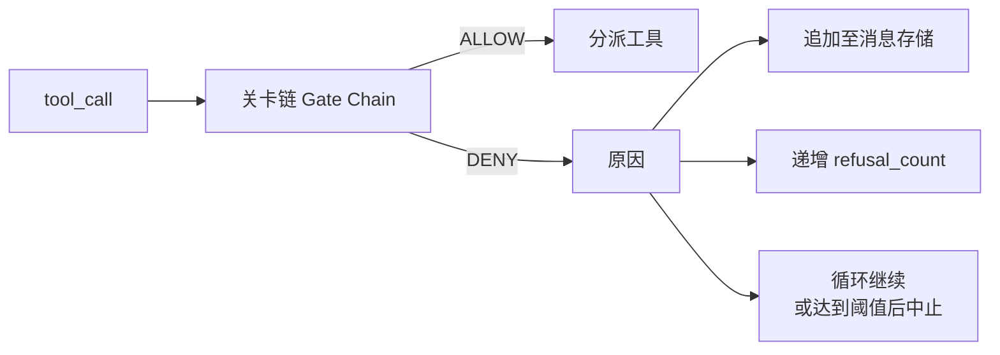
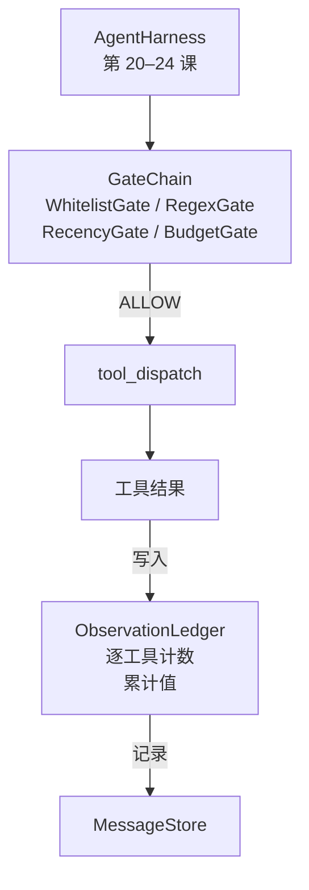

# 综合项目第 25 课：验证关卡与观察预算（Capstone Lesson 25: Verification Gates and the Observation Budget）

> 没有验证层的智能体运行框架（Agent Harness），只是披着工程外衣的愿望。本课构建确定性关卡链（Gate Chain），决定工具调用能否执行、智能体能看到多少输出，以及智能体读取过多内容时何时停止循环。关卡链由具名的小型关卡组成，并配有观察账本（Observation Ledger），跟踪展示给模型的每个词元（Token）。

**Type:** Build
**Languages:** Python (stdlib)
**Prerequisites:** 第 19 阶段第 20–24 课（路线 A1：智能体循环、工具注册表、消息存储、提示词构建器、模型路由器），第 14 阶段第 33 课（指令作为约束）、第 36 课（范围契约）、第 38 课（验证关卡）
**Time:** 约 90 分钟

## 学习目标（Learning Objectives）

- 构建 `VerificationGate` 协议，提供确定性的 `evaluate(call)` 方法。
- 将预算、时效性、白名单和正则表达式关卡组合成具有短路语义（Short-Circuit Semantics）的链。
- 使用按工具与轮次索引的 `ObservationLedger` 跟踪每次观察。
- 累计观察预算将被超出时，拒绝工具调用。
- 输出下游可观测性（Observability）系统可摄取的结构化 `GateDecision` 记录。

## 问题（The Problem）

当运行框架允许模型自由调用工具时，实际使用的第一个小时内就会出现三类问题。

第一类是无界观察（Unbounded Observation）。对二十万行仓库执行一次 grep，把五十万词元的输出塞进下一轮。模型每读取一千字节才能看到一个匹配，其余上下文都被浪费。词元费用很高，智能体处理任务的能力反而下降。

第二类是时效性失效（Stale Recency）。长任务积累了五十次工具调用，模型却把第三轮首次 read_file 的结果当作实时状态重读。第四十七轮的修改始终没有出现，因为提示词构建器优先序列化了最早的观察。

第三类是权限蔓延（Privilege Creep）。研究任务从调用 `web_search` 开始，却莫名执行起 `shell`：模型编造工具名，而框架默认放行。等有人查看追踪记录时，/tmp 中已经出现垃圾文件，curl 也已访问私有 API。

验证关卡（Verification Gate）是框架中负责拒绝的组件。它不是模型，也不是裁判，而是关于 `(call, history, ledger)` 的确定性函数，返回 ALLOW 或 DENY 及原因。原因会写入日志并告知模型，随后循环继续或中止。

## 概念（The Concept）



任何具有 `evaluate(call, ctx) -> GateDecision` 方法的组件都可以作为关卡。关卡链是有序列表，遇到首次拒绝便短路。顺序很重要：低成本的结构关卡应先于高成本的词元计数关卡运行。

本课提供四个关卡：

- `WhitelistGate`。允许的工具名是显式集合，集合外一律拒绝。这是成本最低的关卡，最先运行。
- `RegexGate`。用正则表达式（Regular Expression）匹配工具参数，可用于拒绝含 `rm -rf` 的 shell 调用，或访问内部 IP 的 HTTP 调用。它只依赖调用载荷，是纯函数。
- `RecencyGate`。模型只看到最近 N 轮的观察，更早的观察被屏蔽。若某次调用的结果会延伸已经过期的观察窗口，关卡就拒绝该调用。
- `BudgetGate`。模型在整个会话中累计读取的词元数有上限。账本显示达到上限后，所有后续工具调用都被拒绝。

观察账本负责记账。每次成功的工具调用写入一行：工具名、轮次、输出词元数、累计值。账本回答两个问题：模型总共看了多少内容，以及看了多少工具 X 的内容。预算关卡读取前者；作为练习编写的逐工具预算关卡读取后者。

```figure
cg-gate-chain
```

## 架构（Architecture）



框架询问关卡链，关卡链放行或拒绝。放行后工具运行、账本计数、结果追加到消息存储；拒绝时，拒绝信息作为系统消息交给模型，再由循环决定重试还是中止。

## 构建内容（What you will build）

实现包含一个 `main.py` 及测试。

1. `Observation` 与 `ToolCall` 数据类（Dataclass）定义传输结构。
2. `ObservationLedger` 记录 `(turn, tool, tokens)` 行，支持 `cumulative()` 与 `per_tool(name)` 查询。
3. `GateDecision` 携带 `(allow, reason, gate_name)`。
4. `VerificationGate` 是协议，各关卡实现 `evaluate(call, ctx)`。
5. `GateChain` 封装有序列表，依次调用关卡并返回首次拒绝；全部通过才返回允许。
6. 演示运行一个三轮的小型合成智能体循环。第三轮触发预算关卡，循环报告明确的拒绝，且拒绝计数非零。

词元计数器刻意采用简单的 `len(text) // 4` 启发式估算。本课重点是关卡的连接机制，而非分词器（Tokenizer）。生产环境应替换为真实分词器。

## 为什么关卡顺序重要（Why the chain order matters）

拒绝的成本低于放行。`WhitelistGate` 执行 O(1) 哈希查询；`RegexGate` 的成本为 O(pattern * argv)；`RecencyGate` 读取消息存储的一小段；`BudgetGate` 读取整个账本。按成本递增排序，可以在执行高成本工作前让被拒绝的调用短路。

还要按影响范围排序。白名单的约束最强：工具不在契约内；正则关卡其次：参数不在契约内；时效性随后：调用结构合法，但框架仍需关注其时效；预算最后，因为按定义，只有其他关卡都通过后它才会触发。

## 与路线 A 的其他部分组合（How this composes with the rest of Track A）

前几课提供了循环、工具注册表、消息存储、提示词构建器和模型路由器。本课在模型与工具之间增加一层。第 26 课提供沙箱（Sandbox），关卡链返回 ALLOW 后，分派器将工具调用交给沙箱；第 27 课提供评估框架（Evaluation Harness），将拒绝次数记录为质量信号；第 28 课把关卡决策接入 OpenTelemetry 跨度（Span）；第 29 课将所有组件组合为可用的编码智能体。

## 运行（Running it）

```bash
cd phases/19-capstone-projects/25-verification-gates-observation-budget
python3 code/main.py
python3 -m pytest code/tests/ -v
```

演示按轮次打印追踪信息，包含每次关卡决策，并以退出码零结束。测试覆盖账本、各关卡的独立行为、关卡链短路，以及合成循环的端到端流程。
