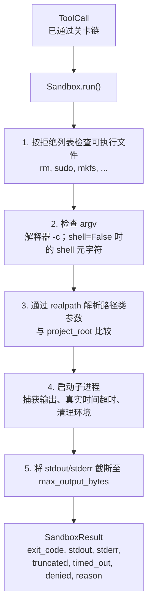
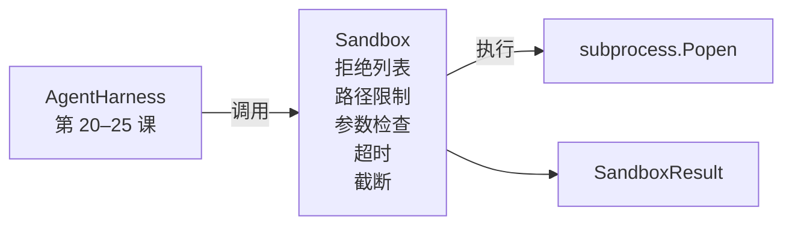

# 综合项目第 26 课：带拒绝列表与路径限制的沙箱运行器（Capstone Lesson 26: Sandbox Runner with Denylist and Path Jail）

> 验证关卡（Verification Gate）决定工具调用是否应运行，沙箱（Sandbox）决定运行时的行为。本课提供一个子进程运行器：拒绝危险可执行文件和危险参数结构，将所有文件路径限制在项目根目录内，截断过大输出，并在真实时间超时后终止失控进程。它是模型与操作系统之间两道防护中的第二道。

**Type:** Build
**Languages:** Python (stdlib)
**Prerequisites:** 第 19 阶段第 25 课（验证关卡与观察预算），第 14 阶段第 33 课（指令作为约束）、第 38 课（验证关卡）
**Time:** 约 90 分钟

## 学习目标（Learning Objectives）

- 构建包装 `subprocess.run` 的 `Sandbox` 类，支持超时、输出捕获和截断。
- 根据拒绝列表（Denylist）检查命令名称，并通过参数检查器（Argv Inspector）检查命令结构。
- 拒绝解析后位于声明的项目根目录之外的任何路径参数。
- 关闭 shell 模式时拒绝 shell 元字符（Metacharacter）。
- 返回结构化 `SandboxResult`，供下游可观测性系统与评估框架使用。

## 问题（The Problem）

能够调用 shell 的编码智能体（Coding Agent），一轮内就可能安装后门、外传密钥、损坏开发者笔记本，并产生高额云费用。成本最低的防御是不提供 shell；其次是用沙箱拒绝一组精确定义的模式。

智能体追踪记录中反复出现三类失败。

第一类是危险可执行文件。急于修复路径问题的模型会尝试 `sudo`、`chmod -R 777`、`rm -rf`、`mkfs`、`dd`。这些都不应出现在智能体运行中。拒绝列表按名称和别名拦截它们。

第二类是参数伎俩。被告知不可使用 shell 的模型，会借解释器传递攻击：`python3 -c "import os; os.system('rm -rf /')"`、`bash -c '...'`、`node -e '...'`、`perl -e '...'`。沙箱必须识别：任何带类似 `-c` 标志的解释器执行，本质上只是绕了一步的 shell 调用。

第三类是路径逃逸（Path Escape）。模型被要求读取 `./src/main.py`，却读取了 `../../etc/passwd`。沙箱通过 `os.path.realpath` 解析每个路径参数，并检查前缀，将路径限制在指定范围内。

此沙箱不是操作系统意义上的安全边界（Security Boundary）。有意攻击且能执行代码的人仍可逃逸。它是开发期防护措施：显式暴露常见失败模式，阻止智能体因能力不足而造成破坏。

## 概念（The Concept）



沙箱从四个维度拒绝调用：名称、参数、路径、结构。每个维度都是只依赖调用的纯函数（Pure Function），此时尚未启动子进程。只有全部检查通过后才创建子进程。

`SandboxResult` 使用惯例退出码：0 表示成功，非零表示失败，另有三种哨兵情形：denied（-100）、timed_out（-101）和 truncated（保留真实退出码，另设标志）。后续课程读取这一结构化结果，而不是解析标准错误输出。

```figure
cg-path-jail
```

## 架构（Architecture）



拒绝列表是可执行文件基本名称的不可变集合（Frozenset）。别名（`/bin/rm`、`/usr/bin/rm`）都归为相同基本名称。参数检查器识别解释器调用结构：argv[0] 为解释器，且后续任一参数以 `-c` 或 `-e` 开头时，拒绝调用。若未显式请求 shell，shell 元字符（`;`、`|`、`&`、`>`、`<`、反引号、`$()`）也会触发拒绝。

路径限制（Path Jail）最需要细心处理。沙箱构造时接收 `project_root`。看起来像路径的参数（包含 `/` 或匹配已有文件）都先经 `os.path.realpath` 规范化，再与项目根目录的真实路径比较。解析目标不在根目录内便拒绝。检查真实路径而非字面路径，可拦截符号链接（Symbolic Link）逃逸：项目内的链接指向项目外。

## 构建内容（What you will build）

实现由 `main.py` 与测试目录组成。

1. `SandboxResult` 数据类：exit_code、stdout、stderr、truncated、timed_out、denied、reason、duration_ms。
2. `SandboxConfig` 数据类：project_root、max_output_bytes、timeout_seconds、denylist、interpreter_block。
3. `Sandbox` 类：`run(argv, *, shell=False, cwd=None)` 返回 `SandboxResult`。
4. 内部拒绝检查辅助函数：`_check_executable_denylist`、`_check_argv_interpreter`、`_check_shell_metachars`、`_check_path_jail`。
5. 输出截断：设置明确的 `truncated` 标志，并在捕获的流中插入标记行。
6. 文件末尾的演示：依次运行合法和对抗性调用，逐个展示结果。

沙箱使用 `subprocess.run`，默认 `shell=False`，并设置 `capture_output=True`。真实时间超时通过 `timeout` 参数实现；发生 `TimeoutExpired` 时，沙箱终止进程组并生成 SandboxResult。

## 为什么这不是真正的沙箱（Why this is not a real sandbox）

本课沙箱不使用命名空间（Namespace）、控制组（Control Group，cgroup）、seccomp、gVisor、Firecracker 或任何内核级隔离。子进程能做的事情，沙箱也能做。防护是结构性的：拒绝智能体最常见的危险调用，并把明确的拒绝记录进可观测性系统，而不是静默执行。

生产智能体需要继续叠加防护：在无特权 Docker 容器或微型虚拟机（MicroVM）中运行、移除能力（Capability）、将项目根目录挂载为只读而临时目录可读写、用 ulimit 限制内存与中央处理器（Central Processing Unit，CPU）、将环境清理为已知安全的白名单。第 29 课会实现其中一部分。操作系统隔离不在本课范围内。

## 运行（Running it）

```bash
cd phases/19-capstone-projects/26-sandbox-runner-denylist
python3 code/main.py
python3 -m pytest code/tests/ -v
```

演示创建临时目录，放入一个无害文件，再运行一组调用。合法调用成功；拒绝的调用返回 `denied=True` 的 SandboxResult 及原因；超时返回 `timed_out=True`；截断设置 `truncated=True`。演示打印 JSON 格式的结果表，以退出码零结束。

## 与路线 A 的其他部分组合（How this composes with the rest of Track A）

第 25 课构建关卡链，第 26 课是关卡返回 ALLOW 后运行的执行器。第 27 课的评估框架将沙箱结果与每个任务的预期退出码比较；第 28 课在每次 `Sandbox.run` 调用外创建 `gen_ai.tool.execution` 跨度（Span）；第 29 课的端到端演示让真实编码智能体经过这两层。
