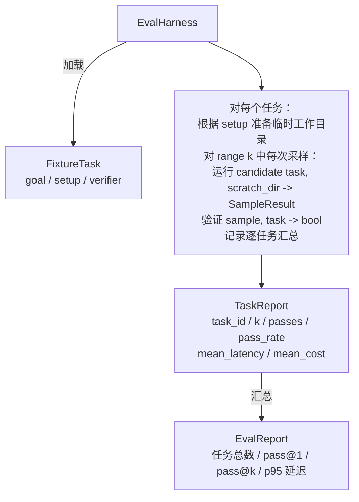

# 综合项目第 27 课：基于任务夹具的评估框架（Capstone Lesson 27: Eval Harness with Fixture Tasks）

> 编码智能体的质量，取决于你用来衡量它的任务套件。本课构建评估框架（Evaluation Harness）：读取一个任务夹具（Fixture Task）目录，将每个任务交给候选智能体运行，以确定性验证器（Deterministic Verifier）判定通过或失败，再汇总为 pass@1、pass@k、平均延迟和平均成本。框架提供事实依据，让你区分回归与重构。

**Type:** Build
**Languages:** Python (stdlib)
**Prerequisites:** 第 19 阶段第 25 课（验证关卡）、第 26 课（沙箱运行器），第 14 阶段第 30 课（评估驱动的智能体开发）、第 19 课（SWE-bench 与 GAIA 基准）
**Time:** 约 90 分钟

## 学习目标（Learning Objectives）

- 将任务夹具定义为目标、准备步骤和验证器组成的三元组。
- 对每个任务的多次采样运行评分，计算 pass@1 和 pass@k。
- 将延迟与成本汇总为均值和第 95 百分位指标。
- 将确定性验证器（文件差异、退出码、正则匹配）封装为可复用函数。
- 输出回归跟踪脚本可读取的结构化 JSON 报告。

## 问题（The Problem）

没有评估框架的智能体基准测试，会受到三类失败模式困扰。

第一类是未经验证的通过。智能体声称已修复错误，人扫一眼差异便把套件标绿，三周后回归测试却发现同一个错误。智能体给出了貌似合理的推理，实际什么也没修好。

第二类是未检测到的回归。提示词模板变化让智能体在受关注的任务上提升 4%，却在不受关注的任务上退步 14%。没有黄金测试集（Goldset）和逐任务分数，回归就会进入 main，直到客户投诉才暴露。

第三类是任务集合漂移。周一评估运行一百个任务，周五只运行其中九十五个，因为有人重命名了五个夹具。通过率看起来提升了 5%，实际并非如此。

框架将这些问题转化为可核实的事实：每次以可复现的顺序运行每个夹具，交给通过确定性检查返回真或假的验证器。

## 概念（The Concept）

```mermaid
flowchart LR
  F1[fixtures/task_001/<br/>task.json + expected/] --> Harness
  F2[fixtures/task_002/<br/>...] --> Harness
  Harness[评估框架 Harness<br/>对每个任务：<br/>准备环境 / 运行智能体采样 k 次 /<br/>验证每次采样 /<br/>记录延迟与成本]
  Harness --> Report[EvalReport<br/>pass@1 / pass@k<br/>平均毫秒数 / p95 毫秒数<br/>平均成本]
```

`FixtureTask` 由一个小型 JSON 文件和可选的 `expected/` 目录组成。JSON 声明 `id`、`goal`（传给智能体的提示词）、`setup` 块（放入临时工作目录的文件）以及 `verifier` 块。验证器块指定框架验证器注册表中的函数名称，并提供参数。

三种验证器结构可以覆盖大多数有价值的任务。

第一种是 `file_equals`：智能体运行后，将指定文件与预期内容比较，适合“按这一确切方式修复此错误”的任务。

第二种是 `regex_match`：将指定文件内容与正则表达式匹配，适合“函数必须存在并返回 X”这类允许多种解法的任务。

第三种是 `shell_exit_zero`：框架通过第 26 课的沙箱运行 shell 命令，只有退出码为零才判定通过，适合“测试必须通过”的任务。

框架将每个任务运行 `k` 次。Pass@k 为 `1 - (1 - p)^k`，其中 p 是经验通过率；框架也报告原始计数，便于发现方差。延迟是每次采样的真实耗时；成本由智能体自报，可以是词元数、美元或两者。框架对各采样求和，并给出逐任务与整体数值。

```figure
pass-at-k
```

## 架构（Architecture）



候选实现是可调用对象：`Callable[[FixtureTask, str], SampleResult]`。框架通过 `tempfile.mkdtemp()` 创建临时工作目录，将其路径作为普通字符串传入。框架不关心候选实现的工作方式：它可以是确定性的补丁应用器（适合框架自测）、真实的大语言模型（Large Language Model，LLM）智能体，或模糊测试器（Fuzzer）。双方契约是 SampleResult。

## 构建内容（What you will build）

`main.py` 提供：

1. `FixtureTask` 数据类（Dataclass）。
2. `SampleResult` 数据类：success_self_reported、latency_ms、cost_units、edits。
3. 带 `to_dict()` 的 `TaskReport`、`EvalReport` 数据类。
4. `VerifierRegistry`，将验证器名称映射到函数。内置验证器为 file_equals、regex_match、shell_exit_zero。
5. `EvalHarness` 类，将任务目录交给候选实现运行并返回 EvalReport。
6. `tasks/` 中附带五个任务夹具：
   - `fizzbuzz` 中的边界偏一错误（Off-by-One Error）
   - `factorial` 中缺失返回语句
   - 错误消息中的拼写错误
   - 空函数体
   - 链表遍历中的边界偏一错误
7. 确定性的参考候选实现（`apply_known_fixes`），用于演示 pass@1 达到 1.0 的完整通过结果。
8. 打印 EvalReport JSON 并以退出码零结束的演示。

任务夹具由 `tasks/` 中的 JSON 文件以及 `tasks/<id>/buggy/`、`tasks/<id>/expected/` 中配对的源文件组成。框架将 buggy 复制到临时工作目录，交给候选实现，再对照 expected 验证。

## 为什么需要 pass@k，而不只是 pass@1（Why pass@k and not just pass@1）

真实 LLM 智能体具有随机性。pass@1 为 0.6 看起来像失败；pass@5 为 0.95 则表明智能体多数情况下能够找到正确答案，只是早期采样选错了。改进方法是采样与排序，不一定总是增加训练。Pass@k 让这种情况可见。

报告 pass@k 时也要报告 pass@1，因为 pass@k 会掩盖真实失败：模型二十次才答对一次，并不意味着智能体有用。框架同时展示两者。

## 与路线 A 的其他部分组合（How this composes with the rest of Track A）

第 25 课构建关卡链，第 26 课构建沙箱。框架将沙箱用于所有 `shell_exit_zero` 验证器。第 28 课用 OpenTelemetry 追踪（OpenTelemetry Trace，OTel Trace）包装每次框架运行。第 29 课针对附带夹具之一运行端到端演示，并断言参考候选实现满足 pass@1 = 1.0。

## 运行（Running it）

```bash
cd phases/19-capstone-projects/27-eval-harness-fixture-tasks
python3 code/main.py
python3 -m pytest code/tests/ -v
```

演示以 JSON 打印 EvalReport，包含 pass@1、pass@5、平均延迟及逐任务明细，退出码为零。测试覆盖验证器函数、pass@k 数学计算、夹具加载，以及框架与附带参考候选实现的端到端运行。
