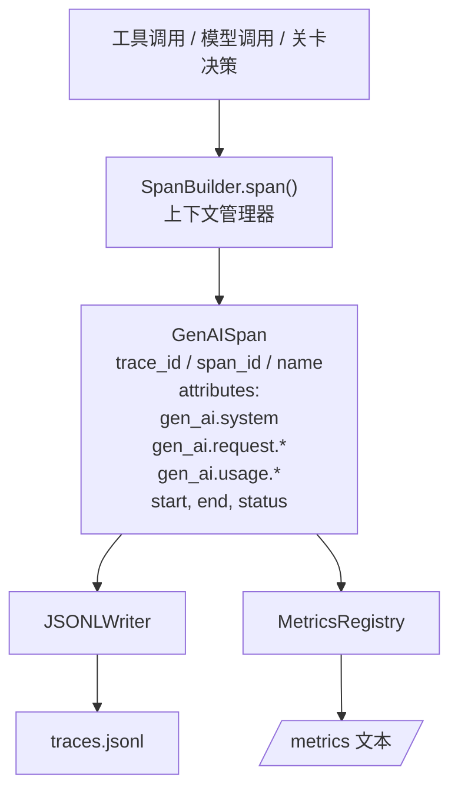
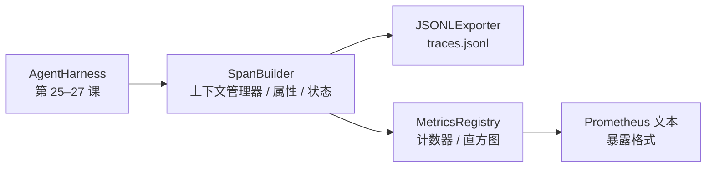

# 综合项目第 28 课：使用 OTel GenAI 跨度与 Prometheus 指标实现可观测性（Capstone Lesson 28: Observability with OTel GenAI Spans and Prometheus Metrics）

> 没有可观测性（Observability）的智能体运行框架，是一个不断花钱的黑盒。本课手工实现跨度构建器（Span Builder），生成符合 OpenTelemetry 生成式人工智能（Generative AI，GenAI）语义约定的记录，按每行一个跨度写入 JSON Lines 文件，并以 Prometheus 文本格式暴露计数器（Counter）和直方图（Histogram）。整个实现只使用 Python 标准库，可离线运行。

**Type:** Build
**Languages:** Python (stdlib)
**Prerequisites:** 第 19 阶段第 25 课（验证关卡）、第 26 课（沙箱）、第 27 课（评估框架），第 13 阶段第 20 课（OpenTelemetry GenAI），第 14 阶段第 23 课（OTel GenAI 约定）
**Time:** 约 90 分钟

## 学习目标（Learning Objectives）

- 构建符合 OpenTelemetry GenAI 语义约定的跨度数据类。
- 实现 JSON Lines（JSONL）导出器，每行写入一个自包含跨度。
- 构建带标签的计数器与直方图，并以 Prometheus 文本格式暴露。
- 用跨度上下文管理器（Context Manager）包装任意可调用对象，记录耗时、状态和异常。
- 验证输出跨度可经 `json.loads` 往返解析，并符合规范结构。

## 问题（The Problem）

生产中的编码智能体每轮产生三类记录：模型调用、工具执行、验证关卡决策。没有结构化遥测（Structured Telemetry），这些都无法有效利用。

第一种失败模式是缺失追踪。周二出了问题，唯一记录却是五百行聊天日志。没有记录哪个工具运行过、耗时多久、提示词用了多少词元，或关卡是否拒绝过什么。智能体作者只能猜。

第二种是不可解析的追踪。框架写了跨度，却使用自创的字段名，Grafana、Honeycomb、Jaeger 和本地命令行工具都无法读取。因为跨度不标准，团队技术栈中现有的工具全派不上用场。

第三种是没有聚合指标。追踪中能看到一次缓慢工具调用，却无法回答“过去一小时 read_file 调用的第 95 百分位（p95）延迟是多少”，因为只有追踪，没有指标。

OpenTelemetry GenAI 语义约定正是为此而存在。它定义一小组标准属性，由各大语言模型（Large Language Model，LLM）框架的跨度输出器共同使用。框架只要写入这些属性，所有兼容 OpenTelemetry（OTel）的后端就能读取。

## 概念（The Concept）



框架中的每项操作都会产生跨度（Span）。跨度包含追踪标识（整个智能体调用）、跨度标识（当前操作）、名称（例如 `gen_ai.chat`、`gen_ai.tool.execution`）、符合 GenAI 约定的属性、开始与结束时间，以及状态。

GenAI 约定标准化了这些属性键：`gen_ai.system`（提供商，例如 `anthropic`、`openai`）、`gen_ai.request.model`（模型标识）、`gen_ai.request.max_tokens`、`gen_ai.usage.input_tokens`、`gen_ai.usage.output_tokens`、`gen_ai.response.model`、`gen_ai.response.id`、`gen_ai.operation.name`，以及工具专用键 `gen_ai.tool.name`、`gen_ai.tool.call.id`。

导出器写入 JSONL，每行一个 JSON 对象。这是下游工具可以流式处理、grep 搜索和导入的最简单格式。真正的 OTel 导出器使用 OpenTelemetry 协议（OpenTelemetry Protocol，OTLP）gRPC；本课 JSONL 导出器是离线对应实现，可在各工作站上以退出码零结束。

指标与追踪并存。计数器在每次工具调用时递增：`tools_called_total{tool="read_file"}`。直方图记录观察到的延迟：`tool_latency_ms{tool="read_file"}`。两者都序列化为 Prometheus 文本暴露格式，这是拉取式指标的事实标准。

```figure
trace-spans
```

## 架构（Architecture）



跨度构建器是一个小型类，`span(name, attrs)` 方法返回上下文管理器。上下文管理器进入时记录开始时间，退出时记录结束时间；若发生异常则附加异常信息，再将完成的跨度送给导出器。

指标注册表由两个字典组成。计数器为 `{(name, frozen_labels): int}`；直方图将原始样本保存在列表中，在暴露指标时序列化为 Prometheus 直方图桶（Bucket）。

## 构建内容（What you will build）

`main.py` 提供：

1. `GenAISpan` 数据类：trace_id、span_id、parent_span_id、name、attributes、start_unix_nano、end_unix_nano、status、status_message、events。
2. `SpanBuilder` 类，提供 `span(name, attrs, parent=None)` 上下文管理器。
3. `JSONLExporter` 类，其 `export(span)` 方法追加一行。
4. `Counter`、`Histogram` 类及 `MetricsRegistry`。
5. 生成文本格式输出的 `prometheus_exposition(registry)`。
6. `wrap_tool_call(name)` 装饰器（Decorator），输出跨度并更新指标。
7. 演示：合成完整的智能体调用（gen_ai.chat 跨度包围工具跨度），写入 traces.jsonl，打印 Prometheus 暴露文本，以退出码零结束。

跨度标识与追踪标识都是由 `os.urandom` 生成的 16 字节十六进制字符串，与 OTel 的 W3C 追踪上下文一致。导出器从不抛出异常；输入输出错误会被报告，但框架继续运行。

直方图使用固定桶边界（OTel 以毫秒衡量延迟时的默认值：5、10、25、50、100、250、500、1000、2500、5000、10000、+Inf）。样本存储为列表，暴露指标时按需计算各桶计数。

## 为什么手工实现而不使用 opentelemetry-sdk（Why hand-rolled instead of opentelemetry-sdk）

OTel Python 软件开发工具包（Software Development Kit，SDK）是一项实际依赖，也意味着数千行代码、OTLP 导出器的多个进程，以及超出本课预算的运行开销。手工实现用于讲清传输格式。生产环境把相同属性接入正式 SDK，就能直接获得 OTLP 导出器、批处理和资源检测能力。

这些约定是稳定的。本课输出的传输格式在 2030 年仍可解析，因为 OTel 不会破坏 GenAI 属性名称，只会增加新名称。

## 与路线 A 的其他部分组合（How this composes with the rest of Track A）

第 25 课构建关卡链，第 26 课构建沙箱，第 27 课构建评估框架。第 28 课让这三者可观测。第 29 课用跨度包装端到端演示的每个步骤，并在结束时打印 Prometheus 文本。

## 运行（Running it）

```bash
cd phases/19-capstone-projects/28-observability-otel-traces
python3 code/main.py
python3 -m pytest code/tests/ -v
```

演示在本课工作目录生成 `traces.jsonl`（结束时清理），随后打印三个跨度样本，再打印计数器和直方图的 Prometheus 暴露文本。测试验证跨度序列化往返、标准 GenAI 属性存在、计数器正确递增，以及直方图暴露结果包含预期桶计数。
