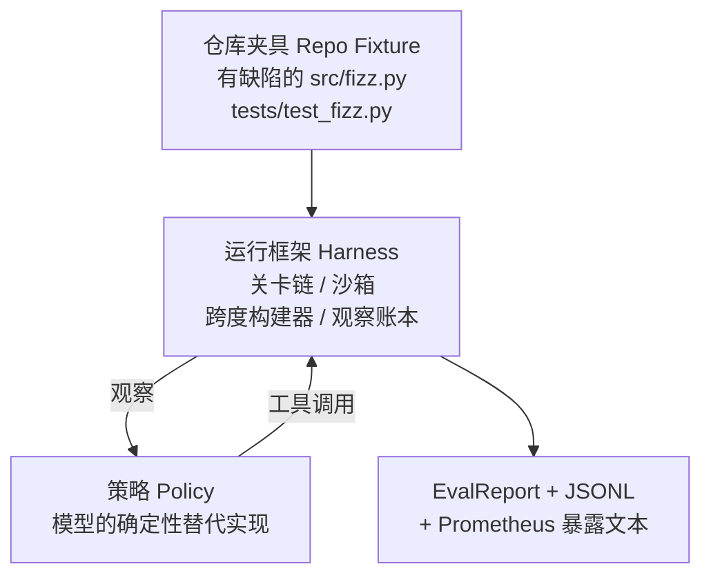
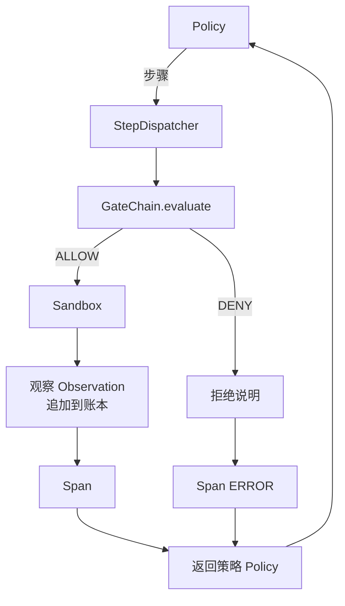

# 综合项目第 29 课：运行框架上的端到端编码智能体（Capstone Lesson 29: End-to-End Coding Agent on the Harness）

> 这是路线 A 的整合成果。本课将关卡链（Gate Chain）、沙箱（Sandbox）、评估框架（Evaluation Harness）和 OpenTelemetry（OTel）跨度（Span）组合成可工作的编码智能体，修复多文件 Python 项目中一个真实但规模较小的夹具缺陷。智能体采用确定性策略（Deterministic Policy），而非大语言模型（Large Language Model，LLM）。这种替换使课程可复现，也说明运行框架始终是重点。契约完全一致：真实模型可接入策略接口。

**Type:** Build
**Languages:** Python (stdlib)
**Prerequisites:** 第 19 阶段第 25 课（验证关卡）、第 26 课（沙箱）、第 27 课（评估框架）、第 28 课（可观测性），第 14 阶段第 38 课（验证关卡）、第 41 课（真实仓库工作台）、第 42 课（智能体工作台综合项目）
**Time:** 约 90 分钟

## 学习目标（Learning Objectives）

- 将关卡链、沙箱、评估框架和跨度构建器组合进同一个智能体循环。
- 实现确定性策略，通过 read_file、run_tests 和 write_file 修复夹具缺陷。
- 在端到端运行中强制执行全局步骤预算与观察词元预算。
- 为完整运行输出完整的 OTel GenAI 追踪与 Prometheus 指标。
- 验证智能体用少于 12 步解决夹具任务，合法工具不触发任何关卡拒绝。

## 问题（The Problem）

多数智能体演示各自独立：单独的沙箱、评估框架、跨度输出器，看起来都没问题，组合后却暴露出连接处的问题。

关卡链返回 ALLOW，沙箱却因关卡链未预料的原因拒绝；评估框架记录通过，OTel 跨度却显示智能体声称使用过的工具被关卡拒绝；Prometheus 计数器本应递增一次，却递增两次；观察预算已耗尽，智能体却继续运行，因为预算在关卡链中跟踪，沙箱并不知情。

本课是整条路线的集成测试（Integration Test）。智能体要依次完成四件事：读取项目、运行测试、根据测试失败识别错误、写入修复、重新运行测试，然后停止。每项操作都经过关卡链，每次工具执行都经过沙箱，每个步骤都由跨度包装，最后由评估框架为整个过程评分。

## 概念（The Concept）



智能体策略是一个状态机（State Machine），共有五个状态。

`SURVEY`：智能体读取项目文件列表，下一状态为 RUN_TESTS。

`RUN_TESTS`：智能体运行测试命令。通过则状态机成功停止，否则进入 INSPECT。

`INSPECT`：智能体读取出错的源文件，下一状态为 FIX。

`FIX`：智能体写入修正后的文件，下一状态为 VERIFY。

`VERIFY`：智能体再次运行测试命令。通过则成功停止，否则失败停止。

每个状态对应一次工具调用，每次调用都通过关卡链。如果调用被拒绝，智能体在追踪中报告拒绝并停止。

夹具缺陷是 `fizz.py` 中的边界偏一错误（Off-by-One Error）。确定性策略通过正则表达式从测试失败消息中识别缺陷，并输出修正后的文件。将策略换成 LLM 不会改变框架契约。

```figure
cg-harness-weave
```

## 架构（Architecture）



本课自包含运行。在 `main.py` 中，以最小规模重新实现前几课的各基础组件（关卡、沙箱、账本、跨度），无需导入相邻课程。名称与第 25–28 课完全一致，使概念对应关系明确。

## 构建内容（What you will build）

`main.py` 提供：

1. 与第 25–28 课同名的最小框架基础组件：`GateChain`、`Sandbox`、`ObservationLedger`、`SpanBuilder`、`MetricsRegistry`。
2. `CodingAgentPolicy` 类：五状态状态机。
3. `Repo` 辅助类：用附带的缺陷夹具准备临时工作目录。
4. `AgentRun` 类：驱动策略，通过框架分派调用，返回 `AgentRunReport`。
5. 附带夹具（`fixture_repo/`），包含 src/fizz.py、tests/test_fizz.py，以及供评估框架使用的 expected/ 目录树。
6. 演示：端到端运行策略，打印逐步骤追踪，断言通过并打印指标。

附带夹具与第 27 课任务结构相同：一个缺陷文件和一个测试文件。测试失败消息含有足够信息，确定性策略可据此识别修复。真实 LLM 会做同样的工作，速度更慢、知识检索范围更广，但框架对它的要求不变。

## 为什么策略不是 LLM（Why the policy is not an LLM）

真实 LLM 需要 API 密钥、网络调用，还带来难以验证的随机性。本课关注的是运行框架。换用确定性策略后，任何开发者笔记本都能在零外部依赖下运行课程，测试套件也能断言精确步骤数。

本课策略是 LLM 智能体行为的严格子集：读取仓库、观察失败测试、定位代码行、输出修复。LLM 在相同框架契约下经历同样的循环，记账方式完全一致。

## 演示断言什么（What the demo asserts）

端到端演示在退出时断言五件事，测试套件以程序方式再次断言。

策略用少于 12 步解决夹具任务。

观察预算从未超出。

合法工具未触发任何关卡拒绝。（智能体从未编造被拒绝的工具名。）

每个步骤在 traces.jsonl 中都有对应跨度。

Prometheus 暴露结果包含 `tools_called_total{tool="read_file"}` 条目和 `tool_latency_ms` 直方图。

## 与路线 A 的其他部分组合（How this composes with the rest of Track A）

本课负责集成。第 25 课编写关卡链，第 26 课编写沙箱，第 27 课编写评估框架，第 28 课编写可观测性组件，第 29 课证明它们能作为系统协作。真实智能体框架从这里扩展：将确定性策略换成模型，将附带夹具换成真实仓库任务，将 JSONL 导出器换成 OTLP。

## 运行（Running it）

```bash
cd phases/19-capstone-projects/29-end-to-end-coding-task-demo
python3 code/main.py
python3 -m pytest code/tests/ -v
```

演示打印逐步骤追踪、最终评估报告和 Prometheus 暴露文本，退出码为零。测试覆盖策略状态转换、合成工具调用触发的关卡拒绝、附带夹具上的端到端运行，以及步骤预算不变量（Invariant）。
