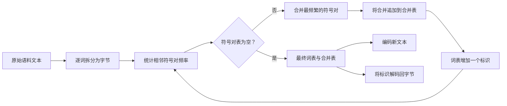
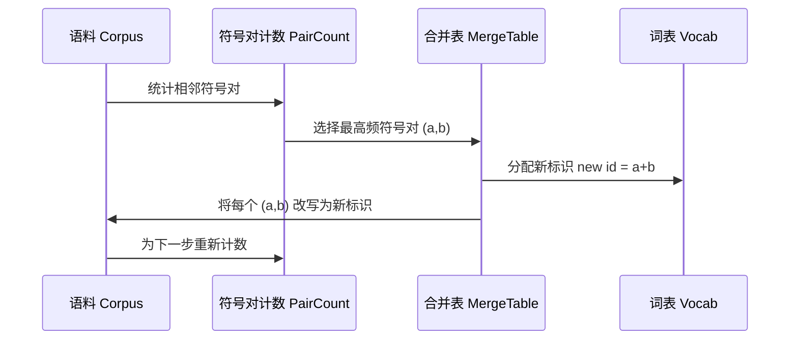

# 从零构建 BPE 分词器（BPE Tokenizer From Scratch）

> 字节输入，标识输出，再由标识还原同样的字节。构建现代文本模型仍然依赖的起点：分词器（Tokenizer）。

**Type:** Build
**Languages:** Python
**Prerequisites:** 第 04 阶段课程、第 07 阶段 Transformer 课程
**Time:** 约 90 分钟

## 学习目标（Learning Objectives）
- 从原始文本语料库（Corpus）训练字节对编码（Byte-Pair Encoding，BPE）词表，反复合并最频繁的相邻符号对。
- 实现确定性合并表（Merge Table），应用于新文本以生成子词（Subword）标识流。
- 将任意 UTF-8 输入转换为标识并还原，确保信息无损。
- 预留并保护特殊词元（Special Token，`<|endoftext|>`、`<|pad|>`），使它们在训练和解码中保持完整。
- 理解为什么字节级字母表（Byte-Level Alphabet）适合作为通用分词器的基础。

```figure
cap-bpe-merge
```

## 基本框架（The frame）

语言模型从不直接看到文本，只看到整数。分词器负责字符串与整数列表之间的双向映射。这一层若出错，训练运行中的每条损失曲线衡量的都是错误对象。

通用文本模型中占主导地位的子词分词器采用字节对编码。思路很简单：从已知字母表开始，找到训练语料中出现最多的相邻符号对，将其合并为新符号，反复执行直到词表达到目标大小。编码新文本时，按相同顺序复用同一合并列表。

我们构建字节级版本。字母表是 256 个原始字节，而非 Unicode 码点（Code Point）。正是这一选择，让分词器可以处理任意 UTF-8 输入，无需回退到未知词元（Unknown Token）。

## 流水线（The pipeline）



训练端与推理端共享合并表，这种共享就是契约。若在推理时改变合并顺序，解码的将是不同的标识流。

## 字节字母表（The byte alphabet）

前 256 个标识预留给 0x00 到 0xFF 的原始字节，保证在任何合并发生前，每个输入字符串都可由词表表示。字节区之后再预留一小段给特殊词元。我们将特殊词元完全排除在预分词后的流之外，因此训练循环永远不会将这些标识作为合并目标。

预分词器（Pretokenizer）在训练前沿空白与标点边界拆分语料。没有这一步，BPE 合并会跨越单词边界，词表中就会充满常见完整短语。有了拆分，合并限制在单词内部，结果更能泛化。

## 训练循环（The training loop）

每个训练步骤做三件事：遍历语料中的每个单词，统计当前符号序列中各相邻对的出现次数，并按单词本身的频次加权；选择计数最高的符号对；将该符号对的每次出现改写为单个新符号，其标识取词表的下一个空闲位置。随后记录此次合并。



每步成本与表示为符号序列列表的语料大小成线性关系。对于一百万个单词和一万个标识的目标词表，循环可在数秒内完成，因为随着合并进行，符号序列持续缩短。

## 编码新文本（Encoding fresh text）

推理不调用合并计数器，而是按学习顺序应用合并表。对于新单词，编码器先拆分为字节，扫描当前序列以查找排序值（Rank）最低的可用合并，也就是最早学到且适用的合并。执行后再次扫描，直到表中没有任何合并适用于当前序列。

按排序值应用合并，使编码具有确定性，并与同一输入的训练行为一致。最早学到的合并位于表首，最先应用。若两个合并都可用于同一位置，排序值较低者优先。

## 特殊词元（Special tokens）

特殊词元的标识永远不会由普通字节流产生，需要手工预留。本课两个即可。

- `<|endoftext|>` 在预训练（Pretraining）中分隔文档，告诉模型：“新文档从这里开始，不要让前一个文档的上下文渗入。”
- `<|pad|>` 填充短序列，使批次成为矩形张量（Tensor）。训练时损失掩码（Loss Mask）会屏蔽它。

编码器接受一个允许输入特殊词元的标志。关闭时，字符串 `<|endoftext|>` 和 `<|pad|>` 按组成它们的字节分词；开启时，这些字面字符串映射到预留标识，不参与任何合并。

## 往返保证（Round-trip guarantee）

先编码再解码，必须精确还原输入字节。解码器按顺序拼接每个标识展开后的字节。每个标识要么是原始字节，要么是两个先前已知标识的拼接，因此递归展开总会终止于原始字节。解码随后返回这些字节构成的 UTF-8 字符串。

本课测试套件对未见句子、含 Unicode 表情符号的句子，以及包含字面 `<|endoftext|>` 词元的句子检查这一性质。

## 本课不实现的内容（What this lesson does not do）

本课不构建大型生产分词器采用的正则表达式驱动预分词器。这里仅沿空白与标点做简单拆分，已足以在小型训练语料上产生合理合并，并保持与后续课程相同的契约。下一课将分词器视为黑盒，在其上构建滑动窗口（Sliding Window）数据集。

本课不并行化符号对计数器。对几千个单词的语料，Python 循环不到一秒即可完成。更大语料的直接做法是逐词并行计数，再归约（Reduce）汇总。

## 代码阅读指南（How to read the code）

`main.py` 定义四个对象：`BPETokenizer` 保存词表、合并表和特殊词元表；`train` 是训练循环；`encode` 是推理路径；`decode` 负责字节拼接。文件末尾的演示用内置语料训练小型分词器，编码一个留出句子，将标识解码还原，并打印两者。`code/tests/test_bpe.py` 中的测试固定验证往返性质、特殊词元预留和合并顺序。

运行演示，然后把目标词表大小从 300 改为 600，观察留出句子的编码长度如何缩短。这条曲线就是 BPE 压缩曲线（Compression Curve）。
