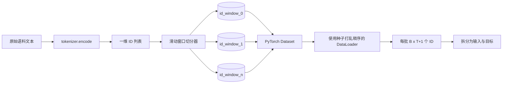
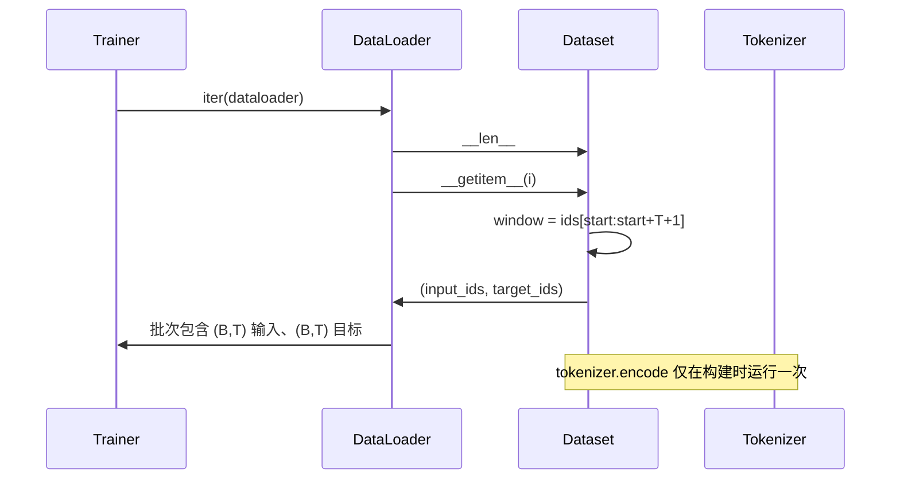

# 滑动窗口分词数据集（Tokenized Dataset with Sliding Window）

> 预训练（Pretraining）过程将词元 ID 映射为梯度。本课构建向训练过程输送这些 ID 的数据管线。

**Type:** Build
**Languages:** Python
**Prerequisites:** 阶段 04 的课程、阶段 07 的 Transformer 课程、本阶段第 30 课
**Time:** ~90 分钟

## 学习目标（Learning Objectives）
- 只调用一次分词器（Tokenizer），将原始语料库转为词元 ID 流。
- 按可配置的重叠步幅（Stride），将 ID 流切分为定长窗口。
- 构建 PyTorch Dataset，返回用于下一词元预测（Next-token prediction）的输入张量和目标张量。
- 用 DataLoader 包装数据集，为每个训练轮次（Epoch）设置种子以确定性地打乱顺序。
- 分析步幅、冗余与有效数据集大小之间的权衡。

```figure
cap-sliding-window
```

## 总体框架（The frame）

预训练每次读取一批词元 ID 并更新模型。每批数据的形状由训练契约（Training contract）固定。对于因果语言模型（Causal language model），批次包含形状为 `(B, T)` 的输入 ID 和形状为 `(B, T)` 的目标 ID，目标是输入向左移动一位的结果。数据管线（Data pipeline）的任务是从可能包含数 GB 原始文本的语料库中，按需生成符合该契约的数据，并确保过程具有确定性且可复现。

本课构建这条管线。上一课的分词器将文本转为一个长的一维 ID 列表。滑动窗口（Sliding window）将列表切分为训练样本，自定义 Dataset 以张量形式提供样本，DataLoader 则将样本组批，并使用已知种子打乱顺序。

## 形状契约（The shape contract）

因果语言模型（Causal LM）接收形状为 `(B, T)` 的 ID，其中 `B` 是批量大小（Batch size），`T` 是上下文长度（Context length）。位置 `t` 的目标是位置 `t+1` 的输入。这意味着每个训练样本覆盖 `T+1` 个原始 ID。窗口步幅控制相邻样本的重叠程度。



切分器不会越过语料库边界。如果最后一个窗口的 ID 不足以填满 `T+1` 个位置，就丢弃该窗口。使用 `<|pad|>` 填充尾部也是有效方案，但会使损失掩码（Loss mask）更复杂。本课选择丢弃。

## 为什么使用滑动窗口（Why a sliding window）

预训练语料库是一条很长的 ID 流。如果模型只看到不重叠的窗口，每个训练样本所呈现的 `T` 边界都固定不变。调整步幅会移动这些边界，让模型接触更多样的下一词元预测任务。

步幅为 `T` 时生成不重叠窗口。步幅为 `T // 2` 时重叠比例为 50%，有效数据集大小加倍。步幅为 `1` 时重叠最多，数据集大小增至原来的 `T` 倍。代价是每轮计算量增加，收益是边界更多样。多数预训练使用与上下文长度相等的步幅，因为语料库本身已远超模型一轮能处理的规模，此时增加边界多样性的理由就不那么充分。

## Dataset 类（The Dataset class）

PyTorch Dataset 必须实现两个方法。`__len__` 返回样本数量，`__getitem__` 以一对张量的形式返回一个样本。这里的 Dataset 保存编码后的 ID 流和步幅。按索引访问时才计算窗口起点，因此无论步幅产生多少样本，内存中都只需保存一份 ID 流。



移动一位的操作在 `__getitem__` 内完成。Dataset 返回 `(input, target)`，其中 `input = window[:-1]`，`target = window[1:]`。两者都是 PyTorch 长整型张量（Long tensor）。训练循环将它们作为真实数据（Ground truth）。

## 确定性打乱（Deterministic shuffle）

设置 `shuffle=True` 的 DataLoader 使用 PyTorch 随机数生成器。显式传入一个按轮次设置种子的 `torch.Generator`，每次重新运行都能获得相同的打乱结果。当你要比较仅有一个超参数（Hyperparameter）不同的两次训练时，这一点很重要。若不设置种子，两次运行读取数据的顺序不同，损失曲线就会因与该改动无关的原因出现差异。

本课的种子契约很简单：`epoch_seed = base_seed + epoch_index`。基础种子在构造时传入，训练器在每轮开始时递增轮次索引。使用相同基础种子重新运行时，每个对应轮次的数据顺序始终相同。

## 批次采样器（Batch sampler）

PyTorch 默认采样器以均匀随机、无放回的方式选择索引，这正是预训练所需的行为。小数据集上的微调（Fine-tuning）也采用同一契约。DataLoader 调用 `__getitem__` 共 `B` 次，并堆叠结果以组成批次。由于构造时已保证样本等长，因此不需要填充逻辑。

为简化实现，本课保留 `num_workers=0`。生产训练中，工作进程（Worker）会并行执行 `__getitem__` 调用。在本管线中，这样做基本没有作用，因为实际工作只是对内存中的张量进行切片，不过同一个 Dataset API 可以直接支持工作进程。

## 计算样本数量（Counting examples）

对于长度为 `N` 的 ID 流、上下文长度 `T` 和步幅 `S`，样本数量为 `max(0, 1 + (N - (T + 1)) // S)`。本课通过 Dataset 的静态方法提供该计算，使训练器无需遍历即可算出每轮总步数。

## 本课不涉及的内容（What this lesson does not do）

本课不从磁盘流式读取数据。语料库在内存中完整编码，并以单个张量保存。对于包含几百万个 ID 的语料库，这远不到 100 MB，适合本课使用。磁盘流式读取是独立问题，可以替换存储实现来接入，同时保留 Dataset 契约。

本课不处理多文档结构，而将语料库视为连续的 ID 流。如果语料库由多份文档组成，构建时插入 `<|endoftext|>` ID 来编码文档之间的边界。模型会学习边界附近的预测方式。

## 如何阅读代码（How to read the code）

`main.py` 定义了两个类和一个辅助函数。`SlidingWindowDataset` 是 PyTorch Dataset；`make_dataloader` 返回已配置且带有设种子生成器的 DataLoader；`_encode_corpus_to_ids` 执行一次性分词器调用。文件底部的演示在进程内构建小型分词器，编码内置语料库，构造数据集和数据加载器，打印一个批次，并断言形状契约成立。`code/tests/test_dataset.py` 中的测试固定了窗口计数公式、移位一位的性质、确定性打乱行为以及步幅的权衡关系。

运行演示，然后将上下文长度从 16 改为 32，观察每轮样本数如何减少。这个数量就是你的每轮步数预算。
