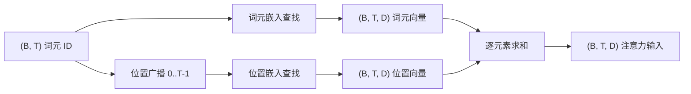
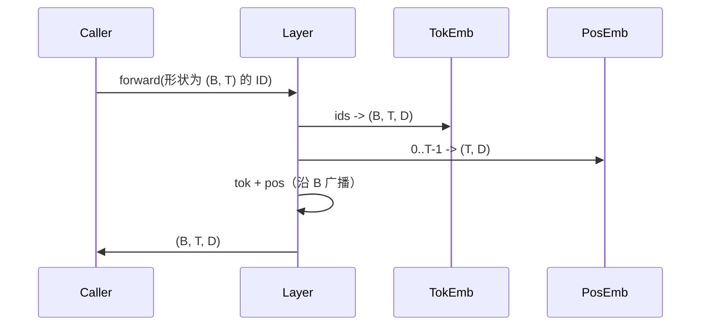

# 词元与位置嵌入（Token and Positional Embeddings）

> ID 是整数，模型需要的是向量。两张查找表连接二者，其中位置表的选择决定了模型能够学到什么。

**Type:** Build
**Languages:** Python
**Prerequisites:** 阶段 04 的课程、阶段 07 的 Transformer 课程、本阶段第 30 和 31 课
**Time:** ~90 分钟

## 学习目标（Learning Objectives）
- 构建词元嵌入（Token embedding）查找表，将词汇表 ID 映射为稠密向量（Dense vector）。
- 构建按位置索引的可学习位置嵌入（Learned positional embedding）查找表。
- 构建按位置索引、没有参数的固定正弦位置嵌入（Sinusoidal positional embedding）。
- 将词元嵌入与位置嵌入合成为 Transformer 块的单一输入。
- 比较可学习嵌入与正弦嵌入的长度泛化（Length generalization）和参数数量。

```figure
cc-embedding-lookup
```

## 总体框架（The frame）

模型接触词元 ID 的第一步，是在词元嵌入矩阵中查找一行。矩阵的每行对应一个词汇表 ID，每列对应一个模型维度。查找返回的向量被模型后续部分视为该 ID 的含义。反向传播（Backpropagation）更新前向传播（Forward pass）使用过的行。随着训练进行，这些行的几何结构学会通过方向编码相似性。

词元 ID 本身不携带顺序信息。模型需要第二种信号，告诉它位置 1 与位置 17 不同。常见的两种选择是可学习位置嵌入（第二张查找表，每个位置一行）和固定正弦位置嵌入（不含参数的数学公式）。这一选择会带来不同后果。可学习表本身是参数，受模型训练所用最大上下文长度限制。正弦表在理论上不含可学习参数，公式可以扩展到任意位置，但本课的 `SinusoidalPositionalEmbedding` 预先计算长度为 `max_context_length` 的固定表，其 `forward` 在越界时抛出异常；因此这里的两个模块都强制限制最大上下文长度。即使表足够大、允许索引，模型在超过训练长度后仍可能表现不佳。

本课构建这两种位置嵌入，并将其分别与词元嵌入组合，形成下一课注意力块（Attention block）的单一输入。

## 形状契约（The shape contract）

嵌入阶段输入一批形状为 `(B, T)` 的词元 ID，输出形状为 `(B, T, D)` 的张量，其中 `D` 是模型维度。每个批次元素具有相同的上下文长度 `T`，每个位置具有相同的向量维度 `D`。



组合操作是求和，而非拼接（Concatenation）。求和使网络中的 `D` 保持不变，并让模型在每层逐特征决定由词元含义还是位置占主导。

## 词元嵌入矩阵（The token embedding matrix）

词元嵌入是形状为 `(V, D)` 的参数张量，其中 `V` 是词汇表大小。PyTorch 通过 `nn.Embedding(V, D)` 提供它。初始化时，各元素采样自幅度较小的高斯分布（Gaussian distribution）；对于 Transformer 规模的模型，惯例是均值为零、标准差约为 `0.02`。相比精确的初始化设置，确保各次运行保持一致更重要。

前向传播只有一次索引操作。PyTorch 通过收集行，将 `(B, T)` 的 int64 ID 映射为 `(B, T, D)` 的浮点数。反向传播只向前向传播访问过的行累加梯度。两行若从未出现在该批次中，其当前步骤的梯度都为零。

有一个细节：词元嵌入与模型末端的输出投影（Output projection）经常共享权重，即权重绑定（Weight tying）。这种情况下，每次反向传播都会从输出端访问嵌入的每一行。本课将两者作为独立模块提供，但在完整模型中，同一矩阵可以同时承担两个角色。

## 可学习位置嵌入（The learned positional embedding）

可学习位置嵌入是第二个 `nn.Embedding`，形状为 `(max_context_length, D)`，以位置 ID `0, 1, 2, ..., T-1` 为键查找。前向传播沿批次维度广播（Broadcast）位置向量。

可学习表的缺点是：如果模型训练时最多只到位置 `T-1`，就无法查询位置 `T`，因为这一行不存在。采用此方案的生产级仅解码器模型（Decoder-only model）会把最大上下文长度固化到架构中，并拒绝处理更长输入。

## 正弦位置嵌入（The sinusoidal positional embedding）

正弦位置嵌入是从位置到向量的函数。位置 `p` 与特征 `i` 产生如下结果：

```python
angle = p / (10000 ** (2 * (i // 2) / D))
emb[p, 2k]     = sin(angle)
emb[p, 2k + 1] = cos(angle)
```

该函数没有参数。每个位置都有唯一向量。波长随特征维度按几何级数变化，因此较低维度编码粗粒度位置，较高维度编码细粒度位置。

同时选择 `sin` 与 `cos` 带来一个性质：位置 `p + k` 的向量是位置 `p` 向量的线性函数。这让注意力层更容易学到相对位置偏移（Relative-position offset）。模型无需单独的参数就能表达“向前看五个词元”。

本课在构造时一次性计算完整正弦表，在前向传播时按索引读取。

## 组合方式（The composition）

输入管线按顺序完成三件事：读取词元 ID、查找词元向量、加上位置向量，然后返回求和结果。



求和步骤中的广播沿批次维度复制 `(T, D)` 位置张量。执行 unsqueeze 后，位置张量形状为 `(1, T, D)`，因此 PyTorch 会自动处理广播。

## 对比分析（Contrastive analysis）

本课在相同输入上运行两种变体，并打印两项诊断结果。

第一项是参数数量。可学习变体在词元嵌入之外增加 `max_context_length * D` 个参数，正弦变体则不增加参数。

第二项是相邻位置嵌入之间的余弦相似度（Cosine similarity）。正弦函数连续，因此其变体的相似度衰减平滑且可预测。可学习变体各行独立采样，初始化时相似度近似随机。训练后，可学习变体通常会形成类似的平滑结构，但必须从数据中发现这一结构。

## 本课不涉及的内容（What this lesson does not do）

本课不构建旋转位置编码（Rotary positional encoding，RoPE）或 AliBi，它们是现代生产级 Transformer 的常见选择。它们都遵循与此处嵌入相同的形状契约，即对形状为 `(B, T, D)` 的向量施加依赖位置的变换，但作用于注意力投影步骤，而非输入端。下一课构建注意力块，其中一个可选扩展是在查询与键的投影中加入旋转编码。

本课不训练嵌入。训练需要损失，损失需要模型输出，而模型输出又需要注意力和语言模型头（LM head）。这些内容将在接下来的两课中构建。

## 如何阅读代码（How to read the code）

`main.py` 定义三个模块。`TokenEmbedding` 包装 `nn.Embedding(V, D)`，`LearnedPositionalEmbedding` 包装 `nn.Embedding(L, D)`，`SinusoidalPositionalEmbedding` 预先计算表并以缓冲区（Buffer）形式提供。`EmbeddingComposer` 将词元嵌入与位置嵌入连接起来。文件底部的演示打印形状、参数数量和相邻位置相似度诊断。`code/tests/test_embeddings.py` 中的测试固定了形状、广播行为、参数数量和正弦公式。

运行演示，然后将模型维度 `D` 从 64 改为 32，观察正弦波长频带如何变化。
