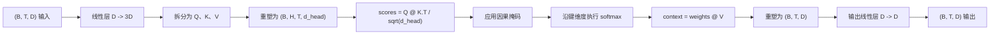
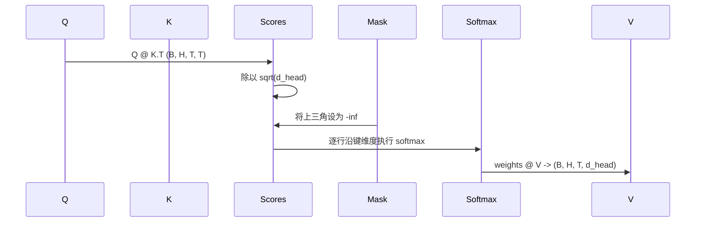

# 多头自注意力（Multi-Head Self-Attention）

> 一次线性投影、三个视图、H 个并行头、一个掩码。这就是模型实际使用的注意力块。

**Type:** Build
**Languages:** Python
**Prerequisites:** 阶段 04 的课程、阶段 07 的 Transformer 课程、本阶段第 30 至 32 课
**Time:** ~90 分钟

## 学习目标（Learning Objectives）
- 用一个线性层实现批量查询／键／值（Query/Key/Value）投影，并拆分为 H 个头。
- 使用正确的归一化和数据类型处理，计算缩放点积注意力（Scaled dot-product attention）。
- 应用因果掩码（Causal mask），防止某个位置关注未来位置。
- 检查固定输入的逐头注意力权重，分析每个头关注什么。
- 在玩具任务上训练小型注意力块，观察各个头形成分工时损失如何下降。

```figure
cap-multihead-attention
```

## 总体框架（The frame）

注意力（Attention）使一个词元的表示能够从同一序列的其他词元中提取信息。自注意力（Self-attention）意味着查询、键和值都源自同一个输入。多头（Multi-head）意味着把投影拆成 H 个并行的注意力问题，再将输出拼接并投影回原维度。

高效实现模式是使用一个从 `D` 投影到 `3 * D` 的线性层，将结果切为三个视图，再重塑为 H 个大小均为 `D // H` 的头。矩阵乘法（Matmul）、softmax 和加权求和都以批量张量操作执行，因此各个头可在加速器上并行运行。

本课构建这个块，并加入因果掩码，使同一份代码能作为仅解码器语言模型（Decoder-only language model）的注意力层。下一课将该块堆叠成完整 Transformer，再下一课进行训练。

## 形状契约（The shape contract）

输入为 `(B, T, D)`，输出为 `(B, T, D)`。掩码为 `(T, T)` 或可广播到该形状。块内中间张量的形状为 `(B, H, T, d_head)`，其中 `d_head = D // H`。约束是 `D % H == 0`。



两个线性层（QKV 投影和输出投影）是块中仅有的参数所在。掩码、softmax、矩阵乘法和形状重塑均不含参数。

## QKV 拆分（The QKV split）

朴素实现有三个独立线性层，分别对应 Q、K、V。高效实现只用一个输出 `3 * D` 个特征的层，再拆分结果。二者在数学上等价，因为分别与三个 `(D, D)` 权重矩阵相乘，恰好等于与它们堆叠而成的一个 `(3D, D)` 权重矩阵相乘。

高效版本更快，因为加速器只启动一次矩阵乘法，而不是三次。它也更容易初始化，因为三个子矩阵位于同一个参数张量中，可以一起初始化。

## 多头形状重塑（The head reshape）

拆分后，Q、K、V 的形状均为 `(B, T, D)`。要将它们变成 H 个并行注意力问题，先重塑为 `(B, T, H, d_head)`，再转置为 `(B, H, T, d_head)`。此时头维度紧邻批次维度，因此 PyTorch 将逐头注意力视为跨 `B * H` 个独立实例的批量操作。

d_head 维度保持在最后，使分数矩阵乘法 `Q @ K.transpose(-2, -1)` 沿它收缩求和，得到形状为 `(B, H, T, T)` 的逐头注意力分数。

## 缩放（Scaling）

分数在 softmax 之前除以 `sqrt(d_head)`。若不缩放，点积会随 `d_head` 增大，将 softmax 推入一个元素占据几乎全部概率质量、其他元素极小的状态。此时梯度很小，学习停滞。除以 `sqrt(d_head)` 可使不同头大小下的分数方差大致恒定。

## 因果掩码（The causal mask）

仅解码器语言模型预测下一词元时，只能以过去的信息为条件。掩码强制实现这一点。具体来说，在 softmax 前，将 `(T, T)` 分数矩阵对角线上方的每个元素替换为负无穷。softmax 后，这些位置的权重为零。



构造时将掩码注册为缓冲区（Buffer），使其与模型位于同一设备上，且不属于梯度图。掩码覆盖该块可能接收的最大上下文长度。前向传播时，切取左上角的 `(T, T)` 区域。

## 输出投影（The output projection）

得到逐头上下文向量 `(B, H, T, d_head)` 后，先转置回 `(B, T, H, d_head)`，再重塑为 `(B, T, D)`，最后应用 `(D, D)` 线性投影。输出投影让模型混合各头的信息。没有它，H 个头只能通过后续层重新组合，给该块施加了人为限制。

## 注意力权重检查（Attention weight inspection）

本课在前向传播中提供 `return_weights=True` 标志。启用后，该块除输出外，还返回形状为 `(B, H, T, T)` 的逐头注意力权重。演示打印短输入上某一个头的权重热力图（Heatmap），让你看到因果三角结构和各位置的关注重点。

训练后的模型中，不同头会学习不同模式：有些关注紧邻的前一个词元，有些关注序列开头，有些几乎均匀分配注意力。检查钩子（Inspection hook）是开展这类可解释性（Interpretability）工作的入口。

## 训练演示（The training demo）

`main.py` 底部的演示将注意力块连接到微型语言模型头（LM head），在重复任务上训练整体。输入的每一行都是一个随机 ID 在上下文长度内的重复。目标是输入移位一位的结果，所以模型必须学会下一词元与前一词元相同。损失为交叉熵（Cross-entropy）。在 H=4、D=32、T=12、词汇表大小为 64 时，在 CPU 上训练三轮，损失会从随机水平（约 `log(64) ~ 4.16`）降至远低于 `1.0`。

演示的目的不是训练实用模型，而是确认梯度能流经块的每个部分，且各个头能在答案显而易见的问题上学到内容。

## 本课不涉及的内容（What this lesson does not do）

本课不添加前馈块（Feed-forward block）。真实模型的 Transformer 层在注意力后接一个两层多层感知机（MLP），两部分各有残差连接（Residual connection）和层归一化（Layer norm）。下一课加入这些组件。

本课不实现旋转位置编码（Rotary positional encoding）或 AliBi。两者都作用于同一块的 QKV 投影步骤，但属于独立教学单元。这里构建的块可以在矩阵乘法前变换 Q 和 K，从而兼容两种方案。

本课不实现推理的键值缓存（KV cache）。在前向传播之间缓存键和值，是加快自回归解码（Autoregressive decoding）的优化方法。它会改变 K 和 V 张量的形状契约，但不改变 Q。这属于推理课程的内容。

## 如何阅读代码（How to read the code）

`main.py` 定义 `MultiHeadSelfAttention`。该类包含两个线性层和一个已注册的掩码缓冲区。前向传播依次执行投影、重塑、评分、掩码、softmax、加权、重塑和再次投影。底部演示构建一个小模型，用词元与位置嵌入及语言模型头包裹注意力，在复制任务上训练三轮，并打印损失曲线和逐头注意力热力图。`code/tests/test_attention.py` 中的测试固定了形状契约、因果性、softmax 性质、多头拆分性质和梯度流。

运行演示，然后将 `n_heads` 从 4 增至 8（保持 `d_model=32`，因此 `d_head=4`），观察热力图的变化。
