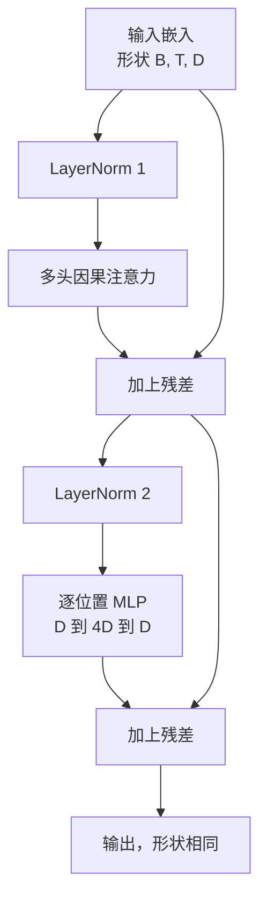
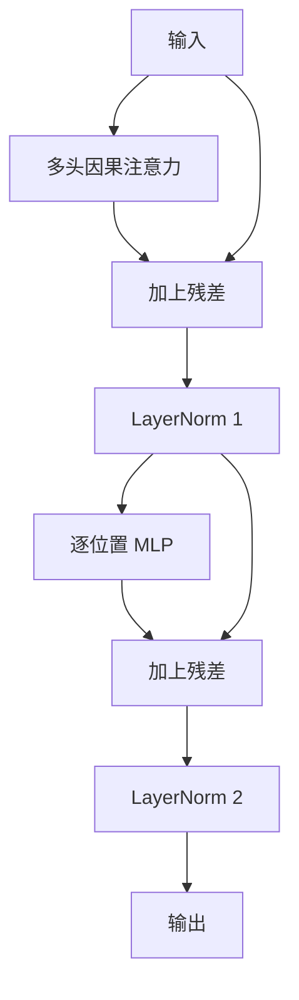

# 从零构建 Transformer 块（Transformer Block from Scratch）

> 块是所有现代解码器大语言模型（LLM）的基本单元：层归一化、多头注意力、残差、多层感知机、残差。前置层归一化（Pre-LN）变体无需预热也能稳定训练，后置层归一化（Post-LN）变体则是原始论文采用的方案。本课并列实现两者，展示哪一种能在常见学习率下经受住 12 层堆叠。

**Type:** Build
**Languages:** Python
**Prerequisites:** 阶段 19 第 30 至 33 课（分词器、嵌入、注意力数学、批量数据加载器）
**Time:** ~90 分钟

## 学习目标（Learning Objectives）

- 用 LayerNorm、多头因果注意力（Multi-head causal attention）、残差连接（Residual connection）和逐位置多层感知机（Position-wise MLP）四个组件，在 PyTorch 中构建 Transformer 块。
- 按前置与后置两种配置放置 LayerNorm，并解释为什么其中一种无需预热（Warmup）也能稳定训练。
- 在多头注意力内部实现因果掩码，使词元 `i` 无法看到词元 `j > i`。
- 在 12 层堆叠中跟踪两种变体的梯度流（Gradient flow），依据实际结果分析，而非泛泛解释。
- 在下一课组装 1.24 亿参数 GPT 时，将此块作为可直接接入的单元复用。

## 问题（The Problem）

Transformer 就是一个块的重复。块只要错一次，再重复十二遍，交付的模型可能第一轮就发散，或此后一直需要用预热技巧维持训练。本课展示的两种故障模式并不罕见，学习者第一次直接堆叠块时就会遇到。一种是注意力层关注未来，另一种是 LayerNorm 的位置无法控制深层网络中的残差信号。

看清问题后，修复步骤就很明确。块恰好有两条残差路径、两个归一化位置。选对位置后，堆叠的其余工作就只是管理这些组件。

## 概念（The Concept）

每个仅解码器 Transformer 块都是一个函数：接收形状为 `(batch, sequence, embedding)` 的张量，返回相同形状的张量。内部由两个子层完成工作。



这是前置层归一化变体。LayerNorm 位于残差分支内部、子层之前。残差连接将未经归一化的信号向前传递。

后置层归一化变体把 LayerNorm 移到残差相加之后。



形状相同，训练行为却不同。后置层归一化中，沿残差路径回传的梯度必须经过 LayerNorm。在十二层深度、学习率 `3e-4` 时，梯度收缩得很快，需要预热调度。前置层归一化保持残差路径不归一化，使梯度能顺畅传播到嵌入层。因此，从 GPT-2 起采用的是前置层归一化配置。

### 因果多头注意力（Causal multi head attention）

注意力子层将输入投影为查询、键、值三种张量。每个张量从 `(B, T, D)` 重塑为 `(B, H, T, D/H)`，其中 `H` 是头数。缩放点积注意力（Scaled dot-product attention）逐头计算 `softmax(Q K^T / sqrt(d_k))`：把上三角掩蔽为负无穷，通过 softmax 使掩码生效，再乘以 `V`。各头拼接回单个 `(B, T, D)` 张量，再投影一次。掩码是使模型具有因果性的唯一组件。忘记掩码，就会训练出一个作弊的模型。

### 多层感知机（The MLP）

逐位置 MLP 对每个词元独立应用同一个两层网络。隐藏宽度为嵌入宽度的四倍，激活函数是 GELU，第二个线性层后接随机失活（Dropout）。MLP 内部的词元不相互交流，所有词元混合都发生在注意力中。

### 残差连接的两个作用（Residual connections do two things）

残差连接使梯度路径在深度方向上可加，从而让梯度范数经过十二层仍保持合适尺度。它还让每个块学习对当前表示的加性更新，而不是整体替换。两个作用共同使该块能够扩展到更深网络。

```figure
cc-transformer-block
```

## 动手实现（Build It）

`code/main.py` 实现：

- `class LayerNorm`：包含可学习的缩放与平移，以及偏置 eps，逐词元向量应用。
- `class MultiHeadAttention`：包含 `num_heads`、`head_dim = d_model // num_heads`、融合 QKV 投影（Fused QKV projection）、已注册的因果掩码、注意力和残差随机失活。
- `class FeedForward`：包含两个线性层、GELU 激活和随机失活。
- `class TransformerBlock`：通过 `pre_ln` 标志切换两种变体。
- 演示：使用相同输入构建 6 层前置归一化堆叠和 6 层后置归一化堆叠，打印 (a) 输出形状，(b) 一次反向传播后嵌入处的梯度范数。

运行：

```bash
python3 code/main.py
```

输出包括两个堆叠的形状检查，以及并列显示的梯度范数。在相同学习率下，前置归一化堆叠的嵌入梯度比后置归一化大一个数量级，这是前置归一化无需预热即可训练的实验证据。

## 技术栈（Stack）

- `torch` 提供张量数学、自动微分（Autograd）和 `nn.Module` 基础设施。
- 不使用 `transformers`，不使用预训练权重，从基本操作实现该块。

## 实际生产模式（Production patterns in the wild）

三种模式将教材中的块转为可以交付的实现。

**融合 QKV 投影（Fused QKV projection）。** 三个独立线性层需要三次内核启动、三次矩阵乘法。宽度为 `3 * d_model` 的一个线性层只需一次启动即可完成同样工作，再沿最后一轴拆分输出。融合路径在各种加速器上都更快，也与 GPT-2、LLaMA 和 Mistral 参考实现采用的做法一致。

**注册因果掩码缓冲区（Registered causal mask buffer）。** 掩码只取决于最大上下文长度。构造时用 `register_buffer` 一次性分配，每次前向传播切取当前活动窗口，免去逐次分配。忘记这一点，会让长上下文中的掩码成为内存分配热点。

**随机失活放两处，而非三处（Dropout in two places, not three）。** 随机失活应放在注意力 softmax 之后（注意力随机失活）和 MLP 第二个线性层之后（残差随机失活）。直接对残差本身做随机失活，会破坏让梯度流经深层网络的加性恒等路径。部分早期实现犯过此错，代价是训练脆弱。

## 实际应用（Use It）

- 本课的块无需修改即可接入第 35 课的 GPT 组装。
- 前置层归一化变体是所有现代开放权重 LLM 使用的方案，后置层归一化变体是 2017 年原始注意力论文采用的方案。理解两者，足以读懂你遇到的解码器架构。
- 将 GELU 换成 SiLU，就得到 LLaMA 系列的激活函数；将 LayerNorm 换成均方根归一化（RMSNorm），就得到 LLaMA 系列的归一化方式。骨架不变。

## 练习（Exercises）

1. 为块内所有线性层添加 `bias=False` 标志。现代开放权重 LLM 的线性层不带偏置。测量 12 层、768 维模型能节省多少参数。
2. 用手写 RMSNorm 替换 `nn.LayerNorm`，验证输出形状不变。
3. 添加标志，以 `(B, T, T)` 张量返回第一个头的注意力权重。绘制上三角，确认 softmax 后其值为零。
4. 构建健全性检查：将 `(2, 16, 384)` 张量以 `H=6` 输入两种变体，在权重初始化相同、随机失活设为零时，断言前向输出不同（例如 `not torch.allclose`）。

## 关键术语（Key Terms）

| 术语 | 常见说法 | 实际含义 |
|------|-----------------|------------------------|
| 前置层归一化（Pre-LN） | “前置归一化（Pre norm）” | LayerNorm 位于残差分支内部、各子层之前；残差携带未归一化信号 |
| 后置层归一化（Post-LN） | “后置归一化（Post norm）” | LayerNorm 位于残差相加之后；2017 年论文采用、需要预热的方案 |
| 因果掩码（Causal mask） | “三角掩码（Triangle mask）” | 将注意力逻辑值（Logits）的上三角设为负无穷，使词元 i 无法读取 j 大于 i 时的词元 j |
| 融合 QKV（Fused QKV） | “组合投影（Combined projection）” | 一个宽度为 3D 的线性层替代三个宽度为 D 的线性层；一个内核、一次矩阵乘法 |
| 残差流（Residual stream） | “跳跃连接（Skip connection）” | 从上到下流经各块的未归一化张量，也是每个块添加更新的对象 |

## 延伸阅读（Further Reading）

- 阶段 7 第 02 课（从零实现自注意力）：了解本块底层的注意力数学。
- 阶段 7 第 05 课（完整 Transformer）：了解同一骨架的编码器－解码器版本。
- 阶段 10 第 04 课（预训练微型 GPT）：了解本块接入的训练流程。
- 阶段 19 第 35 课（本路线）：将十二个这样的块堆叠为 GPT 模型。
