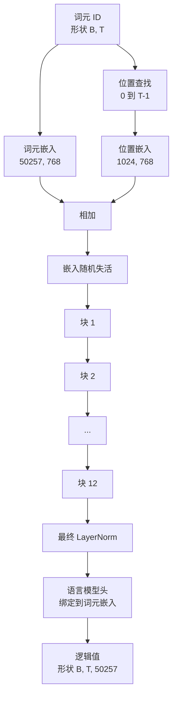

# GPT 模型组装（GPT Model Assembly）

> 十二个堆叠块、词元嵌入、可学习位置嵌入、最终 LayerNorm，以及绑定权重的语言模型头，构成了完整的 1.24 亿参数 GPT 模型。本课将它们组装成可工作的类，统计参数以确认符合参考 124M 配置，并用多项式采样、温度和 top-k 生成文本。

**Type:** Build
**Languages:** Python
**Prerequisites:** 阶段 19 第 30 至 34 课
**Time:** ~90 分钟

## 学习目标（Learning Objectives）

- 将第 34 课的 Transformer 块组装为完整 GPT：词元嵌入（Token embedding）、位置嵌入（Position embedding）、N 个块、最终 LayerNorm 和语言模型头（LM head）。
- 复现 1.24 亿参数配置：词汇表 50257、上下文 1024、嵌入 768、十二个头、十二层。
- 将语言模型头权重绑定到词元嵌入，解释为何在这一规模下可节省约 3800 万参数。
- 从提示词（Prompt）出发，以多项式采样（Multinomial sampling）、温度缩放（Temperature scaling）和 top-k 截断生成文本，并用滑动窗口维持上下文长度。
- 对照 124M 目标测量参数数量和前向传播成本。

## 问题（The Problem）

Transformer 块本身无法独立完成工作。你需要把词元 ID 转成向量，混入位置信息，让它们经过堆叠，再投影回词汇表上的逻辑值（Logits）。漏掉这四步中的任何一步，模型就会无法前向传播、位置信息漂移，或无法输出语言。

模型的配置也很重要。参考 GPT-2 small 在上述精确配置下有 1.24 亿参数。这些数字并不神秘：词汇表 50257 乘以嵌入 768 是词元表，位置 1024 乘以 768 是位置表，十二个块每个约 700 万参数，合计 8400 万。最终模型头通过权重绑定（Weight tying）复用词元表。各部分相加得到 1.24 亿。如果构建的模型参数数目与参考不符，往往意味着某处连接出错。

## 概念（The Concept）



词元 ID 变成词元向量，位置 ID 变成位置向量。两者相加后进入堆叠。最终 LayerNorm 是各类现代变体都会保留的块外组件。语言模型头复用词元嵌入矩阵，这就是权重绑定的含义。

### 权重绑定（Weight tying）

词元嵌入形状为 `(vocab, d_model)`，语言模型头需要从 `d_model` 投影回 `vocab`，两者互为转置。绑定意味着同一个参数张量实际被使用两次。词汇表为 50257、d_model 为 768 时，这个矩阵有 3800 万参数。不绑定就要支付两份参数成本；绑定只需一份，且嵌入与模型头一起更新，还能获得稍清晰的梯度信号。

### 位置嵌入是可学习的，而非正弦的（Position embedding is learned, not sinusoidal）

GPT-2 使用可学习位置嵌入。位置表是形状为 `(1024, 768)` 的参数张量。每次前向传播，模型查找位置 0 至 T-1，再将结果加到词元嵌入上。这是最简单的位置方案，也是 124M 参考模型采用的方案；替代方案包括旋转位置编码（RoPE）、ALiBi 和 T5 相对偏置（Relative bias）。

### 生成：温度、top-k、多项式采样（Generation: temperature, top-k, multinomial）

生成是自回归（Autoregressive）的。每步模型都返回每个位置覆盖整个词汇表的逻辑值。只取最后一个位置，除以温度，可选地将最高 k 项之外的逻辑值设为负无穷，通过 softmax 得到概率，再从所得分布采样一个词元。


三个调节项带来三种不同的行为。温度接近零时退化为贪心（Greedy）；温度为一时符合模型自然分布；top-k 为一时就是贪心；top-k 为四十时过滤长尾。它们的组合很重要，下一课训练时会用生成结果作为定性评估信号。

```figure
cc-gpt-assembly
```

## 动手实现（Build It）

`code/main.py` 实现：

- `class GPTConfig` 数据类，使用 124M 默认值：`vocab_size=50257`、`context_length=1024`、`d_model=768`、`num_heads=12`、`num_layers=12`、`mlp_expansion=4`、`dropout=0.1`、`use_bias=True`、`weight_tying=True`。
- `class GPTModel`：包含词元嵌入、位置嵌入、嵌入随机失活（Dropout）、十二个 `TransformerBlock`、最终 LayerNorm，以及在标志启用时绑定到词元嵌入的 `lm_head`。
- `count_parameters` 辅助函数：返回去重后的参数数量，使统计正确反映权重绑定。
- `generate` 函数：实现温度、top-k、多项式采样和滑动窗口上下文。
- 演示：构建模型，对照 124M 参考打印参数数量，并从固定提示词生成短序列，展示端到端管线。

运行：

```bash
python3 code/main.py
```

输出包括与 124M 参考并列显示的参数数量、从随机提示词生成的词元 ID，以及开启绑定时语言模型头与词元嵌入共享存储的确认信息。

为加快演示，脚本还端到端运行微型配置（`d_model=64`、`num_layers=2`），并直接打印生成的词元序列。124M 配置会被构建，但只统计参数并执行一次前向传播。

## 技术栈（Stack）

- `torch` 提供张量数学、自动微分（Autograd）和模块基础设施。
- `code/main.py` 在本地重新实现第 34 课的同一块模式。

## 实际生产模式（Production patterns in the wild）

三种模式区分了能运行的模型和能交付的模型。

**以较小值初始化残差投影（Initialize the residual projections small）。** 注意力的输出投影和 MLP 的第二个线性层都直接接入残差相加。若与其他线性层采用相同标准差初始化，残差流（Residual stream）就会随深度增长，使最终 LayerNorm 进入高幅值状态。对这两个投影，将标准差乘以 `1 / sqrt(2 * num_layers)`，残差流经过十二层仍能保持合理范围。

**缓存位置 ID 张量，不要重复计算（Cache the position id tensor, do not recompute）。** `torch.arange(T)` 每次前向传播都会分配新内存。在 `__init__` 中按最大上下文分配一次，每次调用切取前 T 项，免去反复请求分配器。

**在参数层面绑定权重，而非仅复制（Tie weights at parameter level, not just by copying）。** 设置 `lm_head.weight = token_embedding.weight` 才会共享张量，复制不会。优化器需要更新一个参数，自动微分图需要进行一次累加。如果只是复制，模型头会逐渐偏离嵌入，权重绑定也就失去作用。

## 实际应用（Use It）

- 本课模型类的配置与下一课训练的模型相同。
- 将可学习位置嵌入替换为 RoPE，无需改动块或模型头，就得到 LLaMA 系列。
- 将 GELU 换为 SiLU、LayerNorm 换为 RMSNorm，就得到 LLaMA 系列的其余变化。
- 生成函数可用于任意逻辑值来源，不限于此模型。第 37 课可以从预训练 GPT-2 文件取得逻辑值，并复用同一生成循环。

## 练习（Exercises）

1. 解除语言模型头与词元嵌入的绑定，重新统计参数，验证差值为 50257 乘以 768，约 3800 万。
2. 将可学习位置嵌入替换为构造时计算的正弦表，确认模型仍能前向传播，且参数数目减少 786,432。
3. 为生成添加 `greedy=True` 标志，跳过采样、选择 argmax，确认不同运行的序列一致。
4. 添加 `repetition_penalty` 调节项，在 softmax 前将提示词或生成历史中任何词元的逻辑值除以常数。用固定提示词展示大于一的值如何减少输出重复次数。
5. 在 `top_k` 之外添加 `top_p` 核采样（Nucleus sampling）。用两行检查确认保留词元的概率和超过 `top_p`。

## 关键术语（Key Terms）

| 术语 | 常见说法 | 实际含义 |
|------|-----------------|------------------------|
| 权重绑定（Weight tying） | “绑定嵌入（Tied embeddings）” | 语言模型头与词元嵌入共享同一参数张量；节省 vocab 乘以 d_model 个参数，与 GPT-2 参考一致 |
| 位置嵌入（Position embedding） | “可学习位置（Learned positions）” | 形状为（上下文长度，d_model）的独立表，加到词元向量上，端到端学习 |
| 滑动窗口上下文（Sliding window context） | “上下文上限（Context cap）” | 提示词加生成词元超过上下文长度时，丢弃最旧词元，使活动窗口能够容纳 |
| top-k 采样（Top-k sampling） | “K 截断（K truncation）” | 保留值最高的 K 个逻辑值，将其余设为负无穷，对剩余项执行 softmax |
| 温度（Temperature） | “采样温度（Sampling temperature）” | softmax 前将逻辑值除以 T；T 小于 1 时分布变尖，等于 1 时保留自然分布，大于 1 时变平 |

## 延伸阅读（Further Reading）

- 阶段 19 第 34 课：本模型堆叠的块。
- 阶段 19 第 36 课：以交叉熵（Cross-entropy）损失驱动本模型的训练循环。
- 阶段 19 第 37 课：将预训练 GPT-2 权重加载到此架构。
- 阶段 7 第 07 课（GPT 因果语言建模）：下一词元预测的数学。
- 阶段 10 第 04 课（预训练微型 GPT）：同一架构的原始训练流程。
