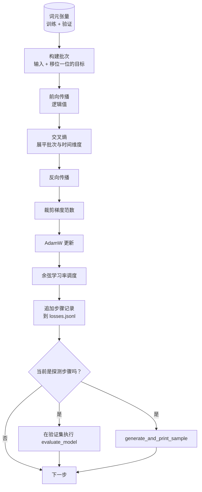

# 训练循环与评估（Training Loop and Evaluation）

> 不测量的循环会给出假象。本课构建驱动 GPT 的训练循环：按权重衰减分组的 AdamW、预热加余弦学习率调度、`calc_loss_batch` 辅助函数、留出数据上的 `evaluate_model` 评估、每 K 步执行一次的 `generate_and_print_sample` 定性探测，以及供后续绘图的 JSONL 损失日志。同一骨架可以训练你今后构建的每个解码器 LLM。

**Type:** Build
**Languages:** Python
**Prerequisites:** 阶段 19 第 30 至 35 课
**Time:** ~90 分钟

## 学习目标（Learning Objectives）

- 构建训练循环，为下一词元预测正确对齐输入和目标，计算交叉熵（Cross-entropy）损失。
- 配置 AdamW，使权重衰减（Weight decay）作用于权重张量，而不作用于 LayerNorm 或偏置张量。
- 实现线性预热（Linear warmup）加余弦衰减（Cosine decay）的学习率调度，读懂学习率随时间的变化。
- 用 `evaluate_model` 在留出划分（Held-out split）上评估，使各次运行的评估损失可比较。
- 每 K 步用 `generate_and_print_sample` 生成定性样本，争取比损失曲线更早发现发散。
- 将逐步损失持久化到 JSONL，以便重新加载、绘图，并将训练日志作为交付物交付。

## 问题（The Problem）

只打印损失、别的什么也不做的训练脚本有三种不足。它无法告诉你损失是否因正确的原因下降：模型可能过拟合训练集，却没有真正学会泛化。它无法告诉你是否开始发散：损失可能突增一步后恢复，也可能突增一步后崩溃。它也无法告诉你模型学到了什么：损失是标量，生成样本却是一段话。不做测量，这三种失败就会被隐藏。

本课循环从三个方面测量：每步测量训练批次损失，每 K 步测量留出批次损失，每 K 步从固定提示词生成续写。训练日志落入 JSONL，使这个交付物成为循环行为的记录。

## 概念（The Concept）



其中不易察觉的两个关键点是损失对齐和 AdamW 衰减分组。

### 损失对齐（Loss alignment）

模型在每个位置预测下一词元。如果输入批次的词元为 `[t0, t1, t2, t3]`，目标批次必须是 `[t1, t2, t3, t4]`。交叉熵基于展平的 `(batch * seq, vocab)` 和目标 `(batch * seq,)` 计算。忘记移位就会训练模型预测自身，损失虽趋于零，却学不到有用内容。

### AdamW 衰减分组（AdamW decay split）

权重衰减正则化（Regularize）权重张量，但不应作用于归一化缩放或偏置。对 LayerNorm 缩放施加衰减，会逐渐把它推向零，破坏归一化。对偏置施加衰减在数学上无害，但浪费计算。标准分组是：矩阵形状张量（线性权重、嵌入表）使用衰减，类似缩放或平移的参数不使用。

### 预热加余弦调度（Warmup plus cosine schedule）

预热在数百步内将学习率从零升至目标值，让优化器状态有时间建立。余弦衰减在余下步骤将学习率降回接近零，让最后阶段用小步长微调权重。这是开放权重 LLM 训练中最常见的调度组合，因为它消除了最初一千步和最后一千步中大部分易出问题的时刻。

### 留出评估（Held out evaluation）

`evaluate_model` 在验证划分上运行固定数量的批次，累加损失，除以批次数后返回。不计算梯度，不启用随机失活（Dropout）。给定相同种子和划分，结果可在各次运行间复现。将留出损失和训练损失并列报告，是发现过拟合（Overfitting）的方法。

### 定性采样作为早期信号（Qualitative sampling as an early signal）

训练损失下降顺利、生成样本却全是同一词元的模型出了问题。损失曲线看似平坦、生成样本却逐渐变为连贯词语的模型正在学习。定性探测比阅读完整曲线更快，能捕捉标量遗漏的情况。

```figure
cap-training-loop
```

## 动手实现（Build It）

`code/main.py` 实现：

- `make_batches(token_ids, batch_size, context_length)`：将长词元张量切为输入与目标对。
- `calc_loss_batch(model, inputs, targets)`：执行前向传播、展平，并返回标量交叉熵。
- `evaluate_model(model, val_loader, max_batches)`：在不计算梯度的条件下迭代固定数量的验证批次，返回平均损失。
- `generate_and_print_sample(model, prompt, max_new_tokens)`：对固定提示词运行第 35 课的生成函数并打印结果。
- `build_param_groups(model, weight_decay)`：生成分成两组的 AdamW 参数列表。
- `cosine_with_warmup(step, warmup_steps, total_steps, max_lr, min_lr)`：返回给定步骤的学习率。
- `train(...)`：执行循环，持久化 `outputs/losses.jsonl`，并每 `eval_every` 步打印评估损失和一个样本。
- 演示：在合成数据上训练微型模型少量步骤，写入 JSONL 日志，在探测点打印评估损失和样本。CPU 上远不到一分钟即可运行完毕。

运行：

```bash
python3 code/main.py
```

输出包括逐步损失行、每个探测步骤的评估损失与生成样本，以及最终的 `outputs/losses.jsonl`，可逐行用 `json.loads` 加载。

## 技术栈（Stack）

- `torch` 提供自动微分、优化器和模块。
- `main.py` 在本地重新实现第 35 课的 `GPTModel` 及其支持模块。

## 实际生产模式（Production patterns in the wild）

三种模式让教材循环变为可以放心运行一夜的实现。

**梯度范数裁剪不可省略（Gradient norm clipping is non negotiable）。** 坏批次（异常数据、学习率突增、数值边界情况）可能产生巨大梯度，毁掉数小时的训练。在 `backward` 后、`step` 前执行 `torch.nn.utils.clip_grad_norm_(params, max_norm=1.0)`，可让优化器保持在安全范围。裁剪值是可调参数；默认值一适用于多数配置。

**使用可恢复的 JSONL 日志，而非 pickle 状态（Resumable JSONL logging, not pickled state）。** 将逐步损失以 `{"step": int, "train_loss": float, "lr": float}` 的 JSONL 行保存很耐用：崩溃后仍留下可读交付物，可用 grep 搜索，三十行 Python 即可绘图，还能读取最后一步恢复训练。pickle 状态绑定于生成文件时的精确模块布局，重构后很容易失效。

**从固定切片获取评估批次（Eval batches drawn from a fixed slice）。** 验证词元在脚本启动时就被切分成批次，而非临时切分。可复现性依赖各次运行的评估批次完全一致，否则两次运行的评估损失比较既衡量模型，也同样衡量批次顺序变化。

## 实际应用（Use It）

- 本课循环的骨架同样能在真实数据上训练 124M 模型。把合成词元张量换成 `datasets` 风格加载器，循环无需修改。
- JSONL 日志是将一次训练转化为证据的交付物。下一课用它比较新训练的检查点（Checkpoint）和预训练检查点。
- 定性样本探测是兜底检查，标量损失无法替代。

## 练习（Exercises）

1. 添加 `weight_decay_groups()` 单元测试，确认缩放和偏置参数进入无衰减组，线性权重和嵌入权重进入衰减组。
2. 用小文本文件中的字节替换合成随机词元，让演示训练可读内容。验证生成样本使用文件中存在的字符。
3. 为余弦调度添加等于 `max_lr` 10% 的 `min_lr` 下限，重新绘图。
4. 除 JSONL 日志外，每 `eval_every` 步保存检查点。添加 `resume_from` 标志，重新加载模型和优化器状态。
5. 在损失旁记录逐步吞吐量（每秒词元数），确认它保持在稳定区间。

## 关键术语（Key Terms）

| 术语 | 常见说法 | 实际含义 |
|------|-----------------|------------------------|
| 损失对齐（Loss alignment） | “移位一位（Shift by one）” | 输入词元在位置 0..T-1，目标在 1..T；在展平后的形状上计算交叉熵 |
| 衰减分组（Decay split） | “两组（Two groups）” | AdamW 对矩阵形状张量施加权重衰减，对缩放或偏置张量不施加衰减 |
| 预热（Warmup） | “爬升（Ramp）” | 学习率在固定步数内从零升至目标值，让优化器状态得以建立 |
| 评估批次（Eval batches） | “留出批次（Held out batches）” | 验证词元张量的固定切片，脚本启动时切分一次，每次探测使用相同批次 |
| 定性探测（Qualitative probe） | “打印样本（Sample print）” | 每 K 步打印固定提示词的短生成结果，捕捉仅靠损失无法发现的失败模式 |

## 延伸阅读（Further Reading）

- 阶段 19 第 35 课：循环驱动的模型。
- 阶段 19 第 37 课：向同一模型加载预训练权重。
- 阶段 10 第 04 课（预训练微型 GPT）：真实数据上的流程。
- 阶段 10 第 10 课（评估）：交叉熵损失之外的更广泛评估内容。
