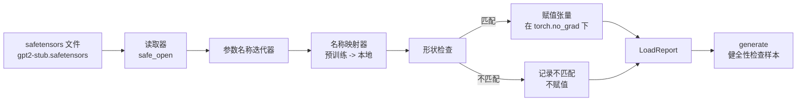

# 加载预训练权重（Loading Pretrained Weights）

> 从零训练 1.24 亿参数模型需要权衡预算，加载已发布检查点则是日常操作。本课将 safetensors 文件中的 GPT-2 风格预训练权重加载到第 35 课的原样架构，逐项讲解参数名称映射，并通过生成续写做健全性检查，证明加载生效。不联网，不使用第三方加载器，也没有不透明的魔法。

**Type:** Build
**Languages:** Python
**Prerequisites:** 阶段 19 第 30 至 36 课
**Time:** ~90 分钟

## 学习目标（Learning Objectives）

- 使用 `safetensors` Python 库读取 safetensors 文件，检查张量名称和形状。
- 将每个预训练参数名称映射到第 35 课 GPT 模型中的参数。
- 处理已发布 GPT-2 权重与本路线模型的两套不同命名约定：`wte/wpe/h.N.attn.c_attn/c_proj` 和 `mlp.c_fc/c_proj`，对应本地 `tok_embed/pos_embed/blocks.N.attn.qkv/out_proj` 和 `mlp.fc1/fc2`。
- 在任何权重赋值发生前，检测并拒绝形状不匹配，给出明确错误。
- 用已加载权重生成短续写，确认词元来自加载后的分布，而非随机初始化分布。

## 问题（The Problem）

已发布权重不是为你的架构打包的，它们携带原实现的名称。预训练文件中有形状为 `(2304, 768)` 的 `transformer.h.0.attn.c_attn.weight`，而你的模型需要形状为 `(2304, 768)` 的 `blocks.0.attn.qkv.weight`（同一矩阵采用不同布局约定），或者模型使用按转置形式存储矩阵的 `nn.Linear`。同一参数具有三种略有差异的身份信息：名称、形状、字节布局，加载器必须协调三者。

盲目复制的加载器会将正确张量放错位置，使模型生成无意义内容。遇到形状差异便拒绝复制却不记录日志的加载器，又让你猜不出哪个张量未能落位。本课加载器显式处理一切：记录每次赋值、检查每个形状，并用 `LoadReport` 汇总命中、缺失和形状不匹配，让发生的事情可读。

## 概念（The Concept）



名称映射器只是字符串到字符串的函数。形状检查只需一个 if。赋值在 `torch.no_grad()` 中进行，自动微分（Autograd）不会跟踪加载操作。报告保存每个名称的处理结果。

### GPT-2 命名约定（The GPT-2 naming convention）

已发布 GPT-2 权重使用如下名称：

| 预训练名称 | 形状 | 含义 |
|-----------------|-------|---------|
| `wte.weight` | (50257, 768) | 词元嵌入（Token embedding） |
| `wpe.weight` | (1024, 768) | 位置嵌入（Position embedding） |
| `h.N.ln_1.weight` | (768,) | 块 N 的 LayerNorm 1 缩放 |
| `h.N.ln_1.bias` | (768,) | 块 N 的 LayerNorm 1 平移 |
| `h.N.attn.c_attn.weight` | (768, 2304) | 融合 QKV 线性权重 |
| `h.N.attn.c_attn.bias` | (2304,) | 融合 QKV 线性偏置 |
| `h.N.attn.c_proj.weight` | (768, 768) | 注意力输出投影（Attention output projection） |
| `h.N.attn.c_proj.bias` | (768,) | 注意力输出投影偏置 |
| `h.N.ln_2.weight` | (768,) | LayerNorm 2 缩放 |
| `h.N.ln_2.bias` | (768,) | LayerNorm 2 平移 |
| `h.N.mlp.c_fc.weight` | (768, 3072) | MLP fc1 权重 |
| `h.N.mlp.c_fc.bias` | (3072,) | MLP fc1 偏置 |
| `h.N.mlp.c_proj.weight` | (3072, 768) | MLP fc2 权重 |
| `h.N.mlp.c_proj.bias` | (768,) | MLP fc2 偏置 |
| `ln_f.weight` | (768,) | 最终 LayerNorm 缩放 |
| `ln_f.bias` | (768,) | 最终 LayerNorm 平移 |

有两点需要预先考虑。`c_attn`、`c_proj`、`c_fc` 线性层的矩阵存储方式相对于 `nn.Linear.weight` 预期形式是转置的，加载器在赋值时转置。语言模型头（LM head）完全不在文件中：模型依赖与 `wte` 的权重绑定（Weight tying），因此 `wte` 落位后，通过别名设置模型头。

### 本地命名约定（The local naming convention）

本路线的模型使用描述性名称：

| 本地名称 | 含义 |
|------------|---------|
| `tok_embed.weight` | 词元嵌入 |
| `pos_embed.weight` | 位置嵌入 |
| `blocks.N.ln1.scale` | 块 N 的 LayerNorm 1 缩放 |
| `blocks.N.ln1.shift` | LayerNorm 1 平移 |
| `blocks.N.attn.qkv.weight` | 融合 QKV（Fused QKV） |
| `blocks.N.attn.qkv.bias` | 融合 QKV 偏置 |
| `blocks.N.attn.out_proj.weight` | 注意力输出投影 |
| `blocks.N.attn.out_proj.bias` | 输出投影偏置 |
| `blocks.N.ln2.scale` | LayerNorm 2 缩放 |
| `blocks.N.ln2.shift` | LayerNorm 2 平移 |
| `blocks.N.mlp.fc1.weight` | MLP fc1 |
| `blocks.N.mlp.fc1.bias` | MLP fc1 偏置 |
| `blocks.N.mlp.fc2.weight` | MLP fc2 |
| `blocks.N.mlp.fc2.bias` | MLP fc2 偏置 |
| `final_ln.scale` | 最终 LayerNorm 缩放 |
| `final_ln.shift` | 最终 LayerNorm 平移 |

映射是固定函数。本课以字典形式交付，供加载器迭代。

### 桩测试夹具（The stub fixture）

真实 GPT-2 权重有 0.5 GB。演示不下载它们，而是在首次运行时生成小型 safetensors 测试夹具（Fixture）：使用完全相同的 GPT-2 命名约定，形状适配 12 块、d_model 为 192 而非 768 的模型。夹具具有正确结构，可覆盖加载器所有代码路径。将夹具换成真实文件，加载器无需修改即可工作。

```figure
cc-weight-remap
```

## 动手实现（Build It）

`code/main.py` 实现：

- 第 35 课 `GPTModel` 的小型副本，使本课独立完整。
- `make_pretrained_to_local(num_layers)`：展开各层条目。
- `load_safetensors(model, path)`：迭代名称、映射、检查形状、转置 conv1d 风格权重，并在 `torch.no_grad()` 下赋值，返回 `LoadReport`。
- `make_stub_safetensors(path, cfg)`：生成完全采用预训练命名约定的夹具文件。
- 演示：首次运行创建 `outputs/gpt2-stub.safetensors`，构建新模型，记录随机初始化时的一段生成续写，再加载桩文件、记录另一段续写，打印两者，并验证其不同，确认加载实际改变了模型。

运行：

```bash
python3 code/main.py
```

输出包括夹具路径、逐名称加载日志、`LoadReport` 汇总、加载前后的续写，以及向夹具注入一个刻意构造的错误张量所产生的形状不匹配，以覆盖失败路径。

## 技术栈（Stack）

- `safetensors` 提供磁盘格式与流式读取器。
- `torch` 提供模型与赋值数学。
- 不使用 `transformers`、`huggingface_hub`，不发起网络调用。

## 实际生产模式（Production patterns in the wild）

三种模式让加载器能够应对不是你自己生成的权重。

**任何赋值前都先验证文件（Always validate the file before any assignment）。** 打开文件，列出每个张量的名称、数据类型和形状，执行完整映射与形状检查，全部成功后才开始赋值。只加载一半的模型会静默失败。

**每次赋值都记录源名称和目标名称（Log every assignment with the source name and the destination name）。** 出现异常时，日志告诉你哪个张量落到了哪里；否则只能阅读十六进制转储。本课 `LoadReport` 数据类跟踪 `loaded`、`missing`、`unexpected` 和 `shape_mismatch` 列表，并在最后打印汇总。

**语言模型头是权重绑定别名，而非独立副本（The LM head is a weight tying alias, not a separate copy）。** 加载 `tok_embed` 后设置 `model.lm_head.weight = model.tok_embed.weight` 是标准模式。把嵌入矩阵复制到新的 `lm_head.weight` 参数，会破坏绑定，并悄悄使参数数量翻倍。

## 实际应用（Use It）

- 加载器适用于任何采用预训练命名约定的 safetensors 文件。真实 GPT-2 文件（small / medium / large / xl）无需修改代码，只需调整模型配置。
- 更新名称映射后，同一模式可扩展至 LLaMA、Mistral、Qwen 权重。形状检查和报告保持不变。
- 加载后的健全性生成是快速门禁：如果加载后样本看起来与加载前相同，加载就未改变模型，意味着映射静默漏掉了所有张量。

## 练习（Exercises）

1. 为加载器添加 `dtype` 参数，在赋值时将每个张量转为目标数据类型（`bfloat16`、`float16`、`float32`）。确认 `float32` 模型可以降精度为 `bfloat16` 且仍能生成。
2. 添加 `expected_layers` 参数，拒绝加载 `h.N` 索引与模型 `num_layers` 不符的检查点（Checkpoint）。
3. 将加载器接入第 35 课生成函数，并列产生两份样本：随机初始化一份、加载夹具后一份。
4. 添加导出路径：使用预训练命名约定，将当前模型状态写入新的 safetensors 文件。往返加载，确认报告中形状不匹配数为零。
5. 扩展 `NAME_MAP`，处理 LLaMA 命名约定（无偏置、RMSNorm、融合 qkv 布局），在你生成的 LLaMA 桩夹具上重新运行加载器。

## 关键术语（Key Terms）

| 术语 | 常见说法 | 实际含义 |
|------|-----------------|------------------------|
| 名称映射（Name map） | “键重映射（Key remapping）” | 从预训练张量名称到本地参数名称的函数；通常是字典字面量，通过循环按层索引展开条目 |
| 形状不匹配（Shape mismatch） | “错误形状（Bad shape）” | 映射名称下存在预训练张量，但维度与本地参数不符；加载器拒绝赋值并记录二者 |
| 加载时转置（Transpose-on-load） | “Conv1d 布局（Conv1d layout）” | 已发布 GPT-2 的注意力与 MLP 投影按 nn.Linear 所需形式的转置存储；加载器赋值时转置 |
| 权重绑定别名（Weight tying alias） | “共享模型头（Shared LM head）” | 设置 model.lm_head.weight = model.tok_embed.weight，让模型头与嵌入共享存储；因此文件中没有模型头 |
| 加载报告（Load report） | “覆盖汇总（Coverage summary）” | 跟踪 loaded、missing、unexpected 和 shape_mismatch 列表的小型数据类；打印它可以判断加载是否成功 |

## 延伸阅读（Further Reading）

- 阶段 19 第 35 课：接收权重的架构。
- 阶段 19 第 36 课：生成相同配置检查点的训练循环。
- 阶段 10 第 11 课（量化）：内存紧张时如何处理已加载权重。
- 阶段 10 第 13 课（构建完整 LLM 管线）：围绕加载和推理的完整生命周期。
