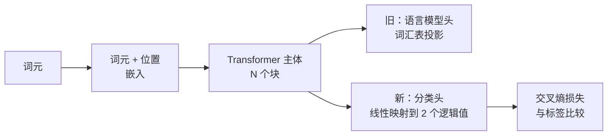
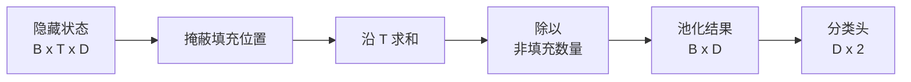
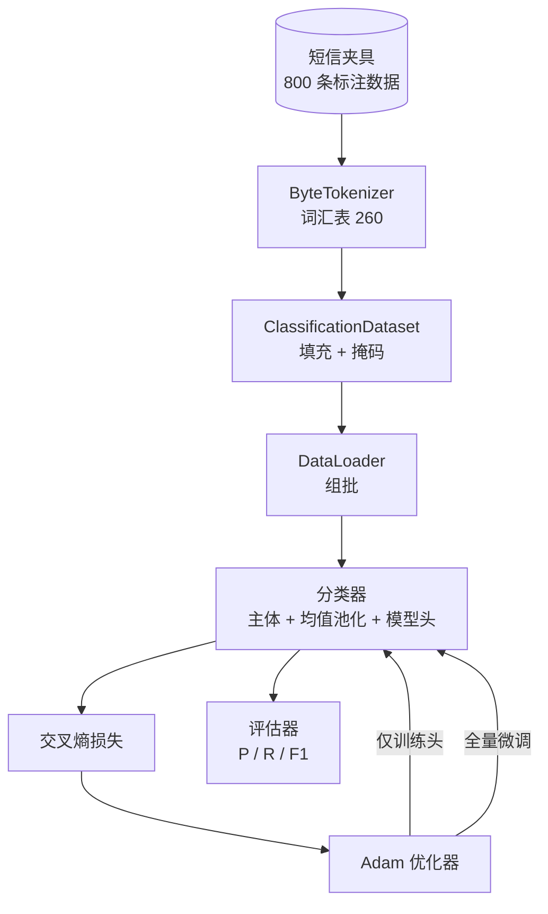

# 综合实践第 38 课：更换模型头进行分类器微调（Capstone Lesson 38: Classifier Fine-Tuning by Head Swap）

> 路线 B 的首个综合实践（Capstone）。预训练语言模型由一组自注意力块堆叠而成，末端是词元预测头。要区分垃圾短信与正常短信时，模型头不合适，主体却大体可用。本课移除原头，在池化表示上接一个二分类线性层，再以两种方式训练分类器：仅训练最后一层，以及全量微调。评估指标为留出划分上的精确率、召回率和 F1。你将了解各策略的收益与成本。

**Type:** Build
**Languages:** Python (torch, numpy)
**Prerequisites:** 阶段 19 第 30–37 课（NLP LLM 路线：分词器、嵌入表、注意力块、Transformer 主体、预训练循环、检查点保存、生成、困惑度）
**Time:** ~90 分钟

## 学习目标（Learning Objectives）

- 不重新初始化主体，将语言模型头替换为分类头（Classification head）。
- 用同一训练循环实现两种训练方式：冻结主体（仅训练模型头，Head-only）与全量微调（Full fine-tuning）。
- 构建适配分词器的数据管线，完成填充、填充掩码和注意力输出池化（Pooling）。
- 从原始逻辑值（Logits）计算精确率（Precision）、召回率（Recall）、F1 和混淆矩阵（Confusion matrix）。
- 分析参数数量、训练时间与性能提升空间之间的权衡。

## 问题（The Problem）

你已在通用语料库上预训练小型 Transformer。输出头将最后隐藏状态投影到 1000 词元的词汇表。现在你有 800 条标注为垃圾或正常的短信，需要一个二分类器。有三种选择。

错误选择是在 800 个样本上从零训练全新分类器。预训练模型主体已编码词语身份、位置、简单共现等有用结构。丢弃它，会浪费建立这些结构所用的计算。

两个正确选择分别是更换模型头并冻结主体，以及更换模型头并允许训练主体。仅训练头速度快、内存成本几乎可忽略，在这样少的数据下也很少过拟合。全量微调更慢，小数据下可能过拟合，但下游领域偏离预训练语料时，可以达到更高准确率。

本课同时实现两种方式，让你在同一测试夹具（Fixture）上比较。

## 概念（The Concept）



模型是函数 `f_theta(tokens) -> hidden_states`，模型头是函数 `g_phi(hidden) -> logits`。更换模型头意味着保留 `theta`，替换 `g_phi`。主体参数是成本高的部分，模型头只有一个线性层。

有两组需要关注的可训练参数：

- `theta`（主体）：每个注意力块数万个权重。
- `phi`（模型头）：`hidden_dim * num_classes` 个权重加偏置。

仅训练头时，对 `phi` 计算梯度，对 `theta` 的梯度置零。PyTorch 允许通过将主体参数设为 `requires_grad=False` 来实现。优化器于是只处理模型头，主体保持冻结。

全量微调则允许梯度回流整个堆叠，主体权重随之变化以适配分类目标。小数据下的风险是灾难性遗忘（Catastrophic forgetting）：对噪声的过拟合冲掉了主体的预训练知识。

## 池化问题（The Pooling Question）

分类器每个序列需要一个向量，而不是每个词元一个向量。常见的三种选择：

- **均值池化（Mean pool）**：按注意力掩码加权，对序列中的隐藏状态取平均。
- **CLS 池化（CLS pool）**：在前面添加特殊词元，只使用它的输出。BERT 采用此方式。
- **末词元池化（Last-token pool）**：使用最后一个非填充词元。GPT 类分类器采用此方式。

本课使用显式注意力掩码加权的均值池化。这种方式最简单，不同序列长度下信号稳定，也不需要预训练 CLS 词元。



## 数据（The Data）

`code/main.py` 确定性生成 800 条短信，垃圾和正常各 400 条，类别平衡。生成器使用固定种子，选择模板并替换槽位内容，生成长度为 5 至 25 个词元的短信。真实数据集存在该夹具没有的噪声，夹具的目的是可复现。

数据按 80/20 划分：640 条训练、160 条测试。采用分层划分（Stratified split），使测试集保留 50/50 平衡。类别比例已知的留出集，可以让精确率与召回率如实反映表现。

## 指标（The Metrics）

二分类将类别 1 作为正类（垃圾短信）。计数为：

- `TP`：预测垃圾，实际为垃圾。
- `FP`：预测垃圾，实际为正常。
- `FN`：预测正常，实际为垃圾。
- `TN`：预测正常，实际为正常。

三个主要指标：

- `precision = TP / (TP + FP)`：标为垃圾的短信中，实际垃圾占多少？
- `recall = TP / (TP + FN)`：实际垃圾短信中，模型标出了多少？
- `F1 = 2 * P * R / (P + R)`：两者的调和平均数（Harmonic mean）。

混淆矩阵以 2x2 网格打印四个计数。演示将两种训练方式的矩阵输出到标准输出（stdout）。

```figure
cap-classifier-head-swap
```

## 架构（Architecture）



主体是刻意设计的微型 Transformer：词汇表 260、隐藏维度 64、4 个头、2 个块、最大序列 32。规模小到可以在 CPU 上九十秒内将两种方式都训练至收敛。本课不提供已预训练的主体；而是由 `pretrain_quick` 辅助函数在同一夹具文本上进行五轮语言模型训练，为主体提供非平凡起点，使课程保持独立完整。

## 你将构建什么（What you will build）

实现由一个 `main.py` 和一个测试模块（`code/tests/test_main.py`）组成。

1. `ByteTokenizer`：将字节映射到 ID，预留填充 ID。
2. `Block`：包含多头注意力与前馈层的 Transformer 块，采用前置归一化（Pre-norm）。
3. `LMBody`：词元与位置嵌入加块堆叠，返回隐藏状态。
4. `MeanPool`：沿序列轴按掩码加权平均。
5. `Classifier`：主体、池化、线性头。两种方式使用同一主体实例。
6. `freeze_body` 和 `unfreeze_body`：切换主体参数的 `requires_grad`。
7. `train_classifier`：共用循环，接收模型及针对当前可训练参数组配置的优化器。
8. `evaluate`：运行测试集，返回 `Metrics(precision, recall, f1, confusion)`。
9. `run_demo`：短暂预训练主体，然后训练并评估仅训练头方式，再进行全量微调，打印两份报告并以零退出。

## 为什么比较重要（Why the comparison matters）

仅训练头通常更快，欠拟合（Underfitting）也更温和。在本夹具上，仅训练头二十轮后，通常能看到精确率接近 0.9、召回率接近 0.85。全量微调耗时约三倍，结果上下相差几个百分点，取决于随机种子。

本课不选胜者，而是教你读懂数值和成本。800 个样本加微型主体时，仅训练头是合适选择。80000 个样本加更大主体时，全量微调开始值得投入。你从本课带走的是 API 契约：同一个 `train_classifier` 处理两种方式，一次调用即可切换。

## 拓展目标（Stretch goals）

- 添加只解冻最后一个块的第三种方式，有时称为部分微调（Partial fine-tuning）。它比全量微调成本低，比仅训练头学得更多。
- 添加学习率调度器（Learning-rate scheduler）。模型头使用余弦调度、主体使用更小恒定学习率，是常见生产配置。
- 用可学习注意力池化（Learned attention pool）替换均值池化：一个带单个可学习查询的小型注意力层。在较长序列上，它往往优于均值池化。

实现提供了扩展钩子，测试固定了契约，指标能提高到哪里由你探索。
